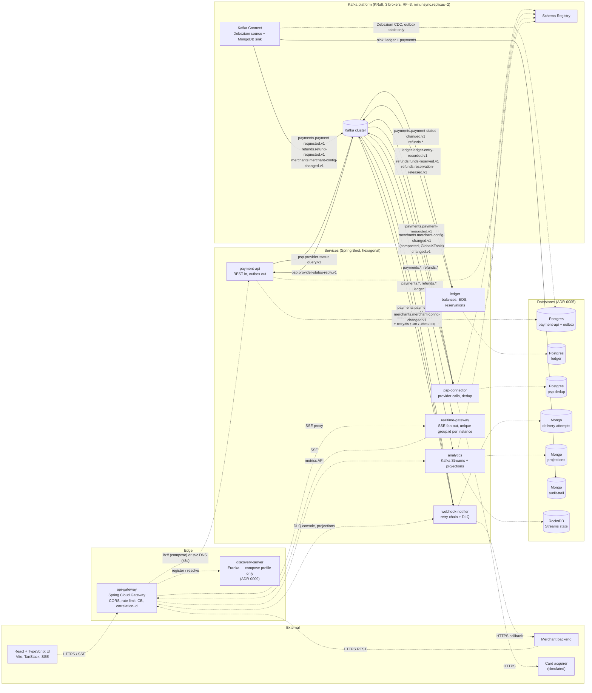

# C4 Level 2 — Containers

Rendered as a Mermaid flowchart rather than `C4Container`: at this node count the flowchart
gives usable layout control, and edge labels can carry the exact topic names from
[topic-map.md](topic-map.md).

Read the edges as: **solid arrow = Kafka record**, labelled with the topic; **dotted arrow =
everything else** (HTTP where labelled, datastore access where not). Per
[ADR-0004](../adr/0004-sync-async-boundary.md) no dotted HTTP arrow runs between two services —
the only dotted HTTP arrows are edge-to-service or system-to-outside-world.

## Runtime containers

## Container responsibilities

| Container | Tech | Owns | Kafka role |
|---|---|---|---|
| `api-gateway` | Spring Cloud Gateway | Routing, CORS, Redis rate limiting, Resilience4j, correlation-id injection | none — never touches Kafka |
| `discovery-server` | Eureka | Registry, **compose profile only** ([ADR-0009](../adr/0009-service-discovery-per-profile.md)) | none |
| `payment-api` | Spring Boot + Postgres | Payment and refund aggregates, merchant config API, outbox table | producer (via Debezium); request side of M12 request-reply |
| `psp-connector` | Spring Boot + Postgres | Provider integration, dedup table `(paymentId, providerEventId)` | consumer + producer; KEDA-scaled on lag (M18) |
| `ledger` | Spring Boot + Postgres | Merchant balances, refund reservations | transactional consumer/producer, `read_committed` (M7) |
| `webhook-notifier` | Spring Boot + Mongo | Merchant callback delivery, attempt log with TTL index | consumer + producer of its own retry chain (M8) |
| `analytics` | Kafka Streams + Mongo + RocksDB | Windowed metrics, saga projection, interactive queries | Streams application `analytics-streams.v1` |
| `realtime-gateway` | Spring Boot, stateless | SSE fan-out to browsers | **unique `group.id` per instance** — broadcast, not load-split (M12) |
| Kafka Connect | Debezium + Mongo sink | Outbox → Kafka; Kafka → audit-trail | source + sink |
| Schema Registry | Confluent | Avro subjects, `BACKWARD` compatibility | — |

## Things this diagram is asserting

1. **`payment-api` never produces directly to Kafka.** It writes to `outbox` in the same
   transaction as the aggregate; Debezium publishes (M6). This is why the arrow goes through
   Connect.
2. **`realtime-gateway` is the one consumer that is not a consumer group in the usual sense.**
   Every instance needs every record, so each takes a unique `group.id`.
3. **`merchants.merchant-config-changed.v1` fans out to several services as a `GlobalKTable`**,
   which is what replaces a "merchant service" REST call.
4. **`api-gateway` has no Kafka client.** The synchronous request-reply of M12 originates in
   `payment-api`, not at the edge.
5. **No HTTP arrow crosses from one service directly to another.** If one ever appears,
   ADR-0004 has been violated.
6. **The only synchronous cross-service call is a Kafka round trip** —
   `psp.provider-status-query.v1` out, `psp.provider-status-reply.v1` back (M12).
