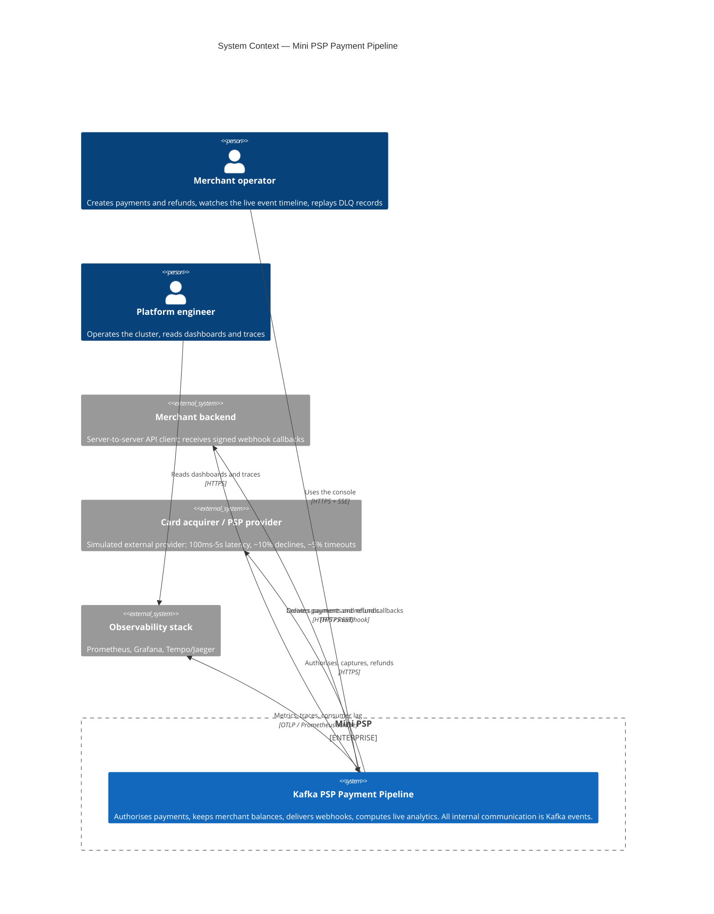

# C4 Level 1 — System Context

The mini PSP as a black box, and everyone it talks to. Consistent with
[ADR-0004](../adr/0004-sync-async-boundary.md): the only inbound path is HTTPS through the API
gateway, and the only outbound HTTP leaves the system entirely (merchant callbacks, acquirer).

## Actors and boundaries

| Actor / system | Direction | Channel | Notes |
|---|---|---|---|
| Merchant operator | in | HTTPS + SSE via `api-gateway` | React UI (M17); SSE stream served by `realtime-gateway` through the gateway |
| Merchant backend | in | HTTPS REST via `api-gateway` | `POST /payments` returns `202 Accepted` with a `paymentId` — the outcome arrives later as an event (ADR-0004) |
| Merchant backend | out | HTTPS webhook | Delivered by `webhook-notifier` with the retry chain of [ADR-0006](../adr/0006-error-taxonomy-retry-dlq.md) |
| Card acquirer | out | HTTPS | Simulated in `psp-connector`; the only source of authorisation truth |
| Observability stack | out | Prometheus scrape + OTLP | W3C trace context propagates through Kafka headers (M15, [ADR-0002](../adr/0002-event-envelope.md)) |

## What the context diagram already decides

- There is exactly **one** inbound door. No service is directly reachable from outside.
- Payment outcomes are **not** returned synchronously. Every external consumer of an outcome
  gets it as a webhook (machines) or an SSE event (humans).
- The acquirer is the only true external dependency on the critical path; everything else the
  system can survive losing for a while, at the cost of consumer lag rather than errors.
