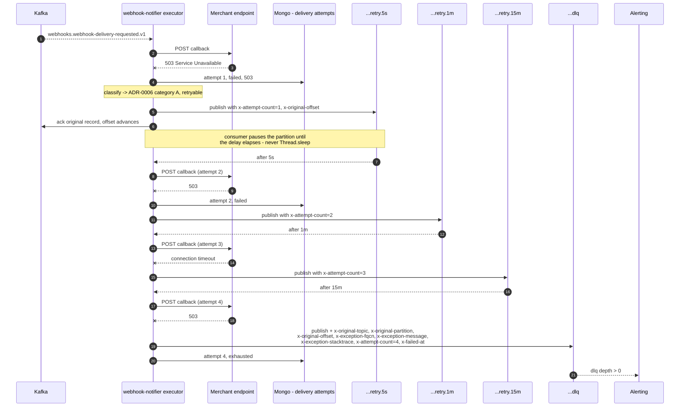
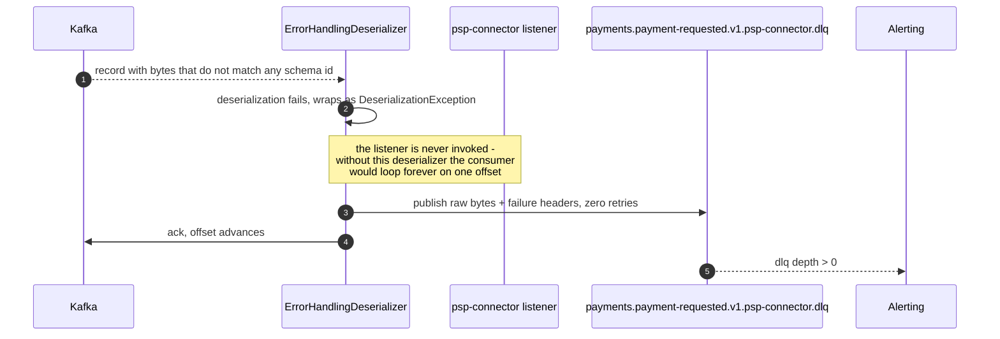
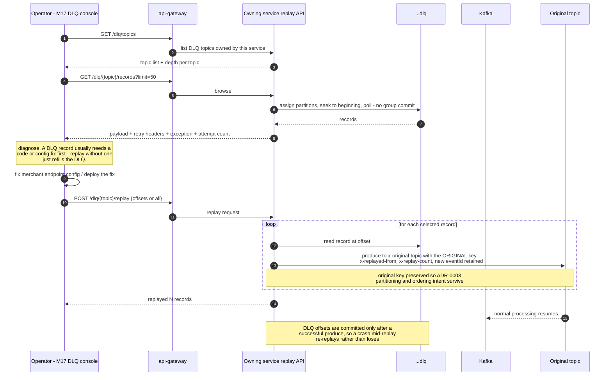

# Sequence — retry chain, DLQ, and replay

Implements [ADR-0006](../adr/0006-error-taxonomy-retry-dlq.md). Two paths are shown: a
**retryable** failure walking the retry chain into the DLQ, and a **poison pill** going
straight there. Both end at the same operator loop.

## Path A — retryable failure through the retry chain

## Path B — poison pill, no retries

## Path C — operator inspects and replays

## What to notice

1. **The offset always advances.** At no point does a failing record block its partition. That
   is the whole reason for non-blocking retries — a blocking `Thread.sleep` of 15 minutes would
   blow `max.poll.interval.ms` and trigger the rebalance storm from M4.
2. **Retries reorder.** A record retried at 15 minutes is processed long after later records for
   the same key. Ordering guarantees (ADR-0003) hold on the happy path only, which is why every
   consumer is an idempotent, guarded state machine.
3. **Replay depends on idempotency.** The replayed record carries its **original `eventId`**, so
   the M5 dedup table recognises it if the first attempt partially succeeded. Minting a new
   `eventId` on replay would defeat dedup and double-charge.
4. **Replay is manual by design.** No timer redrives the DLQ; records land there precisely
   because retrying did not help.
5. **Browsing the DLQ does not commit offsets.** The console assigns partitions manually and
   seeks, so inspection never consumes the record.
6. **`analytics` and `realtime-gateway` have no DLQ.** They log, increment
   `records.skipped`, and advance; their state is rebuilt by resetting the group's offsets and
   replaying the source topics.
