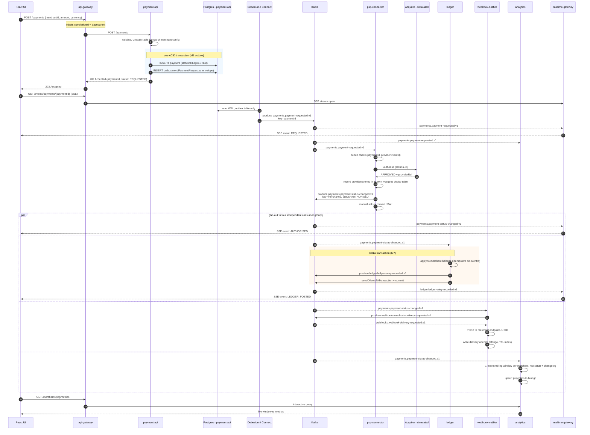

# Sequence — happy-path payment, `POST /payments` to SSE update

Topic names and keys are those of [topic-map.md](topic-map.md). The response is `202 Accepted`,
not a result, because of [ADR-0004](../adr/0004-sync-async-boundary.md).

## What to notice

1. **The 202 arrives before the event is on Kafka.** The commit to Postgres is what makes the
   payment durable; publication is guaranteed afterwards by the outbox, not by the request. Kill
   `payment-api` between the Postgres commit and the CDC read and the event still arrives — that
   is M6's "prove it".
2. **The SSE subscription is opened after the 202**, so the UI can miss the `REQUESTED` event in
   a race. `realtime-gateway` therefore replays the last N events for that `paymentId` on
   subscribe, from its in-memory ring buffer, before streaming live ones.
3. **The key changes when psp-connector produces.** `payment-requested` is keyed by `paymentId` and
   `payment-status-changed` by `merchantId` (ADR-0003). psp-connector is a repartitioning
   producer, and this is exactly why the M13 Streams join needs a repartition topic.
4. **Four consumer groups, one record.** The `par` block is fan-out across groups, not
   parallelism within one. Each group commits independently, so the ledger being slow shows up
   as lag on `ledger.v1` and does not delay the SSE update.
5. **The ledger's Kafka transaction does not cover Postgres.** `sendOffsetsToTransaction` makes
   the produce + offset commit atomic *within Kafka*; the balance update in Postgres is outside
   it and is protected by idempotency on `eventId`. Being able to say this precisely is the M7
   checkpoint.
6. **`webhook-notifier` publishes to itself** — planner produces the delivery command, executor
   consumes it. That hop exists so the retry chain
   attaches to a delivery command rather than to a payment event (ADR-0006).
7. **Each service touches only its own database** (ADR-0005) — psp-connector's dedup table is
   in psp-connector's Postgres, never payment-api's.
8. **Every arrow carries `traceparent`** in Kafka headers, so M15 renders this whole diagram as
   one trace.
