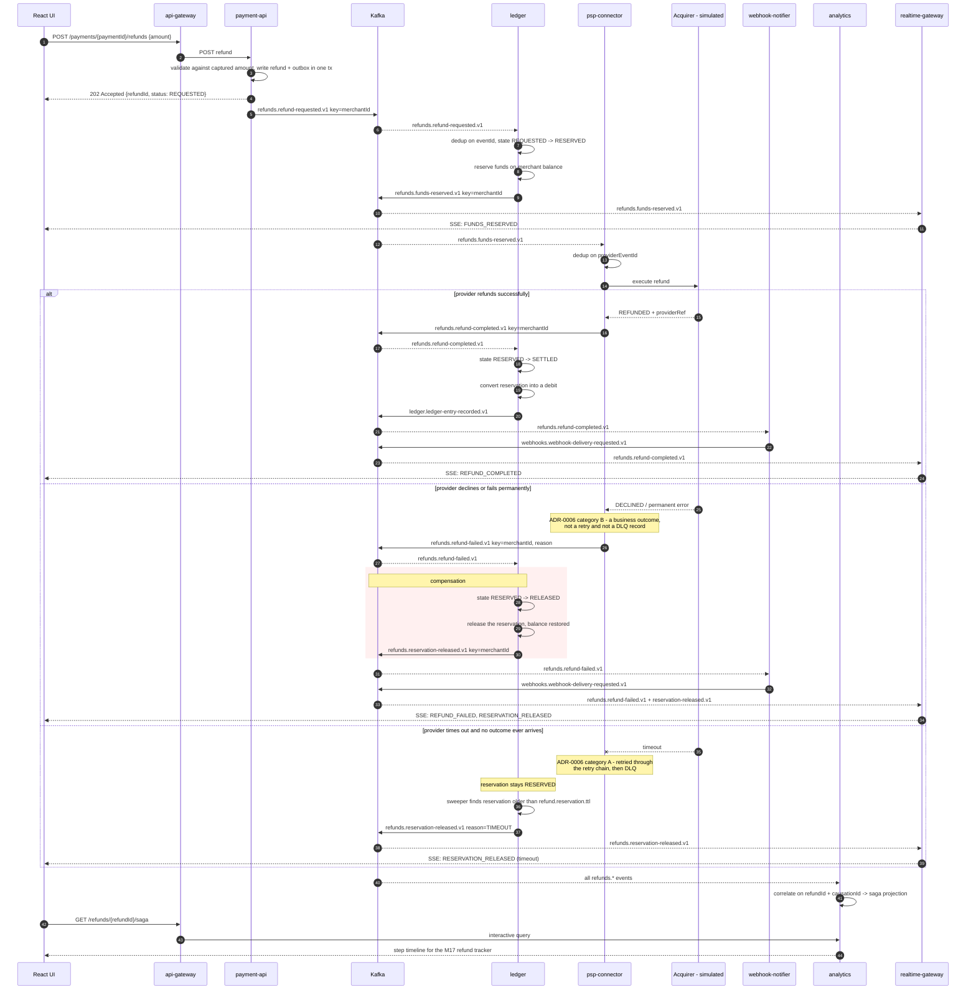
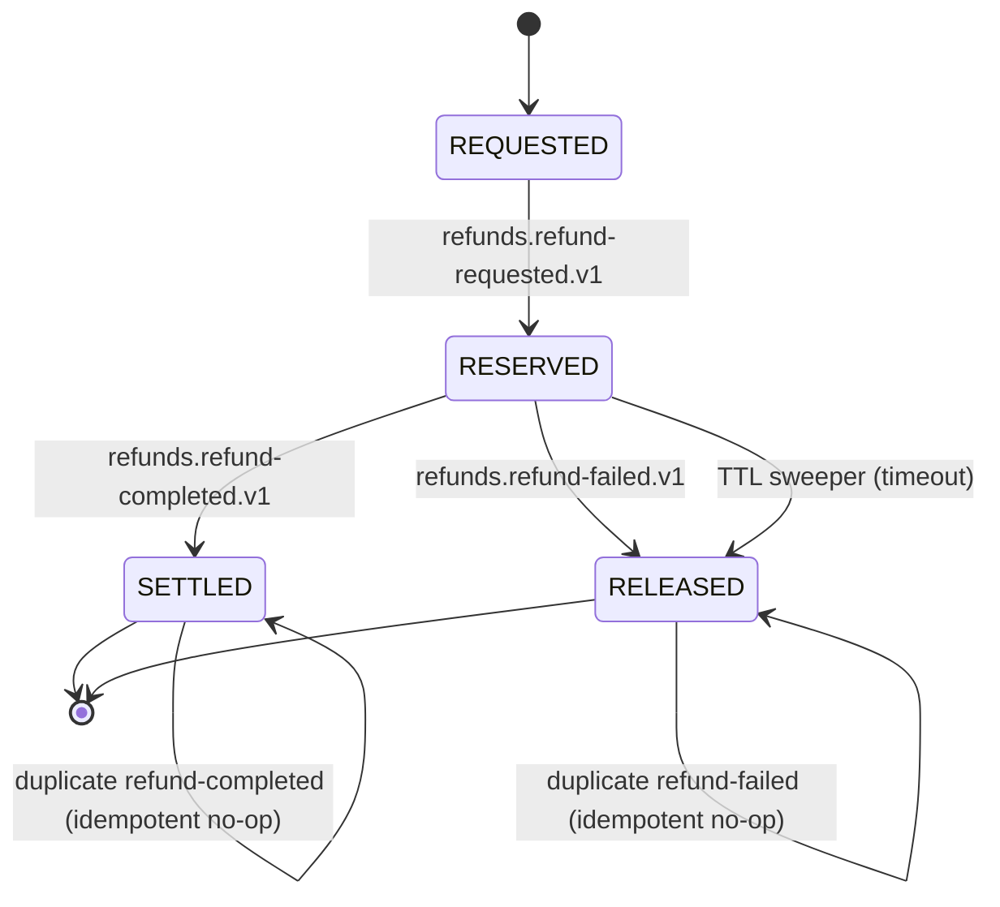

# Sequence — refund saga (choreography), success and compensation

Implements [ADR-0008](../adr/0008-saga-choreography.md). No orchestrator: each service reacts
to an event and publishes its own. All `refunds.*` topics are keyed by `merchantId`
([ADR-0003](../adr/0003-partition-keys-and-counts.md)), so every step for one merchant is
serialized against that merchant's balance.

## Saga state machine (held in the ledger, per `refundId`)

Transitions not on this diagram are **rejected and logged**, not assumed impossible. In
particular `RELEASED --> SETTLED` is illegal: if `refund-completed` arrives after the timeout
sweeper released the reservation, the refund is escalated for manual review rather than
silently applied — the money left the acquirer, but the ledger already un-reserved it.

## What to notice

1. **Nothing here is a rollback.** Once the acquirer has moved money, the compensation writes a
   *new* ledger entry; it never deletes one. Forward recovery only.
2. **Cross-topic order is not guaranteed.** `refunds.refund-completed.v1` and
   `refunds.reservation-released.v1` are different topics; the ledger must handle them in any
   order, which is why every step is an explicit guarded transition.
3. **A declined refund is not an error** — no retry, no DLQ, just
   `refunds.refund-failed.v1` (ADR-0006 category B). A *timeout* is an error and goes through
   the retry chain.
4. **The timeout branch is the one people forget.** Without the TTL sweeper, a lost
   `refund-completed` leaks a reservation forever and the merchant's available balance is
   quietly wrong. The sweeper is a required deliverable of M11, not a nice-to-have.
5. **No single service knows the saga.** The refund tracker in M17 reads a *projection* built by
   analytics from `causationId` chains (ADR-0002). That projection is the price of choreography
   and ships with M11.
6. **`payment-api` produces via the outbox** here too — omitted from the diagram for width; see
   [sequence-happy-path.md](sequence-happy-path.md).
