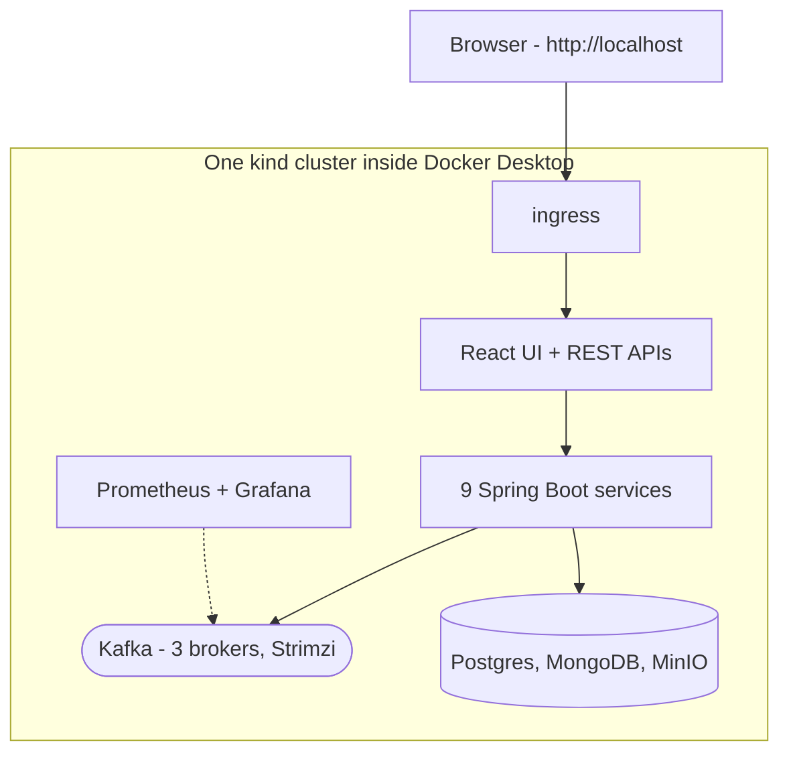

# What actually runs on your machine

Everything lives in one local Kubernetes (kind) cluster, brought up by three scripts:

| Script | Brings up |
|---|---|
| `infra/k8s/scripts/up.sh` | the cluster + Kafka with all topics, users and ACLs |
| `infra/k8s/scripts/deploy-apps.sh` | all services, databases, UI, ingress |
| `infra/k8s/scripts/install-monitoring.sh` | Prometheus + Grafana |

Also inside: KEDA (scales psp-connector when Kafka lag grows), Debezium (streams the outbox
table into Kafka), Schema Registry (Avro contracts).
