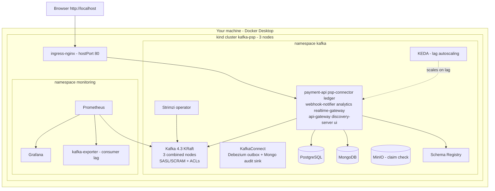

# Deployment (kind)

Brought up by three scripts: `up.sh` (Kafka platform) → `deploy-apps.sh` (build + deploy apps)
→ `install-monitoring.sh` (Prometheus/Grafana). See the root README for the from-zero guide.
