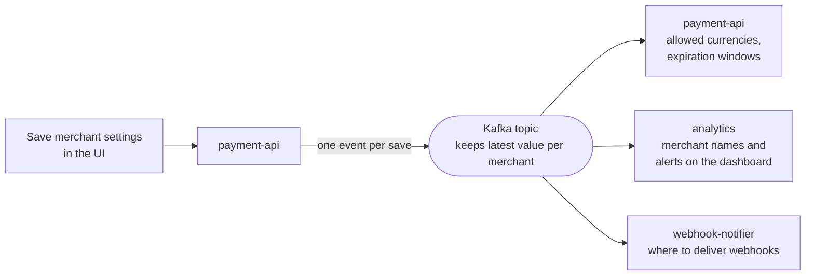

# Merchant settings — one save, three consumers

The topic is *compacted*: Kafka keeps only the newest event per merchant, so it behaves like a
table. Deleting a merchant publishes an empty event (a *tombstone*) — the merchant disappears
from all three consumers with no cleanup code anywhere.
