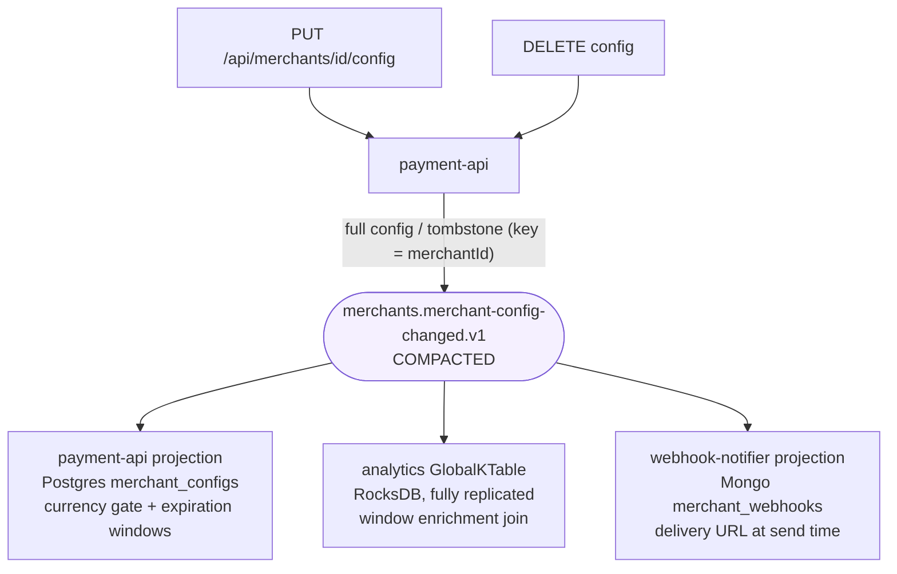

# Merchant config propagation (compacted topic)

```mermaid
flowchart TD
    PUT[PUT /api/merchants/id/config] --> PA[payment-api]
    DEL[DELETE config] --> PA
    PA -- "full config / tombstone (key = merchantId)" --> T([merchants.merchant-config-changed.v1\nCOMPACTED])
    T --> P1[payment-api projection\nPostgres merchant_configs\ncurrency gate + expiration windows]
    T --> P2[analytics GlobalKTable\nRocksDB, fully replicated\nwindow enrichment join]
    T --> P3[webhook-notifier projection\nMongo merchant_webhooks\ndelivery URL at send time]
    style T fill:#f5f0ff,stroke:#7c5cd6
```

Compaction keeps the latest value per key; a tombstone deletes the merchant from every
projection with zero cleanup code.
