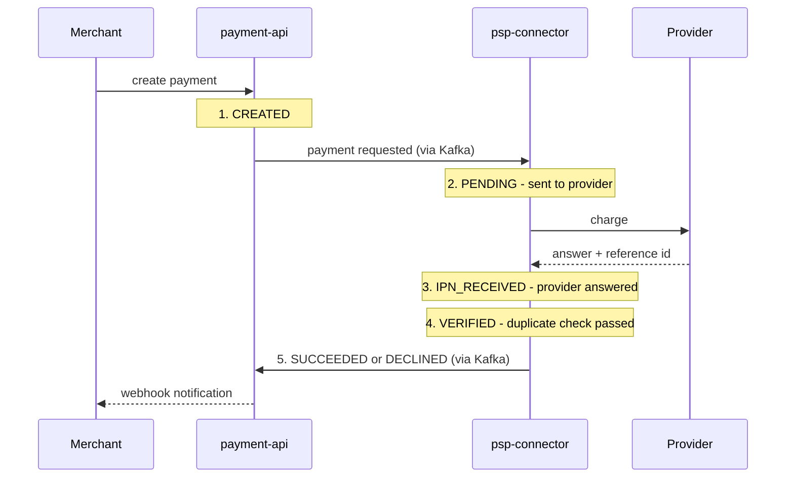

# Payment lifecycle — the five stages

What the merchant sees in the History panel, and where each stage comes from.

Three details that matter:

- **Stuck payment?** If no final answer arrives within the merchant's `paymentExpirationSeconds`,
  payment-api marks it `EXPIRED` and the merchant gets a webhook. A late provider answer still
  wins — the provider is the source of truth.
- **Timeout?** Stage 3 honestly never appears: no answer, no IPN.
- The webhook is delivered by **webhook-notifier** (retries + DLQ), and **ledger** /
  **analytics** consume the same final status for balances and metrics.
