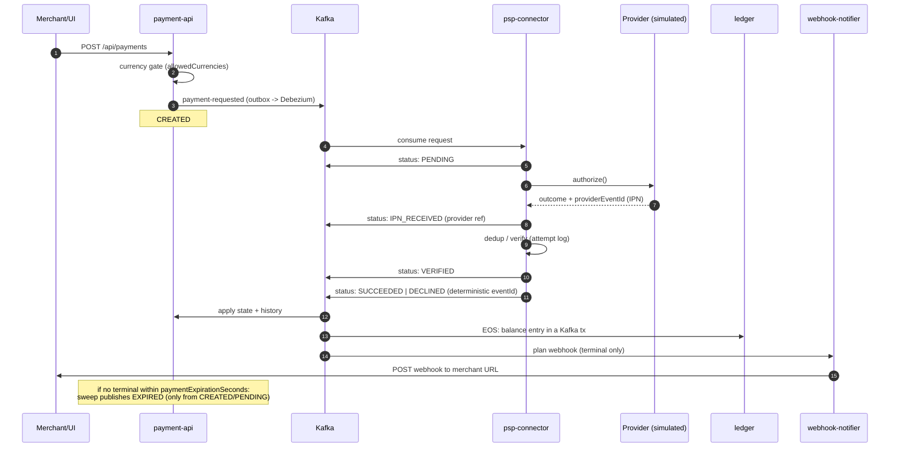

# Payment lifecycle (five stages)

```mermaid
sequenceDiagram
    autonumber
    participant M as Merchant/UI
    participant PA as payment-api
    participant K as Kafka
    participant PC as psp-connector
    participant PR as Provider (simulated)
    participant L as ledger
    participant W as webhook-notifier

    M->>PA: POST /api/payments
    PA->>PA: currency gate (allowedCurrencies)
    PA->>K: payment-requested (outbox -> Debezium)
    Note over PA: CREATED
    K->>PC: consume request
    PC->>K: status: PENDING
    PC->>PR: authorize()
    PR-->>PC: outcome + providerEventId (IPN)
    PC->>K: status: IPN_RECEIVED (provider ref)
    PC->>PC: dedup / verify (attempt log)
    PC->>K: status: VERIFIED
    PC->>K: status: SUCCEEDED | DECLINED (deterministic eventId)
    K->>PA: apply state + history
    K->>L: EOS: balance entry in a Kafka tx
    K->>W: plan webhook (terminal only)
    W->>M: POST webhook to merchant URL
    Note over PA: if no terminal within paymentExpirationSeconds:<br/>sweep publishes EXPIRED (only from CREATED/PENDING)
```
