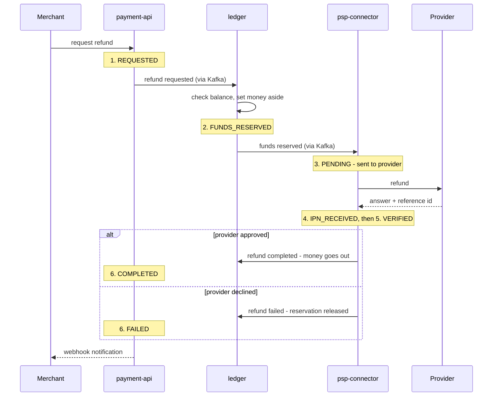

# Refund lifecycle — the six stages

A refund moves money back, so the ledger must reserve it first. Every step is an event; if the
provider says no, the reservation is released — nothing is lost, nothing double-refunded.

Safety nets for a refund that never finishes:

- **ledger** releases any reservation older than 2 minutes — the money is always safe.
- **payment-api** marks the refund `EXPIRED` after the merchant's `refundExpirationSeconds`
  and sends a `REFUND_EXPIRED` webhook — the merchant is never left guessing.
