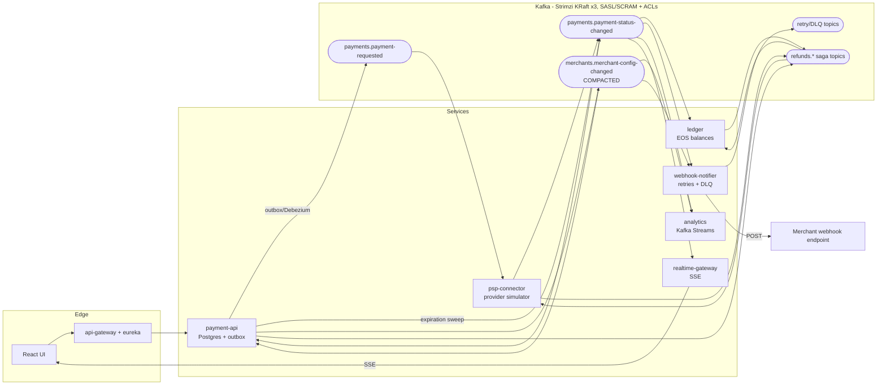

# System overview

```mermaid
flowchart LR
    subgraph edge [Edge]
        UI[React UI]
        GW[api-gateway + eureka]
    end
    subgraph core [Services]
        PA[payment-api\nPostgres + outbox]
        PSP[psp-connector\nprovider simulator]
        LED[ledger\nEOS balances]
        WH[webhook-notifier\nretries + DLQ]
        AN[analytics\nKafka Streams]
        RT[realtime-gateway\nSSE]
    end
    subgraph kafka [Kafka - Strimzi KRaft x3, SASL/SCRAM + ACLs]
        T1([payments.payment-requested])
        T2([payments.payment-status-changed])
        T3([merchants.merchant-config-changed\nCOMPACTED])
        T4([refunds.* saga topics])
        T5([retry/DLQ topics])
    end
    MERCH[Merchant webhook endpoint]

    UI --> GW --> PA
    PA -- outbox/Debezium --> T1 --> PSP
    PSP --> T2
    PA -- expiration sweep --> T2
    T2 --> LED & WH & AN & RT & PA
    PA --> T3
    T3 --> PA & AN & WH
    PA --> T4 --> LED --> T4 --> PSP --> T4
    WH --> T5
    WH -- POST --> MERCH
    RT -- SSE --> UI
```
