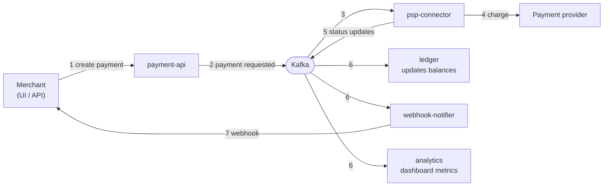

# How a payment travels through the system

That's the whole idea: **services never call each other** — every arrow in the middle is an
event on a Kafka topic. Each consumer reacts at its own pace and keeps its own database.

Also in the picture, but off the happy path:

- **realtime-gateway** — streams the same events to the browser, so the UI updates live.
- **api-gateway** — the single REST entrance in front of payment-api.
- **audit-trail** — a Kafka Connect sink that copies events into MongoDB with zero code.
