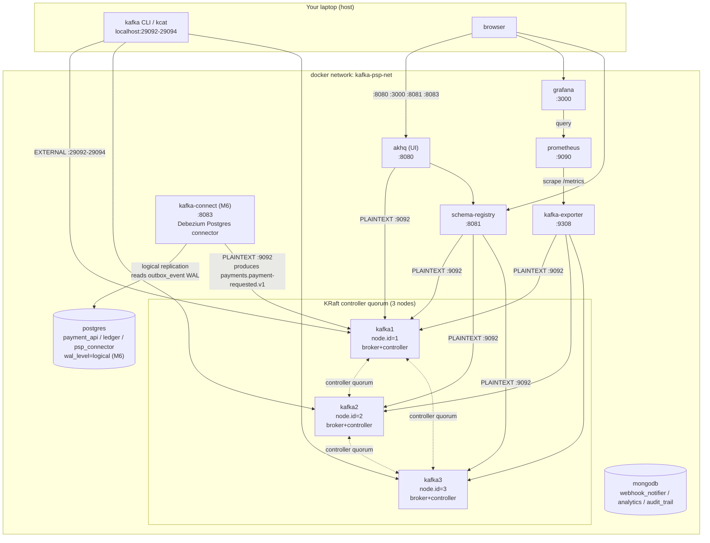

# infra/compose - M2: Infrastructure baseline

## Purpose

Stands up the Kafka PSP pipeline's shared infrastructure on a laptop: a 3-broker KRaft Kafka
cluster, Schema Registry, a topic-browser UI, the two databases the services will use, and a
metrics stack that actually scrapes the cluster. Nothing here runs application code (M3+); this
module is the ground the rest of the pipeline stands on.

**Kafka concepts demonstrated**

- KRaft mode (no ZooKeeper): combined broker+controller roles, 3-node controller quorum,
  `CLUSTER_ID`-based metadata bootstrap.
- Multi-listener brokers: separating an **internal** (Docker-network) listener from an
  **external** (host) listener, and why `advertised.listeners` is the setting that makes or
  breaks it.
- Replication mechanics: replicas, leader election, the in-sync-replica (ISR) set, and how they
  react to a broker failure and recovery in real time.
- Broker-level config precedence (retention, cleanup policy, compression, replication factor)
  vs. per-topic overrides set at creation time.
- Idempotent, script-driven topic provisioning as an alternative to `auto.create.topics.enable`.

## Architecture



## The #1 misconfiguration: `advertised.listeners`

Every broker opens **three** listeners:

| Listener | Container port | Audience | Advertised as |
|---|---|---|---|
| `PLAINTEXT` | 9092 | Containers on `kafka-psp-net` (schema-registry, akhq, kafka-exporter, later services) | `kafka1:9092` / `kafka2:9092` / `kafka3:9092` - Compose DNS names, resolvable only inside the network |
| `CONTROLLER` | 9093 | Broker-to-broker KRaft quorum traffic only | never advertised to clients |
| `EXTERNAL` | 29092 (same on all three containers) | Host tools (your terminal) | `localhost:29092` / `localhost:29093` / `localhost:29094` - a **different host port per broker**, since only one process can bind a given host port |

**Why this breaks so easily.** A client's `bootstrap.servers` is only used for the *first*
connection. That broker replies with metadata containing the full `advertised.listeners` value
for every partition leader in the cluster, and the client reconnects directly using that
metadata. If a broker only advertises its Compose-internal hostname, a host client that reached
it via `localhost:29092` gets told to reconnect to `kafka1:9092` next - which does not resolve
outside Docker - and every produce/consume against a non-bootstrap partition hangs or fails with
DNS/connection errors, even though the *first* connection looked fine. This is exactly the
failure mode PLAN.md calls out as the most common Kafka Docker mistake.

The fix, applied in `docker-compose.yml` (see the big comment block at the top of that file):
give every audience its own listener **name**, map each name to a protocol via
`listener.security.protocol.map`, and set `advertised.listeners` to the address that specific
audience will actually dial - `kafka1:9092` for containers, `localhost:2909X` (broker-specific
port) for the host.

## Topics

All topics come from [`docs/diagrams/topic-map.md`](../../docs/diagrams/topic-map.md); names
per [ADR-0001](../../docs/adr/0001-topic-naming-and-versioning.md), keys/partitions per
[ADR-0003](../../docs/adr/0003-partition-keys-and-counts.md). Created by `create-topics.sh`.

| Name | Key | Partitions | RF | Retention | cleanup.policy |
|---|---|---|---|---|---|
| `payments.payment-requested.v1` | `paymentId` | 12 | 3 | 7 d | delete |
| `payments.payment-status-changed.v1` | `merchantId` | 12 | 3 | 7 d | delete |
| `refunds.refund-requested.v1` | `merchantId` | 6 | 3 | 7 d | delete |
| `refunds.funds-reserved.v1` | `merchantId` | 6 | 3 | 7 d | delete |
| `refunds.refund-completed.v1` | `merchantId` | 6 | 3 | 7 d | delete |
| `refunds.refund-failed.v1` | `merchantId` | 6 | 3 | 7 d | delete |
| `refunds.reservation-released.v1` | `merchantId` | 6 | 3 | 7 d | delete |
| `ledger.ledger-entry-recorded.v1` | `merchantId` | 6 | 3 | 30 d | delete |
| `merchants.merchant-config-changed.v1` | `merchantId` | 3 | 3 | ∞ | compact |
| `webhooks.webhook-delivery-requested.v1` | `merchantId` | 6 | 3 | 3 d | delete |
| `webhooks.webhook-delivery-requested.v1.retry.5s` | `merchantId` | 6 | 3 | 3 d | delete |
| `webhooks.webhook-delivery-requested.v1.retry.1m` | `merchantId` | 6 | 3 | 3 d | delete |
| `webhooks.webhook-delivery-requested.v1.retry.15m` | `merchantId` | 6 | 3 | 3 d | delete |
| `webhooks.webhook-delivery-requested.v1.dlq` | `merchantId` | 3 | 3 | 30 d | delete |
| `payments.payment-requested.v1.psp-connector.dlq` | `paymentId` | 3 | 3 | 30 d | delete |
| `payments.payment-status-changed.v1.ledger.dlq` | `merchantId` | 3 | 3 | 30 d | delete |
| `psp.provider-status-query.v1` | `paymentId` | 6 | 3 | 1 h | delete |
| `psp.provider-status-reply.v1` | `paymentId` | 6 | 3 | 1 h | delete |

**Not created here** (see comments in `create-topics.sh`): the `analytics-streams.v1-*` Kafka
Streams internal topics (M10) and `connect.configs`/`connect.offsets`/`connect.status` (M6/M13)
- both are created by their own owning process, not by this script.

Cluster-wide defaults (`docs/diagrams/topic-map.md`), set as broker config in
`docker-compose.yml`: `replication.factor=3`, `min.insync.replicas=2`,
`cleanup.policy=delete`, `retention.ms=604800000` (7 d), `compression.type=zstd`,
`unclean.leader.election.enable=false`, `auto.create.topics.enable=false`.

## Image choices

| Component | Image | Why |
|---|---|---|
| Kafka brokers | `confluentinc/cp-kafka:7.7.1` (Apache Kafka 3.8.0) | Wire-compatible, 100% OSS Kafka underneath; chosen over the bare `apache/kafka` image because Confluent's env-var-driven config (`KAFKA_*`) is what nearly every KRaft docker-compose reference (including Confluent's own `cp-all-in-one-kraft`) uses, which made the dual-listener setup easy to cross-check against a known-working pattern. It also keeps the whole registry+broker stack on one vendor's tested version matrix (`cp-schema-registry` is Confluent's own product; pairing it with a Confluent broker image removes one axis of version-mismatch risk). Nothing here uses a Confluent-proprietary feature - the brokers speak plain Kafka protocol and every other client in this compose file (AKHQ, kafka-exporter, the host CLI) is a plain community tool. |
| Schema Registry | `confluentinc/cp-schema-registry:7.7.1` | No Apache-native alternative exists; this is the reference implementation and matches the cp-kafka version line. |
| UI | `tchiotludo/akhq:0.24.0` | Chosen over Redpanda Console: AKHQ has first-class Schema Registry and (later) Kafka Connect integration in one UI, works against plain Kafka/KRaft with no broker-side plugin, and is configured via a single mounted YAML file. |
| Metrics | `danielqsj/kafka-exporter:v1.7.0` | See "Metrics" below. |
| Postgres | `postgres:16-alpine` | Small image, current stable major. |
| MongoDB | `mongo:7.0` | Current stable major with TTL-index support needed later (M8). |
| Prometheus / Grafana | `prom/prometheus:v2.54.1` / `grafana/grafana:11.1.4` | Current stable releases at time of writing. |
| Kafka Connect (M6) | `debezium/connect:2.7.3.Final` | Chosen over `confluentinc/cp-kafka-connect` + a separate `confluent-hub install debezium/debezium-connector-postgresql` step: this image ships a plain Kafka Connect distributed-mode worker with every Debezium connector (including `debezium-connector-postgres`) pre-installed, so there is no second plugin-provisioning step to get wrong for a stack that only needs one connector. Verified compatible with the 3.8.0-wire-protocol broker cluster above - Kafka Connect's client/broker compatibility is broad across minor versions. |

## M6 - `wal_level=logical` and Kafka Connect

Two changes support the transactional outbox pattern (`services/payment-api/README.md`'s M6
section has the full writeup; this is the infra side only).

**`wal_level=logical` on Postgres.** Debezium's Postgres connector doesn't poll tables - it opens
a logical replication slot and streams the write-ahead log directly, and Postgres cannot decode
WAL into row-level changes below `wal_level=logical` (the default, `replica`, only carries enough
for physical streaming replication/PITR). This is a **server-wide** setting, not per-database or
per-table, applied via `command: ["postgres", "-c", "wal_level=logical"]` on the `postgres`
service rather than a mounted `postgresql.conf`, so the image's own default config is otherwise
untouched. It requires a Postgres **restart** to take effect - `docker compose up -d postgres`
recreates the container; the named `postgres-data` volume (and everything in it) survives, since
this is a config change, not a re-initialization. On an already-running stack whose data volume
predates this change, `01-init-databases.sh`/`02-debezium-replication.sh` will **not** re-run
(init scripts only run against a fresh, empty data directory) - grant replication manually once:
`docker compose exec postgres psql -U postgres -c "ALTER ROLE payment_api WITH REPLICATION;"`,
then `docker compose up -d postgres` to pick up the `command` change. A genuinely fresh
`docker compose down -v && up -d` needs neither step; both init scripts run automatically.

**Replication privilege, scoped per-service.** `postgres/init/02-debezium-replication.sh` grants
`REPLICATION` to the existing `payment_api` role (the same role Flyway already uses to own
`payment_api`'s schema) rather than introducing a new shared credential - the Debezium connector
authenticates as that role, so it can stream WAL for `payment_api` and nothing else, preserving
the ADR-0005 per-service isolation the rest of this stack already relies on (that role still
cannot even `CONNECT` to `ledger` or `psp_connector`).

**`kafka-connect` service.** A single distributed-mode worker (see
`services/payment-api/README.md`'s "Kafka Connect architecture" section for what
worker/connector/task/converter each mean) exposing the REST API on `${KAFKA_CONNECT_PORT}`
(`8083` by default). `CONNECT_*`-prefixed environment variables are generic passthrough - the
image's entrypoint strips the `CONNECT_` prefix, lowercases, and turns `_` into `.` to build
`connect-distributed.properties` - the same idea as this file's own `KAFKA_*` broker variables,
one layer further into the stack.

**Connector registration.** `register-connector.sh` is the M6 sibling of `create-topics.sh`:
idempotent, `.env`-driven, safe to re-run. It renders
`connect/payment-outbox-connector.json` (resolving the `${PAYMENT_API_DB_USER}`-style
placeholders via `jq`, not shell substitution, so a password containing a JSON-special character
can never corrupt the payload), `PUT`s it to `/connectors/payment-outbox-connector/config`
(Kafka Connect's REST API defines `PUT` on that path as an upsert - create if absent, update in
place if present), then polls `/connectors/<name>/status` until **both** `connector.state` and
`tasks[0].state` report `RUNNING` - a connector can show `RUNNING` while its only task is
`FAILED`, so checking connector state alone is not enough. If the task is `FAILED` (e.g. because
an earlier config version was buggy), the script issues **one** automatic
`POST .../restart?includeTasks=true` and retries - `PUT`ting a fixed config does not, on its own,
restart an already-failed task, a genuine Kafka Connect gotcha hit during verification.

### Metrics: kafka-exporter vs. jmx_exporter

The task allows either. I used **`kafka-exporter`** (protocol-based - it talks the Kafka wire
protocol via the Sarama client library, not JMX) instead of a `jmx_exporter` Java agent:

- **No javaagent/jar management.** A JMX exporter needs a `jmx_prometheus_javaagent-*.jar` plus
  a hand-written mbean-to-metric YAML mounted into every broker and wired through `KAFKA_OPTS`.
  Getting that YAML's regex rules right is fiddly and a single bad rule silently drops metrics
  cluster-wide. `kafka-exporter` ships as one static binary with zero broker-side config.
- **It exposes exactly the metrics this module's acceptance bar cares about**:
  `kafka_topic_partition_leader`, `kafka_topic_partition_replicas`, and
  `kafka_topic_partition_in_sync_replica` per partition - i.e., leader and ISR, live, in
  Grafana, which is the whole point of the broker-kill drill below. The Grafana dashboard's "ISR
  per partition" panel is driven directly by this.
- **Trade-off accepted:** it does not expose JVM/GC/heap or request-latency percentiles the way
  JMX would. That's real signal you'd want in production and will matter more from M15
  (observability) onward. For M2, topic/partition/broker-level visibility was the priority.

## Persistence

One Postgres container, one Mongo container - each hosting **separate logical
databases with separate users/passwords per service**, per
[ADR-0005](../../docs/adr/0005-database-per-service.md)'s explicit "physical vs logical
separation" compose shortcut. Verified below: a service's DB user cannot even open a connection
to another service's database (`permission denied for database`).

| Service | Store | Database | User |
|---|---|---|---|
| payment-api | PostgreSQL | `payment_api` | `payment_api` |
| ledger | PostgreSQL | `ledger` | `ledger` |
| psp-connector | PostgreSQL | `psp_connector` | `psp_connector` |
| webhook-notifier | MongoDB | `webhook_notifier` | `webhook_notifier` |
| analytics | MongoDB | `analytics` | `analytics` |
| audit-trail | MongoDB | `audit_trail` | `audit_trail` |

## How to run

```bash
cd infra/compose
docker compose up -d
docker compose ps                 # wait for every service to show "healthy"
./create-topics.sh                # idempotent - safe to re-run
./register-connector.sh           # M6 - idempotent - safe to re-run
```

Endpoints (see `.env` to change ports):

| Service | URL |
|---|---|
| Kafka (host) | `localhost:29092`, `localhost:29093`, `localhost:29094` |
| Schema Registry | http://localhost:8081 |
| AKHQ | http://localhost:8080 |
| Grafana | http://localhost:3000 (admin/admin) |
| Prometheus | http://localhost:9090 |
| Postgres | `localhost:5432` |
| MongoDB | `localhost:27017` |
| Kafka Connect REST API (M6) | http://localhost:8083 |

Tear down: `docker compose down` (keeps volumes/data) or **`docker compose down -v`** (also
deletes named volumes - full reset, next `up` reformats the KRaft log from scratch).

## Prove it - experiments run against this exact stack

All output below is real, captured while verifying this module (not hand-written). The Grafana
dashboard "Kafka Cluster Overview (M2)" (provisioned automatically) mirrors the ISR numbers
below live, panel "In-sync replicas per partition."

### a. `docker compose up -d` and health

```
$ docker compose ps --format "table {{.Name}}\t{{.Image}}\t{{.Status}}\t{{.Ports}}"
NAME              IMAGE                                   STATUS                    PORTS
akhq              tchiotludo/akhq:0.24.0                  Up 18 hours (healthy)     0.0.0.0:8080->8080/tcp
grafana           grafana/grafana:11.1.4                  Up 39 seconds (healthy)   0.0.0.0:3000->3000/tcp
kafka-exporter    danielqsj/kafka-exporter:v1.7.0         Up 18 hours (healthy)     0.0.0.0:9308->9308/tcp
kafka1            confluentinc/cp-kafka:7.7.1             Up 18 hours (healthy)     0.0.0.0:29092->29092/tcp
kafka2            confluentinc/cp-kafka:7.7.1             Up 3 hours (healthy)      0.0.0.0:29093->29092/tcp
kafka3            confluentinc/cp-kafka:7.7.1             Up 18 hours (healthy)     0.0.0.0:29094->29092/tcp
mongodb           mongo:7.0                               Up 18 hours (healthy)     0.0.0.0:27017->27017/tcp
postgres          postgres:16-alpine                      Up 18 hours (healthy)     0.0.0.0:5432->5432/tcp
prometheus        prom/prometheus:v2.54.1                 Up 18 hours (healthy)     0.0.0.0:9090->9090/tcp
schema-registry   confluentinc/cp-schema-registry:7.7.1   Up 18 hours (healthy)     0.0.0.0:8081->8081/tcp
```
(`grafana` and `kafka2` show shorter uptimes above because both were deliberately
stopped/restarted during this verification - a mount-path bug fix for Grafana, and the broker
failure drill for kafka2. See "Troubleshooting" and the drill below.)

### b. `create-topics.sh`, then `--describe` on a 6-partition RF=3 topic

```
$ ./create-topics.sh
Creating 18 topics via mode='compose' ...
  OK    payments.payment-requested.v1                           partitions=12  rf=3  cleanup=delete   retention.ms=604800000
  OK    payments.payment-status-changed.v1                      partitions=12  rf=3  cleanup=delete   retention.ms=604800000
  ... (18 topics total, all OK)
All topics present.
```

Describing `webhooks.webhook-delivery-requested.v1` (6 partitions, RF=3):

```
$ docker compose exec kafka1 kafka-topics --bootstrap-server kafka1:9092,kafka2:9092,kafka3:9092 \
    --describe --topic webhooks.webhook-delivery-requested.v1

Topic: webhooks.webhook-delivery-requested.v1  PartitionCount: 6  ReplicationFactor: 3
  Configs: compression.type=zstd,min.insync.replicas=2,cleanup.policy=delete,retention.ms=259200000,unclean.leader.election.enable=false
        Partition: 0  Leader: 1  Replicas: 1,2,3  Isr: 1,2,3
        Partition: 1  Leader: 2  Replicas: 2,3,1  Isr: 2,3,1
        Partition: 2  Leader: 3  Replicas: 3,1,2  Isr: 3,1,2
        Partition: 3  Leader: 2  Replicas: 2,3,1  Isr: 2,3,1
        Partition: 4  Leader: 3  Replicas: 3,1,2  Isr: 3,1,2
        Partition: 5  Leader: 1  Replicas: 1,2,3  Isr: 1,2,3
```

Leadership is spread evenly (each broker leads 2 of the 6 partitions), and every partition's
ISR contains all 3 replicas - the cluster is fully in sync.

Re-running `./create-topics.sh` a second time produces the same 18 `OK` lines with no errors and
does not change partition counts or configs - confirming idempotency.

### c. Produce/consume from the HOST and from a container

Host had no Kafka CLI pre-installed, so I downloaded the matching Apache Kafka 3.8.0 client
tarball (Java already present via sdkman) purely to run these commands as genuine host-native
processes - not a container - against the **EXTERNAL** listener:

```
$ kafka-console-producer.sh --bootstrap-server localhost:29092,localhost:29093,localhost:29094 \
    --topic webhooks.webhook-delivery-requested.v1
> hello-from-host-1
> hello-from-host-2
$ kafka-console-consumer.sh --bootstrap-server localhost:29092,localhost:29093,localhost:29094 \
    --topic webhooks.webhook-delivery-requested.v1 --from-beginning --max-messages 2
hello-from-host-1
hello-from-host-2
Processed a total of 2 messages
```

From inside a container (kafka2 producing, kafka3 consuming), against the **INTERNAL**
listener - proving the other half of the dual-listener setup:

```
$ docker compose exec kafka2 kafka-console-producer --bootstrap-server kafka1:9092,kafka2:9092,kafka3:9092 \
    --topic webhooks.webhook-delivery-requested.v1
> hello-from-container-1
> hello-from-container-2
$ docker compose exec kafka3 kafka-console-consumer --bootstrap-server kafka1:9092,kafka2:9092,kafka3:9092 \
    --topic webhooks.webhook-delivery-requested.v1 --from-beginning --max-messages 4
hello-from-container-1
hello-from-container-2
hello-from-host-1
hello-from-host-2
Processed a total of 4 messages
```

Both listeners write to (and read from) the exact same partitions - the consumer sees all 4
messages regardless of which listener produced them.

### d. Acceptance bar: broker failure drill

**BEFORE** - all 3 brokers up, `webhooks.webhook-delivery-requested.v1` fully in sync
(same describe output as in step b): every partition's `Isr` lists all 3 replica IDs, kafka2 is
leader for partitions 1 and 3.

**Stop kafka2:**

```
$ docker stop kafka2
kafka2
$ docker compose ps --format "table {{.Name}}\t{{.Status}}"
NAME              STATUS
akhq              Up ... (healthy)
kafka-exporter    Up ... (healthy)
kafka1            Up ... (healthy)
kafka3            Up ... (healthy)
mongodb           Up ... (healthy)
postgres          Up ... (healthy)
prometheus        Up ... (healthy)
schema-registry   Up ... (healthy)
                                        # kafka2 no longer listed - it is stopped
```

**DURING** (kafka2 down, ~20s after stop so the controller quorum has time to notice the missed
broker heartbeat and shrink the ISR):

```
$ docker compose exec kafka1 kafka-topics --bootstrap-server kafka1:9092,kafka3:9092 \
    --describe --topic webhooks.webhook-delivery-requested.v1

Topic: webhooks.webhook-delivery-requested.v1  PartitionCount: 6  ReplicationFactor: 3
        Partition: 0  Leader: 1  Replicas: 1,2,3  Isr: 1,3
        Partition: 1  Leader: 3  Replicas: 2,3,1  Isr: 3,1
        Partition: 2  Leader: 3  Replicas: 3,1,2  Isr: 3,1
        Partition: 3  Leader: 3  Replicas: 2,3,1  Isr: 3,1
        Partition: 4  Leader: 3  Replicas: 3,1,2  Isr: 3,1
        Partition: 5  Leader: 1  Replicas: 1,3,2  Isr: 1,3
```

Exactly the module's "prove it" story: **ISR shrank from `{1,2,3}` to a 2-member set on every
partition** (broker 2 dropped everywhere), and **partitions 1 and 3 - the ones kafka2 used to
lead - re-elected kafka3 as the new leader**. `min.insync.replicas=2` means the topic still
tolerates this: `acks=all` writes still succeed with 2 in-sync replicas.

Produce + consume still works with a broker down (host client, via the two surviving EXTERNAL
listeners):

```
$ kafka-console-producer.sh --bootstrap-server localhost:29092,localhost:29094 \
    --topic webhooks.webhook-delivery-requested.v1
> during-outage-1
> during-outage-2
$ kafka-console-consumer.sh --bootstrap-server localhost:29092,localhost:29094 \
    --topic webhooks.webhook-delivery-requested.v1 --from-beginning --max-messages 6
hello-from-host-1
hello-from-host-2
during-outage-1
during-outage-2
hello-from-container-1
hello-from-container-2
Processed a total of 6 messages
```

The cluster kept serving both reads and writes with one of three brokers down.

**Restart kafka2 and watch ISR re-expand:**

```
$ docker start kafka2
kafka2
$ # polled docker inspect --format '{{.State.Health.Status}}' kafka2 - reported "healthy" quickly
$ docker compose exec kafka1 kafka-topics --bootstrap-server kafka1:9092,kafka2:9092,kafka3:9092 \
    --describe --topic webhooks.webhook-delivery-requested.v1

Topic: webhooks.webhook-delivery-requested.v1  PartitionCount: 6  ReplicationFactor: 3
        Partition: 0  Leader: 1  Replicas: 1,2,3  Isr: 1,3,2
        Partition: 1  Leader: 2  Replicas: 2,3,1  Isr: 3,1,2
        Partition: 2  Leader: 3  Replicas: 3,1,2  Isr: 3,1,2
        Partition: 3  Leader: 2  Replicas: 2,3,1  Isr: 3,1,2
        Partition: 4  Leader: 3  Replicas: 3,1,2  Isr: 3,1,2
        Partition: 5  Leader: 1  Replicas: 1,3,2  Isr: 1,3,2
```

**AFTER**: ISR is back to all 3 replicas on every partition, and - since
`auto.leader.rebalance.enable` defaults to `true` - Kafka's periodic preferred-leader election
even moved leadership for partitions 1 and 3 back to kafka2, restoring the exact original
leader assignment from step (a) with zero manual intervention. No data was lost: the 6 messages
produced across the whole drill (2 host, 2 container, 2 during-outage) were all still readable
afterward.

### e. Schema Registry, UI, Postgres, Mongo, Prometheus targets

```
$ curl -s http://localhost:8081/subjects
[]                                          # reachable, empty - no schemas registered until M9

$ curl -s -L -o /dev/null -w "HTTP %{http_code} final_url=%{url_effective}\n" http://localhost:8080/
HTTP 200 final_url=http://localhost:8080/ui # AKHQ UI loads

$ docker compose exec postgres psql -U payment_api -d payment_api -c "SELECT current_database(), current_user;"
 current_database | current_user
------------------+--------------
 payment_api      | payment_api
(the same succeeds for ledger/ledger and psp_connector/psp_connector)

$ docker compose exec postgres psql -U payment_api -d ledger -c "SELECT 1;"
psql: error: ... FATAL:  permission denied for database "ledger"
DETAIL:  User does not have CONNECT privilege.
                                             # confirms ADR-0005 per-service grants actually work

$ docker compose exec mongodb mongosh -u webhook_notifier -p webhook_notifier_pw \
    --authenticationDatabase webhook_notifier webhook_notifier --eval "db.getName()"
webhook_notifier                            # same pattern succeeds for analytics, audit_trail

$ curl -s http://localhost:9090/api/v1/targets | ...
kafka       http://kafka-exporter:9308/metrics   up
prometheus  http://localhost:9090/metrics        up

$ curl -s http://localhost:3000/api/health
{"commit":"...","database":"ok","version":"11.1.4"}

$ curl -s -u admin:admin http://localhost:3000/api/datasources
[{"name":"Prometheus","type":"prometheus","url":"http://prometheus:9090","isDefault":true,...}]

$ curl -s -u admin:admin "http://localhost:3000/api/datasources/proxy/uid/<uid>/api/v1/query?query=kafka_topic_partition_in_sync_replica"
# result count: 159 series, e.g.:
# {topic="webhooks.webhook-delivery-requested.v1", partition="1", ...} value=3
```

Everything responds; the Postgres/Mongo cross-database denial and the 159-series Prometheus
query (which includes every business topic's per-partition ISR, all back at 3 post-recovery)
are the two checks worth re-running yourself after `docker compose up -d`.

## Troubleshooting

**Symptom: host client connects, lists topics, then hangs or fails on produce/consume to a
specific partition.** Classic `advertised.listeners` misconfiguration - the broker that owns
that partition is advertising an address the host can't reach (usually its Compose-internal
hostname). Check `KAFKA_ADVERTISED_LISTENERS` for that broker; the `EXTERNAL` entry must be
`localhost:<that broker's own mapped host port>`, not a Docker-network hostname and not another
broker's port.

**Symptom: only one broker is reachable from the host; the other two time out.** Two brokers are
advertising the *same* host port (e.g. both say `localhost:29092`). Each broker's EXTERNAL
listener needs a distinct host-side port - check the `ports:` mapping and the corresponding
`${KAFKA*_EXTERNAL_PORT}` value in `.env` line up 1:1 per broker.

**Symptom: `docker compose up -d` never converges / a service stays "Created" and never
starts.** Check `docker compose logs <service>` - don't assume a healthcheck problem first. This
bit us for real during verification: `grafana` silently stayed in `Created` state because
`grafana/dashboards` was bind-mounted *inside* the path already claimed by the
`grafana/provisioning/dashboards` mount (`/etc/grafana/provisioning/dashboards/files`), and
Docker cannot create a mountpoint inside another bind mount's read-only root
(`OCI runtime create failed: ... read-only file system`). Fixed by mounting dashboard JSON files
at a sibling path (`/etc/grafana/dashboards-data`) instead, referenced by
`grafana/provisioning/dashboards/dashboard.yml`'s `options.path`. General lesson: never nest one
bind mount's target inside another's.

**Symptom: `create-topics.sh` fails with `Invalid topic config: all configs to be added must be
in the format "key=val"`.** `kafka-topics --config` takes one `key=value` pair per flag
occurrence, not a comma-joined string in a single flag - repeat `--config` per property.

**Symptom: cluster looks "up" but topic creation / metadata operations hang.** KRaft needs a
**majority** (2 of 3) of controller-quorum votes to process metadata changes. If two brokers are
down simultaneously, the surviving broker's data plane may still serve existing traffic in some
cases, but no new topic/partition/config changes will commit. Individual broker healthchecks
only prove that broker's own listener responds - they don't prove quorum health.

**Symptom: `psql`/`mongosh` "permission denied" for a database that isn't yours.** That's not a
bug - it's ADR-0005's per-service grant working as designed (see step (e) above). Each service
user can only connect to its own database.

## Compromises / what didn't fully match the ideal

- **(M6) `snapshot.mode=no_data`** on the outbox connector means rows already present in
  `outbox_event` at connector-registration time are never relayed - only inserts after
  registration are captured. This is the textbook-correct choice for an outbox connector (see
  `services/payment-api/README.md`'s "Known issues"), not an oversight, but it's a real gap if the
  connector is ever registered *after* payment-api has already been accepting traffic against a
  fresh table.
- **(M6) No outbox cleanup job.** `outbox_event` grows forever on this service's side; nothing
  purges rows Debezium has already relayed. Fine at learning-cluster scale.
- **(M6) `topic.prefix=payment-api`** is set to satisfy the Postgres connector's required config
  (it also seeds the replication-slot-adjacent internal naming), but since the outbox event router
  SMT hardcodes the destination topic (`route.topic.replacement`), this prefix never actually
  appears in any topic name a consumer sees - a slightly confusing but harmless required field.
- **Combined broker+controller roles** on all 3 nodes (not dedicated controller-only nodes) -
  explicitly allowed by the task for a laptop; a production KRaft cluster would split these.
- **kafka-exporter over a JMX javaagent** for metrics - see "Metrics" above for the reasoning
  and the trade-off (no JVM/heap/GC/request-latency metrics yet; that's a good M15 upgrade).
- **One Postgres/Mongo container each**, not one per service - explicitly sanctioned by
  ADR-0005 as the compose-scale shortcut, with per-service databases/users to preserve the
  isolation property that matters (a service cannot reach another service's data).
- Grafana's dashboard-provisioning path required a real fix mid-build (see Troubleshooting) -
  left documented rather than silently corrected, since the failure mode (nested bind mounts) is
  a genuinely easy mistake to repeat in later modules (M18 Helm charts mount plenty of
  ConfigMaps).
- A **`kind` cluster (`kafka-psp`, 3 nodes)** is already running on this machine from the M1/0.3
  toolchain setup and was left untouched per instructions; it costs some RAM/CPU alongside this
  compose stack. On a memory-constrained laptop, `kind delete cluster` (not run here) would free
  it up, but this module doesn't need it and there was no resource pressure observed (48 GB
  total RAM; the full stack - 3 Kafka brokers, Schema Registry, AKHQ, Postgres, Mongo,
  kafka-exporter, Prometheus, Grafana, plus the pre-existing 3-node kind cluster - ran
  comfortably at once).
