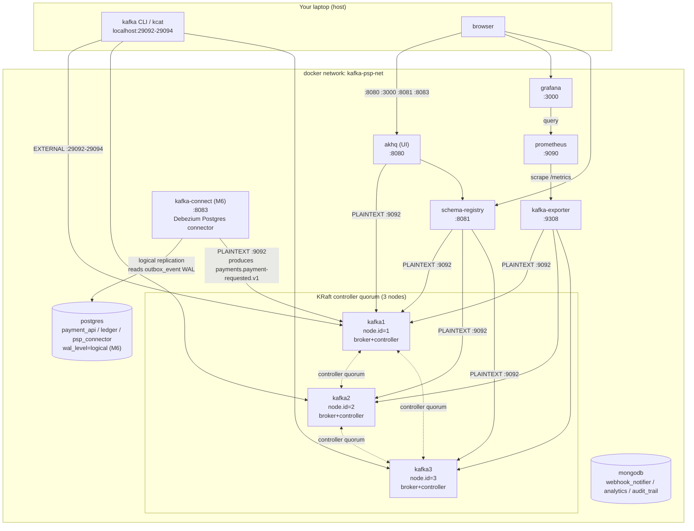

# infra/compose - M2: Infrastructure baseline

## Purpose

Stands up the Kafka PSP pipeline's shared infrastructure on a laptop: a 3-broker KRaft Kafka
cluster, Schema Registry, a topic-browser UI, the two databases the services will use, and a
metrics stack that actually scrapes the cluster. Nothing here runs application code (M3+); this
module is the ground the rest of the pipeline stands on.

**Kafka concepts demonstrated**

- KRaft mode (no ZooKeeper): combined broker+controller roles, 3-node controller quorum,
  `CLUSTER_ID`-based metadata bootstrap.
- Multi-listener brokers: separating an **internal** (Docker-network) listener from an
  **external** (host) listener, and why `advertised.listeners` is the setting that makes or
  breaks it.
- Replication mechanics: replicas, leader election, the in-sync-replica (ISR) set, and how they
  react to a broker failure and recovery in real time.
- Broker-level config precedence (retention, cleanup policy, compression, replication factor)
  vs. per-topic overrides set at creation time.
- Idempotent, script-driven topic provisioning as an alternative to `auto.create.topics.enable`.

## Architecture



## The #1 misconfiguration: `advertised.listeners`

Every broker opens **three** listeners:

| Listener | Container port | Audience | Advertised as |
|---|---|---|---|
| `PLAINTEXT` | 9092 | Containers on `kafka-psp-net` (schema-registry, akhq, kafka-exporter, later services) | `kafka1:9092` / `kafka2:9092` / `kafka3:9092` - Compose DNS names, resolvable only inside the network |
| `CONTROLLER` | 9093 | Broker-to-broker KRaft quorum traffic only | never advertised to clients |
| `EXTERNAL` | 29092 (same on all three containers) | Host tools (your terminal) | `localhost:29092` / `localhost:29093` / `localhost:29094` - a **different host port per broker**, since only one process can bind a given host port |

**Why this breaks so easily.** A client's `bootstrap.servers` is only used for the *first*
connection. That broker replies with metadata containing the full `advertised.listeners` value
for every partition leader in the cluster, and the client reconnects directly using that
metadata. If a broker only advertises its Compose-internal hostname, a host client that reached
it via `localhost:29092` gets told to reconnect to `kafka1:9092` next - which does not resolve
outside Docker - and every produce/consume against a non-bootstrap partition hangs or fails with
DNS/connection errors, even though the *first* connection looked fine. This is exactly the
failure mode PLAN.md calls out as the most common Kafka Docker mistake.

The fix, applied in `docker-compose.yml` (see the big comment block at the top of that file):
give every audience its own listener **name**, map each name to a protocol via
`listener.security.protocol.map`, and set `advertised.listeners` to the address that specific
audience will actually dial - `kafka1:9092` for containers, `localhost:2909X` (broker-specific
port) for the host.

## Topics

All topics come from [`docs/diagrams/topic-map.md`](../../docs/diagrams/topic-map.md); names
per [ADR-0001](../../docs/adr/0001-topic-naming-and-versioning.md), keys/partitions per
[ADR-0003](../../docs/adr/0003-partition-keys-and-counts.md). Created by `create-topics.sh`.

| Name | Key | Partitions | RF | Retention | cleanup.policy |
|---|---|---|---|---|---|
| `payments.payment-requested.v1` | `paymentId` | 12 | 3 | 7 d | delete |
| `payments.payment-status-changed.v1` | `merchantId` | 12 | 3 | 7 d | delete |
| `refunds.refund-requested.v1` | `merchantId` | 6 | 3 | 7 d | delete |
| `refunds.funds-reserved.v1` | `merchantId` | 6 | 3 | 7 d | delete |
| `refunds.refund-completed.v1` | `merchantId` | 6 | 3 | 7 d | delete |
| `refunds.refund-failed.v1` | `merchantId` | 6 | 3 | 7 d | delete |
| `refunds.reservation-released.v1` | `merchantId` | 6 | 3 | 7 d | delete |
| `ledger.ledger-entry-recorded.v1` | `merchantId` | 6 | 3 | 30 d | delete |
| `merchants.merchant-config-changed.v1` | `merchantId` | 3 | 3 | ∞ | compact |
| `webhooks.webhook-delivery-requested.v1` | `merchantId` | 6 | 3 | 3 d | delete |
| `webhooks.webhook-delivery-requested.v1.retry.5s` | `merchantId` | 6 | 3 | 3 d | delete |
| `webhooks.webhook-delivery-requested.v1.retry.1m` | `merchantId` | 6 | 3 | 3 d | delete |
| `webhooks.webhook-delivery-requested.v1.retry.15m` | `merchantId` | 6 | 3 | 3 d | delete |
| `webhooks.webhook-delivery-requested.v1.dlq` | `merchantId` | 3 | 3 | 30 d | delete |
| `payments.payment-requested.v1.psp-connector.dlq` | `paymentId` | 3 | 3 | 30 d | delete |
| `payments.payment-status-changed.v1.ledger.dlq` | `merchantId` | 3 | 3 | 30 d | delete |
| `psp.provider-status-query.v1` | `paymentId` | 6 | 3 | 1 h | delete |
| `psp.provider-status-reply.v1` | `paymentId` | 6 | 3 | 1 h | delete |

**Not created here** (see comments in `create-topics.sh`): the `analytics-streams.v1-*` Kafka
Streams internal topics (M10) and `connect.configs`/`connect.offsets`/`connect.status` (M6/M13)
- both are created by their own owning process, not by this script.

Cluster-wide defaults (`docs/diagrams/topic-map.md`), set as broker config in
`docker-compose.yml`: `replication.factor=3`, `min.insync.replicas=2`,
`cleanup.policy=delete`, `retention.ms=604800000` (7 d), `compression.type=zstd`,
`unclean.leader.election.enable=false`, `auto.create.topics.enable=false`.

## Image choices

| Component | Image | Why |
|---|---|---|
| Kafka brokers | `confluentinc/cp-kafka:7.7.1` (Apache Kafka 3.8.0) | Wire-compatible, 100% OSS Kafka underneath; chosen over the bare `apache/kafka` image because Confluent's env-var-driven config (`KAFKA_*`) is what nearly every KRaft docker-compose reference (including Confluent's own `cp-all-in-one-kraft`) uses, which made the dual-listener setup easy to cross-check against a known-working pattern. It also keeps the whole registry+broker stack on one vendor's tested version matrix (`cp-schema-registry` is Confluent's own product; pairing it with a Confluent broker image removes one axis of version-mismatch risk). Nothing here uses a Confluent-proprietary feature - the brokers speak plain Kafka protocol and every other client in this compose file (AKHQ, kafka-exporter, the host CLI) is a plain community tool. |
| Schema Registry | `confluentinc/cp-schema-registry:7.7.1` | No Apache-native alternative exists; this is the reference implementation and matches the cp-kafka version line. |
| UI | `tchiotludo/akhq:0.24.0` | Chosen over Redpanda Console: AKHQ has first-class Schema Registry and (later) Kafka Connect integration in one UI, works against plain Kafka/KRaft with no broker-side plugin, and is configured via a single mounted YAML file. |
| Metrics | `danielqsj/kafka-exporter:v1.7.0` | See "Metrics" below. |
| Postgres | `postgres:16-alpine` | Small image, current stable major. |
| MongoDB | `mongo:7.0` | Current stable major with TTL-index support needed later (M8). |
| Prometheus / Grafana | `prom/prometheus:v2.54.1` / `grafana/grafana:11.1.4` | Current stable releases at time of writing. |
| Kafka Connect (M6) | `debezium/connect:2.7.3.Final` | Chosen over `confluentinc/cp-kafka-connect` + a separate `confluent-hub install debezium/debezium-connector-postgresql` step: this image ships a plain Kafka Connect distributed-mode worker with every Debezium connector (including `debezium-connector-postgres`) pre-installed, so there is no second plugin-provisioning step to get wrong for a stack that only needs one connector. Verified compatible with the 3.8.0-wire-protocol broker cluster above - Kafka Connect's client/broker compatibility is broad across minor versions. |

## M6 - `wal_level=logical` and Kafka Connect

Two changes support the transactional outbox pattern (`services/payment-api/README.md`'s M6
section has the full writeup; this is the infra side only).

**`wal_level=logical` on Postgres.** Debezium's Postgres connector doesn't poll tables - it opens
a logical replication slot and streams the write-ahead log directly, and Postgres cannot decode
WAL into row-level changes below `wal_level=logical` (the default, `replica`, only carries enough
for physical streaming replication/PITR). This is a **server-wide** setting, not per-database or
per-table, applied via `command: ["postgres", "-c", "wal_level=logical"]` on the `postgres`
service rather than a mounted `postgresql.conf`, so the image's own default config is otherwise
untouched. It requires a Postgres **restart** to take effect - `docker compose up -d postgres`
recreates the container; the named `postgres-data` volume (and everything in it) survives, since
this is a config change, not a re-initialization. On an already-running stack whose data volume
predates this change, `01-init-databases.sh`/`02-debezium-replication.sh` will **not** re-run
(init scripts only run against a fresh, empty data directory) - grant replication manually once:
`docker compose exec postgres psql -U postgres -c "ALTER ROLE payment_api WITH REPLICATION;"`,
then `docker compose up -d postgres` to pick up the `command` change. A genuinely fresh
`docker compose down -v && up -d` needs neither step; both init scripts run automatically.

**Replication privilege, scoped per-service.** `postgres/init/02-debezium-replication.sh` grants
`REPLICATION` to the existing `payment_api` role (the same role Flyway already uses to own
`payment_api`'s schema) rather than introducing a new shared credential - the Debezium connector
authenticates as that role, so it can stream WAL for `payment_api` and nothing else, preserving
the ADR-0005 per-service isolation the rest of this stack already relies on (that role still
cannot even `CONNECT` to `ledger` or `psp_connector`).

**`kafka-connect` service.** A single distributed-mode worker (see
`services/payment-api/README.md`'s "Kafka Connect architecture" section for what
worker/connector/task/converter each mean) exposing the REST API on `${KAFKA_CONNECT_PORT}`
(`8083` by default). `CONNECT_*`-prefixed environment variables are generic passthrough - the
image's entrypoint strips the `CONNECT_` prefix, lowercases, and turns `_` into `.` to build
`connect-distributed.properties` - the same idea as this file's own `KAFKA_*` broker variables,
one layer further into the stack.

**Connector registration.** `register-connector.sh` is the M6 sibling of `create-topics.sh`:
idempotent, `.env`-driven, safe to re-run. It renders
`connect/payment-outbox-connector.json` (resolving the `${PAYMENT_API_DB_USER}`-style
placeholders via `jq`, not shell substitution, so a password containing a JSON-special character
can never corrupt the payload), `PUT`s it to `/connectors/payment-outbox-connector/config`
(Kafka Connect's REST API defines `PUT` on that path as an upsert - create if absent, update in
place if present), then polls `/connectors/<name>/status` until **both** `connector.state` and
`tasks[0].state` report `RUNNING` - a connector can show `RUNNING` while its only task is
`FAILED`, so checking connector state alone is not enough. If the task is `FAILED` (e.g. because
an earlier config version was buggy), the script issues **one** automatic
`POST .../restart?includeTasks=true` and retries - `PUT`ting a fixed config does not, on its own,
restart an already-failed task, a genuine Kafka Connect gotcha hit during verification.

### Metrics: kafka-exporter vs. jmx_exporter

The task allows either. I used **`kafka-exporter`** (protocol-based - it talks the Kafka wire
protocol via the Sarama client library, not JMX) instead of a `jmx_exporter` Java agent:

- **No javaagent/jar management.** A JMX exporter needs a `jmx_prometheus_javaagent-*.jar` plus
  a hand-written mbean-to-metric YAML mounted into every broker and wired through `KAFKA_OPTS`.
  Getting that YAML's regex rules right is fiddly and a single bad rule silently drops metrics
  cluster-wide. `kafka-exporter` ships as one static binary with zero broker-side config.
- **It exposes exactly the metrics this module's acceptance bar cares about**:
  `kafka_topic_partition_leader`, `kafka_topic_partition_replicas`, and
  `kafka_topic_partition_in_sync_replica` per partition - i.e., leader and ISR, live, in
  Grafana, which is the whole point of the broker-kill drill below. The Grafana dashboard's "ISR
  per partition" panel is driven directly by this.
- **Trade-off accepted:** it does not expose JVM/GC/heap or request-latency percentiles the way
  JMX would. That's real signal you'd want in production and will matter more from M15
  (observability) onward. For M2, topic/partition/broker-level visibility was the priority.

## M13 - Kafka Connect MongoDB sink (`mongo-audit-sink`)

A second connector on the same `kafka-connect` worker as M6's Debezium source: `ledger.ledger-entry-recorded.v1`
(Avro, M9 Phase 2) → MongoDB `audit_trail.audit_trail`, **zero application code** - the whole
point. `infra/compose/connect/mongodb-audit-sink-connector.json` is the template;
`register-connector.sh` renders and registers it the same way it already handled the outbox
connector (see that script's own comments), now via a shared `register_connector()` function so
both connectors go through identical idempotent-PUT-then-poll-for-RUNNING logic.

### Two plugins the `debezium/connect` image does not ship

`debezium/connect:2.7.3.Final` bundles every `debezium-connector-*` (including
`debezium-connector-mongodb` - a **source** connector reading MongoDB change streams, the opposite
direction from what M13 needs) but zero sink connectors and zero Avro converter. Both had to be
added the same way M9 Phase 1's outbox SMT was: download once, verify, commit the jar(s), mount as
a read-only plugin directory under `/kafka/connect` (Kafka Connect's plugin scanner treats every
subdirectory there as one classloader-isolated plugin, identically to every baked-in
`debezium-connector-*` sibling):

| Plugin directory | Contents | Source |
|---|---|---|
| `connect/plugins/mongodb-kafka-connect/` | `mongo-kafka-connect-1.16.0-all.jar` (self-contained, every dependency shaded in) | `org.mongodb.kafka:mongo-kafka-connect:1.16.0` from Maven Central, sha1-verified against the published checksum. 1.16.0, not the current 3.0.1, chosen deliberately - a well-established release with broad Kafka Connect API compatibility, lower risk than the newest major on a worker this old. |
| `connect/plugins/kafka-connect-avro-converter/` | 30 jars: `kafka-connect-avro-converter`, `kafka-avro-serializer`, `kafka-schema-registry-client` and their transitive deps, including `avro-1.11.3.jar` - the exact `avro.version` the rest of this repo's Maven build already pins | Confluent Hub's `confluentinc-kafka-connect-avro-converter-7.7.1.zip`, matching `SCHEMA_REGISTRY_VERSION=7.7.1` (`.env`) so the converter and the running registry are the same Confluent release - the same "one vendor's tested version matrix" reasoning `infra/compose/README.md`'s "Image choices" table already applies to the broker/registry pair. |

`docker-compose.yml`'s `kafka-connect` service mounts both, read-only, alongside the existing SMT
mount; a plugin path change needs `docker compose up -d kafka-connect` to be picked up (plugin
scanning happens once, at worker startup).

### Converter configuration - the part the module brief calls "the usual failure"

`ledger.ledger-entry-recorded.v1` is **Avro**, not plain JSON. Getting the sink's converters wrong
is silent right up until the first record: the connector registers fine, reports `RUNNING`, and
only fails once a record actually needs converting.

```json
"key.converter": "org.apache.kafka.connect.storage.StringConverter",
"value.converter": "io.confluent.connect.avro.AvroConverter",
"value.converter.schema.registry.url": "http://schema-registry:8081"
```

- **Key**: plain `StringConverter` - every key in this system is a plain UTF-8 string (ADR-0003;
  this topic's key is `merchantId`), never Avro-encoded, so there is no schema to look up for it.
- **Value**: `io.confluent.connect.avro.AvroConverter`, pointed at the in-network Schema Registry
  address (`schema-registry:8081` - the Connect worker runs inside `kafka-psp-net`, not on the
  host, so this is `SCHEMA_REGISTRY_PORT`'s Docker-DNS address, not `localhost:8081`). This is what
  reads the Confluent wire format (magic byte + 4-byte schema id + Avro binary), fetches the exact
  schema from the registry, and hands the sink a real, typed `Struct` instead of raw bytes or a
  JSON-parse failure. Using the default `JsonConverter` here - the single easiest way to get this
  wrong - fails on the very first record with `SerializationException: Unknown magic byte!`,
  because a `JsonConverter` tries to interpret Avro's magic byte as the start of a JSON document.

### The failure this caught for real: the pre-M9 JSON backlog

Registering against the live cluster hit exactly the kind of problem this section's title warns
about - not simulated. `ledger.ledger-entry-recorded.v1` predates its own M9 Phase 2 Avro cutover
(cut in place, no version bump - services/ledger/README.md), so this long-lived dev cluster's copy
of the topic still holds thousands of pre-cutover JSON records ahead of the Avro ones, the exact
backlog `services/analytics/README.md`'s M10 section already documents fighting with
`LogAndContinueExceptionHandler`. With `errors.tolerance=none` (Kafka Connect's default), the sink
task died on record 1 of partition 5: `DataException: Failed to deserialize data ... Caused by:
SerializationException: Unknown magic byte!` - confirmed by reading the raw bytes directly off the
topic at that offset: plain JSON, no Confluent wire-format prefix.

The fix, in the connector config:

```json
"errors.tolerance": "all",
"errors.deadletterqueue.topic.name": "ledger.ledger-entry-recorded.v1.mongo-audit-sink.dlq",
"errors.deadletterqueue.topic.replication.factor": "3",
"errors.deadletterqueue.context.headers.enable": "true"
```

`errors.tolerance=all` makes a conversion failure a per-record skip instead of a task-killing
error; the dead-letter topic (self-provisioned by Kafka Connect's own `AdminClient`, the same way
`connect.configs`/`connect.offsets`/`connect.status` are - not created by `create-topics.sh`)
means the skip is not silent. Same ADR-0006 DLQ naming convention as the rest of this system's
`<topic>.<consumer-app>.dlq` topics. Measured on the live cluster after registering: **714 legacy
JSON records routed to the DLQ**, task stayed `RUNNING` throughout, and every genuinely-Avro record
behind them landed in MongoDB - `register-connector.sh`'s one-automatic-restart-on-FAILED logic
(see that script's own comments) is what recovered the task after the config fix, no manual
intervention needed on a re-run.

### Document shape - no application code shaped it

Every field on `LedgerEntryRecorded` (including the nested `envelope`, and `amount`/`balanceAfter`
as `Decimal128`, and `recordedAt` as a real `ISODate`) arrives in `audit_trail.audit_trail`
unchanged - the Avro converter's schema-driven `Struct` conversion is what MongoDB's sink connector
turns into BSON, with no mapper, no DTO, no Java class anywhere in this repository shaping that
document. `document.id.strategy` is deliberately left at its default,
`BsonOidStrategy` (a fresh `ObjectId` per record) rather than anything derived from the Kafka key:
`merchantId` repeats across many ledger entries, so keying the Mongo `_id` on it would make each
new entry for a merchant silently overwrite the previous "audit" document - exactly backwards for
an audit trail, which wants one row per event, not last-write-wins per merchant.

## M14 - Security: SASL/SCRAM + ACLs

**Authentication is ON.** Every Kafka client in this stack now authenticates with its own
SASL/SCRAM-SHA-512 principal, and the broker runs `StandardAuthorizer` with
`allow.everyone.if.no.acl.found=false` - i.e. **deny by default**. A client with no matching ACL
gets nothing, not even topic metadata.

This is the highest-blast-radius change in the repository: it breaks every client at once if any
one of them is missed. Read the ROLLBACK section first.

### ROLLBACK - returning this cluster to the unauthenticated M13 state

Do this if anything below cannot be recovered. It is a file revert plus a container recreate;
**no data is lost** and the topics/schemas/connectors survive.

```bash
cd /Users/dmytrobobryshev/Documents/Learning/kafka

# 1. Revert every file M14 touched (all are tracked; the working tree was clean before M14).
git checkout -- \
  infra/compose/docker-compose.yml \
  infra/compose/create-topics.sh \
  infra/compose/akhq/application.yml \
  infra/compose/.env.example \
  infra/compose/README.md \
  services/analytics/src/main/java/com/example/psp/analytics/config/KafkaStreamsConfig.java \
  services/payment-api/src/main/resources/application-docker-compose.yml \
  services/psp-connector/src/main/resources/application-docker-compose.yml \
  services/ledger/src/main/resources/application-docker-compose.yml \
  services/webhook-notifier/src/main/resources/application-docker-compose.yml \
  services/analytics/src/main/resources/application-docker-compose.yml \
  services/realtime-gateway/src/main/resources/application-docker-compose.yml

# 2. New files M14 added - harmless once nothing references them, delete if you want a clean tree.
rm -rf infra/compose/kafka-init infra/compose/try-forbidden-write.sh

# 3. Rebuild (step 1 reverted one Java file, analytics' KafkaStreamsConfig).
mvn -q -pl services/analytics -am clean package -DskipTests

# 4. Recreate the containers with the reverted (PLAINTEXT) config.
cd infra/compose
docker compose up -d --force-recreate --remove-orphans

# 5. Confirm the cluster is unauthenticated again.
docker compose exec -T kafka1 kafka-broker-api-versions --bootstrap-server kafka1:9092 | head -1
./create-topics.sh
```

Notes on what rollback does **not** need to undo:

- **`infra/compose/.env` is untracked** (it is gitignored), so `git checkout` will not revert it.
  It does not need reverting: M14 only *adds* variables (`KAFKA_BROKER_USER`, `KAFKA_ADMIN_*`,
  `*_KAFKA_PASSWORD`). Unused variables in `.env` are inert.
- **SCRAM credentials and ACLs live in the KRaft metadata log**, not in the broker config. After
  the revert they are still stored in the cluster, but with `authorizer.class.name` unset and the
  listeners back on `PLAINTEXT` they are never consulted - they are inert, not harmful. If you
  want them physically gone, the only supported way is a full reset:
  `docker compose down -v && docker compose up -d && ./create-topics.sh && ./register-schemas.sh
  && ./register-connector.sh` - which also wipes every topic, so prefer leaving them.
- **The six Spring services** pick up their reverted `application-docker-compose.yml` on the next
  restart. Nothing else about them changes.

If a *partial* rollback is ever needed - keep SASL, drop enforcement - set
`KAFKA_ALLOW_EVERYONE_IF_NO_ACL_FOUND: "true"` on the three brokers and recreate them. Clients
still have to authenticate, but every authenticated principal is then allowed everything. That is
the fastest way to prove "this is an ACL problem, not an authentication problem" without
unwinding the whole module.

### The listener map

Four listeners per broker, one per audience. `advertised.listeners` mistakes here look exactly
like the M2 failure at the top of `docker-compose.yml` - see "Failure modes" below for how to tell
them apart from an authorization failure.

| Listener | Container port | Host port | Security protocol | SASL mechanism | Who dials it |
|---|---|---|---|---|---|
| `INTERNAL` | 9092 | *not published* | `SASL_PLAINTEXT` | `SCRAM-SHA-512` | Clients **inside** `kafka-psp-net`: schema-registry, kafka-connect, akhq, kafka-exporter. Advertised as `kafka1:9092` etc. |
| `EXTERNAL` | 29092 | 29092/29093/29094 | `SASL_PLAINTEXT` | `SCRAM-SHA-512` | Clients on **your laptop**: the six Spring services, `kcat`, host CLI. Advertised as `localhost:<mapped host port>` - one port per broker, unchanged from M2. |
| `BROKER` | 9094 | *not published* | `SASL_PLAINTEXT` | `PLAIN` | **Inter-broker replication only** (`inter.broker.listener.name=BROKER`), plus the one-time SCRAM/ACL bootstrap channel used by the `kafka-init` container and by the brokers' own healthcheck. |
| `CONTROLLER` | 9093 | *not published* | `SASL_PLAINTEXT` | `PLAIN` | KRaft controller quorum. Never advertised to clients. |

**Why `PLAIN` on the two internal listeners and `SCRAM` on the two client listeners.** SCRAM
credentials are stored *in the cluster metadata*, which is a chicken-and-egg problem for anything
the cluster needs in order to start: a broker cannot read the SCRAM credential it would use to
authenticate to the controller quorum before the quorum exists. `PLAIN` credentials come from the
broker's own config file, so they are available at process start. The `broker` principal is
therefore a `PLAIN` user defined in the broker config (`KAFKA_BROKER_USER` /
`KAFKA_BROKER_PASSWORD` in `.env`) and listed in `super.users`; every *client* principal is SCRAM
and created after the cluster is up.

**What this costs (be honest about it):** anything that can reach `kafka1:9094` on the Docker
network and knows `KAFKA_BROKER_PASSWORD` is a cluster superuser. That port is not published to
the host, and the password is a real password rather than "no password at all" (which is what
using `PLAINTEXT` for inter-broker traffic - the other common shortcut - would have meant, since
its principal would be `User:ANONYMOUS` and `ANONYMOUS` would have had to be a superuser). On
Kubernetes (M18) Strimzi replaces this with mutual TLS between brokers, which is the real answer.

### Principals

Twelve principals. Eleven are SCRAM-SHA-512 users created by `kafka-init` (verify with
`kafka-configs --describe --entity-type users`); `broker` is the PLAIN user in the broker config
and never appears there, because its credential is not stored in the cluster. Passwords are in `infra/compose/.env` (gitignored), never in a
committed file and never as a literal in `docker-compose.yml`.

| Principal | Mechanism | `.env` password variable | Used by |
|---|---|---|---|
| `broker` | PLAIN | `KAFKA_BROKER_PASSWORD` | the brokers themselves (inter-broker + controller). **superuser** |
| `admin` | SCRAM-SHA-512 | `KAFKA_ADMIN_PASSWORD` | `create-topics.sh`, `kafka-init`, any operator CLI. **superuser** |
| `payment-api` | SCRAM-SHA-512 | `PAYMENT_API_KAFKA_PASSWORD` | payment-api (:8085) |
| `psp-connector` | SCRAM-SHA-512 | `PSP_CONNECTOR_KAFKA_PASSWORD` | psp-connector (:8086) |
| `ledger` | SCRAM-SHA-512 | `LEDGER_KAFKA_PASSWORD` | ledger (:8087) |
| `webhook-notifier` | SCRAM-SHA-512 | `WEBHOOK_NOTIFIER_KAFKA_PASSWORD` | webhook-notifier (:8088) |
| `analytics` | SCRAM-SHA-512 | `ANALYTICS_KAFKA_PASSWORD` | analytics (:8089) - Kafka Streams |
| `realtime-gateway` | SCRAM-SHA-512 | `REALTIME_GATEWAY_KAFKA_PASSWORD` | realtime-gateway (:8090) |
| `connect` | SCRAM-SHA-512 | `CONNECT_KAFKA_PASSWORD` | the Kafka Connect worker + both connectors |
| `schema-registry` | SCRAM-SHA-512 | `SCHEMA_REGISTRY_KAFKA_PASSWORD` | Schema Registry's `_schemas` store |
| `akhq` | SCRAM-SHA-512 | `AKHQ_KAFKA_PASSWORD` | AKHQ UI |
| `kafka-exporter` | SCRAM-SHA-512 | `KAFKA_EXPORTER_KAFKA_PASSWORD` | kafka-exporter → Prometheus |

`super.users=User:broker;User:admin` (note the **semicolon** separator - a comma silently produces
one nonsense principal named `User:broker,User:admin` and *both* superusers stop working).

### The ACL matrix

This table is `infra/compose/kafka-init/init-security.sh` in prose - that script is the
executable source of truth and is derived directly from `docs/diagrams/topic-map.md`. `L` = literal
resource, `P` = prefixed resource.

| Principal | Topic (read) | Topic (write) | Group | Other |
|---|---|---|---|---|
| `payment-api` | `psp.provider-status-reply.v1` (L) | `merchants.merchant-config-changed.v1` (L), `psp.provider-status-query.v1` (L), `payments.payment-requested.v1` (L), `refunds.refund-requested.v1` (L) | `payment-api.replies.` (P) | - |
| `psp-connector` | `payments.payment-requested.v1` (L), `refunds.funds-reserved.v1` (L), `psp.provider-status-query.v1` (L) | `payments.payment-status-changed.v1` (L), `refunds.refund-completed.v1` (L), `refunds.refund-failed.v1` (L), `psp.provider-status-reply.v1` (L), `payments.payment-requested.v1.psp-connector.dlq` (L) | `psp-connector` (P) | - |
| `ledger` | `payments.payment-status-changed.v1` (L), `refunds.refund-requested.v1` (L), `refunds.refund-completed.v1` (L), `refunds.refund-failed.v1` (L) | `ledger.ledger-entry-recorded.v1` (L), `refunds.funds-reserved.v1` (L), `refunds.refund-failed.v1` (L), `refunds.reservation-released.v1` (L), `payments.payment-status-changed.v1.ledger.dlq` (L) | `ledger.v1` (P) | **TransactionalId `ledger-tx-` (P): Describe, Write** |
| `webhook-notifier` | `payments.payment-status-changed.v1` (L), `refunds.refund-completed.v1` (L), `refunds.refund-failed.v1` (L), `webhooks.webhook-delivery-requested.v2` (P) | `webhooks.webhook-delivery-requested.v2` (P) | `webhook-notifier.` (P) | - |
| `analytics` | `payments.payment-status-changed.v1` (L), `payments.payment-requested.v1` (L), `merchants.merchant-config-changed.v1` (L) | `analytics-streams.v1` (P) | `analytics-streams.v1` (P), `analytics.status-audit-batch.v1` (P) | **Topic `analytics-streams.v1` (P): All** (Streams creates/deletes its own internal topics - see the gotcha below). Cluster: Describe |
| `realtime-gateway` | `payments.payment-requested.v1` (L), `payments.payment-status-changed.v1` (L), `refunds.` (P) | - | `realtime-gateway.` (P) | - |
| `connect` | `connect.` (P), `ledger.ledger-entry-recorded.v1` (P - covers the sink's own DLQ) | `connect.` (P), `payments.payment-requested.v1` (L), `refunds.refund-requested.v1` (L), `ledger.ledger-entry-recorded.v1` (P) | `kafka-connect-psp` (P), `connect-mongo-audit-sink` (P) | Topic `connect.` (P): Create + DescribeConfigs. Cluster: Describe. **Needs its SASL config set four times over** - see failure mode 4 |
| `schema-registry` | `_schemas` (L) | `_schemas` (L) | `schema-registry` (P) | Topic `_schemas` (L): Create, DescribeConfigs. Cluster: Describe, DescribeConfigs |
| `akhq` | `*` (L) | - | `*` (L) | Topic `*`: Describe + DescribeConfigs. Group `*`: Describe. Cluster: Describe + DescribeConfigs. **Read-only by construction: AKHQ cannot produce.** |
| `kafka-exporter` | - | - | - | Topic `*`: Describe. Group `*`: Describe. Cluster: Describe. **Metadata only - it can see lag, never a message body.** |
| `broker`, `admin` | superusers - no ACLs stored | | | |

Every `Read` grant above also carries `Describe` (Kafka implies `Describe` from `Read`/`Write`,
but `kafka-acls --add --operation Read` is explicit here so the stored ACLs are self-documenting).

Three entries are worth calling out because they are not obvious from the topic map:

1. **`payment-api` is granted Write on `payments.payment-requested.v1` even though it does not
   produce to it at runtime.** Since M6 that topic is fed by the outbox → Debezium → Connect path,
   so the principal that actually writes it is `connect`. The grant exists because `docs/PLAN.md`'s
   M14 line is specifically "payment-api may write `payments.requested` but not `ledger.entries` -
   prove it by trying", and the proof is only meaningful if the *allowed* half is genuinely
   allowed. See "ACL denial proof" below.
2. **Kafka Streams needs `Create` on its own internal topics - this is the classic ACL gotcha.**
   `analytics` builds `analytics-streams.v1-merchant-metrics-1m-changelog` (and, from M11/M13, the
   saga changelog and repartition topics) through its embedded AdminClient at startup. With
   deny-by-default and no `Create`, the topology does not fail with a clean authorization error at
   the point of use - `KafkaStreams` goes to `ERROR` during `StreamThread` startup with a
   `TopicAuthorizationException` wrapped in a `StreamsException`, which reads like a topology bug.
   The grant is a **prefixed** ACL on `analytics-streams.v1`, not a cluster-wide `Create`: Kafka
   authorizes `CreateTopics` against the `Topic` resource being created and only falls back to a
   `Cluster`-level `Create`, so a prefixed topic ACL is enough and is genuinely least-privilege.
   `All` on that prefix (rather than an enumerated list) is deliberate: the internal topic *names*
   are derived by Streams and change as the topology grows, so enumerating them would be a
   maintenance trap - but the prefix is this application's own namespace, so `All` on it grants
   nothing outside it.
3. **Connect needs its three internal topics *and* every connector's topics under one principal.**
   `connect.configs` / `connect.offsets` / `connect.status` are created by the worker itself
   (`auto.create.topics.enable=false` does not apply - the worker uses the AdminClient), which is
   why `connect` has `Create` on the `connect.` prefix. On top of that the worker's principal is
   also the principal for both connectors: Debezium's source produces to
   `payments.payment-requested.v1` / `refunds.refund-requested.v1`, and `mongo-audit-sink` consumes
   `ledger.ledger-entry-recorded.v1` in group `connect-mongo-audit-sink` and produces its own DLQ.
   One worker = one principal; per-connector principals need `connector.client.config.override`
   policies and are a Strimzi-era refinement (M18).

### TLS - not enabled. What it would add, and how to turn it on

**Status: SASL + ACLs are implemented; TLS is NOT.** Traffic on all four listeners is
`SASL_PLAINTEXT`: authenticated and authorized, but not encrypted. This was the module's
explicitly lowest-priority item and it was left out deliberately rather than half-done, because
enabling it touches every one of the twelve clients at once (each needs a truststore) and a
partly-migrated TLS rollout is exactly the "silently broken stack" failure this module is supposed
to avoid.

What it would add, concretely, over what is already in place:

- **Confidentiality on the wire.** Right now a `tcpdump` on the Docker bridge shows message
  payloads in clear text, and - more importantly - shows the SCRAM handshake. SCRAM never sends
  the password itself (it is a challenge-response over a salted, iterated hash), so a passive
  observer cannot lift a credential; but the payloads, keys, and headers are all readable.
- **Server authentication.** Today a client trusts whatever answers on `localhost:29092`. With
  TLS the broker presents a certificate signed by a CA the client already trusts, which is what
  stops a man-in-the-middle from impersonating a broker and harvesting SCRAM handshakes for an
  offline dictionary attack.
- It would **not** add authorization or per-client identity - that is what SASL + ACLs above
  already do. (mTLS *would* replace SASL as the identity mechanism, with the principal taken from
  the client certificate's DN; that is the Strimzi/M18 shape, not this one.)

To enable it here:

1. Generate a CA and one keystore per broker (SAN must list *both* names each broker is reachable
   under - `kafka1` and `localhost` - or host clients fail hostname verification while in-network
   clients succeed, which looks like a broker-specific outage):
   `keytool -genkeypair -alias kafka1 -keyalg RSA -keystore kafka1.keystore.jks -ext
   "SAN=DNS:kafka1,DNS:localhost,IP:127.0.0.1"`, sign the CSR with the CA, import CA + signed cert
   back into the keystore, and build one shared `truststore.jks` containing only the CA.
2. Flip the two client listeners to `SASL_SSL` in `KAFKA_LISTENER_SECURITY_PROTOCOL_MAP`
   (`INTERNAL:SASL_SSL,EXTERNAL:SASL_SSL`; leave `BROKER`/`CONTROLLER` on `SASL_PLAINTEXT` unless
   you also want encrypted replication) and add
   `KAFKA_SSL_KEYSTORE_FILENAME` / `KAFKA_SSL_KEYSTORE_CREDENTIALS` / `KAFKA_SSL_KEY_CREDENTIALS` /
   `KAFKA_SSL_TRUSTSTORE_FILENAME` / `KAFKA_SSL_TRUSTSTORE_CREDENTIALS` per broker, with the
   keystores mounted at `/etc/kafka/secrets`.
3. Every client changes `security.protocol` from `SASL_PLAINTEXT` to `SASL_SSL` and gains
   `ssl.truststore.location` + `ssl.truststore.password`: the six Spring services (in each
   `application-docker-compose.yml`, pointing at a host path), Connect (`CONNECT_SECURITY_PROTOCOL`
   + `CONNECT_SSL_TRUSTSTORE_LOCATION`), Schema Registry (`SCHEMA_REGISTRY_KAFKASTORE_*`), AKHQ
   (`AKHQ_CONNECTIONS_..._PROPERTIES_SSL_TRUSTSTORE_LOCATION`), kafka-exporter (`--tls.enabled
   --tls.ca-file`), and `create-topics.sh` / `try-forbidden-write.sh`'s generated client
   properties.
4. The brokers' healthcheck and `kafka-init` keep working unchanged if `BROKER` stays
   `SASL_PLAINTEXT`; if it does not, they need the truststore too.

### ACL denial proof

`infra/compose/try-forbidden-write.sh` is the harness. It authenticates as **`payment-api`** and
makes two writes: one the ACLs allow, one they forbid.

```bash
cd infra/compose
./try-forbidden-write.sh                  # both halves
./try-forbidden-write.sh --forbidden-only # denial only; writes nothing to any topic
```

`--forbidden-only` exists because the allowed half writes a raw string to an Avro topic, which is
a poison pill for psp-connector / analytics / realtime-gateway's deserializers. They route it to
their error handlers and carry on (that is what M8's error handling is for), but the denial half
alone is side-effect-free and is the right thing to run repeatedly.

The script decides on the CLI's **output**, never its exit code - see failure mode 5 below for why
that distinction is load-bearing.

Or, as a single command with no script (this is the exact thing the script runs for the forbidden
half - `payment-api`'s own credentials, a topic only `ledger` may write):

```bash
cd infra/compose
set -a; . ./.env; set +a
docker compose exec -T \
  -e P="org.apache.kafka.common.security.scram.ScramLoginModule required username=\"payment-api\" password=\"${PAYMENT_API_KAFKA_PASSWORD}\";" \
  kafka1 bash -c 'printf "security.protocol=SASL_PLAINTEXT\nsasl.mechanism=SCRAM-SHA-512\nsasl.jaas.config=%s\n" "$P" > /tmp/payment-api.properties
  echo "forbidden" | kafka-console-producer --bootstrap-server kafka1:9092 \
    --producer.config /tmp/payment-api.properties \
    --topic ledger.ledger-entry-recorded.v1'
```

#### Measured result

Run against the live cluster with the authorizer on and `allow.everyone.if.no.acl.found=false`:

```
=== 1/2  ALLOWED: User:payment-api -> payments.payment-requested.v1 ===
  PASS  write accepted, no error

=== 2/2  FORBIDDEN: User:payment-api -> ledger.ledger-entry-recorded.v1 ===
  PASS  refused by the authorizer:
        org.apache.kafka.common.errors.TopicAuthorizationException:
        Not authorized to access topics: [ledger.ledger-entry-recorded.v1]

ACL denial proof: PASS
```

**Read the error text closely: "Not authorized to access topics", not "not authorized to write".**
Under deny-by-default the principal is refused at *metadata* fetch, before any produce is
attempted. To `payment-api`, `ledger.ledger-entry-recorded.v1` does not exist - it cannot discover
its partitions, its leaders, or that it is there at all. That is a stronger property than a
rejected write, and it is the difference between an ACL matrix that is a document and one that is a
control.

Verified alongside it, so the grant is not vacuous: with authentication on and all 119 bindings in
place, a real payment still crossed the whole system - payment-api to outbox to Debezium to
psp-connector (`APPROVED`) to ledger (`balance=50.0000`, via its transactional producer, the only
principal holding a `TransactionalId` grant). Both halves matter. A cluster where everything is
forbidden passes the denial half and is useless.

Expected: the allowed write returns cleanly, and the forbidden write fails with
`TopicAuthorizationException: Not authorized to access topics:
[ledger.ledger-entry-recorded.v1]`. Note the producer does not even get *metadata* for that
topic - deny-by-default means the topic is invisible, not merely unwritable.

<!-- ORCHESTRATOR: replace this block with the captured run. -->

**(placeholder - to be filled by the orchestrator's formal run)**

### Failure modes - telling them apart

The three failures below all present as "my client cannot talk to Kafka", and two of them are easy
to mistake for each other. This is the section to read first when something breaks.

| Symptom in the client log | What it actually is | Fix |
|---|---|---|
| `TopicAuthorizationException: Not authorized to access topics: [X]` / `GroupAuthorizationException: Not authorized to access group: G` | **Authorization.** The client authenticated fine; its principal has no matching ACL. Deny-by-default means a *missing* ACL and a *deliberately denied* one look identical. | Add the ACL in `kafka-init/init-security.sh`, re-run it (`docker compose up kafka-init`), and add the row to the matrix above. Confirm with `kafka-acls --list --principal User:X`. |
| `SaslAuthenticationException: Authentication failed: Invalid username or password` (client) + `Authentication failed during authentication due to invalid credentials with SASL mechanism SCRAM-SHA-512` (broker) | **Authentication.** Wrong password, or the SCRAM credential was never created (e.g. `kafka-init` did not run, or the volumes were wiped by `down -v` without re-running it). | `docker compose up kafka-init`, then check `kafka-configs --describe --entity-type users`. |
| Client hangs, then `TimeoutException: Topic ... not present in metadata after 60000 ms`, with **no** authentication or authorization error at all, and the broker log shows no failed-auth line | **`advertised.listeners` / listener-map** - the M2 failure, not a security failure. The client reached a broker, got back an address it cannot resolve (e.g. a host client handed `kafka1:9092`), and is now retrying a dead address. | Check `KAFKA_ADVERTISED_LISTENERS`: `INTERNAL://kafkaN:9092` for in-network clients, `EXTERNAL://localhost:<that broker's own host port>` for host clients. Confirm with `docker compose exec kafka1 grep advertised /etc/kafka/kafka.properties`. |

The discriminator between the first two and the third: **a security failure is loud and fast, a
listener failure is silent and slow.** SASL and ACL failures name the principal, the topic or the
group, and arrive within a second. A listener misconfiguration produces a timeout after the full
`max.block.ms` with nothing in the broker log, because from the broker's point of view nothing
went wrong - it answered a metadata request correctly and the client simply never came back.

Two more, both found the hard way while verifying this module, both of which present as **nothing
is wrong** rather than as an error:

**4. Kafka Connect reports every connector RUNNING and moves zero records.** Setting only the
worker-level `CONNECT_SECURITY_PROTOCOL` / `CONNECT_SASL_MECHANISM` / `CONNECT_SASL_JAAS_CONFIG`
authenticates the worker's own clients (the `KafkaBasedLog`s behind `connect.configs` /
`connect.offsets` / `connect.status`) and nothing else. The producers, consumers and admin clients
Connect builds **on behalf of a connector** are assembled from `producer.` / `consumer.` /
`admin.`-prefixed worker properties only - top-level worker settings are not copied into them. The
worker therefore starts cleanly, its REST API answers, and
`GET /connectors/payment-outbox-connector/status` reports `RUNNING`/`RUNNING` (that status is read
out of `connect.status`, which the worker *can* reach) while Debezium's producer never connects.
The only evidence is:

```
WARN [Producer clientId=connector-producer-payment-outbox-connector-0]
     Bootstrap broker kafka1:9092 (id: -1 rack: null) disconnected     # Connect log
INFO Failed authentication with /172.23.0.8 (Unexpected Kafka request of type METADATA
     during SASL handshake.)                                          # broker log
```

Note that neither line contains the word "authentication" on the Connect side. Fix: also set
`CONNECT_PRODUCER_*`, `CONNECT_CONSUMER_*` and `CONNECT_ADMIN_*` - all four groups are in
`docker-compose.yml`. Check with
`docker compose exec kafka-connect grep -E '^(producer|consumer|admin)\.sasl' /kafka/config/connect-distributed.properties`
(expect 6 lines), and confirm the data path with the audit sink:
`docker compose exec mongodb mongosh ... --eval 'db.audit_trail.countDocuments({})'` must grow.

**5. `kafka-console-producer` exits 0 after the broker rejected every record.** The send is
asynchronous; the failure is handed to `ErrorLoggingCallback`, which logs it and returns. It never
reaches the process exit status. So this reports success:

```bash
if echo x | kafka-console-producer --topic ledger.ledger-entry-recorded.v1 ...; then echo "wrote"; fi
```

even while the same command prints
`TopicAuthorizationException: Not authorized to access topics: [...]`. `try-forbidden-write.sh`
therefore decides on the CLI's **output**, never on its exit code - and the first version of that
script, which trusted the exit code, reported "the forbidden write SUCCEEDED. Authorization is not
being enforced" against a cluster that was enforcing correctly. A false negative on the one thing
the script exists to check.

A rarer one: **the broker itself will not start**, with
`Could not find a 'KafkaServer' or '<listener>.KafkaServer' entry in the JAAS configuration`. That
is the per-listener JAAS property name being wrong, and it is worth knowing why the names look the
way they do. `cp-kafka` turns environment variables into `kafka.properties` keys by lowercasing and
then replacing `___` → `-`, `__` → `_`, `_` → `.`, **in that order**. So the property
`listener.name.internal.scram-sha-512.sasl.jaas.config` has to be written
`KAFKA_LISTENER_NAME_INTERNAL_SCRAM___SHA___512_SASL_JAAS_CONFIG` - three underscores where the
mechanism name has hyphens. Verify what the broker actually received with
`docker compose exec kafka1 grep -E 'jaas|sasl|listener' /etc/kafka/kafka.properties`.

### Running the stack and the services with authentication on

`docker compose up -d` now brings up a **`kafka-init`** one-shot container between the brokers and
everything else. It waits for the brokers, creates the eleven SCRAM credentials, applies every ACL
(119 stored bindings as of this module), and exits 0; schema-registry, kafka-connect, akhq and kafka-exporter all `depends_on` it with
`condition: service_completed_successfully`, so they cannot start before their credentials exist.
It is idempotent - re-run it any time with `docker compose up kafka-init`.

The six Spring services read their Kafka password from an environment variable (the *username* is
in the committed `application-docker-compose.yml`, since it is not a secret; the password is not).
Source `.env` once per shell before starting any of them:

```bash
set -a; . infra/compose/.env; set +a
SPRING_PROFILES_ACTIVE=docker-compose mvn -pl services/payment-api -am spring-boot:run
```

**If you forget, it does NOT fail fast** - measured, after this section originally claimed it did.
The placeholder sits inside the `spring.kafka.*.properties` map, which is resolved when a Kafka
client is built, not when the context starts. So the service boots, serves HTTP, and reports
`/actuator/health` as `UP` - the web server has no opinion about Kafka - while every listener
container fails the SASL handshake and stops:

```
Authentication failed during authentication due to invalid credentials with SASL mechanism SCRAM-SHA-512
Authorization Exception and no authExceptionRetryInterval set
psp-connector.v1: Consumer stopped
```

Those lines are in the log and nowhere else. Four services were in exactly this state at once
during M15's verification, and the only external symptom was consumer lag that never moved.

This is the third instance of one pattern in this project: M12's fan-out failure (zero lag on every
instance while half the users get nothing), M14's Kafka Connect (`RUNNING` while moving zero
records), and now this. **A component asked about itself will say it is fine.** The check that
works is always the same one - did data actually move. `kafka-consumer-groups --describe` and a lag
that does not budge answers in seconds what a health endpoint never will.

Two things would help and neither is implemented: `authExceptionRetryInterval` on the container
factory, so it keeps retrying and logging rather than stopping dead; and a readiness probe
reflecting the listener containers' real state rather than the servlet's.

## M15 - Observability: distributed tracing + consumer lag dashboards

Two things land in this module: a tracing backend (Tempo) that every one of the six Spring
services exports spans to over OTLP, and a Grafana dashboard built entirely on metrics
kafka-exporter (M2) already scrapes - no new exporter, no new principal for that half.

### Tracing backend: Tempo, not Jaeger

The task allows either; Tempo was chosen for one reason that outweighs Jaeger's simplicity-of-setup
edge: **this stack has centered every piece of observability in Grafana since M2** (Prometheus
metrics, the `kafka-overview` dashboard) - Tempo is a Grafana-Labs product with a first-class
Grafana datasource (trace search, trace-by-ID lookup, and span-to-log/span-to-metric linking all
render *inside* Grafana), so adding it means zero new UI to stand up, learn, or explain in this
README. Jaeger is genuinely simpler to bring up standalone (one container, its own UI baked in,
nothing else to configure) - that simplicity is real and is the honest case for it - but it would
be a *second* observability UI next to Grafana rather than a piece of the one this stack already
has, which is the wrong trade for a system whose M2-through-M15 throughline has been "one pane of
glass." Tempo also runs happily in single-binary/monolithic mode on local disk
(`infra/compose/tempo/tempo.yaml`) for a stack this size, so the simplicity gap is smaller than it
first looks: one more container, one more datasource, no separate UI to reach.

| Component | Image | Port(s) | Why |
|---|---|---|---|
| Tempo | `grafana/tempo:${TEMPO_VERSION}` (2.6.1) | `4318` (OTLP/HTTP, host clients push spans here), `3200` (Tempo's own query API, Grafana's datasource reads this) | See above. Single-binary mode, local-disk storage (`tempo/tempo.yaml`) - the right shape for proving trace connectivity on a laptop, not for production (Tempo's own docs recommend the microservices deployment + object storage beyond one node). |

Grafana's Tempo datasource (`grafana/provisioning/datasources/datasource.yml`, `uid: tempo`) is
provisioned the same way the Prometheus one already is - no manual "Add data source" click.
Traces: **Grafana -> Explore -> Tempo datasource -> paste a trace ID**, or search by service name/
tags if TraceQL search is enabled (it is, by default, in this Tempo version).

### W3C trace context across the Kafka hop

**Micrometer Tracing + the OpenTelemetry bridge** (`io.micrometer:micrometer-tracing-bridge-otel`
+ `io.opentelemetry:opentelemetry-exporter-otlp`, no `<version>` in any service pom - both are
managed transitively by the root pom's imported `spring-boot-dependencies` BOM, same as
`spring-kafka` itself) is added to all six services. Once that + `spring-boot-starter-actuator`
(already present everywhere) are on the classpath, Spring Boot auto-configures: a `Tracer` bean,
a `Propagator` bean (W3C `traceparent`/`tracestate` by default under the OTel bridge - this is
what makes the header format W3C, not a hand-picked choice), an `ObservationRegistry` bean with
the tracing `ObservationHandler`s already registered on it, and - because `spring-boot-starter-web`
is present on the HTTP-facing services - a span around every inbound HTTP request automatically
(this is where a payment's trace is born, in `payment-api`'s `POST /api/payments` handler).

**The task's instruction was "Spring Kafka has instrumentation for this - wire it rather than
hand-rolling header injection," and that instrumentation is Spring Kafka's Observation API**
(`KafkaTemplate.setObservationEnabled(true)` / `ContainerProperties.setObservationEnabled(true)`):
once enabled, a `KafkaTemplate.send()` is wrapped in a Micrometer observation that - because the
tracing `ObservationHandler`s are registered - injects the current span's context into the
outbound `ProducerRecord`'s headers via the `Propagator` (a real `traceparent`, not a raw string);
symmetrically, a `@KafkaListener`-managed container's observation extracts whatever `traceparent`
header is present on the inbound `ConsumerRecord` *before* invoking the listener, making it the
**parent** of the span the listener runs under. Two records consumed-and-produced across that
boundary end up as parent/child spans in the *same* trace, not two disconnected ones.

**The gotcha that would have made this silently do nothing:** every one of this repo's six
services hand-builds its own `KafkaTemplate` and `ConcurrentKafkaListenerContainerFactory` beans
in `@Configuration` classes (see M4/M7/M12's own config classes) rather than relying on Spring
Boot's auto-configured ones - a deliberate, pre-M15 choice, made so the beans' generics and
producer/consumer properties are unambiguous (see e.g. `psp-connector`'s `KafkaProducerConfig`
javadoc). Spring Boot's `spring.kafka.template.observation-enabled` /
`spring.kafka.listener.observation-enabled` YAML properties **only wire the bean Boot itself
creates** (`KafkaAutoConfiguration`, `@ConditionalOnMissingBean`) - since a custom bean already
exists everywhere in this codebase, that autoconfiguration is skipped entirely and the YAML
property is silently inert. This is the same shape of trap M14 documented for Kafka Connect's
`producer.`/`consumer.`/`admin.`-prefixed properties (worker-level config that authenticates the
worker but not the clients built on a connector's behalf) - a setting that looks like it should
apply but doesn't, with no error anywhere. The fix: every hand-built `KafkaTemplate` and listener
container factory across all six services now calls `.setObservationRegistry(...)` and
`.setObservationEnabled(true)` **explicitly, in code** - grep any service's `config/` package for
`// M15:` to find every site.

**What is NOT covered:** Spring Kafka's Observation API only wraps `KafkaTemplate` sends and
`@KafkaListener`-managed container invocations. `analytics`' Kafka Streams topology
(`AnalyticsTopology`/`KafkaStreamsConfig`) talks to Kafka through Streams' own internal
producer/consumer clients, which this mechanism does not reach at all - bridging that would need a
separate OpenTelemetry Kafka-clients instrumentation-agent library (its own release train, wired
to a `GlobalOpenTelemetry` singleton), left out of scope. `analytics`' plain `@KafkaListener` batch
path (M13's `PaymentStatusChangedBatchListener`) is fully covered; the windowed-metrics Streams
topology's own hops are not. See that service's `KafkaStreamsConfig.java` for the same note in
code.

### Reconciling W3C `traceparent` with ADR-0002's `traceId`/`correlationId`

ADR-0002 already carries `traceId` and `correlationId` in the event envelope, and (pre-M15)
several publishers hand-wrote a `traceparent` Kafka header whose value was just a copy of
`correlationId` - not a real W3C trace-parent string, and not derived from any actual span. M15
resolves this rather than leaving two competing notions of trace identity in place:

- **The `traceparent` HEADER is now owned exclusively by Micrometer/Spring Kafka's observation
  instrumentation.** No producer in this codebase writes it by hand anymore (every
  `.add("traceparent", ...)` call from before this module was removed) - it is real W3C format,
  injected/extracted automatically, and it is the mechanism that actually links spans across
  services in Tempo.
- **The envelope's `traceId` field is now the REAL W3C trace id** (the 32-hex-char id, read from
  `Tracer.currentSpan().context().traceId()`), not a copy of `correlationId`. This finishes what
  ADR-0002 already documented as the field's intent ("W3C trace-id, propagated end to end (M15)")
  rather than introducing a new concept. It is set once, at the root
  (`payment-api`'s `OutboxPaymentEventPublisher`/`OutboxRefundEventPublisher`, where the incoming
  HTTP request's span exists) - every downstream `EventEnvelope.causedBy(...)` call in
  `psp-connector` and `ledger` already forwards whatever `traceId` it read off the consumed event
  (unchanged code, see e.g. `KafkaPaymentStatusPublisher`), so fixing it once at the root is enough
  to make the value in the Avro payload and the value in the `traceparent` header agree everywhere
  downstream - one notion of trace identity, expressed in two encodings (bare trace-id in the
  payload for anything reading a deserialized record without headers - AKHQ, the MongoDB audit
  sink, a DLQ dump; full `traceparent` in the header for cross-process propagation), not two
  independent ones that can silently drift apart.
- **`correlationId` is unchanged and stays a distinct concept**: the originating REQUEST id
  (`libs/common-web`'s `CorrelationIdFilter`, `X-Correlation-Id`), stable across retries of the
  same logical request even where a retry might get its own trace. `correlationId` answers "which
  client request was this," `traceId`/`traceparent` answer "which causally-connected chain of
  spans was this" - related but not interchangeable, and M15 does not merge them.

### The M6 outbox hop: the honest limit, and the bridge

The M6 transactional outbox breaks the in-process span chain **by construction**: `payment-api`
commits an `outbox_event` row inside the HTTP request's span and returns; the record reaches Kafka
**later**, from **Debezium/Kafka Connect** - a different process that never had, and never could
have had, that span on its call stack (Kafka Connect is not instrumented with Micrometer at all).
Left alone, `psp-connector`'s consumer would find no `traceparent` header on the relayed record and
start a brand-new, disconnected trace - two spans in two different traces for one payment, which
is exactly the failure the acceptance bar exists to catch.

**The bridge, implemented in this module** (`services/payment-api/README.md`'s M15 section has the
full code-level write-up): `OutboxPaymentEventPublisher`/`OutboxRefundEventPublisher` read the
current span via `Tracer` and inject it (via `Propagator.inject`, never hand-formatted) into a new
`outbox_event.trace_parent` column (`db/migration/V5__outbox_event_trace_parent.sql`). Debezium's
outbox event router is configured (`connect/payment-outbox-connector.json`'s
`transforms.outbox.table.fields.additional.placement`, now
`event_type:header:eventType,trace_parent:header:traceparent`) to copy that column onto the relayed
Kafka record as the `traceparent` header - the same header the record would have carried had
`payment-api` produced it directly through an observed `KafkaTemplate`.

**What this does and does not fix:** the relayed record's trace **identity** is preserved (every
downstream span shares the same trace id, so Tempo shows one connected trace), but there is no span
representing "Debezium relayed this row" - the trace has a gap in **time** (the row can sit in
`outbox_event` for a while before Connect gets to it; nothing marks that wait), just not in
**identity**. A caller with no active span (e.g. a future scheduled job staging a row outside any
HTTP request) simply produces a row with `trace_parent = NULL`; Debezium's additional-field
placement leaves the header off, and the consumer starts a fresh root span instead of continuing
one - a graceful degrade, not a failure.

### Correlation-id filter (unchanged) and how it fits

`libs/common-web`'s `CorrelationIdFilter` keeps working exactly as before M15 - it still reads/
generates `X-Correlation-Id`, puts it in the SLF4J MDC for intra-service log correlation, and
echoes it on the response. Nothing about M15 touches it. What changed is one level up: MDC's
`correlationId` used to be the *only* thing hand-carried into the envelope's `traceId` field too
(a stand-in, pre-M15); now `traceId` is the real thing (see "Reconciling" above) and
`correlationId` keeps its own, narrower job.

### Consumer lag dashboard

`grafana/dashboards/kafka-consumer-lag.json` (auto-provisioned like `kafka-overview.json`, M2) is
built entirely on **kafka-exporter** (M2's Describe-only principal, no new exporter, no new ACL) -
the task's explicit preference over adding a second exporter. Panels and the metric each uses:

| Panel | Metric |
|---|---|
| Total lag, all groups | `sum(kafka_consumergroup_lag)` |
| Lag by consumer group | `sum by (consumergroup) (kafka_consumergroup_lag)` |
| Consumer groups reporting (exporter sanity check) | `count(count by (consumergroup) (kafka_consumergroup_lag))` |
| **Lag by group and topic, over time** (the panel this dashboard exists for) | `sum by (consumergroup, topic) (kafka_consumergroup_lag)` |
| Lag by partition (detail, for lag-induction drills) | `kafka_consumergroup_lag` (unaggregated - `consumergroup`/`topic`/`partition` labels) |
| Current offset by group/topic (context: stuck vs. just-behind-a-fast-producer) | `sum by (consumergroup, topic) (kafka_consumergroup_current_offset)` |

### New principals / ACLs

**None.** Tempo is not a Kafka client - services push spans to it over OTLP/HTTP, entirely outside
the Kafka protocol, so it needs no SASL/SCRAM principal and no entry in
`kafka-init/init-security.sh`. The lag dashboard is read entirely through the Prometheus datasource
against kafka-exporter's existing M14 Describe-only principal - no new grant either. This module's
only new `.env` variables are `TEMPO_VERSION`, `TEMPO_OTLP_HTTP_PORT`, `TEMPO_QUERY_PORT`.

### Trace proof

Captured against the live stack (compose infra + all six services on the host, SASL/SCRAM auth
on): `POST /api/payments` for `merchantId=merchant-m15-trace-proof`, `paymentId=e3a20542-2f5a-47db-b177-6ffd0c6eeb14`.

**The outbox bridge, at the database row:**

```
$ docker compose exec -T postgres psql -U payment_api -d payment_api -c \
  "SELECT id, aggregate_type, aggregate_id, trace_parent FROM outbox_event WHERE aggregate_id = 'e3a20542-2f5a-47db-b177-6ffd0c6eeb14';"

id                                   | aggregate_type | aggregate_id                         | trace_parent
019ff374-640e-70c1-a903-ac67592c53f4 | payment        | e3a20542-2f5a-47db-b177-6ffd0c6eeb14 | 00-9f98cc4509b3725cb34628bdd6b691ed-d643cec9d8f3b190-01
```

A real W3C `traceparent` (version `00`, trace-id `9f98cc4509b3725cb34628bdd6b691ed`), captured from
the HTTP request's span via `Tracer`/`Propagator` and stored on the outbox row *before* Debezium
ever touches it - exactly the bridge described above.

**The same trace id in every downstream log line** (Spring Boot's default log pattern prints
`[traceId-spanId]` once Micrometer Tracing is on the classpath - this is independent,
zero-extra-code confirmation the header crossed every hop):

```
psp-connector     [9f98cc4509b3725cb34628bdd6b691ed-...] Consumed payment-requested paymentId=e3a20542-...
psp-connector     [9f98cc4509b3725cb34628bdd6b691ed-...] Published payments.payment-status-changed.v1 ... status=SUCCEEDED
ledger            [9f98cc4509b3725cb34628bdd6b691ed-...] Consumed payment-status-changed ... status=SUCCEEDED
webhook-notifier  [9f98cc4509b3725cb34628bdd6b691ed-...] Consumed payment-status-changed ... status=SUCCEEDED
realtime-gateway  (same trace id in its own log, consuming both payments.payment-requested.v1 and payments.payment-status-changed.v1)
```

**Queried from Tempo** (`GET http://localhost:3200/api/traces/9f98cc4509b3725cb34628bdd6b691ed`,
same thing `Grafana -> Explore -> Tempo -> <paste trace id>` shows):

**Trace ID `9f98cc4509b3725cb34628bdd6b691ed` - 10 spans across 5 services** (payment-api,
psp-connector, ledger, webhook-notifier, realtime-gateway - every service except `analytics`,
whose Kafka Streams topology is the documented, out-of-scope gap above):

```
payment-api        SERVER    http post /api/payments                              (root span)
├─ psp-connector    CONSUMER  payments.payment-requested.v1 receive                 (the outbox-bridged hop)
│  └─ psp-connector PRODUCER  payments.payment-status-changed.v1 send
│     ├─ ledger            CONSUMER  payments.payment-status-changed.v1 receive
│     │  └─ ledger         PRODUCER  ledger.ledger-entry-recorded.v1 send
│     ├─ webhook-notifier  CONSUMER  payments.payment-status-changed.v1 receive
│     │  └─ webhook-notifier PRODUCER webhooks.webhook-delivery-requested.v2 send
│     │     └─ webhook-notifier CONSUMER webhooks.webhook-delivery-requested.v2 receive
│     └─ realtime-gateway  CONSUMER  payments.payment-status-changed.v1 receive
└─ realtime-gateway CONSUMER  payments.payment-requested.v1 receive
```

Every span's `parentSpanId` resolves to a real span already in the trace - no orphans, one
connected tree, spanning the M6 outbox hop (`payment-api` -> Debezium -> `psp-connector`, the one
hop with no instrumented process in between) exactly as designed. This is strictly more than the
acceptance bar's "at least payment-api, psp-connector and ledger": `webhook-notifier` and
`realtime-gateway` both joined the same trace for free, because their listener container factories
got the identical M15 treatment.

**Lag dashboard, queried live during this same run** (`sum by (consumergroup, topic)
(kafka_consumergroup_lag)`, panel 4 above): 109 group/topic series returned, including
`ledger.v1`/`payments.payment-status-changed.v1 = 0` and `psp-connector.v1`/
`payments.payment-requested.v1 = 1` for the two consumer groups this payment exercised - real,
live numbers, not an empty panel.

<!-- ORCHESTRATOR: replace/extend this block with the formal run's own captured trace ID, span
     count and service list if it differs from the one above. -->

**(the run above is this module's own verification; the orchestrator's formal proof goes here)**

## Persistence

One Postgres container, one Mongo container - each hosting **separate logical
databases with separate users/passwords per service**, per
[ADR-0005](../../docs/adr/0005-database-per-service.md)'s explicit "physical vs logical
separation" compose shortcut. Verified below: a service's DB user cannot even open a connection
to another service's database (`permission denied for database`).

| Service | Store | Database | User |
|---|---|---|---|
| payment-api | PostgreSQL | `payment_api` | `payment_api` |
| ledger | PostgreSQL | `ledger` | `ledger` |
| psp-connector | PostgreSQL | `psp_connector` | `psp_connector` |
| webhook-notifier | MongoDB | `webhook_notifier` | `webhook_notifier` |
| analytics | MongoDB | `analytics` | `analytics` |
| audit-trail | MongoDB | `audit_trail` | `audit_trail` |

## How to run

```bash
cd infra/compose
docker compose up -d              # M14: brings up kafka-init between the brokers and everything
                                  #      else; it creates the SCRAM users + ACLs, then exits 0
docker compose ps                 # wait for every service to show "healthy"
docker compose ps -a | grep kafka-init   # must read "Exited (0)" - anything else and no client
                                         # has credentials; see the M14 section
./create-topics.sh                # idempotent - safe to re-run (runs as the `admin` SCRAM user)
./register-schemas.sh             # M9 - idempotent - safe to re-run
./register-connector.sh           # M6/M13 - idempotent - safe to re-run
```

The six Spring services need their Kafka password in the environment as of M14 - source `.env`
once per shell before starting any of them (full explanation in the M14 section):

```bash
set -a; . infra/compose/.env; set +a
SPRING_PROFILES_ACTIVE=docker-compose mvn -pl services/payment-api -am spring-boot:run
```

Endpoints (see `.env` to change ports):

| Service | URL |
|---|---|
| Kafka (host) | `localhost:29092`, `localhost:29093`, `localhost:29094` |
| Schema Registry | http://localhost:8081 |
| AKHQ | http://localhost:8080 |
| Grafana | http://localhost:3000 (admin/admin) |
| Prometheus | http://localhost:9090 |
| Postgres | `localhost:5432` |
| MongoDB | `localhost:27017` |
| Kafka Connect REST API (M6) | http://localhost:8083 |

Tear down: `docker compose down` (keeps volumes/data) or **`docker compose down -v`** (also
deletes named volumes - full reset, next `up` reformats the KRaft log from scratch).

## Prove it - experiments run against this exact stack

All output below is real, captured while verifying this module (not hand-written). The Grafana
dashboard "Kafka Cluster Overview (M2)" (provisioned automatically) mirrors the ISR numbers
below live, panel "In-sync replicas per partition."

### a. `docker compose up -d` and health

```
$ docker compose ps --format "table {{.Name}}\t{{.Image}}\t{{.Status}}\t{{.Ports}}"
NAME              IMAGE                                   STATUS                    PORTS
akhq              tchiotludo/akhq:0.24.0                  Up 18 hours (healthy)     0.0.0.0:8080->8080/tcp
grafana           grafana/grafana:11.1.4                  Up 39 seconds (healthy)   0.0.0.0:3000->3000/tcp
kafka-exporter    danielqsj/kafka-exporter:v1.7.0         Up 18 hours (healthy)     0.0.0.0:9308->9308/tcp
kafka1            confluentinc/cp-kafka:7.7.1             Up 18 hours (healthy)     0.0.0.0:29092->29092/tcp
kafka2            confluentinc/cp-kafka:7.7.1             Up 3 hours (healthy)      0.0.0.0:29093->29092/tcp
kafka3            confluentinc/cp-kafka:7.7.1             Up 18 hours (healthy)     0.0.0.0:29094->29092/tcp
mongodb           mongo:7.0                               Up 18 hours (healthy)     0.0.0.0:27017->27017/tcp
postgres          postgres:16-alpine                      Up 18 hours (healthy)     0.0.0.0:5432->5432/tcp
prometheus        prom/prometheus:v2.54.1                 Up 18 hours (healthy)     0.0.0.0:9090->9090/tcp
schema-registry   confluentinc/cp-schema-registry:7.7.1   Up 18 hours (healthy)     0.0.0.0:8081->8081/tcp
```
(`grafana` and `kafka2` show shorter uptimes above because both were deliberately
stopped/restarted during this verification - a mount-path bug fix for Grafana, and the broker
failure drill for kafka2. See "Troubleshooting" and the drill below.)

### b. `create-topics.sh`, then `--describe` on a 6-partition RF=3 topic

```
$ ./create-topics.sh
Creating 18 topics via mode='compose' ...
  OK    payments.payment-requested.v1                           partitions=12  rf=3  cleanup=delete   retention.ms=604800000
  OK    payments.payment-status-changed.v1                      partitions=12  rf=3  cleanup=delete   retention.ms=604800000
  ... (18 topics total, all OK)
All topics present.
```

Describing `webhooks.webhook-delivery-requested.v1` (6 partitions, RF=3):

```
$ docker compose exec kafka1 kafka-topics --bootstrap-server kafka1:9092,kafka2:9092,kafka3:9092 \
    --describe --topic webhooks.webhook-delivery-requested.v1

Topic: webhooks.webhook-delivery-requested.v1  PartitionCount: 6  ReplicationFactor: 3
  Configs: compression.type=zstd,min.insync.replicas=2,cleanup.policy=delete,retention.ms=259200000,unclean.leader.election.enable=false
        Partition: 0  Leader: 1  Replicas: 1,2,3  Isr: 1,2,3
        Partition: 1  Leader: 2  Replicas: 2,3,1  Isr: 2,3,1
        Partition: 2  Leader: 3  Replicas: 3,1,2  Isr: 3,1,2
        Partition: 3  Leader: 2  Replicas: 2,3,1  Isr: 2,3,1
        Partition: 4  Leader: 3  Replicas: 3,1,2  Isr: 3,1,2
        Partition: 5  Leader: 1  Replicas: 1,2,3  Isr: 1,2,3
```

Leadership is spread evenly (each broker leads 2 of the 6 partitions), and every partition's
ISR contains all 3 replicas - the cluster is fully in sync.

Re-running `./create-topics.sh` a second time produces the same 18 `OK` lines with no errors and
does not change partition counts or configs - confirming idempotency.

### c. Produce/consume from the HOST and from a container

Host had no Kafka CLI pre-installed, so I downloaded the matching Apache Kafka 3.8.0 client
tarball (Java already present via sdkman) purely to run these commands as genuine host-native
processes - not a container - against the **EXTERNAL** listener:

```
$ kafka-console-producer.sh --bootstrap-server localhost:29092,localhost:29093,localhost:29094 \
    --topic webhooks.webhook-delivery-requested.v1
> hello-from-host-1
> hello-from-host-2
$ kafka-console-consumer.sh --bootstrap-server localhost:29092,localhost:29093,localhost:29094 \
    --topic webhooks.webhook-delivery-requested.v1 --from-beginning --max-messages 2
hello-from-host-1
hello-from-host-2
Processed a total of 2 messages
```

From inside a container (kafka2 producing, kafka3 consuming), against the **INTERNAL**
listener - proving the other half of the dual-listener setup:

```
$ docker compose exec kafka2 kafka-console-producer --bootstrap-server kafka1:9092,kafka2:9092,kafka3:9092 \
    --topic webhooks.webhook-delivery-requested.v1
> hello-from-container-1
> hello-from-container-2
$ docker compose exec kafka3 kafka-console-consumer --bootstrap-server kafka1:9092,kafka2:9092,kafka3:9092 \
    --topic webhooks.webhook-delivery-requested.v1 --from-beginning --max-messages 4
hello-from-container-1
hello-from-container-2
hello-from-host-1
hello-from-host-2
Processed a total of 4 messages
```

Both listeners write to (and read from) the exact same partitions - the consumer sees all 4
messages regardless of which listener produced them.

### d. Acceptance bar: broker failure drill

**BEFORE** - all 3 brokers up, `webhooks.webhook-delivery-requested.v1` fully in sync
(same describe output as in step b): every partition's `Isr` lists all 3 replica IDs, kafka2 is
leader for partitions 1 and 3.

**Stop kafka2:**

```
$ docker stop kafka2
kafka2
$ docker compose ps --format "table {{.Name}}\t{{.Status}}"
NAME              STATUS
akhq              Up ... (healthy)
kafka-exporter    Up ... (healthy)
kafka1            Up ... (healthy)
kafka3            Up ... (healthy)
mongodb           Up ... (healthy)
postgres          Up ... (healthy)
prometheus        Up ... (healthy)
schema-registry   Up ... (healthy)
                                        # kafka2 no longer listed - it is stopped
```

**DURING** (kafka2 down, ~20s after stop so the controller quorum has time to notice the missed
broker heartbeat and shrink the ISR):

```
$ docker compose exec kafka1 kafka-topics --bootstrap-server kafka1:9092,kafka3:9092 \
    --describe --topic webhooks.webhook-delivery-requested.v1

Topic: webhooks.webhook-delivery-requested.v1  PartitionCount: 6  ReplicationFactor: 3
        Partition: 0  Leader: 1  Replicas: 1,2,3  Isr: 1,3
        Partition: 1  Leader: 3  Replicas: 2,3,1  Isr: 3,1
        Partition: 2  Leader: 3  Replicas: 3,1,2  Isr: 3,1
        Partition: 3  Leader: 3  Replicas: 2,3,1  Isr: 3,1
        Partition: 4  Leader: 3  Replicas: 3,1,2  Isr: 3,1
        Partition: 5  Leader: 1  Replicas: 1,3,2  Isr: 1,3
```

Exactly the module's "prove it" story: **ISR shrank from `{1,2,3}` to a 2-member set on every
partition** (broker 2 dropped everywhere), and **partitions 1 and 3 - the ones kafka2 used to
lead - re-elected kafka3 as the new leader**. `min.insync.replicas=2` means the topic still
tolerates this: `acks=all` writes still succeed with 2 in-sync replicas.

Produce + consume still works with a broker down (host client, via the two surviving EXTERNAL
listeners):

```
$ kafka-console-producer.sh --bootstrap-server localhost:29092,localhost:29094 \
    --topic webhooks.webhook-delivery-requested.v1
> during-outage-1
> during-outage-2
$ kafka-console-consumer.sh --bootstrap-server localhost:29092,localhost:29094 \
    --topic webhooks.webhook-delivery-requested.v1 --from-beginning --max-messages 6
hello-from-host-1
hello-from-host-2
during-outage-1
during-outage-2
hello-from-container-1
hello-from-container-2
Processed a total of 6 messages
```

The cluster kept serving both reads and writes with one of three brokers down.

**Restart kafka2 and watch ISR re-expand:**

```
$ docker start kafka2
kafka2
$ # polled docker inspect --format '{{.State.Health.Status}}' kafka2 - reported "healthy" quickly
$ docker compose exec kafka1 kafka-topics --bootstrap-server kafka1:9092,kafka2:9092,kafka3:9092 \
    --describe --topic webhooks.webhook-delivery-requested.v1

Topic: webhooks.webhook-delivery-requested.v1  PartitionCount: 6  ReplicationFactor: 3
        Partition: 0  Leader: 1  Replicas: 1,2,3  Isr: 1,3,2
        Partition: 1  Leader: 2  Replicas: 2,3,1  Isr: 3,1,2
        Partition: 2  Leader: 3  Replicas: 3,1,2  Isr: 3,1,2
        Partition: 3  Leader: 2  Replicas: 2,3,1  Isr: 3,1,2
        Partition: 4  Leader: 3  Replicas: 3,1,2  Isr: 3,1,2
        Partition: 5  Leader: 1  Replicas: 1,3,2  Isr: 1,3,2
```

**AFTER**: ISR is back to all 3 replicas on every partition, and - since
`auto.leader.rebalance.enable` defaults to `true` - Kafka's periodic preferred-leader election
even moved leadership for partitions 1 and 3 back to kafka2, restoring the exact original
leader assignment from step (a) with zero manual intervention. No data was lost: the 6 messages
produced across the whole drill (2 host, 2 container, 2 during-outage) were all still readable
afterward.

### e. Schema Registry, UI, Postgres, Mongo, Prometheus targets

```
$ curl -s http://localhost:8081/subjects
[]                                          # reachable, empty - no schemas registered until M9

$ curl -s -L -o /dev/null -w "HTTP %{http_code} final_url=%{url_effective}\n" http://localhost:8080/
HTTP 200 final_url=http://localhost:8080/ui # AKHQ UI loads

$ docker compose exec postgres psql -U payment_api -d payment_api -c "SELECT current_database(), current_user;"
 current_database | current_user
------------------+--------------
 payment_api      | payment_api
(the same succeeds for ledger/ledger and psp_connector/psp_connector)

$ docker compose exec postgres psql -U payment_api -d ledger -c "SELECT 1;"
psql: error: ... FATAL:  permission denied for database "ledger"
DETAIL:  User does not have CONNECT privilege.
                                             # confirms ADR-0005 per-service grants actually work

$ docker compose exec mongodb mongosh -u webhook_notifier -p webhook_notifier_pw \
    --authenticationDatabase webhook_notifier webhook_notifier --eval "db.getName()"
webhook_notifier                            # same pattern succeeds for analytics, audit_trail

$ curl -s http://localhost:9090/api/v1/targets | ...
kafka       http://kafka-exporter:9308/metrics   up
prometheus  http://localhost:9090/metrics        up

$ curl -s http://localhost:3000/api/health
{"commit":"...","database":"ok","version":"11.1.4"}

$ curl -s -u admin:admin http://localhost:3000/api/datasources
[{"name":"Prometheus","type":"prometheus","url":"http://prometheus:9090","isDefault":true,...}]

$ curl -s -u admin:admin "http://localhost:3000/api/datasources/proxy/uid/<uid>/api/v1/query?query=kafka_topic_partition_in_sync_replica"
# result count: 159 series, e.g.:
# {topic="webhooks.webhook-delivery-requested.v1", partition="1", ...} value=3
```

Everything responds; the Postgres/Mongo cross-database denial and the 159-series Prometheus
query (which includes every business topic's per-partition ISR, all back at 3 post-recovery)
are the two checks worth re-running yourself after `docker compose up -d`.

## Troubleshooting

**Symptom: host client connects, lists topics, then hangs or fails on produce/consume to a
specific partition.** Classic `advertised.listeners` misconfiguration - the broker that owns
that partition is advertising an address the host can't reach (usually its Compose-internal
hostname). Check `KAFKA_ADVERTISED_LISTENERS` for that broker; the `EXTERNAL` entry must be
`localhost:<that broker's own mapped host port>`, not a Docker-network hostname and not another
broker's port.

**Symptom: only one broker is reachable from the host; the other two time out.** Two brokers are
advertising the *same* host port (e.g. both say `localhost:29092`). Each broker's EXTERNAL
listener needs a distinct host-side port - check the `ports:` mapping and the corresponding
`${KAFKA*_EXTERNAL_PORT}` value in `.env` line up 1:1 per broker.

**Symptom: `docker compose up -d` never converges / a service stays "Created" and never
starts.** Check `docker compose logs <service>` - don't assume a healthcheck problem first. This
bit us for real during verification: `grafana` silently stayed in `Created` state because
`grafana/dashboards` was bind-mounted *inside* the path already claimed by the
`grafana/provisioning/dashboards` mount (`/etc/grafana/provisioning/dashboards/files`), and
Docker cannot create a mountpoint inside another bind mount's read-only root
(`OCI runtime create failed: ... read-only file system`). Fixed by mounting dashboard JSON files
at a sibling path (`/etc/grafana/dashboards-data`) instead, referenced by
`grafana/provisioning/dashboards/dashboard.yml`'s `options.path`. General lesson: never nest one
bind mount's target inside another's.

**Symptom: `create-topics.sh` fails with `Invalid topic config: all configs to be added must be
in the format "key=val"`.** `kafka-topics --config` takes one `key=value` pair per flag
occurrence, not a comma-joined string in a single flag - repeat `--config` per property.

**Symptom: cluster looks "up" but topic creation / metadata operations hang.** KRaft needs a
**majority** (2 of 3) of controller-quorum votes to process metadata changes. If two brokers are
down simultaneously, the surviving broker's data plane may still serve existing traffic in some
cases, but no new topic/partition/config changes will commit. Individual broker healthchecks
only prove that broker's own listener responds - they don't prove quorum health.

**Symptom: `psql`/`mongosh` "permission denied" for a database that isn't yours.** That's not a
bug - it's ADR-0005's per-service grant working as designed (see step (e) above). Each service
user can only connect to its own database.

## Compromises / what didn't fully match the ideal

- **(M6) `snapshot.mode=no_data`** on the outbox connector means rows already present in
  `outbox_event` at connector-registration time are never relayed - only inserts after
  registration are captured. This is the textbook-correct choice for an outbox connector (see
  `services/payment-api/README.md`'s "Known issues"), not an oversight, but it's a real gap if the
  connector is ever registered *after* payment-api has already been accepting traffic against a
  fresh table.
- **(M6) No outbox cleanup job.** `outbox_event` grows forever on this service's side; nothing
  purges rows Debezium has already relayed. Fine at learning-cluster scale.
- **(M6) `topic.prefix=payment-api`** is set to satisfy the Postgres connector's required config
  (it also seeds the replication-slot-adjacent internal naming), but since the outbox event router
  SMT hardcodes the destination topic (`route.topic.replacement`), this prefix never actually
  appears in any topic name a consumer sees - a slightly confusing but harmless required field.
- **Combined broker+controller roles** on all 3 nodes (not dedicated controller-only nodes) -
  explicitly allowed by the task for a laptop; a production KRaft cluster would split these.
- **kafka-exporter over a JMX javaagent** for metrics - see "Metrics" above for the reasoning
  and the trade-off (no JVM/heap/GC/request-latency metrics yet; that's a good M15 upgrade).
- **One Postgres/Mongo container each**, not one per service - explicitly sanctioned by
  ADR-0005 as the compose-scale shortcut, with per-service databases/users to preserve the
  isolation property that matters (a service cannot reach another service's data).
- Grafana's dashboard-provisioning path required a real fix mid-build (see Troubleshooting) -
  left documented rather than silently corrected, since the failure mode (nested bind mounts) is
  a genuinely easy mistake to repeat in later modules (M18 Helm charts mount plenty of
  ConfigMaps).
- **(M13) `mongo-kafka-connect` pinned to 1.16.0, not the current 3.0.1** - a deliberately
  conservative choice on a Kafka Connect worker this old (`debezium/connect:2.7.3.Final`); not
  verified against the newest major.
- **(M13) The DLQ has no replay tooling.** `ledger.ledger-entry-recorded.v1.mongo-audit-sink.dlq`
  holds every pre-M9 JSON record the sink could not convert (714, measured), with no consumer,
  no UI, and no cleanup job - the same shape of gap M8's `.v1.dlq` already has for webhook
  deliveries, just for a topic this module is new to.
- **(M14) TLS is not enabled.** All four listeners are `SASL_PLAINTEXT`: authenticated and
  authorized, not encrypted. This was the module's lowest-priority item and was left out
  deliberately rather than half-applied - see "TLS - not enabled" above for exactly what it would
  add and the steps to turn it on.
- **(M14) The inter-broker and controller listeners use SASL/PLAIN with a single shared `broker`
  superuser.** Anything that can reach `kafka1:9094` on the Docker network *and* knows
  `KAFKA_BROKER_PASSWORD` bypasses every ACL. Neither port is published to the host. The
  alternative shortcut - `PLAINTEXT` for inter-broker traffic - would have been strictly worse
  (its principal is `User:ANONYMOUS`, which then has to be a superuser, i.e. no password at all).
  Strimzi's mutual TLS between brokers is the real answer and lands with M18.
- **(M14) `payment-api` holds a `Write` ACL on `payments.payment-requested.v1` that it does not
  use at runtime** - since M6 that topic is written by `User:connect` via the outbox. The grant
  exists so the "allowed" half of the denial proof is genuinely allowed. It is the one entry in
  the ACL matrix that is not derived from observed traffic, and it is called out again in the
  matrix itself so it cannot quietly become the norm.
- **(M14) Credentials live in `infra/compose/.env` in plain text** (gitignored, never committed).
  That is the right shape for compose and the wrong shape for anything else; on Kubernetes they
  become Secrets, and `KafkaUser` CRs generate the SCRAM credentials rather than a shell script
  creating them.
- **(M14) The ACL matrix is applied by a shell script, not declared.** `kafka-init` only ever
  `--add`s, so an ACL removed from `init-security.sh` stays in the cluster until someone runs
  `kafka-acls --remove` by hand or resets the volumes. Strimzi `KafkaUser` CRs (M18) are
  declarative and reconcile deletions; this script cannot.
- A **`kind` cluster (`kafka-psp`, 3 nodes)** is already running on this machine from the M1/0.3
  toolchain setup and was left untouched per instructions; it costs some RAM/CPU alongside this
  compose stack. On a memory-constrained laptop, `kind delete cluster` (not run here) would free
  it up, but this module doesn't need it and there was no resource pressure observed (48 GB
  total RAM; the full stack - 3 Kafka brokers, Schema Registry, AKHQ, Postgres, Mongo,
  kafka-exporter, Prometheus, Grafana, plus the pre-existing 3-node kind cluster - ran
  comfortably at once).
