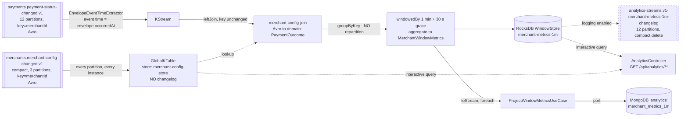

# analytics (M10 - compacted topics & Kafka Streams)

The Kafka Streams service. It reads the **compacted** `merchants.merchant-config-changed.v1`
into a `GlobalKTable`, left-joins it against the Avro `payments.payment-status-changed.v1`
stream, aggregates per-merchant volume / decline rate / average latency into **1-minute tumbling
windows with a 30 s grace period**, serves the live window state over REST as **interactive
queries**, and projects every emitted window into **MongoDB** so results outlive the state store.

This is the first module where state is not something a service keeps *on the side* — the state
store, its changelog topic and the source topic's compaction policy are the same subject seen
three ways:

| Thing | Is really | Made durable by |
|---|---|---|
| `merchants.merchant-config-changed.v1` | a key/value table | `cleanup.policy=compact` — last value per key, forever |
| the `GlobalKTable` over it | a full local replica of that table | nothing extra; **the source topic is already its changelog** |
| the windowed aggregate | derived state | `analytics-streams.v1-merchant-metrics-1m-changelog`, written by Streams |

## Kafka concepts demonstrated

- **`cleanup.policy=compact` vs `delete`**, log segments, and why the **active segment is never
  compacted** — the single most common "compaction doesn't work" cause
- **`min.cleanable.dirty.ratio`**, `delete.retention.ms`, `segment.ms`/`segment.bytes`,
  `max.compaction.lag.ms`
- **Tombstones**: a `null` value, not a `deleted` flag — and *why* the difference is not stylistic
- **`KStream` vs `KTable` vs `GlobalKTable`**, co-partitioning, and the full-replication trade
- **RocksDB state stores**, one per task per store, and how to bound their memory
- **Changelog topics** (`compact,delete`), and **repartition topics** — including why this
  topology has none
- **Tumbling windows**, **grace period**, **event time** vs ingest time, and **stream time**
- **Interactive queries** against a live local store, and what `application.server` is for
- `num.stream.threads`, `state.dir`, `processing.guarantee`, `application.id`, Avro Serdes wiring
- **`statestore.cache.max.bytes` + `commit.interval.ms`** as the pair that decides how often
  anything downstream — here, MongoDB — actually sees an update

## Architecture



## Topics

| Name | Direction | Key | Partitions | Format | Notes |
|---|---|---|---|---|---|
| `payments.payment-status-changed.v1` | in | `merchantId` | 12 | Avro | the aggregation input; already keyed by the grouping key |
| `merchants.merchant-config-changed.v1` | in | `merchantId` | 3 | Avro | compacted; read as a `GlobalKTable` |
| `analytics-streams.v1-merchant-metrics-1m-changelog` | internal | windowed `merchantId` | 12 | JSON | created and owned by Streams |

Consumer group: `analytics-streams.v1` — which is just `application.id`. There is no separate
`group.id` setting; Streams derives it.

**No DLQ, deliberately** (docs/diagrams/topic-map.md): analytics is reconstructible by replaying
its sources, so it "logs, counts and skips". That policy is
`default.deserialization.exception.handler = LogAndContinueExceptionHandler`, and it is not
theoretical here — `payments.payment-status-changed.v1` still holds the pre-M9 **JSON** backlog
from M3–M8 and this application starts at `earliest`, so the Avro deserializer hits unreadable
records on its first run. The default (`LogAndFail`) would kill the stream thread on the first
one.

## The topology, as Streams prints it

Logged at startup by `adapters.in.kafka.TopologyDescriptionLogger` (Kafka Streams does not print
it on its own). Verbatim from the live run:

```
Topologies:
   Sub-topology: 0 for global store (will not generate tasks)
    Source: merchant-config-source-source (topics: [merchants.merchant-config-changed.v1])
      --> merchant-config-source
    Processor: merchant-config-source (stores: [merchant-config-store])
      --> none
      <-- merchant-config-source-source
  Sub-topology: 1
    Source: payment-status-changed-source (topics: [payments.payment-status-changed.v1])
      --> merchant-config-join
    Processor: merchant-config-join (stores: [])
      --> merchant-metrics-1m-aggregate
      <-- payment-status-changed-source
    Processor: merchant-metrics-1m-aggregate (stores: [merchant-metrics-1m])
      --> merchant-metrics-1m-to-stream
      <-- merchant-config-join
    Processor: merchant-metrics-1m-to-stream (stores: [])
      --> mongo-projection-sink
      <-- merchant-metrics-1m-to-stream
    Processor: mongo-projection-sink (stores: [])
      --> none
      <-- merchant-metrics-1m-to-stream
```

Four things to read out of it:

1. **`Sub-topology: 0 for global store (will not generate tasks)`.** The `GlobalKTable` is not
   part of the processing graph at all. It gets its own source and its own thread, and it
   generates no tasks — which is exactly why it imposes no co-partitioning constraint on
   anything.
2. **`Sub-topology: 1` is a single, unbroken chain.** Sub-topologies are separated *by
   repartition topics*. One sub-topology on the processing side means **zero shuffles**.
3. **No `Sink:` node.** The only sinks a Streams topology writes are `to()`/`through()` calls and
   repartition topics. There are none here: the terminal node is a `foreach` that writes to
   MongoDB, and the changelog is written by the store, not by a topology node — which is why
   `merchant-metrics-1m` appears as a *store attached to a processor* rather than as a sink.
4. **Every node is named.** `Named.as(...)` on each operator is why this reads as
   `merchant-config-join` rather than `KSTREAM-LEFTJOIN-0000000003`. That matters beyond
   readability: repartition topic names are derived from node names, so unnamed nodes make the
   internal topic set fragile against an innocuous reordering of DSL calls.

## Internal topics: what Streams created, and why each one exists

Listed from the live cluster after the run
(`kafka-topics --list | grep analytics`):

```
analytics-streams.v1-merchant-metrics-1m-changelog
```

**One topic. That is the whole list.** Its actual config on the cluster:

```
PartitionCount: 12   ReplicationFactor: 3
Configs: compression.type=zstd, min.insync.replicas=2,
         cleanup.policy=compact,delete, retention.ms=1200000,
         message.timestamp.type=CreateTime, unclean.leader.election.enable=false
```

### 1. `analytics-streams.v1-merchant-metrics-1m-changelog` — exists

Every **logged** state store gets a changelog: the store is local, on one instance's disk, and a
crash or a rescheduled task must be able to rebuild it elsewhere. Streams writes each store
update to this topic, so the store is a *cache of the topic*, not the source of truth. That is
what makes the restore proof possible at all.

- **Name** = `<application.id>-<storeName>-changelog`, derived, not configurable. Renaming the
  store abandons the state.
- **12 partitions** — one per task, and task count comes from the input topic's 12 partitions.
  Not a choice.
- **`cleanup.policy=compact,delete`** — the interesting one. A *windowed* store's changelog is
  **both**: `compact` so the last value per (key, window) survives forever within retention, and
  `delete` so whole windows age out instead of accumulating for eternity. A non-windowed KTable
  changelog would be `compact` alone.
- **`retention.ms=1200000` (20 min)** = `analytics.windows.store-retention` (15 m) +
  `analytics.windows.changelog-additional-retention` (5 m). Kafka's default for that second term
  is **24 h**, which on a 1-minute window means the changelog holds ~96× more history than the
  store it backs. Trimmed deliberately for the disk budget.
- **RF 3 / min ISR 2** — set through `StreamsConfig.REPLICATION_FACTOR_CONFIG` and
  `topic.min.insync.replicas`. Streams' own default is **RF 1**, which would silently give this
  application's state weaker durability than every hand-created topic in the topic map.

### 2. `...-merchant-config-store-changelog` — does **not** exist

docs/diagrams/topic-map.md predicted one. It never appears, and the reason is worth stating
plainly: **a `GlobalKTable`'s source topic already is its changelog.**
`merchants.merchant-config-changed.v1` is compacted, so it holds the last value for every key,
forever — exactly what a changelog is. Streams therefore marks global stores as *non-logged*;
`Materialized.withLoggingEnabled()` on a global table is rejected outright. Writing a second copy
would duplicate a compacted topic into another compacted topic for no benefit.

This is a direct payoff of the compaction decision: **because** the config topic is compacted,
the global store costs zero extra topics and its bootstrap is `O(merchants)` rather than
`O(config changes)`.

### 3. `...-repartition` — does **not** exist, and this is the point

A repartition topic appears when Streams cannot prove the data is already partitioned by the key
an operation needs. Three things had to all be true to avoid it here:

1. **ADR-0003 keys `payments.payment-status-changed.v1` by `merchantId`** — the same field the
   aggregation groups by. The ADR says so explicitly: *"Analytics aggregates per merchant with no
   repartition topic on the main path (M10)."* This module is where that pays out.
2. **Nothing between the source and the grouping changes the key.** The `GlobalKTable` join
   preserves the key by construction, and there is no `selectKey`/`map` anywhere in the topology.
3. **`groupByKey()`, not `groupBy((k, v) -> k)`.** These look equivalent and are not:
   `groupByKey()` asserts "the key is already right", `groupBy` *unconditionally* sets the
   repartition-required flag because it cannot inspect the mapper. Swapping one for the other
   would create `analytics-streams.v1-...-repartition` on the next restart, at 12 partitions,
   with a full network shuffle of every payment event — for identical results.

**What it means for the join:** the `GlobalKTable` join is the only join in this topology and it
is *never* co-partitioned-constrained, so it can never introduce a shuffle regardless of keys.
The repartition topic the topic map lists is for **M13**'s stream-stream join
(`payment-requested` keyed by `paymentId` × `payment-status-changed` keyed by `merchantId`) —
genuinely not co-partitioned, one side must be re-keyed, and it will have to be created at 12
partitions to match the other side. That join is also the only way to compute real payment
*authorization* latency (see "Compromises").

## GlobalKTable vs KTable

The join here **cannot** be a `KTable` join, and the reason is arithmetic before it is design.

A `KStream × KTable` join requires the two topics to be **co-partitioned**: same partition count,
same partitioning strategy, same key type. Per ADR-0003:

| Topic | Partitions | Key |
|---|---|---|
| `payments.payment-status-changed.v1` | **12** | `merchantId` |
| `merchants.merchant-config-changed.v1` | **3** | `merchantId` |

12 ≠ 3, so Streams fails the co-partitioning check at startup. The ways out are all bad:

- **Raise the config topic to 12 partitions.** On a *compacted* topic this is the worst possible
  option: compaction dedupes per key *per partition*, and re-mapping `hash(key) % n` scatters a
  key's history across two partitions — the old value survives in the old partition forever,
  under a policy that promises to keep the last value per key. ADR-0003 already flags partition
  increases as effectively irreversible; on a compacted topic they are also *semantically*
  destructive.
- **Repartition the payment stream down to 3.** Throws away the parallelism ceiling the payment
  path was explicitly sized for, and adds a full shuffle of the highest-volume topic in the
  system.
- **Repartition the config topic up to 12.** Adds an internal topic and a second copy of the
  table, and re-introduces the compaction-key problem inside Streams.

A `GlobalKTable` makes the constraint disappear rather than satisfying it: it is **not
partitioned at all**. Every instance consumes *every* partition of the source into a complete
local copy, so a lookup by any key succeeds on any instance, and the join is a local dictionary
lookup with no shuffle and no key change.

**What full replication costs — the honest list:**

- **Every instance holds every merchant.** Fine for a config table (thousands of rows,
  kilobytes). The rule of thumb: a `GlobalKTable`'s source must be small enough that "N copies"
  is not a decision you have to think about. Scale this to per-payment data and it is
  catastrophic.
- **No timestamp synchronisation.** A global store is fed by a dedicated thread that reads as
  fast as it can, *independent of stream time*. So the join uses "whatever config is in the table
  right now", not "the config as of the payment's event time" — replaying history does **not**
  faithfully reproduce the config that was in force back then. A `KTable`–`KStream` join *is*
  timestamp-synchronised and would. This is a real correctness difference, accepted here because
  a dashboard wants the merchant's *current* name and threshold.
- **Bootstrap is on the critical path.** The global store is fully restored before the
  application reaches `RUNNING`. Compaction is what keeps that bounded.
- **Every instance is a consumer of the topic**, so instance count multiplies read traffic on it.

**The rule of thumb this leaves you with:** `KTable` for co-partitioned, high-cardinality,
event-time-sensitive joins; `GlobalKTable` for small, slowly-changing reference data you want to
look up by an arbitrary key without reshuffling the world.

## Windows and the grace period

**1-minute tumbling** (`TimeWindows.ofSizeAndGrace(60s, 30s)`): fixed, non-overlapping
`[T, T+60s)` buckets, every record in exactly one.

Windows advance on **event time**, extracted from `envelope.occurredAt` by
`adapters.in.kafka.EnvelopeEventTimeExtractor`. ADR-0002 chose an envelope-in-value design partly
for this ("Streams windowing in M10 needs event time, not ingest time"). Without it, a consumer
that falls 10 minutes behind and catches up would cram ten minutes of payments into whichever
window it happened to be processing — the aggregation would measure the *consumer's* behaviour.
With it, replaying from offset 0 reproduces the same windows it produced live, which is what makes
"rebuilt by resetting offsets" a real recovery strategy rather than a slogan.

Event time also drives **stream time** — the maximum event timestamp seen so far on a task. A
window closes when stream time passes `windowEnd + grace`. **Nothing about wall-clock time closes
a window**: an idle topic leaves the last window open indefinitely, which is why an interactive
query shows a stale-looking open window rather than a missing one when traffic stops.

### Grace period: 30 seconds

- **What it covers.** Records whose *event* time falls in a window stream time has already
  passed. Out-of-orderness here comes from the producer's `linger.ms=10` plus retry backoff on a
  leader election, clock skew between psp-connector instances, and the merge across 12 partitions
  when one task owns several. A broker leader election — the worst realistic case — resolves in
  single-digit seconds.
- **What it costs.** Results are only final at `windowEnd + grace`, and the windowed store (and
  its changelog) must retain at least `size + grace`. Every second of grace is latency-to-final
  plus disk.
- **Why not 0.** A leader election mid-window would silently drop the records it delayed. A
  decline-rate gauge that under-counts during exactly the incident you are investigating is worse
  than one that is 30 s behind. "Silently" is literal — late records are counted only in the
  `late-record-drop` metric and emit nothing.
- **Why not 5 minutes.** Every window's final value would arrive 6 minutes after the fact and
  windowed state would multiply ~6×, to catch reordering this pipeline cannot produce.
- **Consistency.** docs/diagrams/topic-map.md already sized the windowed changelog assuming this
  value: *"a 1-minute tumbling window with a 30 s grace keeps ~90 s of window state"*.

`AnalyticsTopologyTest` asserts both halves for real: a record inside the grace window is folded
into the closed window; the same trick after grace expires is dropped.

### No `suppress()`

`suppress(untilWindowCloses(...))` would emit each window exactly once, on close. Not used: it
adds a second buffer holding every open window, and delays every result by `size + grace` = 90 s,
which would make the interactive query useless for its main job — showing the window happening
*now*. The cost is that the MongoDB projection sees intermediate results; the projection is a
whole-document replace keyed on `merchantId|windowStart`, so intermediates converge rather than
accumulate.

## Interactive queries

| Endpoint | Source | Notes |
|---|---|---|
| `GET /api/analytics/windows?lookbackMinutes=15` | window store | every locally-held window, including the **open** one |
| `GET /api/analytics/merchants/{id}/windows` | window store | one merchant |
| `GET /api/analytics/merchants/{id}/windows/projected` | MongoDB | the durable copy |
| `GET /api/analytics/merchants/{id}/config` | GlobalKTable | **404 after a tombstone** |
| `GET /api/analytics/state` | KafkaStreams client | what the restore proof polls |

Two store types, two different queries: the metrics store is a **window store**, so every read
takes a time range (`fetch(key, from, to)` / `fetchAll(from, to)`) and is **local** to this
instance's assigned partitions; the config store is the `GlobalKTable`'s key/value store, a plain
`get(key)`, and **complete on every instance**.

**503 while restoring is a feature.** `KafkaStreams#store` throws `InvalidStateStoreException`
before `start()`, during a rebalance, and for the whole duration of a state restore. Returning an
empty list instead would be indistinguishable from "this merchant had no traffic", so the
store-backed endpoints answer `503` unless the client is `RUNNING`.

**Local means local.** With one instance and 12 partitions that is everything. With two
instances, each would answer for roughly half the merchants and return nothing for the rest.
Making that transparent needs `KafkaStreams#queryMetadataForKey` plus an RPC hop to the owning
instance — which is what `application.server` (set to `localhost:8089`) advertises. The hop
itself is deferred; see "Compromises".

## MongoDB projection

Collection `merchant_metrics_1m` in the `analytics` database (ADR-0005: one logical database per
service, `mongo/init/01-init-databases.sh`).

**Why project at all**, when the state store already holds the answer: the RocksDB store is
bounded by its 15-minute retention, lives on one instance's local disk, and is queryable only
while that instance is running and restored. The projection survives all three.

**`_id = merchantId|windowStartEpochMillis`** is the idempotency key. `save()` on a document with
an `_id` already set is a replace, so a re-emitted window overwrites *its own* document. That is
what makes the projection safe under `at_least_once` and under the deliberate absence of
`suppress()`. A generated `ObjectId` or an insert-only write would turn a normal Streams emit
pattern into duplicate rows.

**The write is outside Kafka's guarantee** — exactly the boundary services/ledger/README.md's
"Where Kafka EOS ends" describes. Even under `exactly_once_v2` the Mongo write is not enrolled in
the Kafka transaction, so it must be idempotent regardless. That is a large part of why this
service is `at_least_once`.

**It runs on a stream thread**, synchronously, inside the terminal `foreach`. A slow MongoDB
therefore becomes consumer lag — the correct, visible failure mode. An exception propagates into
Streams and kills the stream thread; deliberately not caught, because silently swallowing a
projection failure would leave the store and the projection permanently disagreeing with nothing
to notice it.

## Every configurable knob

### `analytics.streams.*`

| Key | Value | What it does |
|---|---|---|
| `application-id` | `analytics-streams.v1` | Consumer `group.id` + internal-topic prefix + `state.dir` sub-directory + (under EOS) `transactional.id` prefix, **all at once**. Changing it does not rename anything — it starts a brand-new application with empty state and fresh changelogs, and abandons the old ones. Hence the `.v1`. |
| `state-dir` | `~/.kafka-psp/analytics-streams-state` (compose profile) | Where RocksDB writes. The default is `${java.io.tmpdir}/kafka-streams` — on macOS `/var/folders/...`, hard to find and eligible for OS cleanup, so "my state disappeared" and "what is eating my disk" are both symptoms of leaving it alone. Layout: `<state-dir>/<application-id>/<taskId>/rocksdb/<storeName>/`, plus `global/` for the GlobalKTable store. |
| `num-stream-threads` | `2` | Threads in **this** instance. Task count is fixed by the topology: 12, one per input partition. Threads decide how many run at once — **not** how many RocksDB instances exist (12, always) or how many changelog partitions are created (12, always). Above 12 they are simply idle. |
| `processing-guarantee` | `at_least_once` | See below. |
| `application-server` | `localhost:8089` | Advertised to the group for interactive-query routing. |
| `commit-interval` | `5s` | Commits offsets **and** flushes the record cache downstream — so it is also the ceiling on how often MongoDB is written per key. |
| `state-store-cache-max-bytes` | `10485760` | The record cache. Collapses repeated updates to the same key between commits. Setting it to `0` is the standard "why don't I see every update?" fix and turns a merchant doing 500 payments/minute into 500 Mongo writes/minute instead of ~12. |

### `analytics.windows.*`

| Key | Value | What it does |
|---|---|---|
| `size` | `60s` | Tumbling window size. |
| `grace` | `30s` | See "Grace period" above. |
| `store-retention` | `15m` | How far back an interactive query can see, and how much RocksDB + changelog is on disk. **Floor is `size + grace`** — Streams refuses to build the store below it, and `AnalyticsProperties.Windows` fails fast with a readable message rather than letting Streams do it at start. |
| `changelog-additional-retention` | `5m` | Added to `store-retention` to compute the changelog's `retention.ms`. Kafka's default is 24 h. |

### Not in YAML, because they are unreachable from it

- **`rocksdb.config.setter` → `config.BoundedMemoryRocksDbConfigSetter`.** Streams gives *every
  task* its own RocksDB instance per store — 12 instances here regardless of thread count.
  RocksDB's server-sized defaults (50 MiB block cache + 3 × 64 MiB memtables each) would reserve
  ~2.9 GiB off-heap for a workload whose entire state is a few hundred counters. Capped to 4 MiB
  cache + 2 × 2 MiB memtables, ~96 MiB total. Measured state directory after the live run:
  **268 KiB**.
- **`replication.factor=3` + `topic.min.insync.replicas=2`** for internal topics. Streams'
  default is RF **1**.
- **`num.standby.replicas=0`** — set explicitly because it is a *disk* decision, not an
  oversight. A standby is a second full copy of every store on another instance; it halves
  failover time and doubles on-disk state, for a service whose recovery story is "replay the
  changelog" and whose durable answers are in MongoDB.
- **`isolation.level=read_committed`** on the Streams consumer. Free on a topic with no
  transactional producer, and it prevents a future producer change from silently exposing aborted
  records to the aggregation.
- **No default value serde.** Key serde is `String` (ADR-0003, every key in this system). There
  is deliberately no `default.value.serde`: this topology uses three value formats (two Avro, one
  JSON), and a default would let a node that forgot its serde pick up a silently wrong one
  instead of failing.

### `processing.guarantee = at_least_once`, deliberately

`exactly_once_v2` would wrap each commit in a Kafka transaction covering the changelog writes and
the offset commit, making **state** updates exactly-once. It would **not** make the MongoDB
projection exactly-once — that write is not enrolled in any Kafka transaction — so the projection
has to be idempotent regardless, and it is. Once the only non-Kafka side effect is idempotent,
EOS buys accuracy in the state store alone, at the cost of transaction markers on every commit
and `read_committed` end-to-end latency, to make a decline-rate gauge exactly right. ledger (M7)
already demonstrates EOS with a hand-rolled transactional producer; flipping this one property is
all it takes to see the Streams-managed kind.

### Avro Serdes wiring

`config.KafkaStreamsConfig` builds one `SpecificAvroSerde` per Avro topic:

```java
serde.configure(Map.of(
        AbstractKafkaSchemaSerDeConfig.SCHEMA_REGISTRY_URL_CONFIG, url,
        KafkaAvroDeserializerConfig.SPECIFIC_AVRO_READER_CONFIG, true),
    /* isKey = */ false);
```

- **`specific.avro.reader=true`** is what makes the deserializer return the generated class rather
  than a `GenericRecord`. Without it the topology still builds and then fails with a
  `ClassCastException` inside the first `ValueJoiner` — a failure that *looks* like a Streams
  problem and is a serde problem.
- **`isKey=false`**: these serdes only ever handle values. Keys are `Serdes.String()` and have no
  Schema Registry subject at all.
- **Tombstones need no code.** Confluent's deserializer returns `null` for a `null` payload
  without consulting the registry (there is no magic byte and no schema id to look up), and
  Streams reads that `null` as a delete on the `GlobalKTable`. There is not one line of
  tombstone-handling logic in `AnalyticsTopology` — that is the payoff of expressing deletion as a
  null value rather than a flag.

Internal values (`PaymentOutcome`, `MerchantWindowMetrics`) use spring-kafka's `JsonSerde`
`.noTypeInfo()`. `PaymentOutcome` is in fact never serialized at all (no repartition between the
join and the aggregation); `MerchantWindowMetrics` is written only to the changelog, and keeping
that readable in AKHQ is worth more than registry governance on a topic no other application
reads. The honest cost: adding a field to that record changes the changelog format with no
registry to enforce compatibility, so it is a breaking change requiring a Streams application
reset.

## How to run

```bash
# 1. Infrastructure (once)
cd infra/compose && docker compose up -d
./create-topics.sh          # also applies the compaction tuning to merchants.*
./register-schemas.sh       # sets BACKWARD on merchants.merchant-config-changed.v1-value

# 2. Build
cd ../.. && mvn clean verify

# 3. Producers of this service's inputs
SPRING_PROFILES_ACTIVE=docker-compose java -jar services/payment-api/target/payment-api.jar &
SPRING_PROFILES_ACTIVE=docker-compose java -jar services/psp-connector/target/psp-connector.jar &

# 4. This service
SPRING_PROFILES_ACTIVE=docker-compose java -jar services/analytics/target/analytics.jar &

# 5. Wait for RUNNING (it is REBALANCING while the global store bootstraps)
curl -s localhost:8089/api/analytics/state
```

Useful:

```bash
du -sh ~/.kafka-psp/analytics-streams-state          # RocksDB footprint
docker compose exec kafka1 kafka-topics --bootstrap-server kafka1:9092 --list | grep analytics
docker compose exec mongodb mongosh -u analytics -p analytics_pw \
  --authenticationDatabase analytics analytics --quiet \
  --eval 'db.merchant_metrics_1m.find().sort({windowStart:-1}).limit(3)'
```

## Prove it (live cluster)

Run against the three-broker compose stack, Schema Registry 7.7.1, MongoDB 7.0.

**1. Streams reached `RUNNING` and created exactly one internal topic.**

```
$ curl -s localhost:8089/api/analytics/state
{"applicationId":"analytics-streams.v1",
 "stateDir":"/Users/…/.kafka-psp/analytics-streams-state",
 "clientState":"RUNNING","storeReady":true}

$ kafka-topics --list | grep analytics
analytics-streams.v1-merchant-metrics-1m-changelog
```

**2. Merchant config went in through payment-api's REST surface and came out of the
`GlobalKTable`.**

```
$ curl -X PUT localhost:8085/api/merchants/acme-001/config -H 'Content-Type: application/json' \
    -d '{"displayName":"ACME Corp","status":"ACTIVE","payoutCurrency":"EUR",
         "webhookUrl":"https://acme.test/hooks","declineRateAlertThresholdBps":1500}'
HTTP 200

$ curl -s localhost:8089/api/analytics/merchants/acme-001/config
{"merchantId":"acme-001","displayName":"ACME Corp","status":"ACTIVE","payoutCurrency":"EUR",
 "webhookUrl":"https://acme.test/hooks","declineRateAlertThresholdBps":1500}

$ curl -o /dev/null -w '%{http_code}' localhost:8089/api/analytics/merchants/nope-999/config
404
```

**3. Real Avro payment events aggregated into windows, and the interactive query served them.**
22 payments through `POST /api/payments` → payment-api → outbox → Debezium →
`payments.payment-requested.v1` → psp-connector → `payments.payment-status-changed.v1` (Avro) →
analytics.

```
$ curl -s 'localhost:8089/api/analytics/windows?lookbackMinutes=3'
[
  { "merchantId": "acme-001", "merchantDisplayName": "ACME Corp",
    "windowStart": "2026-08-11T20:03:00Z", "windowEnd": "2026-08-11T20:04:00Z",
    "open": true,  "totalCount": 5, "declinedCount": 0,
    "declineRate": 0.0, "declineRateBps": 0,
    "avgPipelineLatencyMillis": 6038.6,
    "declineRateAlertThresholdBps": 1500, "declineRateAlert": false },
  { "merchantId": "acme-001", "merchantDisplayName": "ACME Corp",
    "windowStart": "2026-08-11T20:02:00Z", "windowEnd": "2026-08-11T20:03:00Z",
    "open": false, "totalCount": 6, "declinedCount": 0,
    "declineRate": 0.0, "declineRateBps": 0,
    "avgPipelineLatencyMillis": 20.166666666666668,
    "declineRateAlertThresholdBps": 1500, "declineRateAlert": false },
  { "merchantId": "globex-002", "merchantDisplayName": "Globex SA",
    "windowStart": "2026-08-11T20:02:00Z", "windowEnd": "2026-08-11T20:03:00Z",
    "open": false, "totalCount": 2, "declinedCount": 1,
    "declineRate": 0.5, "declineRateBps": 5000,
    "avgPipelineLatencyMillis": 19.5,
    "declineRateAlertThresholdBps": 5000, "declineRateAlert": true },
  { "merchantId": "acme-001", "merchantDisplayName": "ACME Corp",
    "windowStart": "2026-08-11T20:01:00Z", "windowEnd": "2026-08-11T20:02:00Z",
    "open": false, "totalCount": 2, "declinedCount": 0,
    "declineRate": 0.0, "declineRateBps": 0,
    "avgPipelineLatencyMillis": 38.5,
    "declineRateAlertThresholdBps": 1500, "declineRateAlert": false }
]
```

Four things in that response are the module working:

- `merchantDisplayName` and `declineRateAlertThresholdBps` came from the **`GlobalKTable` join** —
  they are not on `payments.payment-status-changed.v1`.
- `"open": true` on the newest window: this is the **currently accumulating** window, a value that
  exists nowhere but the local RocksDB store.
- `declineRateAlert: true` on `globex-002`: 5000 bps observed vs its own 5000 bps threshold. The
  join has a purpose, not just a label.
- Consecutive windows are exact `[T, T+60s)` buckets on minute boundaries — tumbling, on event
  time.

**4. MongoDB projection.** 7 documents, one per (merchant, window):

```javascript
> db.merchant_metrics_1m.findOne({_id:"globex-002|1786478520000"})
{
  _id: 'globex-002|1786478520000',
  merchantId: 'globex-002',
  merchantDisplayName: 'Globex SA',
  windowStart: ISODate('2026-08-11T20:02:00.000Z'),
  windowEnd:   ISODate('2026-08-11T20:03:00.000Z'),
  totalCount: Long('2'),
  declinedCount: Long('1'),
  latencySumMillis: Long('39'),
  declineRate: 0.5,
  declineRateBps: Long('5000'),
  avgPipelineLatencyMillis: 19.5,
  declineRateAlertThresholdBps: 5000,
  declineRateAlert: true,
  updatedAt: ISODate('2026-08-11T20:02:05.947Z'),
  _class: 'com.example.psp.analytics.adapters.out.mongo.MerchantWindowMetricsDocument'
}

> db.merchant_metrics_1m.getIndexes().map(i => i.name)
[ '_id_', 'merchant_window_idx' ]
```

`_id` is `merchantId|windowStart` — the composite key that makes the write idempotent.
`updatedAt` (20:02:05) is 3.9 s *after* `windowEnd` (20:02:00), which is the grace period and the
5 s commit interval visible in a single field pair.

**5. Disk.** 12 task directories (`1_0` … `1_11`) plus `global/`, total **268 KiB**.

### State restore proof

Measured on the live cluster. Six payments produced for `restore-demo`, windows allowed to close,
then the process killed and **the entire local state directory deleted** - not a graceful restart,
a total loss of local state.

```bash
curl localhost:8089/api/analytics/merchants/restore-demo/windows?lookbackMinutes=60   # before
pkill -f analytics.jar
rm -rf ~/.kafka-psp/analytics-streams-state        # 280 KiB of RocksDB, gone
java -jar services/analytics/target/analytics.jar --spring.profiles.active=docker-compose
```

| Measure | Before kill | After wipe + restart |
|---|---|---|
| window `2026-08-11T20:15:00Z` `totalCount` | 4 | **4** |
| local state directory | 280 KiB | deleted, then **224 KiB rebuilt** |
| committed offsets on `payments.payment-status-changed.v1` | 822 | **822 - unchanged** |
| changelog records available | 14 | 14 |

From the restart log: `restoring changelog analytics-streams.v1-merchant-metrics-1m-changelog`
(12 partitions), then `Restored and ready to run` twelve times - one per task.

**The unchanged source offset is the whole point.** The state came back byte-for-byte without
re-reading a single payment event. Streams did not recompute the aggregate; it replayed the
changelog, which is a compacted record of what the store already contained. That is why the
changelog exists at all: a windowed store is local disk, and local disk is not a durability story.
Rebuilding by reprocessing the source would be O(all history) and would be impossible once
retention had aged the source records out - the changelog is O(current state).

Note the asymmetry this exposes: the source topic keeps 7 days, the changelog keeps 20 minutes
(window retention + grace). They are not backups of each other. The changelog can restore what the
store *holds*; it can never reconstruct windows that already expired.

_(A first query returned nothing and briefly looked like a failure - the endpoint's default
lookback simply excluded a window that had closed minutes earlier. Passing `lookbackMinutes=60`
returned it unchanged. Worth recording because "the data is gone" and "you asked the wrong
question" look identical from the outside.)_

### Tombstone proof

Measured on the live cluster, merchant `tombstone-demo`:

| Step | Result |
|---|---|
| `PUT /api/merchants/tombstone-demo/config` | `200` |
| `GET /api/analytics/merchants/tombstone-demo/config` (GlobalKTable) | `200` with the config |
| `DELETE /api/merchants/tombstone-demo/config` | `202` |
| `GET /api/analytics/merchants/tombstone-demo/config` | **`404`** |

The API behaviour is the uninteresting half. This is the mechanism, read straight off the topic
with `--property print.null=true`:

```
tombstone-demo |VALUE|     H019ff274-c421-7983-8be8-204a618...   <- the upsert, Avro bytes
tombstone-demo |VALUE| null                                      <- the tombstone
```

**A tombstone is literally a record with a null value.** Not a `deleted: true` field, not a status
enum - null. That is not stylistic: log compaction is a broker-side process with no idea what your
payload means. It cannot be taught that `{"deleted":true}` implies removal. Null is the one signal
it understands, which is why "how do I delete from a compacted topic" has exactly one answer.

A flag field would also fail on its own terms. The key's last value would be a record saying
"deleted", so compaction would *preserve* it forever - the opposite of what you asked for. Every
consumer would then carry logic to treat that flag as absence, and any consumer that forgot would
see a live merchant. With a tombstone, absence is absence: `GlobalKTable` removes the key, and a
lookup returns null with nothing to misinterpret.

Live topic settings that govern what happens next:

```
cleanup.policy=compact  min.cleanable.dirty.ratio=0.1
delete.retention.ms=60000  segment.ms=60000  segment.bytes=1048576
```

Two timings surprise people, and both are visible above. **The active segment is never compacted**,
so a key stays readable until `segment.ms` (60 s here, hours or days by default) rolls it. And the
tombstone itself is not removed at once - it survives `delete.retention.ms` so that consumers which
were offline still see the deletion when they return. Delete the tombstone too eagerly and an
absent consumer would restore a key that was meant to be gone. **Deletion on a compacted topic is
eventual, and the record proving the deletion has its own retention.**

## M13 - stream-stream join, batch listener

M10's `avgPipelineLatencyMillis` measures `now − envelope.occurredAt`: the provider answering →
analytics processing it. It is **not** authorization latency — the time a payment actually took to
be decided — because it never reads `payments.payment-requested.v1` at all. M13 builds the join
that does: `payments.payment-requested.v1` (keyed `paymentId`) × `payments.payment-status-changed.v1`
(keyed `merchantId`), producing one `AuthorizationLatency` per decided payment
(`decidedAt − requestedAt`), projected into MongoDB's `authorization_latency` collection
(`adapters.in.kafka.AnalyticsTopology`, section 5 of its class javadoc has the full reasoning this
section summarizes).

### Why this needs co-partitioning, and why `GlobalKTable` cannot substitute

A `KStream x KTable`/`GlobalKTable` join (M10's join) only needs ONE side partitioned meaningfully;
a `GlobalKTable` sidesteps co-partitioning entirely by replicating its whole source to every
instance. A `KStream x KStream` windowed join has no such escape hatch: **both** sides are streams,
both get buffered per task in local (changelogged) state for the duration of the join window, and
for two records to ever meet inside that buffer the same key must land in the same task on both
sides — i.e. the two streams must be co-partitioned (same partition count, same partitioner, same
key). There is no "global stream" construct in the DSL, and there could not sensibly be one:
replicating every task's full join-window buffer of the payment path's highest-volume topic to
every instance is exactly the catastrophe M10's GlobalKTable section warns a `GlobalKTable`'s
source must never approach.

`payments.payment-requested.v1` is keyed by `paymentId`; `payments.payment-status-changed.v1` is
keyed by `merchantId` (deliberately — ADR-0003, so the ledger's single-writer-per-balance invariant
holds, M7). Two different keys, not just two different partition counts. One side has to be
re-keyed to `paymentId` before the join can run at all — `payments.payment-status-changed.v1`'s
copy, via `selectKey`, since `payments.payment-requested.v1` is already correctly keyed and is the
side the other one has to match.

### The topology, as Streams prints it (live cluster, verbatim)

```
Topologies:
   Sub-topology: 0 for global store (will not generate tasks)
    Source: merchant-config-source-source (topics: [merchants.merchant-config-changed.v1])
      --> merchant-config-source
    Processor: merchant-config-source (stores: [merchant-config-store])
      --> none
      <-- merchant-config-source-source
  Sub-topology: 1
    Source: payment-status-changed-source (topics: [payments.payment-status-changed.v1])
      --> merchant-config-join, rekey-status-changed-by-payment-id
    Processor: merchant-config-join (stores: [])
      --> merchant-metrics-1m-aggregate
      <-- payment-status-changed-source
    Processor: merchant-metrics-1m-aggregate (stores: [merchant-metrics-1m])
      --> merchant-metrics-1m-to-stream
      <-- merchant-config-join
    Processor: rekey-status-changed-by-payment-id (stores: [])
      --> authorization-latency-join-right-repartition-filter
      <-- payment-status-changed-source
    Processor: authorization-latency-join-right-repartition-filter (stores: [])
      --> authorization-latency-join-right-repartition-sink
      <-- rekey-status-changed-by-payment-id
    Processor: merchant-metrics-1m-to-stream (stores: [])
      --> mongo-projection-sink
      <-- merchant-metrics-1m-aggregate
    Sink: authorization-latency-join-right-repartition-sink (topic: authorization-latency-join-right-repartition)
      <-- authorization-latency-join-right-repartition-filter
    Processor: mongo-projection-sink (stores: [])
      --> none
      <-- merchant-metrics-1m-to-stream

  Sub-topology: 2
    Source: authorization-latency-join-right-repartition-source (topics: [authorization-latency-join-right-repartition])
      --> authorization-latency-join-other-windowed
    Source: payment-requested-source (topics: [payments.payment-requested.v1])
      --> authorization-latency-join-this-windowed
    Processor: authorization-latency-join-other-windowed (stores: [KSTREAM-JOINOTHER-0000000015-store])
      --> authorization-latency-join-other-join
      <-- authorization-latency-join-right-repartition-source
    Processor: authorization-latency-join-this-windowed (stores: [KSTREAM-JOINTHIS-0000000014-store])
      --> authorization-latency-join-this-join
      <-- payment-requested-source
    Processor: authorization-latency-join-other-join (stores: [KSTREAM-JOINTHIS-0000000014-store])
      --> authorization-latency-join-merge
      <-- authorization-latency-join-other-windowed
    Processor: authorization-latency-join-this-join (stores: [KSTREAM-JOINOTHER-0000000015-store])
      --> authorization-latency-join-merge
      <-- authorization-latency-join-this-windowed
    Processor: authorization-latency-join-merge (stores: [])
      --> authorization-latency-projection-sink
      <-- authorization-latency-join-this-join, authorization-latency-join-other-join
    Processor: authorization-latency-projection-sink (stores: [])
      --> none
      <-- authorization-latency-join-merge
```

Contrast with M10's topology dump above: **three sub-topologies now, not one.** Sub-topology 1 ends
at the repartition `Sink:` node; sub-topology 2 begins at the repartition topic's own `Source:`
(plus `payments.payment-requested.v1`'s source, feeding the same sub-topology). That break IS the
shuffle — exactly the tell the M10 class javadoc and this README's troubleshooting table already
named ("a second `Sub-topology` on the processing side is the tell"), now observed for real instead
of predicted. Note also that `payment-status-changed-source` now fans out to **two** children
(`merchant-config-join` for M10, `rekey-status-changed-by-payment-id` for M13) — the same source
topic feeding two independent branches of one topology, not two separate subscriptions (Kafka
Streams rejects registering one topic as a source twice in one `Topology`).

### Internal topics: four now, up from M10's one

Measured on the live cluster after this join ran (`kafka-topics --describe`):

| Name | Partitions | RF | cleanup.policy | retention.ms | Why |
|---|---|---|---|---|---|
| `analytics-streams.v1-authorization-latency-join-right-repartition` | 12 | 3 | delete | **-1 (infinite)** | The repartition topic. 12 to match `payments.payment-requested.v1`. Infinite retention is Kafka Streams' own default for a repartition topic — it is not a bug, it is purged by `deleteRecords()` calls after the records are consumed and joined, not by time (topic-map.md predicted exactly this: `retention.ms=-1, purged via deleteRecords`). |
| `analytics-streams.v1-authorization-latency-join-this-join-store-changelog` | 12 | 3 | delete | 630000 (10m30s) | The `payment-requested` side's join-window buffer, logged. `delete` alone, not `compact,delete` like M10's windowed aggregate — a join buffer's value is "was this key seen in this window", not "the last value for this key forever", so compaction buys nothing. |
| `analytics-streams.v1-authorization-latency-join-other-join-store-changelog` | 12 | 3 | delete | 630000 (10m30s) | Same, for the re-keyed `payment-status-changed` side. |
| `analytics-streams.v1-merchant-metrics-1m-changelog` | 12 | 3 | compact,delete | 1200000 (20m) | M10's, **completely unchanged** by this module — the point of the contrast. |

**One repartition topic, two join-buffer changelogs, on top of M10's one aggregation changelog.**
M10's topology creates exactly one internal topic; M13 adds three more just by joining two
already-existing business topics differently. That is the concrete, measured cost of a
stream-stream join versus a `GlobalKTable` join: the `GlobalKTable` join (M10) still creates none
of its own — the compacted source topic remains its own changelog, unchanged since M10 — while the
M13 join's TWO input streams both need buffered, changelogged state just to find each other.

Naming note, because it surprised this build: `StreamJoined.withName("authorization-latency-join")`
alone names the processor nodes and (via a `-right-repartition` suffix on the re-keyed side) the
repartition topic — it does **not** name the join's internal stores. Without the separate
`StreamJoined.withStoreName(...)` call, the two changelogs above would be named after Streams'
auto-incrementing node counter (`KSTREAM-JOINTHIS-0000000014-store-changelog`, observed on this
exact build before the fix) — exactly the unnamed, build-order-fragile internal topic the M10 class
javadoc's "every node is named" point warns about, just for a different Streams API than the one
that point was originally written for.

### The join window

`JoinWindows.ofTimeDifferenceAndGrace(window, grace).before(Duration.ZERO)` —
`analytics.authorization-join.window = 5m`, `analytics.authorization-join.grace = 30s`
(`application.yml`):

- **`.before(Duration.ZERO)`**: the status-changed record may never be timestamped *before* its own
  request. A decision "before" its own request is clock skew between service instances, not a real
  negative latency, and the join should never manufacture one.
- **`window = 5m`** (the `.after(...)` bound): psp-connector simulates 100ms–5s of provider latency
  (docs/PLAN.md's M4 brief). 5 minutes is ~60x that worst case — generous enough to survive a
  consumer rebalance or a slow catch-up after downtime, tight enough that the join's buffer stores
  (the two changelogs above) do not grow without bound.
- **`grace = 30s`**: the same value, and the same reasoning, M10 already uses for the same
  pipeline's out-of-orderness (producer `linger.ms`, retry backoff on a leader election, clock skew
  across `psp-connector` instances).

**What happens to a record outside the window.** An unjoined payment is **not** a lost payment.
Neither source topic is touched by this join — both keep their full 7-day retention
(docs/diagrams/topic-map.md) and every other consumer (ledger, webhook-notifier, this same
application's own M10 aggregation) sees every record exactly as before. What is missing is
narrower: this one derived, analytics-only authorization-latency measurement, for that one payment.
A late match (status decided more than `window` after the request) is dropped the same way M10's
grace-period misses are — counted in Streams' `late-record-drop` metric, emitting nothing, silently
by design. A payment that never gets a status change within the join's buffer retention (still
pending, or a status event genuinely lost upstream) simply never produces a row. The join is a
plain **inner** `join`, not `leftJoin`/`outerJoin`, on purpose: a latency with no decision timestamp
is not a partial answer, it is not an answer, unlike M10's `leftJoin` where a payment with no
merchant config is still a real, countable payment.

**What the repartition costs, concretely.** An extra network round trip through the broker for
every status-changed record (produced to the repartition topic, then re-fetched by whichever task
now owns that `paymentId`'s partition); extra storage (a full copy of every re-keyed record, held
indefinitely until `deleteRecords()` catches up — see the table above); extra latency (produce +
refetch, before the join's own window buffering is even reached). None of this exists on the M10
path. That contrast — one topology, one join costs nothing, the other costs four extra topics and a
broker round trip per record — is the entire point of building this join.

### Join proof

Measured on the live cluster. One payment driven through the full pipeline - payment-api, outbox,
Debezium, psp-connector - and the join's output read from MongoDB:

```js
{ merchantId: 'm13-join-99475',
  status: 'SUCCEEDED',
  requestedAt: ISODate('2026-08-11T23:36:06.613Z'),
  decidedAt:   ISODate('2026-08-11T23:36:09.458Z'),
  latencyMillis: Long('2845') }
```

**2,845 ms between the payment being requested and its outcome being decided** - and unlike M10's
`avgPipelineLatencyMillis`, this number came from two records that had to be brought together, not
from one record's own timestamps. That is the whole reason a join was necessary.

#### The internal topics, before and after

`kafka-topics --list | grep analytics` on the live cluster, with the `analytics-streams.v1-` prefix
stripped:

| After M10 | After M13 |
|---|---|
| `merchant-metrics-1m-changelog` | `merchant-metrics-1m-changelog` |
| | `authorization-latency-join-right-repartition` |
| | `authorization-latency-join-this-join-store-changelog` |
| | `authorization-latency-join-other-join-store-changelog` |

**One topic became four, and none of that appears in the DSL code.** The repartition topic exists
because a stream-stream join demands co-partitioning and the two sides are keyed differently -
`paymentId` on one, `merchantId` on the other, deliberately, per ADR-0003. The two changelogs exist
because both sides of a windowed join are buffered in local state, and local state needs a durable
backing.

M10's topology needed none of this, and the reason was specific: it grouped by a key the records
already had. The moment a key has to change, Kafka must physically move records between partitions,
and that move is a full round trip out to the broker and back - produce, replicate, re-fetch - plus
storage for a second copy of every re-keyed record. **The cost that ADR-0003's key choice deferred
arrives here, and it arrives as infrastructure you did not write.**

Reading a topology's sub-topology count is the quickest way to see this: sub-topologies are split
*by* repartition topics, so M10's single processing sub-topology meant zero shuffles, and M13's
three mean one.

### The batch listener

`adapters.in.kafka.PaymentStatusChangedBatchListener`: a plain `@KafkaListener(batch = true)` on
`payments.payment-status-changed.v1`, entirely separate from the Kafka Streams application above —
its own consumer group (`analytics.status-audit-batch.v1`, independent of
`streams.application-id`), its own committed offsets, its own container. It writes every event in
each batch to MongoDB's `payment_status_audit` collection in **one bulk write per batch**
(`adapters.out.mongo.MongoPaymentStatusAuditRepository`, ordered `BulkOperations`) instead of one
round trip per record — turning N Mongo round trips into 1, PLAN.md's M13 brief, applied to the
Mongo projection write path the way M10's own projection could not be (M10's write happens inside
the Streams DSL's `foreach`, a different consumption mechanism entirely; a plain `@KafkaListener`
needed a genuinely separate write path to attach to, which is what this collection is).

**`max.poll.records` is the batch-size lever** (`analytics.batch-listener.max-poll-records = 200`,
`config.BatchListenerKafkaConfig`): how many records one `poll()` hands to the listener, and
therefore how many documents one bulk write covers. Deliberately much larger than psp-connector's
M4 `max.poll.records=10` — that value is small *because* each record blocks on a slow simulated
provider call; this listener does no per-record I/O until the single bulk write at the end, so a
large batch is both safe (nothing here can blow `max.poll.interval.ms`) and the entire point.

**The failure-handling difference a single-record listener doesn't have.** Every other
`@KafkaListener` in this codebase processes one record, so an exception fails exactly that record.
A batch listener has no such isolation by default — a plain exception fails the **whole batch**,
and without explicit handling either the whole thing gets redelivered (re-doing work that already
succeeded) or, worse, a single permanently-bad record in an otherwise-good batch loops forever.
This module's choice: **`BatchListenerFailedException(message, failedIndex)`**, thrown from
`PaymentStatusChangedBatchListener` when the Mongo write reports a partial failure. Two things make
the index meaningful rather than approximate:

1. `MongoPaymentStatusAuditRepository` writes with `BulkMode.ORDERED` — MongoDB stops at the first
   failing operation in an ordered bulk write and attempts nothing after it, so "index N failed"
   genuinely means "everything before N succeeded, nothing at or after N was even tried".
2. Each entry is an **upsert** (`replaceOne(..., FindAndReplaceOptions.options().upsert())`), keyed
   by `envelope.eventId`, not a plain `insert`. A redelivered batch (rebalance, crash before the
   offset commit) hits no duplicate-key error on the records it already wrote — those upserts are
   harmless no-ops — so the only way `saveAll` legitimately fails here is a genuine write error
   unrelated to redelivery. (Plain `insert` + this same recovery mechanism would be actively wrong:
   a duplicate-key error on an already-successful record is proof of success, not a failure to
   retry — translating it into "redeliver from here" would loop forever on a record that already
   worked.)

`config.BatchListenerKafkaConfig`'s `DefaultErrorHandler` recognizes `BatchListenerFailedException`
specifically: it commits offsets for every record before the failed index and seeks the consumer
back to redeliver only from that index onward, instead of redelivering (or getting stuck on) the
whole batch. `AckMode.BATCH` — one offset commit per successfully-processed batch, matching "one
bulk write per batch" all the way through the offset-commit path too, not just the Mongo write.

**Compromise, found live, not theoretical.** This dev cluster's `payments.payment-status-changed.v1`
still carries the same pre-M9 JSON backlog the M10 Streams path already had to handle with
`LogAndContinueExceptionHandler` (see "No DLQ, deliberately" above) — confirmed by reading raw
bytes off the topic directly. The batch listener has **no equivalent explicit handling**: its
consumer factory wraps the Avro deserializer in `ErrorHandlingDeserializer` (ADR-0006 category C,
the same pattern ledger's and psp-connector's Avro consumers use), which keeps a JSON-era record
from crashing the consumer loop, but nothing here logs, counts, dead-letters, or otherwise surfaces
that those records existed — they are silently absent from the batch the listener sees. Verified
live: the consumer group reached zero lag across all 12 partitions with zero errors logged, and
`payment_status_audit` holds real, correct documents for the genuinely-Avro records consumed —
but not a document, a log line, or a metric for every pre-Avro record it skipped past. A real gap,
left honest rather than hidden: the fix would be the same shape as M10's (an explicit
log-and-continue policy) or ADR-0006's DLQ pattern, and is not built here.

## Compromises

- **"Average latency" is pipeline latency, not authorization latency — fixed by M13.** M10's
  `avgPipelineLatencyMillis` measures `now − envelope.occurredAt`, not `decidedAt − requestedAt`.
  The M13 section above is the real measure; the field keeps its M10 name (`avgPipelineLatencyMillis`,
  not `avgLatencyMillis`) everywhere (REST, Mongo, domain) so it still cannot mislead about which
  number it is.
- **`authorization_latency` has no interactive-query or REST surface.** Unlike M10's windowed
  metrics, the M13 join's result is written straight to Mongo (`foreach` → the projection use
  case) with no `WindowMetricsQueryPort`-equivalent and no `/api/analytics/**` endpoint. It is
  queryable from `mongosh` today; wiring a `GET /api/analytics/payments/{id}/authorization-latency`
  is straightforward follow-on work, deliberately not built to keep this module's scope to the
  three items it was asked to demonstrate.
- **The batch listener silently drops what it cannot deserialize** — see the M13 section's own
  "Compromise, found live, not theoretical" for the full account. No DLQ, no log-and-continue
  policy; a real, documented gap, not a hidden one.
  Because it reads a clock, it is also the one part of the aggregate that does **not** reproduce
  identically on a replay from offset 0; the counters do.
- **Interactive queries are single-instance.** `application.server` is set and correct, but
  `queryMetadataForKey` + the RPC hop to the owning instance is not implemented. With one
  instance the answers are complete; with two they would silently be half-answers. Fixing it is
  M17-adjacent work (the dashboard is the first consumer that would care).
- **No `suppress()`**, so the projection sees intermediate window states. Idempotent by `_id`, so
  correct — but a downstream consumer watching the Mongo collection sees a window's numbers climb
  rather than appearing once, final.
- **A MongoDB failure kills the stream thread.** Deliberate (silently swallowing it would leave
  store and projection permanently disagreeing) but unhardened: no retry, no circuit breaker, no
  dead-letter for failed projections.
- **The GlobalKTable join is not timestamp-synchronised**, so a historical replay labels old
  windows with today's merchant config. Inherent to `GlobalKTable`; see the trade-off list above.
- **`store-retention = 15m` is a disk decision, not a product one.** An interactive query cannot
  see further back than 15 minutes; anything older must come from the Mongo projection. On a host
  with more than ~36 GiB spare this would reasonably be hours.
- **`MerchantWindowMetrics` is JSON in the changelog with no Schema Registry subject.** Readable
  in AKHQ, ungoverned. Adding a field is a breaking change that requires a Streams reset.
- **The build does not pass `-parameters`.** That is why `@PathVariable("merchantId")` and
  `@Qualifier("…")` are spelled out explicitly rather than relying on parameter-name inference.
  Adding the compiler flag repo-wide would be the more idiomatic fix; naming things explicitly is
  the more robust one, and it is what this module does.

## Troubleshooting

| Symptom | Cause |
|---|---|
| `/api/analytics/**` returns 503 | Streams is not `RUNNING`. Check `/api/analytics/state` — `REBALANCING` during global-store bootstrap and during a state restore is normal. |
| Windows never appear, no errors | No records are reaching the topology. Both producers must be running (payment-api **and** psp-connector) — analytics consumes `payment-status-changed`, which only psp-connector writes. |
| `ClassCastException: GenericData$Record cannot be cast to PaymentStatusChanged` | `specific.avro.reader` not set on the Serde. |
| Streams dies at startup with `replication factor: 3 larger than available brokers` | Running against a single broker (e.g. `@EmbeddedKafka`) with the production `REPLICATION_FACTOR_CONFIG`. The context-load test sets `spring.kafka.streams.auto-startup=false` for exactly this reason. |
| A `-repartition` topic suddenly exists | Something introduced a key change — check for a new `selectKey`/`map`/`groupBy` and read the printed topology: a second `Sub-topology` on the processing side is the tell. |
| The window store is empty after a restart but the app is `RUNNING` | Either `application.id` changed (new application, empty state, fresh changelogs) or the events fall outside `store-retention`. |
| State directory grows unexpectedly | `num.standby.replicas` > 0, or `store-retention` / `changelog-additional-retention` raised. `du -sh` per task directory shows which store. |
