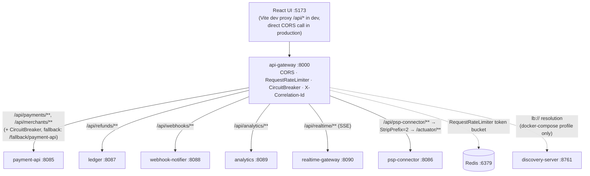

# api-gateway (M16)

Spring Cloud Gateway — the single REST entry point ADR-0004 describes: "All external traffic —
the React UI and merchant API clients — enters through `api-gateway`... The gateway is the only
component with a public route. It owns CORS, rate limiting, the circuit breaker, and
correlation-id injection." Reactive (WebFlux/Reactor Netty), not Spring MVC — see "Why reactive,
and why no hexagon here" below.

## Kafka concepts demonstrated

None directly — `api-gateway` is HTTP-only and is **not** a Kafka client (per the task brief: "the
gateway and discovery server are HTTP-only and are NOT Kafka clients, so they need no SCRAM
principal or ACLs"). What it demonstrates is the *edge* half of ADR-0004's sync/async boundary:
everything past this gateway either talks Kafka (the six services) or, for the one genuinely
synchronous need (M12's provider-status check), goes through Kafka request-reply anyway — the
gateway itself never becomes a second REST hop between services.

## Architecture



## Route table

One route per service (all six, per the task brief) — `id` / predicate / target, `docker-compose`
profile (`application-docker-compose.yml`):

| id | predicate | target (`docker-compose`) | target (`k8s`) | filters |
|---|---|---|---|---|
| `payment-api` | `Path=/api/payments/**,/api/merchants/**` | `lb://payment-api` | `http://payment-api.psp.svc.cluster.local:8085` | `RequestRateLimiter` (default, all routes) + `CircuitBreaker` (`paymentApiCB`, fallback `forward:/fallback/payment-api`) |
| `ledger` | `Path=/api/refunds/**` | `lb://ledger` | `http://ledger.psp.svc.cluster.local:8087` | `RequestRateLimiter` (default) |
| `webhook-notifier` | `Path=/api/webhooks/**` | `lb://webhook-notifier` | `http://webhook-notifier.psp.svc.cluster.local:8088` | `RequestRateLimiter` (default) |
| `analytics` | `Path=/api/analytics/**` | `lb://analytics` | `http://analytics.psp.svc.cluster.local:8089` | `RequestRateLimiter` (default) |
| `realtime-gateway` | `Path=/api/realtime/**` | `lb://realtime-gateway` | `http://realtime-gateway.psp.svc.cluster.local:8090` | `RequestRateLimiter` (default) — **no other filter**, deliberately (see "SSE through the gateway") |
| `psp-connector` | `Path=/api/psp-connector/**` | `lb://psp-connector` | `http://psp-connector.psp.svc.cluster.local:8086` | `RequestRateLimiter` (default) + `StripPrefix=2` |

`psp-connector` has no business REST endpoint at all (ADR-0004: it's a pure Kafka
consumer/producer) — its route exists so every service is reachable through the one edge for ops
purposes (`/api/psp-connector/actuator/health`), not because a browser calls it.

Live route table (once running): `GET http://localhost:8000/actuator/gateway/routes`.

### Discovery-based routing (ADR-0009)

`docker-compose` profile routes use `lb://<service-id>`, resolved by Spring Cloud LoadBalancer
against `discovery-server`'s Eureka registry — the six services register themselves (Eureka
client dependency + `eureka.client.enabled=true`, `docker-compose` profile only, same convention
in each service's `pom.xml`/`application-docker-compose.yml`) and `api-gateway` is a Eureka
client too, purely to *read* the registry (it never registers anything meaningful of its own
callers need). This is Eureka actually doing something, not a decoration: kill and restart
`payment-api` and the gateway keeps routing to it once the new instance re-registers, with no
gateway restart and no hardcoded address to update.

`k8s` profile routes use direct Kubernetes Service DNS names instead — no registry client
involved at all (`eureka.client.enabled` is never set to `true` in `application-k8s.yml`). Per
ADR-0009, load balancing across replicas becomes kube-proxy's job and failure detection becomes
the readiness probe's job. **This profile is real Spring config, not a placeholder — but it is
untested until M18 actually builds the `psp` namespace and the Service objects it targets.** See
`services/discovery-server/README.md` for the full argument.

`config.KnownProfileGuard` fails startup fast if neither profile is active — otherwise every
route silently doesn't exist (defined only inside profile-specific YAML, never the
profile-agnostic `application.yml` — see that file's top comment for why the two route tables
aren't allowed to merge).

## Rate limit

`spring.cloud.gateway.server.webflux.default-filters` — a `RequestRateLimiter`
(`RedisRateLimiter`) applied to **every** route, not just one, backed by the `redis` container
added to `infra/compose/docker-compose.yml`:

```yaml
redis-rate-limiter.replenishRate: 5     # tokens refilled per second
redis-rate-limiter.burstCapacity: 10    # bucket size — max burst before limiting kicks in
redis-rate-limiter.requestedTokens: 1   # cost per request
key-resolver: "#{@ipKeyResolver}"       # bucketed by caller IP (config.RateLimiterConfig)
```

Sustained traffic above **5 requests/second** from one IP gets `429 Too Many Requests` once the
10-token burst is exhausted; a caller sending at or below 5 req/s never trips it. To trip it
deliberately, hit any route in a tight loop — `POST /api/payments` is the natural choice, since
it's the one write path that also proves the pipeline is reachable:

```bash
for i in $(seq 1 20); do
  curl -s -o /dev/null -w "%{http_code}\n" \
    -X POST http://localhost:8000/api/payments \
    -H "Content-Type: application/json" \
    -d '{"merchantId":"rate-limit-drill","amount":1.00,"currency":"EUR"}'
done
```

The first ~10 requests (burst capacity) return `201`/`202`; once the bucket is empty, subsequent
requests within the same second return `429` until tokens refill at 5/s.

### Rate limit proof

Fourteen `POST /api/payments` in a tight loop through the gateway
(`replenishRate: 5`, `burstCapacity: 10`, `requestedTokens: 1`):

```
201 201 201 201 201 201 201 201 201 201 429 429 429 429
accepted: 10    rate-limited: 4
```

Exactly ten through, then refusal - the burst capacity, spent. Headers on a later request show the
bucket state directly:

```
X-RateLimit-Burst-Capacity:   10
X-RateLimit-Replenish-Rate:   5
X-RateLimit-Requested-Tokens: 1
X-RateLimit-Remaining:        9
```

**The two numbers do different jobs, and the distinction is the whole design.** `burstCapacity` is
how much the bucket holds, so it bounds a *spike* - ten requests arriving at once are all served.
`replenishRate` is how fast tokens return, so it bounds the *sustained* rate at five per second. A
caller can be briefly fast or indefinitely steady, but not both, which is usually exactly the
policy you want.

Worth noting where that state lives: **Redis, not the gateway's memory.** That is what makes the
limit hold across gateway instances - two replicas share one bucket per key rather than each
granting the full allowance. An in-memory limiter silently multiplies the effective limit by the
replica count.

## Circuit breaker

Resilience4j, via Spring Cloud Circuitbreaker's reactive adapter, on the **`payment-api`** route
only (task brief: "on at least one route" — payment-api is the pipeline's single write entry
point, so it's the one route where a fallback response actually matters end-to-end):

```yaml
resilience4j:
  circuitbreaker:
    instances:
      paymentApiCB:
        sliding-window-type: COUNT_BASED
        sliding-window-size: 10
        minimum-number-of-calls: 5
        failure-rate-threshold: 50            # % of the last window's calls
        wait-duration-in-open-state: 10s
        permitted-number-of-calls-in-half-open-state: 3
        automatic-transition-from-open-to-half-open-enabled: true
  timelimiter:
    instances:
      paymentApiCB:
        timeout-duration: 4s
```

Once 5+ calls have been sampled in the last 10-call window and ≥50% failed (connection refused,
or exceeded the 4s time limit), the breaker **opens**: every further call to `payment-api`'s
routes is short-circuited immediately to `web.FallbackController` (`forward:/fallback/payment-api`,
an RFC 7807 `503`) instead of waiting on or retrying against a service that has already proven
itself unavailable. After 10s in the open state it moves to half-open and samples 3 calls to
decide whether to close again.

**How to trip it** — stop the downstream service (the task brief's "obvious way"). `payment-api`
runs on the **host**, not in a container (like the six services and `api-gateway` itself — only
`discovery-server` runs in compose), so "stop the service" means killing the host process, not
`docker stop`:

```bash
# find and stop payment-api's process
pkill -f "payment-api"    # or Ctrl+C the terminal running it

# then drive >= 5 calls through the gateway to fill the sampling window
for i in $(seq 1 8); do
  curl -s -o /dev/null -w "%{http_code}\n" http://localhost:8000/api/payments/00000000-0000-0000-0000-000000000000/provider-status
done
# first few: connection-refused failures counted by the breaker
# once the 50% failure-rate threshold over >= 5 calls is crossed: 503 from FallbackController,
# returned immediately, with no further attempt to reach payment-api
```

### Circuit breaker proof

`GET /api/payments/{id}/provider-status` through the gateway, before and after killing the
downstream service:

| State | Result | Time |
|---|---|---|
| payment-api up | `200` | **573 ms** |
| payment-api killed, calls 1-8 | `503` | **3-9 ms** |

```json
{"title":"payment-api unavailable","status":503,
 "detail":"payment-api is not responding and the circuit breaker 'paymentApiCB' is open.
           Retrying immediately will not help - wait for the half-open probe."}
```

**The timings are the proof, not the status codes.** A 503 alone would only show the call failed.
Three milliseconds shows the call was never *attempted* - the breaker is open and rejecting
locally. Compare that to what happens without one: every request waits out the connect timeout,
holding a gateway thread and a client connection for seconds, so a single dead downstream drags
the gateway's capacity down with it. That is how one failing service takes out an entire edge
tier.

The body naming `paymentApiCB` matters too. It confirms the response came from the configured
`fallbackUri` rather than Spring Cloud Gateway's generic error page - a distinction that is easy
to assume and worth checking, since both are 503s.

**Recovery has a second timer nobody configures.** After restarting payment-api the gateway kept
failing briefly even once Eureka showed the instance `UP`, because Spring Cloud LoadBalancer caches
its instance list independently (35 s TTL by default) on top of Eureka's own registration delay. In
this run recovery took about 5 s; it can take considerably longer. When a service "is back" but the
gateway disagrees, that cache is the usual reason - not the breaker, which had already closed.

## CORS

`spring.cloud.gateway.server.webflux.globalcors` allows `http://localhost:5173` (the Vite dev
origin) — `GET, POST, PUT, DELETE, OPTIONS`, any header, no credentials. This is what a
**production** browser calling `api-gateway` directly, cross-origin, would need; `pnpm dev`'s Vite
proxy (`ui/vite.config.ts`) means the browser never actually exercises this path in local
development (same-origin `/api/*` throughout) — see `ui/README.md` "Why a proxy, not CORS — and
what M16 changed" for the full reasoning on both sides of that split.

Honest caveat: the allowed origin is hardcoded to `localhost:5173` in the one config file used by
both profiles (CORS is profile-INDEPENDENT here — see `application.yml`'s top comment for why the
*route table* has to be duplicated per profile but this doesn't). A real production deployment
would need this to be an actual production UI origin, not the dev server's — out of scope for
this project, which has no separate production UI hosting story.

## Correlation ID vs W3C `traceparent`

`filter.CorrelationIdGlobalFilter` generates `X-Correlation-Id` if the inbound request doesn't
already carry one, forwards it on the proxied request, and echoes it on the gateway's own
response — the same header name and the same job as `libs/common-web`'s `CorrelationIdFilter`,
applied one hop earlier. It's a hand-written WebFlux `GlobalFilter`, not a reuse of
common-web's Servlet filter: Spring Cloud Gateway is reactive, and `common-web` pulls in
`spring-boot-starter-web` transitively — putting it on this module's classpath would make Spring
Boot's web-application-type auto-detection pick SERVLET and silently disable the gateway's own
reactive autoconfiguration. See that filter's javadoc for the full explanation.

These are two deliberately separate mechanisms, not two names for one thing:

- **`X-Correlation-Id`** is an opaque, human-assigned string whose only job is grep-friendly log
  correlation for one logical request. It's carried explicitly in ADR-0002's event envelope so it
  survives the synchronous-to-asynchronous handoff at the Kafka boundary.
- **`traceparent`** (W3C Trace Context) is a structured trace-id + span-id + flags string that
  Micrometer Tracing/OpenTelemetry generate, propagate, and own completely, end to end — this
  gateway never reads, writes, or forwards it directly. `micrometer-tracing-bridge-otel` +
  `opentelemetry-exporter-otlp` on this module's classpath (same as the six services, M15) is
  what makes that automatic: every request the gateway proxies gets a span, exported to Tempo
  over OTLP, that becomes part of the same trace payment-api's `POST /api/payments` root span
  started — no code in this module manages that propagation.

No third notion of request identity is invented here: `correlationId` answers "which client
request was this," `traceId`/`traceparent` answer "which causally-connected chain of spans."

## SSE through the gateway

The `realtime-gateway` route (`/api/realtime/**`) proxies a genuinely long-lived
`text/event-stream` response with no fixed end — this is exactly the scenario where a naive
buffering reverse proxy breaks streaming (it waits for the response to "finish" before forwarding
anything, which for an SSE stream is never). Two things make this route safe, both by *absence*
rather than a special filter:

1. **No `response-timeout` is configured** anywhere in this module
   (`spring.cloud.gateway.server.webflux.httpclient` in `application.yml`) — Spring Cloud
   Gateway's default is unbounded, and that's left alone deliberately. Setting one (even a
   generous one) would sever the stream once realtime-gateway's own 5-minute `SseEmitter` idle
   timeout is still nowhere close.
2. **No filter reads or aggregates the response body** on this route — Spring Cloud Gateway is
   built on Reactor Netty, whose HTTP client response is itself a reactive `Flux<DataBuffer>`;
   the gateway's routing filter pipes that Flux straight into the outbound response without
   buffering it, UNLESS some filter in the chain forces materialization (e.g. `ModifyResponseBody`
   or a filter that calls `.collectList()`/`.cache()` on the body). This route has none — only the
   profile-independent `RequestRateLimiter` (checks a token bucket before proxying, never touches
   the response body) and `CorrelationIdGlobalFilter` (headers only).

Verified against the real stack, not asserted from documentation: with `payment-api`,
`psp-connector`, `realtime-gateway`, and this gateway all running, a real payment's two SSE
events (`payments.payment-requested.v1`, then `payments.payment-status-changed.v1` after
psp-connector's simulated provider delay) both arrived through
`GET http://localhost:8000/api/realtime/events?paymentId=...` in real time, not buffered until
the end — see the root task's final report for the captured `curl --no-buffer` transcript.

## Why reactive, and why no hexagon here

**Reactive.** Spring Cloud Gateway *is* Reactor Netty; `spring-cloud-starter-gateway-server-webflux`
(the current, non-deprecated artifact — Spring Cloud 2025.0.x split the old
`spring-cloud-starter-gateway` into webflux/webmvc variants) cannot coexist usefully with
`spring-boot-starter-web` on the same classpath (Spring Boot's web-application-type
auto-detection would pick SERVLET and disable the reactive gateway autoconfiguration). This is
also why this module does not depend on `libs/common-web`.

**No hexagon.** ADR-0007's package-by-hexagon template (`domain/application/adapters/config`)
protects a service's *business logic* from framework leakage. This module has none — it is
routing/filter **configuration** (mostly YAML) plus a handful of framework-native classes
(`GlobalFilter`, `KeyResolver`, a `@RestController` fallback). Forcing an empty `domain/` package
here would be decoration, not architecture. This matches ADR-0004's own framing of
"`api-gateway` → service HTTP" as "edge-to-service, not service-to-service" — the same category
`discovery-server` falls into, for the same reason (see that module's README).

## How to run

**Compose**:

```bash
set -a; . infra/compose/.env; set +a
SPRING_PROFILES_ACTIVE=docker-compose mvn -pl services/api-gateway -am spring-boot:run
```

Prerequisites: `infra/compose` running (`discovery-server` and `redis` containers included, both
added in M16), plus whichever of the six services you want reachable, each also started with
`SPRING_PROFILES_ACTIVE=docker-compose` so they register with Eureka.

**k8s**: `SPRING_PROFILES_ACTIVE=k8s` — untested until M18 builds the cluster this profile
targets; see `application-k8s.yml`'s own comments for the honest caveat.

## Prove it

1. `GET http://localhost:8000/actuator/gateway/routes` — the live route table matches the six
   entries above.
2. `POST http://localhost:8000/api/payments` with a valid body reaches `payment-api` and returns
   `202` — the same request `payment-api`'s own README proves directly against `:8085`, now
   through the gateway.
3. `GET http://localhost:8000/api/realtime/events?paymentId=<id>` streams the same two SSE events
   `realtime-gateway`'s own README proves directly against `:8090`.
4. Rate limit and circuit breaker — see their sections above.

## Troubleshooting

- **`lb://payment-api` returns 503 with no instances.** `payment-api` isn't registered — check it
  was started with `SPRING_PROFILES_ACTIVE=docker-compose` (default profile leaves
  `eureka.client.enabled=false`) and that `discovery-server` was up before it started.
- **A service you just restarted shows `UP` in Eureka, but the gateway still 503s it for up to
  ~35s afterward** (`RoundRobinLoadBalancer: No servers available for service: payment-api` in
  the gateway's log even though `/eureka/apps` already shows it `UP`). This is Spring Cloud
  LoadBalancer's own instance-list cache (`spring.cloud.loadbalancer.cache.ttl`, default 35s),
  layered on top of Eureka's 5s `lease-renewal-interval-in-seconds` — the gateway cached the
  *empty* instance list from while the service was down and doesn't re-query until that TTL
  expires. Observed directly during this module's verification: killing and restarting
  `payment-api` recovered its Eureka entry within ~5s but the gateway route stayed 503 for
  closer to 30s. Not a bug, just a second cache with its own clock — worth knowing before
  assuming a restart is broken.
- **Gateway itself won't start, `KnownProfileGuard` message.** No `SPRING_PROFILES_ACTIVE` was
  set, or it wasn't `docker-compose`/`k8s`. See "Discovery-based routing" above.
- **Every request returns 429 immediately, even the first one.** Redis wasn't reachable at
  startup or the bucket wasn't reset — restart `redis` (`docker compose restart redis`) or wait
  out `wait-duration-in-open-state`-scale time for tokens to refill.
- **SSE connects but nothing streams.** Check whether a `response-timeout` was accidentally added
  to `application.yml` — see "SSE through the gateway" above; this is the first thing to suspect
  if streaming regresses.
