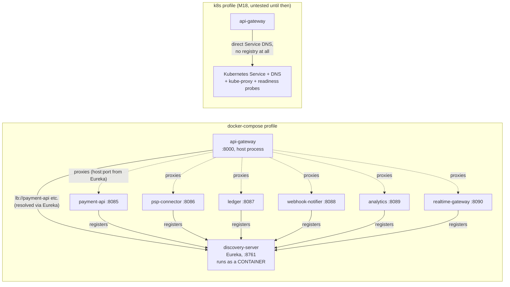

# discovery-server (M16)

A Netflix Eureka registry, and nothing else. Per **ADR-0009** it exists ONLY for the
`docker-compose` profile — `api-gateway` resolves `lb://payment-api` (and the other five
services) through it. It is **never deployed under the `k8s` profile**: no Deployment, no
Service, no Helm chart in M18. See "Why Eureka is redundant on Kubernetes" below for the argument
this module exists to demonstrate.

## Kafka concepts demonstrated

None — this is the one module in this repo that is deliberately NOT about Kafka. It exists so
the discovery *problem* (how does `api-gateway` find `payment-api`'s host:port?) gets solved two
different ways across the two profiles, and so the difference is visible and explainable, not
just asserted in an ADR.

## Architecture



Why this service runs **in a container**, unlike the six pipeline services and `api-gateway`
(which all run on the HOST via `mvn spring-boot:run` / `java -jar`, per every other service's
README): `discovery-server` is infrastructure the compose profile itself depends on, not
something you iterate on the way you iterate on `payment-api`'s business logic. It belongs to
the stack's own lifecycle (`docker compose up`/`down`), the same category as Kafka, Postgres,
Schema Registry, and now Redis — not the six services' "edit code, restart the JVM" loop. ADR-0009
literally says so: "`discovery-server` (Netflix Eureka) runs as a container."

## Why Eureka is redundant on Kubernetes

This is the actual point of building this module — not "get Eureka working," but understand
precisely why a platform-native alternative made it obsolete.

A Kubernetes **Service** already gives you everything a client-side registry exists to provide:

| Eureka gives you | Kubernetes gives you |
|---|---|
| A stable name to resolve (`payment-api`) | A stable DNS name (`payment-api.psp.svc.cluster.local`) |
| A list of healthy instances | `Endpoints`/`EndpointSlice`, maintained from readiness probes |
| Client-side load balancing across instances | kube-proxy load balancing (iptables/IPVS), no client library needed |
| Failure detection via heartbeat + eviction | A readiness probe removing an endpoint in **seconds** |

The failure-detection gap is the sharpest difference, and it's quantitative, not just
architectural: Eureka's defaults are a 30s client heartbeat and a 90s server-side eviction
window (tuned down to 5s/`enable-self-preservation: false` here, for a *dev laptop*, per
ADR-0009 — production Eureka runs closer to the defaults, which is the point: even the tuned-down
version isn't as fast as a readiness probe). A Kubernetes readiness probe can pull a pod out of
`Endpoints` within one probe interval, typically single-digit seconds. Running Eureka **on**
Kubernetes doesn't add safety — it adds a second, slower, independently-failing source of truth
that duplicates state the platform already maintains authoritatively.

`spring-cloud-kubernetes-discovery` (queries the k8s API server, does client-side load balancing
from Pod-level knowledge) is a real alternative technique, and deliberately **not** used here
either — it needs its own RBAC, adds an API-server dependency to every client, and buys nothing
in a system where the gateway is the only client and has no per-request routing logic beyond
"give me an instance of this Service." Plain DNS + kube-proxy is the smaller correct answer. See
ADR-0009's "Alternatives considered" for the full comparison.

**The switch is real, not aspirational.** This service has exactly one supported way to run and
refuses to start any other way — see `config.ComposeProfileGuard`:

```
discovery-server must be started with SPRING_PROFILES_ACTIVE=docker-compose (ADR-0009).
This service exists ONLY for the compose profile and is never deployed under k8s...
```

There is no `application-k8s.yml` in this module at all, and no Deployment/Service/Helm chart
will be added for it in M18 — the absence itself is the demonstration. Contrast with
`services/api-gateway`, which genuinely has two profiles because it genuinely runs in both
environments (see that module's README).

## How to run

**Compose** (the only supported profile):

```bash
mvn -pl services/discovery-server -am package -DskipTests
cd infra/compose
docker compose build discovery-server
docker compose up -d discovery-server
```

Dashboard: <http://localhost:8761> — lists every registered application and instance once the
six services and `api-gateway` are also running with `SPRING_PROFILES_ACTIVE=docker-compose`.
Raw registry (what `api-gateway`'s LoadBalancer actually reads):

```bash
curl -s http://localhost:8761/eureka/apps -H "Accept: application/json" | jq '.applications.application[].name'
```

**k8s**: not applicable — see above.

## Prove it

1. Bring up `discovery-server` alone; `curl http://localhost:8761/actuator/health` returns `UP`.
2. Start `payment-api` under the `docker-compose` profile
   (`SPRING_PROFILES_ACTIVE=docker-compose mvn -pl services/payment-api -am spring-boot:run`);
   within its `lease-renewal-interval-in-seconds: 5` window it appears at
   `GET /eureka/apps/PAYMENT-API`.
3. Try starting `discovery-server` with no active profile
   (`java -jar services/discovery-server/target/discovery-server.jar`) — it fails fast with
   `ComposeProfileGuard`'s message instead of silently binding :8761 under the wrong assumption.

## Troubleshooting

- **Service registers, but `api-gateway`'s `lb://` route returns 503 immediately.** Check the
  registering service's `eureka.instance.hostname` — if it's the machine's real hostname instead
  of `localhost` (see every service's `application-docker-compose.yml`), the LoadBalancer may
  resolve an address `api-gateway` can't dial.
- **`discovery-server` container never becomes healthy.** Its jar wasn't built before `docker
  compose build` — the `Dockerfile` copies `target/discovery-server.jar`, it does not run Maven.
  Run `mvn -pl services/discovery-server -am package -DskipTests` first.
- **A service takes up to ~35s to disappear from the dashboard after you kill it.** That's the
  eviction window this README's "Why Eureka is redundant on Kubernetes" section is about, live —
  compare it to a Kubernetes readiness probe the next time you're on the `k8s` profile (M18).
