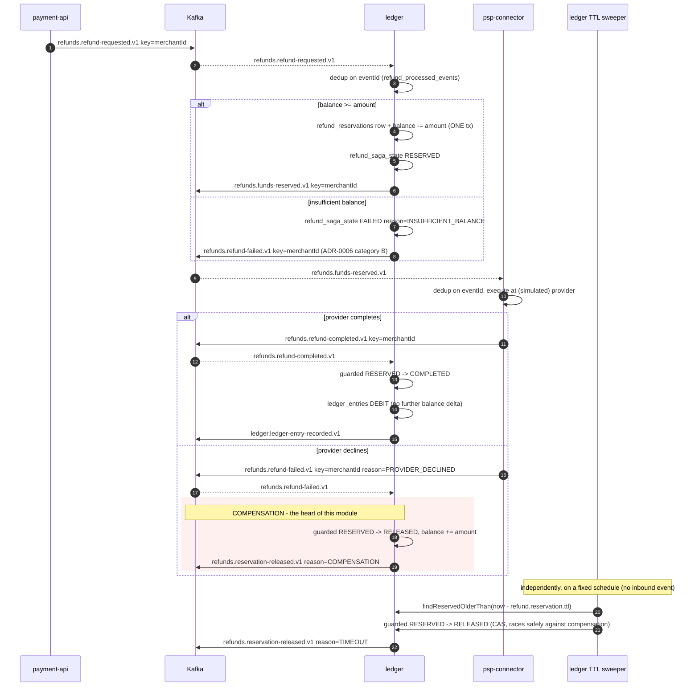
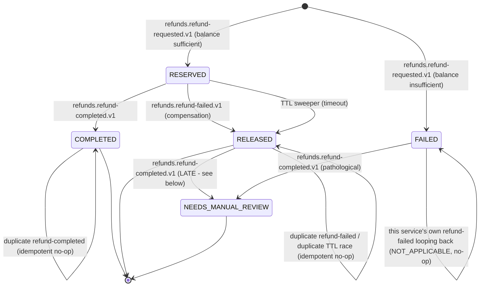

# ledger (M7 - exactly-once semantics)

Consumes `payments.payment-status-changed.v1`, maintains per-merchant balances in its own
Postgres database, and publishes `ledger.ledger-entry-recorded.v1`.

This is the module where "exactly-once" stops being a slogan. The service has **two independent
correctness mechanisms** and the whole point is that they are not the same mechanism and do not
cover the same thing:

| # | Mechanism | Covers | Does **not** cover |
|---|---|---|---|
| 1 | Kafka transactions (`transactional.id`, `sendOffsetsToTransaction`, `read_committed`) | consumed offsets **+** produced ledger entry — both live in Kafka | anything outside Kafka |
| 2 | Postgres idempotency keyed on the inbound envelope `eventId` (unique constraint) | the merchant balance write | nothing else — and nothing else needs it |

**Balances stay correct under replay because of mechanism 2, not mechanism 1.** Delete the
transactional producer and balances are still right. Delete the unique constraint and no amount
of Kafka exactly-once will save them. See [Where Kafka EOS ends](#where-kafka-eos-ends).

## Kafka concepts demonstrated

- **Kafka transactions**: `initTransactions` / `beginTransaction` / `sendOffsetsToTransaction` /
  `commitTransaction` / `abortTransaction`, and which Spring abstraction issues each one
- **`transactional.id`**, producer epochs, and **zombie fencing** — including why a random id per
  boot silently disables it
- The **transaction coordinator** (`__transaction_state`), and the **COMMIT / ABORT control
  markers** it writes into every enrolled partition
- **`isolation.level=read_committed`** vs `read_uncommitted`, the **Last Stable Offset**, and why
  a `read_committed` consumer sees offset gaps
- `@Transactional` with `KafkaTransactionManager`, and why it is *not* a substitute for putting
  the transaction manager on the listener container
- **Where Kafka's guarantee stops** — the Kafka↔Postgres boundary, and the M5 idempotency that
  covers the other side of it

## Architecture

```mermaid
flowchart LR
    IN[["payments.payment-status-changed.v1<br/>key: merchantId, 12 partitions"]]
      --> L[PaymentStatusChangedListener]

    subgraph TX["Kafka transaction — one per record (mechanism 1)"]
      direction LR
      L -->|MapStruct: event to command| UC[RecordLedgerEntryUseCase]
      UC -->|port| PUB[LedgerEntryPublisher]
      PUB -.-> K[KafkaLedgerEntryPublisher<br/>transactional producer]
      K --> OUT[["ledger.ledger-entry-recorded.v1<br/>key: merchantId, 6 partitions"]]
      OFF[["__consumer_offsets<br/>via sendOffsetsToTransaction"]]
    end

    UC -->|port| R[(LedgerRepository)]
    R -.-> W[LedgerWriteTransaction<br/>@Transactional#40;transactionManager#41;]
    W -.-> DB[("PostgreSQL 'ledger'<br/>ledger_entries + merchant_balances<br/>MECHANISM 2 — outside the Kafka tx")]

    L -.->|container commits| OFF

    style TX stroke-dasharray: 5 5
    style DB stroke-width:3px
```

The dashed box is what one Kafka transaction covers. **The database is deliberately drawn
outside it**, because it is outside it.

## Topics

| Direction | Topic | Key | Partitions | RF | Retention |
|---|---|---|---|---|---|
| in | `payments.payment-status-changed.v1` | `merchantId` | 12 | 3 | 7 d |
| out | `ledger.ledger-entry-recorded.v1` | `merchantId` | 6 | 3 | 30 d |
| (M8) | `payments.payment-status-changed.v1.ledger.dlq` | `merchantId` | 3 | 3 | 30 d |

Consumer group: **`ledger.v1`** (`docs/diagrams/topic-map.md`).

**The inbound key is why this module is about transactions and not about locking.** ADR-0003
keys `payment-status-changed` by `merchantId` *precisely so the ledger has a single writer per
merchant balance*: every event touching one merchant's balance lands on one partition and is
therefore processed by one consumer instance at a time. Keying by `paymentId` would have turned
M7 into a distributed-locking exercise — ADR-0003 says so explicitly in its "Alternatives
considered". The balance upsert is still a single atomic `ON CONFLICT ... DO UPDATE` statement
rather than a read-modify-write, because "one writer" is a property of today's partitioning, not
an invariant the database enforces.

The outbound key is also `merchantId`, which on this topic happens to coincide with the
envelope's `aggregateId` (a ledger entry is a fact about a merchant's balance). That coincidence
is unusual in this system (ADR-0002/0003 normally keep them different) and should not be
generalised from.

## Where Kafka EOS ends

**Exactly-once in Kafka is Kafka-to-Kafka only. The database write is outside it.** Said as
plainly as possible:

A Kafka transaction is atomic over things Kafka owns. It owns the records this producer appends,
and it owns `__consumer_offsets` — which is just another Kafka topic, which is the entire reason
`sendOffsetsToTransaction` can exist. Postgres is a different system with a different transaction
log and a different commit protocol. There is no two-phase commit here, Kafka exposes no XA
resource manager, and this service does not pretend otherwise.

So the guarantee this service actually provides is:

- **Kafka side — exactly-once.** A `read_committed` consumer of
  `ledger.ledger-entry-recorded.v1` never sees an entry from an attempt that failed, never sees
  one twice from a producer retry, and the offset of the inbound record advances if and only if
  the outbound entry became visible. Output and progress move together or not at all.
- **Postgres side — at-least-once delivery made into an exactly-once *effect*, by idempotency.**
  Every ledger entry row carries `inbound_event_id` under `uq_ledger_entries_inbound_event_id`.
  A redelivered event — from a rebalance, a crash, an aborted transaction, or an operator
  resetting `ledger.v1` to earliest and replaying the whole topic — hits that constraint (or the
  cheap `existsByInboundEventId` read in front of it) and becomes a no-op.

### What that means in practice

Three concrete consequences, none of them hypothetical:

1. **The Kafka transaction can abort after the balance has already committed.** The Postgres
   transaction in `LedgerWriteTransaction` commits *before* the record is produced; if the
   surrounding Kafka transaction then aborts, the balance change is durable and the ledger entry
   event is not. The inbound offset is not committed either, so the record is redelivered — and
   the redelivery is deduplicated, so **the entry event for that movement is never republished**.
   The balance is right; a downstream consumer is missing one entry. This is a real, accepted gap
   (see [Known issues](#known-issues--deferred)); its fix is M6's transactional-outbox pattern
   applied here — write the outbound event into the *same Postgres transaction* as the balance —
   not a bigger Kafka transaction, because a Kafka transaction cannot be made bigger than Kafka.
2. **Replay safety is a database property, and it is testable without a broker.** Every assertion
   in `RecordLedgerEntryUseCaseTest` runs with no Kafka anywhere in the process. That is not a
   testing shortcut; it is the claim itself, expressed as a test.
3. **`isolation.level=read_committed` protects readers from *upstream* aborts, not this service
   from its own.** It is what stops a downstream service double-counting; it does nothing about
   the Postgres row this service already wrote.

The one-line version: *Kafka transactions make the offset commit and the produce atomic with each
other. They say nothing about your database. That part is still M5.*

## Kafka transaction mechanics, end to end

### Which Spring abstraction issues which Kafka call

Nothing in this codebase calls the transaction API by hand. Each call has exactly one origin:

| Kafka `Producer` call | Issued by | Where it is configured |
|---|---|---|
| `initTransactions()` | `DefaultKafkaProducerFactory`, once, when it first creates the producer | `KafkaProducerConfig#ledgerEntryProducerFactory` (`setTransactionIdPrefix`) |
| `beginTransaction()` | `KafkaTransactionManager.doBegin`, driven by the container's `TransactionTemplate` | `KafkaConsumerConfig` — `setKafkaAwareTransactionManager(...)` |
| *(the send)* | `KafkaTemplate.send` enrolling the topic-partition in the open transaction | `KafkaLedgerEntryPublisher` |
| `sendOffsetsToTransaction(offsets, groupMetadata)` | `KafkaMessageListenerContainer`, immediately before commit | `KafkaConsumerConfig` — same line |
| `commitTransaction()` | `KafkaTransactionManager.doCommit` — listener returned normally | `PaymentStatusChangedListener#onMessage` returning |
| `abortTransaction()` | `KafkaTransactionManager.doRollback` — listener threw | any exception out of `onMessage` |

`sendOffsetsToTransaction` is the one that cannot be moved into application code: only the
container holds the `Consumer` and its `ConsumerGroupMetadata`. That is why
`setKafkaAwareTransactionManager` on the **container**, and not `@Transactional` on the listener,
is what turns "produce inside a transaction" into full consume-process-produce exactly-once. The
`@Transactional("kafkaTransactionManager")` on the listener *participates in* the transaction the
container already began; it is kept for legibility and because this service has two transaction
managers, not because it creates the guarantee.

### transaction.id, epochs, and zombie fencing

`transactional.id` here is `ledger-tx-${ledger.instance-id}-`, and
`DefaultKafkaProducerFactory` appends its own suffix — observed at runtime as
`transactional.id = ledger-tx-0-0`.

`initTransactions()` registers that id with the **transaction coordinator** (the broker leading
the `__transaction_state` partition the id hashes to — 50 partitions, RF 3, min ISR 2 in this
stack), retrieves or allocates its `producerId`, and **bumps its producer epoch**:

```
[Producer transactionalId=ledger-tx-0-0] Invoking InitProducerId for the first time in order to acquire a producer ID
[Producer transactionalId=ledger-tx-0-0] ProducerId set to 5004 with epoch 0
```

Any producer still alive using that same `transactional.id` at a now-stale epoch gets
`ProducerFencedException` / `InvalidProducerEpochException` on its next produce or commit, and
any transaction it left open is aborted by the coordinator on the new incarnation's behalf. That
is zombie fencing, and it is what stops a hung-then-resurrected pod from committing work its
replacement knows nothing about.

**All of it depends on the new incarnation presenting the same `transactional.id`.** A random id
per boot (`UUID.randomUUID()` as a prefix) allocates a brand-new `producerId` at epoch 0, fences
nothing, and leaves the zombie free to keep writing and committing. The failure is completely
silent — every individual transaction still looks perfectly well-formed. So the prefix is derived
from `ledger.instance-id`, a value that is **stable across restarts of one logical instance** and
**distinct between instances** (on Kubernetes, the StatefulSet ordinal; locally,
`--ledger.instance-id=1` when starting a second copy). Sharing one id between two live instances
is equally broken in the other direction: each fences the other and the group livelocks.

The prefix deliberately does **not** include `group.id`/topic/partition. Before Kafka 2.5 that was
the only way to fence a consumer-initiated transaction across a rebalance. Kafka 2.5 moved that
fencing to the group coordinator: `sendOffsetsToTransaction` submits the offsets together with the
consumer's `memberId` and `generationId`, so a member from a stale generation has its offset
commit rejected outright. Spring Kafka has used that mode (`EOSMode.V2`) exclusively since 3.0,
which is why one stable id per *instance* is now both sufficient and correct.

### Markers, the Last Stable Offset, and why aborted records are still in the log

Records are appended to their partitions **as they are produced** — a transaction is not buffered
on the client. The publisher logs the assigned offset before the transaction resolves, on purpose:

```
Appended ledger.ledger-entry-recorded.v1 entryId=... partition=2 offset=240
  (NOT yet committed - the commit marker follows if the listener returns normally)
```

On commit, the coordinator writes a **COMMIT control record** into every enrolled partition
(including the `__consumer_offsets` partition holding the offsets); on abort, an **ABORT marker**.
Those markers occupy real offsets, which is why `read_committed` consumers see gaps.

Isolation is therefore a **read-side filter**:

- `read_committed` never fetches past the **Last Stable Offset** — the first offset of the oldest
  still-open transaction on that partition — buffers what it fetches beyond the last commit
  marker, and discards records listed in the fetch response's aborted-transactions index. A
  producer hung mid-transaction shows up as consumer **lag**, until `transaction.timeout.ms`
  (60 s here) lets the coordinator abort it.
- `read_uncommitted` (the Kafka default) does none of that and delivers aborted records like any
  other.

## Error taxonomy (ADR-0006)

| Inbound / failure | Category | Behaviour |
|---|---|---|
| `status=SUCCEEDED` | business outcome | CREDIT entry, balance updated, entry published, transaction commits |
| `status=DECLINED` | **business outcome, not an error** | no entry, no publish, transaction commits (offset advances). Nothing to deduplicate: re-applying "no change" is already idempotent |
| replayed `eventId` | not an error | deduplicated (check-first or constraint race), transaction commits |
| bad bytes / unknown schema | C — poison pill | caught by `ErrorHandlingDeserializer` before the listener; no transaction is opened for it |
| anything thrown from the listener | A/D | Kafka transaction **aborts**; `DefaultAfterRollbackProcessor` retries twice, 1 s apart, then commits the offset in a new transaction so the partition is not blocked |
| `ledger.fail-after-produce=true` | test hook | deliberate abort after produce, before commit — see below |

With a transaction manager present, a listener exception is handled by an **`AfterRollbackProcessor`**,
not by the `CommonErrorHandler` used in `psp-connector`. Same ADR-0006 gap as there: the real
policy is a non-blocking retry chain ending in `payments.payment-status-changed.v1.ledger.dlq`,
and that chain is M8.

## How to run

```bash
cd infra/compose && docker compose up -d && ./create-topics.sh
mvn -pl services/ledger -am package
java -jar services/ledger/target/ledger.jar --spring.profiles.active=docker-compose
```

Listens on **8087** (payment-api 8085, psp-connector 8086, AKHQ 8080, Schema Registry 8081).
Database `ledger` (ADR-0005, `infra/compose/.env`); Flyway creates `ledger_entries` and
`merchant_balances` on first start.

Properties worth knowing:

```
ledger.instance-id                     # stable per logical instance; drives the transactional.id
ledger.kafka.transactional-id-prefix   # default ledger-tx-${ledger.instance-id}-
ledger.fail-after-produce              # THE abort hook, default false
```

Counters (`/actuator/metrics/...`):

```
ledger.entries.applied
ledger.entries.deduplicated{path=check-first}
ledger.entries.deduplicated{path=constraint-race}
ledger.entries.ignored
```

## Integration tests (M19 "Plus")

One Testcontainers IT, `src/test/java/.../integration/LedgerEosIT.java`. It runs under `verify`,
never under `test` - surefire (`*Test.java`) and failsafe (`*IT.java`) have disjoint include
patterns, so `mvn test` starts no containers.

```bash
mvn -pl services/ledger -am verify     # unit + ArchUnit + the IT
mvn -pl services/ledger -am test       # unit + ArchUnit only, no containers
```

Containers: `apache/kafka:3.8.1` (KRaft) + `postgres:15`, static singletons reaped by Ryuk at JVM
exit. A real broker is not negotiable here - `config.KafkaProducerConfig`'s transactional producer
needs a real transaction coordinator, and the assertion side needs a real `read_committed`
consumer, which is where an LSO actually comes from. `org.testcontainers.kafka.KafkaContainer`
already sets `transaction.state.log.replication.factor=1` and `.min.isr=1`, without which a
transactional producer refuses to start on a single broker. No Schema Registry container -
`ledger.schema-registry.url` points at `mock://ledger-it`.

**What it proves.** 8 distinct `payments.payment-status-changed.v1` SUCCEEDED events, 3 of them
delivered a second time under the *same* envelope `eventId` - exactly the shape psp-connector's
drill-9 republish puts on this topic. Then:

- exactly **8** `ledger.ledger-entry-recorded.v1` records read under `isolation.level=read_committed`
- exactly **8** rows in `ledger_entries`, 8 distinct `inbound_event_id`
- `merchant_balances.balance` = 8 x 25.00, `entry_count` = 8

This is the README's "Where Kafka EOS ends" claim turned into an assertion, with each mechanism
checked from the side it actually governs: the Kafka transaction is what the `read_committed` count
measures, and `uq_ledger_entries_inbound_event_id` is what makes the three redeliveries move no
money. Drop the constraint and the transaction keeps working while the balance quietly doubles.

## Prove it

### 1. End-to-end

Real compose stack, real pipeline: `payment-api` → outbox → Debezium →
`payments.payment-requested.v1` → `psp-connector` → `payments.payment-status-changed.v1` →
`ledger`. Two payments for one merchant (149.50 + 50.50 EUR):

```
$ curl -X POST http://localhost:8085/api/payments -d '{"merchantId":"merchant-m7-eos","amount":149.50,"currency":"EUR"}'
{"id":"d1bd972a-dcd0-41de-bf6c-8933bcd6a4e7", ...}
$ curl -X POST http://localhost:8085/api/payments -d '{"merchantId":"merchant-m7-eos","amount":50.50,"currency":"EUR"}'
{"id":"b022d254-69e3-49fe-863e-4a9a6bebc160", ...}
```

The balance row, straight out of the `ledger` database:

```
ledger=> SELECT * FROM merchant_balances WHERE merchant_id='merchant-m7-eos';
 merchant_id | merchant-m7-eos
 currency    | EUR
 balance     | 200.0000
 entry_count | 2
 updated_at  | 2026-08-10 22:43:23.401861+00
```

and the two entries backing it, each carrying the inbound event id under the unique constraint:

```
 id               | 45f78133-937a-4cad-977c-cf84a6a5ac68 | d6dd5ec7-b0cf-4e0a-8966-0876770541c2
 inbound_event_id | 019fedd8-4c3d-761f-a282-4072a34f7d6e | 019fedd8-4c75-7a50-8d05-aa9d0f57167a
 payment_id       | b022d254-69e3-49fe-863e-4a9a6bebc160 | d1bd972a-dcd0-41de-bf6c-8933bcd6a4e7
 direction        | CREDIT                               | CREDIT
 amount           | 50.5000                              | 149.5000
```

The published entries, read with `isolation.level=read_committed` (key, headers, value):

```
KEY: merchant-m7-eos
HEADERS: traceparent:273e05e5-...,event-id:019fedd8-4c8b-7484-abe6-00efa844623a,
         event-type:ledger.ledger-entry-recorded.v1,aggregate-id:merchant-m7-eos
{"envelope":{"eventId":"019fedd8-4c8b-7484-abe6-00efa844623a",
   "eventType":"ledger.ledger-entry-recorded.v1","eventVersion":1,
   "aggregateId":"merchant-m7-eos","aggregateType":"merchant","source":"ledger",
   "causationId":"019fedd8-4c75-7a50-8d05-aa9d0f57167a"},      <-- the inbound eventId
 "entryId":"d6dd5ec7-b0cf-4e0a-8966-0876770541c2",
 "merchantId":"merchant-m7-eos","paymentId":"d1bd972a-dcd0-41de-bf6c-8933bcd6a4e7",
 "direction":"CREDIT","amount":149.5,"currency":"EUR","balanceAfter":200.0000}
```

`causationId` is the inbound `payments.payment-status-changed.v1` `eventId` — the *same value*
stored in `ledger_entries.inbound_event_id`. The causal chain and the idempotency key are
provably one id.

Same run, cold start on the existing topic: `auto.offset.reset=earliest` replayed the full
`payments.payment-status-changed.v1` backlog left by M4–M6 and produced **694 ledger entries
across 311 merchants, total balance 13 114.79** — matching `ledger.entries.applied = 694`.

### 2. Replay does not double-count

The identical record — same envelope `eventId` — re-produced onto
`payments.payment-status-changed.v1`:

```
Deduplicated inboundEventId=019fedd8-4c3d-761f-a282-4072a34f7d6e
  paymentId=b022d254-... merchantId=merchant-m7-eos path=check-first
  - balance already reflects this event, skipping write and publish

ledger=> SELECT * FROM merchant_balances WHERE merchant_id='merchant-m7-eos';
 balance     | 200.0000        <-- unchanged
 entry_count | 2               <-- unchanged
 updated_at  | 22:43:23.401861 <-- unchanged: not even touched
```

Note what did **not** contribute to this result: the transaction was committed both times, the
producer was transactional both times, `read_committed` was on both times. The balance held
because of `uq_ledger_entries_inbound_event_id`. That is the whole argument of this module,
reproduced in one command.

### Abort visibility proof

Measured on the live cluster. 20 status-changed events for one merchant, `10.00` each, with
`--ledger.fail-after-produce=true`, then the same partitions read twice:

| Measure | Result |
|---|---|
| deliberate aborts triggered | 20 |
| topic end offsets grew by | **40** (20 data records + 20 abort markers) |
| aborted entries visible to `read_committed` | **0** |
| aborted entries visible to `read_uncommitted` | **20** |

That is the transaction marker doing its job. The records are physically in the log - a
`read_uncommitted` consumer reads all twenty - but the coordinator wrote an abort marker after
them, so a `read_committed` consumer's fetch stops at the last stable offset and never delivers
them. Isolation here is a **read-side** decision: the broker does not delete aborted records, it
labels them, and the consumer chooses whether to honour the label.

Baseline arithmetic worth noticing: before this drill the topic held 694 entries across 1388
offsets. Offsets are not record counts once transactions are involved - every commit marker
consumes one, and markers are never delivered to any consumer at any isolation level.

#### The failed first attempt, which taught more than the success

The first two runs of this drill produced **20 offsets, not 40**, and `read_uncommitted` saw
*nothing*:

```
linger.ms=10            -> +20 offsets, read_uncommitted: 0
linger.ms=0, batch=1    -> +20 offsets, read_uncommitted: 0
```

A transactional `send()` only appends to the producer's local accumulator; the sender thread
transmits it afterwards. The abort was thrown on the listener thread immediately after `send()`
returned, so `abortTransaction()` discarded the batch **before it was ever transmitted**. What
reached the log was an abort marker with no record behind it - and there is nothing for a
`read_uncommitted` consumer to see, because nothing was ever written.

Dropping `linger.ms` to 0 did not fix it: the race is the thread handoff, not the batching delay.
The drill only became observable once the adapter blocked on the send future before returning
(`awaitAppend`, enabled by the same `ledger.fail-after-produce` flag), forcing the append to
complete first. `+40` instead of `+20` is how you know the record actually reached the log.

The general lesson: "the transaction aborted" and "an aborted record exists" are different claims.
An abort can leave nothing behind at all.

#### Where the money went

The same drill, read from Postgres:

```
ledger=> SELECT merchant_id, balance, entry_count FROM merchant_balances
         WHERE merchant_id LIKE 'merchant-m7-abort%';
 merchant-m7-abort  | 200.0000 | 20
 merchant-m7-abort2 | 200.0000 | 20
 merchant-m7-abort3 | 200.0000 | 20
```

**Every aborted transaction still moved the money.** 200.00 credited and 20 ledger entry rows
committed per batch, while a `read_committed` consumer sees zero corresponding events on
`ledger.ledger-entry-recorded.v1`. The database and the event log disagree, permanently.

This is not a bug in the drill - it is the boundary the module exists to locate, observed rather
than argued. The Kafka transaction covered the consume-offset commit and the produce. The Postgres
write was never inside it and committed regardless. No `transactional.id`, no `read_committed`
setting, and no amount of EOS configuration extends the guarantee across that boundary. See
[Where Kafka EOS ends](#where-kafka-eos-ends) for what to do about it - the answer is M6's outbox
applied here, not a larger Kafka transaction.

## Known issues / deferred

- **An aborted Kafka transaction loses the outbound entry event, permanently.** Detailed in
  [What that means in practice](#what-that-means-in-practice) (point 1). The balance is correct;
  the entry event for that movement is never republished, because the redelivery is deduplicated.
  The fix is the M6 outbox pattern applied to this service — an `outbox_event` row written in the
  *same Postgres transaction* as the balance, tailed by Debezium. Deliberately not built here: it
  would blur the one distinction M7 exists to make.
- **No DLQ.** ADR-0006 requires `payments.payment-status-changed.v1.ledger.dlq` (the topic exists,
  created by `create-topics.sh`). Today a listener failure is retried twice by the
  `AfterRollbackProcessor` and then logged and skipped. M8 scope.
- **Only `SUCCEEDED` moves money.** Refund topics (`refunds.refund-requested.v1`,
  `refund-completed`, `refund-failed`) are on the `ledger.v1` group in `topic-map.md` but are
  M11 scope; `EntryDirection.DEBIT` and the negative-balance-tolerant `Money` exist for them.
- **One instance assumed.** `ledger.instance-id` defaults to `0`; running a second copy without
  overriding it gives two producers the same `transactional.id`, which is a fencing livelock, not
  a scale-out. `group.instance.id` (static membership, `topic-map.md`) is deliberately not set
  yet — it is M18/M19 scope, and setting it now would change restart/rebalance timing during the
  M7 experiments.
- **`transaction.timeout.ms` is 60 s.** A ledger instance killed mid-transaction pins the Last
  Stable Offset — and therefore downstream `read_committed` consumers — for up to that long.
  Correct behaviour, worth knowing before interpreting a lag spike as a bug.
- ~~**JSON, not Avro.**~~ Fixed in M9 Phase 2 - both topics are Avro + Schema Registry now; see
  that section below.

## Troubleshooting

| Symptom | Cause / fix |
|---|---|
| `Cannot perform operation after producer has been closed` / `ProducerFencedException` at startup | Another instance is using the same `transactional.id`. Check `ledger.instance-id` — two copies must not share it. |
| Consumer lag on `ledger.v1` grows but nothing is logged | A `read_committed` consumer is parked at the Last Stable Offset behind an upstream open transaction. Wait for `transaction.timeout.ms`, or check whether an upstream producer is hung. |
| `NoUniqueBeanDefinitionException: TransactionManager` | Something added a `@Transactional` without naming a manager. This service has two; every annotation must qualify (`"kafkaTransactionManager"` or `"transactionManager"`). |
| Spring Data JPA fails with "no bean named transactionManager" | `KafkaProducerConfig#transactionManager` was removed. Boot's auto-configured JPA manager is `@ConditionalOnMissingBean(TransactionManager.class)`, so declaring a `KafkaTransactionManager` suppresses it — it must be declared explicitly. `LedgerApplicationTests` catches this. |
| `UnexpectedRollbackException` after a duplicate | A `DataIntegrityViolationException` is being caught *inside* the Postgres transaction it aborted. The catch must stay in `PostgresLedgerRepository`, outside `LedgerWriteTransaction`'s proxy. |
| Balance disagrees with `COUNT(*)` over `ledger_entries` | Something wrote `merchant_balances` outside `MerchantBalanceJpaRepository#applyDelta`. `entry_count` is maintained by that one statement precisely to make this detectable. |
| `transaction.state.log.replication.factor` errors in a test | A single embedded broker cannot satisfy RF 3. See `LedgerApplicationTests`'s `brokerProperties`. |
| Flyway `validate` failure on start | Schema drift against `V1__create_ledger_tables.sql`. The ledger database is owned solely by this service (ADR-0005); nothing else should have touched it. |

## M9 Phase 2 - Avro on both topics, EOS untouched

Both of this service's topics are now Avro + Schema Registry: `payments.payment-status-changed.v1`
(inbound, consumed) and `ledger.ledger-entry-recorded.v1` (outbound, produced). Both cut in place -
no `v2` topic - and both keep every M7 guarantee described above exactly as it was, because
**serializer choice is orthogonal to Kafka transactions**: `KafkaAvroSerializer`/`KafkaAvroDeserializer`
replace `JsonSerializer`/`JsonDeserializer` as a drop-in, and nothing about `transactional.id`,
`sendOffsetsToTransaction`, `read_committed`, `awaitAppend`, or the `ledger.fail-after-produce`
abort hook reads or depends on the wire format. `config.KafkaProducerConfig` and
`config.KafkaConsumerConfig`'s transaction-manager wiring are unchanged line-for-line from M7,
verified by `mvn clean verify`'s full ArchUnit/unit suite passing unmodified and by the abort-hook
code path itself (`KafkaLedgerEntryPublisher.awaitAppend`) not being touched by this migration.

### The Avro construction point

`adapters.out.kafka.LedgerEntryAvroEventFactory` (a plain method, not a MapStruct `@Mapper` - same
established exception as `payment-api`'s Phase 1 `PaymentAvroEventFactory` and psp-connector's
Phase 2 `PaymentStatusAvroEventFactory`) builds the generated
`com.example.psp.common.events.avro.LedgerEntryRecorded` record from the hand-written
`EventEnvelope`, the just-applied `LedgerEntry`, and the `MerchantBalance` snapshot.
`KafkaLedgerEntryPublisher` is otherwise unchanged: same key (`merchantId`), same headers, same
`awaitAppend`/`future.join()` logic for the abort-visibility drill - only the object it hands to
`kafkaTemplate.send()` changed type.

On the inbound side, `adapters.in.kafka.PaymentStatusChangedListener` now takes the generated
`com.example.psp.common.events.avro.PaymentStatusChanged` record directly (replacing the
hand-written `PaymentStatusChangedEvent`), decoded via `KafkaAvroDeserializer` wrapped in the same
`ErrorHandlingDeserializer` M7 already used for `JsonDeserializer` - still mandatory here (ADR-0006
category C), and if anything more important than in a non-transactional consumer: without it, a
bad record would open and abort a Kafka transaction on every single retry, not just fail cleanly.

### Idempotency key survives the format change (M7 - explicitly verified)

M7's dedup key (`ledger_entries.inbound_event_id`, under `uq_ledger_entries_inbound_event_id`) is
the **inbound** `payments.payment-status-changed.v1` envelope's `eventId` - now decoded from the
Avro record's plain-`string` `envelope.eventId` field via an explicit
`UUID.fromString(event.getEnvelope().getEventId())` in `adapters.in.kafka.PaymentStatusChangedMapper`
(the same pattern psp-connector's `PaymentRequestedMapper` established in Phase 1). Verified live,
not just by inspection - the exact same value appears at every layer of one real request:

```
kafka consumer log:  Consumed payment-status-changed eventId=019ff235-4bce-79a4-9818-83fd26cb7185
                        paymentId=477d6b08-... merchantId=merchant-m9-phase2-e2e status=SUCCEEDED
application log:     Applied ledger entry id=5c17d701-... inboundEventId=019ff235-4bce-79a4-9818-83fd26cb7185
                        merchantId=merchant-m9-phase2-e2e CREDIT275.5000 -> balance=275.5000 EUR

postgres=> SELECT id, inbound_event_id, payment_id, direction, amount FROM ledger_entries
           WHERE merchant_id='merchant-m9-phase2-e2e';
 id                                   | inbound_event_id                     | payment_id                            | direction | amount
 5c17d701-3248-45a7-aebc-eccbe1800738 | 019ff235-4bce-79a4-9818-83fd26cb7185 | 477d6b08-5f17-43a2-8915-62eb388d324c | CREDIT    | 275.5000
```

The Avro-decoded string, the application log line, and the unique-constrained Postgres column all
agree on `019ff235-4bce-79a4-9818-83fd26cb7185`, byte-for-byte. That is the round-trip constraint
(d) of this migration exists to prove: had the string↔UUID conversion silently mangled the value
(a truncation, a case change, a whitespace difference), this column would either reject the insert
against a *different* stale row or - worse - simply store a value that never matches anything on
replay, and dedup would fail silently. It didn't.

### Stale records: no live consumer, so "accept and document" is the honest answer

`ledger.ledger-entry-recorded.v1` has **no consumer in this system today** (analytics,
realtime-gateway, and the Connect Mongo audit sink are all future modules per
docs/diagrams/topic-map.md) - confirmed empirically before this migration: zero consumer groups
were subscribed, while the topic itself already held ~1,468 pre-existing JSON records across its 6
partitions (left by every M7 verification run through M8). Cutting the topic to Avro in place
therefore carries **zero live risk** - there is nothing to poison-pill. The honest documentation of
that fact is itself the decision: a future Avro consumer of this topic will meet the same
`Unknown magic byte!` backlog Phase 1's `psp-connector` did on `payments.payment-requested.v1`, and
should expect `ErrorHandlingDeserializer` to skip those ~1,468 old JSON records exactly the way
Phase 1 documented (ADR-0006 category C) - this is flagged here so whoever builds that consumer
does not rediscover it as a surprise.

### End-to-end proof, live cluster

Same request as psp-connector's and webhook-notifier's M9 Phase 2 sections (one shared live run
across all three services):

```
$ curl -X POST http://localhost:8085/api/payments \
  -d '{"merchantId":"merchant-m9-phase2-e2e","amount":275.50,"currency":"EUR"}'
HTTP 201 {"id":"477d6b08-5f17-43a2-8915-62eb388d324c", ...}

ledger=> SELECT merchant_id, currency, balance, entry_count, updated_at FROM merchant_balances
         WHERE merchant_id='merchant-m9-phase2-e2e';
 merchant_id            | currency | balance  | entry_count | updated_at
 merchant-m9-phase2-e2e | EUR      | 275.5000 |           1 | 2026-08-11 19:03:27.648806+00
```

One payment, one CREDIT entry, balance matches the posted amount exactly - the whole
consume-Avro/apply-Postgres/produce-Avro loop, inside one Kafka transaction, working end to end.

### Registered subject

`ledger.ledger-entry-recorded.v1-value` - `TopicNameStrategy`, `BACKWARD` compatibility, set by
`infra/compose/register-schemas.sh` before this service's first publish, same convention as every
other M9 subject.

## M11 - Refund saga (choreography)

Implements [ADR-0008](../../docs/adr/0008-saga-choreography.md): no orchestrator, each service
reacts to events and publishes its own. The ledger is the saga's centre of gravity - it reserves
funds, settles or compensates, and is the only service exposing the saga's state over REST. See
[docs/diagrams/sequence-refund-saga.md](../../docs/diagrams/sequence-refund-saga.md) for the
canonical diagram this section implements; `services/psp-connector/README.md`'s M11 section covers
the execution step from the other side.

### Sequence - both paths



### Topic / key table

| Topic | Key | Direction | Producer(s) | Why this key (ADR-0003) |
|---|---|---|---|---|
| `refunds.refund-requested.v1` | `merchantId` | in | payment-api (outbox) | Every saga step for one merchant serialises against that merchant's ledger row |
| `refunds.funds-reserved.v1` | `merchantId` | out | ledger | Same reason - psp-connector's execution step lands in merchant order |
| `refunds.refund-completed.v1` | `merchantId` | in | psp-connector | Settlement must observe the merchant's reservation in order |
| `refunds.refund-failed.v1` | `merchantId` | **in AND out** | ledger (insufficient balance) **and** psp-connector (decline) | See "ADR-0008 rule 7" below |
| `refunds.reservation-released.v1` | `merchantId` | out | ledger (compensation + TTL sweep) | Compensation must land after the reservation it releases, same partition |

`envelope.aggregateId` on every event above is `refundId` (ADR-0002: the entity the event is
about), which differs from the Kafka key - the same deliberate split ADR-0003 already documents
for `payments.payment-requested.v1` vs `payments.payment-status-changed.v1`. One consequence worth
flagging explicitly: because Debezium's outbox `EventRouter` maps ONE database column
(`aggregate_id`) directly onto the Kafka key, `payment-api`'s `outbox_event.aggregate_id` holds
`merchantId` for a refund row, not the refund's own id - see
`adapters.out.outbox.OutboxRefundEventPublisher`'s javadoc in `services/payment-api` for the full
reasoning.

### ADR-0008 rule 7: why the ledger both produces and consumes `refunds.refund-failed.v1`

Rule 7 says "a service MUST NOT publish to a topic it also consumes in the same saga" - and this
service does exactly that, on purpose, because the module brief (docs/PLAN.md M11) requires it:
the ledger publishes `refund-failed` on insufficient balance (step 2) and also consumes it for
compensation (step 4). This is not the unbounded feedback loop rule 7 exists to forbid, for one
concrete reason: the insufficient-balance branch **never reserves anything and transitions
straight to the terminal `FAILED` state before publishing**. When the ledger later consumes that
same event back, `RefundRepository#tryRelease` finds the saga already `FAILED` (not `RESERVED`)
and reports `NOT_APPLICABLE` - a silent, single-hop no-op that produces no further event. The
self-consumption terminates in one bounded hop; it never cascades. `ReleaseRefundUseCase`'s javadoc
and `RefundWriteTransaction#release`'s class javadoc spell out every branch. An alternative that
avoids the letter of rule 7 - a dedicated `refunds.refund-declined-at-request.v1` topic for the
insufficient-balance case - was considered and rejected: it would fork one logical failure concept
into two topics for a distinction (why the refund failed) that consumers of `refund-failed` (M17's
tracker, webhook-notifier) don't need to make, and it isn't what `docs/diagrams/topic-map.md`
already provisions.

### State machine (held here, per `refundId`)



`[*] --> REQUESTED` is deliberately absent: this service resolves `refunds.refund-requested.v1`
straight to `RESERVED` or `FAILED` inside one Postgres transaction, so no external reader could
ever observe a persisted `REQUESTED` row here even if one were written - see
`domain.model.RefundSagaStatus`'s javadoc. `REQUESTED` is real and visible exactly once: in
payment-api's synchronous `202 Accepted` response to the original `POST`.

Every arrow above is an explicit guarded transition
(`RefundSagaStateJpaRepository#transitionIfStatus`, a compare-and-swap `UPDATE ... WHERE
refund_id = ? AND status = ?`); anything not on this diagram is rejected and logged, never assumed
impossible (ADR-0008 rule 3) - see `RefundWriteTransaction`'s class javadoc for the branch-by-branch
reasoning of `#settle` and `#release`.

### The documented late-completion edge case

`docs/diagrams/sequence-refund-saga.md` calls out `RELEASED -> SETTLED` as illegal: if
`refunds.refund-completed.v1` arrives after the reservation has already been released (compensation
or TTL timeout), the money left the acquirer but this ledger already told the world the reservation
was gone. This implementation's answer is the `NEEDS_MANUAL_REVIEW` state - not in the module
brief's original five-state list (`REQUESTED`/`RESERVED`/`COMPLETED`/`FAILED`/`RELEASED`), added
because the edge case the task requires implementing needs somewhere honest to record itself:
overloading `FAILED` would claim the refund never happened (false - money moved), and overloading
`RELEASED` would claim it was cleanly compensated (also false). `NEEDS_MANUAL_REVIEW` is terminal,
visible via `GET /api/refunds/{refundId}`, and logged at `ERROR` with every identifying detail
(`SettleRefundUseCase`) - a human reconciles it, nothing here auto-applies the debit.

### Property names

| Property | Default | Purpose |
|---|---|---|
| `ledger.refund.reservation-ttl` | `PT2M` | ADR-0008 rule 6's `refund.reservation.ttl`, under this service's `ledger.*` prefix. 2 minutes - "wrong for a real cluster, right for a demo" (same trade-off M10's compaction settings document), so the timeout path is observable without a long wait. |
| `ledger.refund.sweep-interval` | `PT10S` | How often `adapters.in.scheduler.ReservationTtlSweeper` runs. |

### REST endpoint

`GET /api/refunds/{refundId}` - the saga-state read this module's step 5 asks for. 200 with the
current `RefundSagaState` (refundId, paymentId, merchantId, amount, currency, status, reason,
createdAt, updatedAt), or 404 (RFC 7807 `ProblemDetail`, via `common-web`'s
`GlobalExceptionHandler` - added as a dependency in this module, previously unused since this
service had no business REST endpoints through M7) if this ledger has not consumed the refund's
`refunds.refund-requested.v1` yet.

### Idempotency, in one table

| Consumption point | Dedup key | Check-first | Constraint-race |
|---|---|---|---|
| `refunds.refund-requested.v1` | inbound `eventId` | `hasProcessedInboundEvent` | `refund_processed_events` PK, caught in `PostgresRefundRepository#tryReserveOrFail` |
| `refunds.refund-completed.v1` | inbound `eventId` | guarded transition itself (CAS) | `refund_processed_events` PK, caught in `#trySettle` |
| `refunds.refund-failed.v1` | inbound `eventId` | guarded transition itself (CAS) | `refund_processed_events` PK, caught in `#tryRelease` |
| TTL sweep | none (no inbound event) | N/A | the CAS transition itself is the sole race guard |

### Known compromises

- **Only two proofs, not a general retry chain for the refund topics.** ADR-0006's real DLQ policy
  (M8) is not built for the three new listeners; a poison-pill record is still handled by
  `ErrorHandlingDeserializer` (category C), and any other exception is retried twice by the
  existing `DefaultAfterRollbackProcessor` and then logged and skipped - the same documented gap
  M7's listener already carries.
- **The TTL sweeper is a single-instance, in-process `@Scheduled` job.** Running two ledger
  instances means two sweepers on the same schedule; the CAS transition makes double-releasing
  impossible, but it is not leader-elected. Acceptable at this project's scale; a production
  version would use `ShedLock` or similar.
- **The mandatory ADR-0008 analytics saga projection is out of this module's declared scope.**
  ADR-0008 says building it "is mandatory, not optional... and must be delivered with M11, not
  after it." This task's explicit brief scoped M11 to `services/ledger` and `services/psp-connector`
  only; the projection is deferred, and until it exists the only way to see the saga's state is
  this service's own `GET /api/refunds/{refundId}` plus direct inspection of each service's tables.

### Happy path proof

Measured on the live stack. Merchant seeded to `300.0000` by three settled payments, then a
`60.00` refund requested against one of them with
`--psp-connector.provider.refund-forced-outcome=COMPLETED`:

| Measure | Result |
|---|---|
| balance before | `300.0000` |
| `GET /api/refunds/{refundId}` | `COMPLETED` |
| balance after | `240.0000` |
| topics touched | `refund-requested`, `funds-reserved`, `refund-completed` |
| `refund-failed` / `reservation-released` | not produced |

The money left the balance once and stayed gone, which is what success looks like. Note also what
the entry endpoint refused: a `120.00` refund against a `100.00` payment came back `400` with
`"refund amount 120.00 (already requested 0) would exceed payment amount 100.00"` - the guard is at
the edge, before any event is produced, so an impossible saga never starts.

### Compensation proof

The same flow with `--psp-connector.provider.refund-forced-outcome=DECLINED`, polling balance and
saga state every 300ms so the intermediate state is visible rather than inferred:

```
t+0.1s   balance=240.0000   state=(none yet)
t+0.5s   balance=210.0000   state=RESERVED     <- 30.00 withdrawn
t+5.1s   balance=240.0000   state=RELEASED     <- compensation restored it
```

Event deltas across the run: `refunds.refund-failed.v1` +1, `refunds.reservation-released.v1` +1.
An earlier run of the same drill ended `RELEASED` at amount `45.0000`.

**For 4.6 seconds this merchant's balance was wrong.** Not stale, not eventually-consistent in the
hand-wavy sense - actually, observably 30.00 short, and a dashboard reading it in that window would
have shown the wrong number. That interval is the price of choreography, and the reason the saga
tracks state at all: `RESERVED` is a real state a refund can be found in, not a transient the
system pretends does not exist.

**There is no rollback here, and there could not be.** The reservation was committed to Postgres in
its own transaction. By the time the provider declined, that transaction was long closed - possibly
on a different instance, certainly outside any shared scope. The only way to undo it is a *new
forward action* that reverses the effect: consume `refund-failed`, release the reservation, credit
the balance back, emit `reservation-released`. Compensation is not rollback; it is a second write
that happens to restore the first one's invariant.

Which is why idempotency matters more here than anywhere else in the project. **Releasing a
reservation once restores the money; releasing it twice invents money.** A redelivered
`refund-failed` - from a rebalance, a replay, an aborted transaction - must be a no-op, and that is
enforced the M5 way, on the inbound envelope `eventId`, with both the check-first and
constraint-race paths covered.
