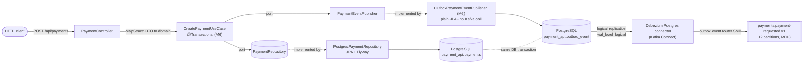

# payment-api (M3 - first producer)

Entry point for the pipeline. Accepts `POST /api/payments` over REST, persists the payment to
PostgreSQL, and publishes a `payments.payment-requested.v1` event to Kafka.

This is the only service that accepts synchronous REST traffic from outside the system
(ADR-0004); everything downstream is event-driven.

## Kafka concepts demonstrated

- `ProducerRecord` key vs value, and why the key determines the partition
- `acks` (0 / 1 / all) and the durability-vs-latency trade-off - measured below
- `enable.idempotence` and the constraints it silently imposes on `acks` and
  `max.in.flight.requests.per.connection`
- Batching: `linger.ms`, `batch.size`, `compression.type`
- Async send with a callback reporting partition and offset
- `min.insync.replicas` as the setting that gives `acks=all` its meaning

## Architecture



`KafkaPaymentEventPublisher` (`adapters/out/kafka`) is the M3 adapter that used to sit where
`OutboxPaymentEventPublisher` sits now - it still compiles and is still documented below for
comparison, but it carries no `@Component` annotation any more, so Spring never wires it in. Ask
the same question of any hexagon: "which adapter is Spring actually instantiating for this port?"
- for `PaymentEventPublisher` today, the answer is `OutboxPaymentEventPublisher`, and there is a
single implementation in the application context, not two competing ones.

The `domain/` package depends on nothing but the JDK. `HexagonalArchitectureTest` (ArchUnit)
fails the build if a Spring, Kafka, or JPA import ever appears there.

## Topics

| Topic | Key | Partitions | RF | min.insync.replicas | cleanup.policy | Retention |
|---|---|---|---|---|---|---|
| `payments.payment-requested.v1` | `paymentId` | 12 | 3 | 2 | delete | 7 days |

Keyed by `paymentId`, not `merchantId` - see ADR-0003. One event per aggregate means ordering
within the key is vacuous here, so the key is chosen to spread load evenly and avoid serializing
a large merchant behind a single partition.

## How to run

The compose stack from `infra/compose` must be running first, including `kafka-connect` with the
outbox connector registered (M6) - otherwise payments still get created and their outbox rows
still get written, they just never reach Kafka until the connector is up.

```bash
cd infra/compose && docker compose up -d && ./create-topics.sh && ./register-connector.sh
mvn -pl services/payment-api -am package
java -jar services/payment-api/target/payment-api.jar --spring.profiles.active=docker-compose
```

Listens on **8085**. Ports 8080 (AKHQ) and 8081 (Schema Registry) are taken by the compose stack.

```bash
curl -X POST http://localhost:8085/api/payments \
  -H 'Content-Type: application/json' \
  -d '{"merchantId":"merchant-acme","amount":49.99,"currency":"EUR"}'
```

## Prove it

### 1. End-to-end

`POST` returns `201` and the event lands on the topic keyed by the payment id:

```
HTTP 201  {"id":"1cc464e6-0a88-4365-9312-567ca70e1362","merchantId":"merchant-acme",
           "amount":49.99,"currency":"EUR","status":"CREATED"}

postgres> 1cc464e6-0a88-4365-9312-567ca70e1362|merchant-acme|49.9900|EUR|CREATED

kafka>    1cc464e6-0a88-4365-9312-567ca70e1362 | KEY={"envelope":{...,"eventId":"019fe41d-9de2-7d79-...",
          "eventType":"payments.payment-requested.v1","aggregateId":"1cc464e6-...","source":"payment-api"},
          "paymentId":"1cc464e6-...","merchantId":"merchant-acme","amount":49.99,...}
```

The Kafka message key equals the payment id, as ADR-0003 requires.

### 2. acks throughput comparison

10,000 records at 512 bytes, `linger.ms=5`, `batch.size=16384`, against the 3-broker cluster:

| acks | enable.idempotence | Throughput | Avg latency | p99 | Max |
|---|---|---|---|---|---|
| 0 | false | 58,480 rec/s (28.6 MB/s) | 9.6 ms | 29 ms | 92 ms |
| 1 | false | 61,350 rec/s (30.0 MB/s) | 16.4 ms | 26 ms | 99 ms |
| all | true | 52,632 rec/s (25.7 MB/s) | 26.4 ms | 48 ms | 100 ms |

**Durability costs latency, not throughput.** Average latency nearly triples from `acks=0` to
`acks=all` while throughput moves less than 15% - and `acks=1` even edges out `acks=0` within
noise. The brokers are containers on loopback, so replication is nearly free; on real network
hardware the throughput gap widens considerably. Don't quote these throughput numbers as if
they generalise - quote the latency shape.

`acks=0` and `acks=1` required `enable.idempotence=false`. Modern Kafka defaults idempotence to
true, and idempotence *requires* `acks=all` - the producer refuses to start otherwise. That
constraint is the point: you cannot have idempotent production without full acknowledgement.

### 3. Leader-kill data loss (the important one)

Single-partition RF=3 topic, 60,000 records at 3,000/s, leader stopped ~8s into the run.

**Under `acks=1`, `min.insync.replicas=1`, `retries=0`:**

```
producer reported : 59,984 records sent
actually durable  : 59,358 records
LOST              :    626 records
leader failover   : kafka2 -> kafka3,  Isr: 3,1
```

**626 records the producer was told were written, which no longer exist.** No error, no
exception, no signal. The leader acknowledged them, died before its followers replicated them,
and the new leader never had them. A payment system on `acks=1` loses transactions and reports
success while doing it.

**Under `acks=all`, `min.insync.replicas=2`:**

```
producer reported : 60,000 records sent
actually durable  : 60,000 records
LOST              :      0 records
leader failover   : kafka3 -> kafka1,  Isr: 1,2
latency during failover: max 692 ms, p99 513 ms  (vs max 101 ms, p99 3 ms under acks=1)
```

The 692 ms spike *is* the leader election - producers block until a new leader is elected and
the write can be acknowledged by two replicas. Half a second of stall in exchange for never
silently losing a payment.

### Why `min.insync.replicas=2` is the setting that matters

`acks=all` alone means "all *in-sync* replicas", which is a hollow guarantee: if the ISR has
shrunk to just the leader, `acks=all` silently degrades to `acks=1`. `min.insync.replicas=2`
forces the broker to reject the write instead of accepting it into a single-replica ISR.

In the drill above the ISR shrank from 3 members to 2 and still met the floor, so writes
continued safely. Had a second broker failed, the producer would have received
`NotEnoughReplicasException` - failing loudly rather than losing data quietly.

## M6 - Transactional outbox

### The problem this fixes

Through M3-M5, `CreatePaymentUseCase.execute()` did two things with no shared transaction:
commit the payment row to Postgres, then call Kafka. A crash between those two lines left the
payment durably persisted while `payments.payment-requested.v1` never received the event - no
error, no retry, no trace. That is the **dual-write problem**: whenever a single business
operation must durably affect two different systems (here, a relational database and a Kafka
topic), there is no way to make an ordinary two-step write atomic across both. Either step can
succeed while the other fails, and a network partition or process crash between the two turns
"this payment happened" into a permanent lie the rest of the system never hears about.

### The fix: transactional outbox

The outbox pattern turns the two-system problem into a one-system problem: instead of writing to
Postgres *and* Kafka, `CreatePaymentUseCase.execute()` (now `@Transactional`) writes to Postgres
*twice* - the `payments` row and a new `outbox_event` row - in the **same** database transaction.
Postgres already gives that write atomicity for free (either both rows commit or neither does),
so there is no longer a window where the payment exists without its event. The `outbox_event`
row is not "the event" in the sense of something a consumer reads directly; it is a durable,
transactional *record of intent to publish*, sitting in the same database as the fact it
describes.

Publishing to Kafka happens later, out of process, by tailing that table - see
`adapters/out/outbox/OutboxPaymentEventPublisher` (implements the existing `PaymentEventPublisher`
port; only the adapter changed, not the port) and
`db/migration/V2__create_outbox_event_table.sql`. `KafkaPaymentEventPublisher` (M3) is kept in the
codebase for reference but is no longer a Spring bean - nothing on the POST path talks to Kafka.

### Kafka Connect architecture: worker, connector, task, converter

"Kafka Connect" is a small stack of distinct concepts, all visible in
`infra/compose/docker-compose.yml`'s `kafka-connect` service and
`infra/compose/connect/payment-outbox-connector.json`:

- **Worker** - the JVM process itself (the `kafka-connect` container, `debezium/connect` image).
  A worker can run many connectors; this stack runs one, in *distributed* mode (the production
  mode - a `group.id`-coordinated cluster that happens to have exactly one member here), which is
  why it needs three bookkeeping topics of its own (`connect.configs`, `connect.offsets`,
  `connect.status` - config for compaction-friendly single-partition storage, offsets and status
  for the actual per-connector state). The worker creates these itself via its embedded
  AdminClient on first start, which is why they are deliberately absent from `create-topics.sh`.
- **Connector** - the logical job, registered via the REST API
  (`infra/compose/register-connector.sh` POSTs/PUTs `payment-outbox-connector.json`), specifying
  *what* to capture (`io.debezium.connector.postgresql.PostgresConnector`, pointed at the
  `payment_api` database and `outbox_event` table) and *how* to transform/route it (the SMT
  chain, below). A connector doesn't move data itself - it's a config object plus a factory for
  tasks.
- **Task** - the actual unit of execution the connector's config produces (`tasks.max=1` here,
  since Debezium's Postgres connector is inherently single-task: one logical replication slot,
  one ordered WAL stream, no way to parallelize within one source database). The REST API's
  `/connectors/<name>/status` endpoint reports connector state and per-task state separately -
  a connector can be `RUNNING` while its one task is `FAILED`, which is exactly what happened
  during verification (see "Compromises" below) and is why `register-connector.sh` checks both.
- **Converter** - the (de)serialization layer between Connect's internal `Struct`/schema
  representation and the bytes actually written to Kafka. This connector uses
  `key.converter=StringConverter` (the key is plain-text `paymentId`, matching ADR-0003 and what
  `StringSerializer`/`StringDeserializer` already used) and
  `value.converter=JsonConverter` with `schemas.enable=false` - critical, because `true` wraps
  every value in `{"schema":...,"payload":...}`, which is not what `psp-connector`'s
  `JsonDeserializer` expects.

### What the outbox event router SMT does

An SMT (Single Message Transform) is a small, chainable function Connect applies to every record
between the connector and the converter. `io.debezium.transforms.outbox.EventRouter`
(`transforms.outbox.type` in the connector config) is the one SMT that makes the outbox pattern
work instead of just leaking raw CDC noise onto a topic. Line by line:

| Config key | What it does |
|---|---|
| `table.field.event.id` = `id` | The outbox row's primary key becomes the event's identity (a Kafka header) - and since `OutboxPaymentEventPublisher` sets this column to `envelope.eventId()`, the outbox row's own PK *is* the ADR-0002 idempotency key, not a second independent id. |
| `table.field.event.key` = `aggregate_id` | Sets the **Kafka record key** from this column. `aggregate_id` is the payment id, so the emitted record is keyed by `paymentId` - ADR-0003, unchanged from the retired direct-publish path. |
| `table.field.event.payload` = `payload` | Names the column holding the JSON to republish. |
| `table.expand.json.payload` = `true` | Parses that JSON column (rather than treating it as an opaque string) and promotes its top-level fields (`envelope`, `paymentId`, `merchantId`, `amount`, `currency`, `status`) to be the **entire** outgoing record value - no `outbox_event`-table metadata (id/aggregate_type/created_at) leaks into the payload. Without this flag the router would just forward the raw JSON *string*, which a schemas-disabled `JsonConverter` would then re-encode as a quoted JSON string literal - double-encoded and unreadable by a plain `JsonDeserializer`. |
| `route.by.field` = `aggregate_type` | Chooses which column decides the destination topic. |
| `route.topic.replacement` = `payments.payment-requested.v1` | The literal destination topic - hardcoded rather than templated from `${routedByValue}` because this outbox table currently carries exactly one event type; a second event type sharing this table would need this to become a real per-row mapping. |
| `table.fields.additional.placement` = `event_type:header:eventType` | Copies the `event_type` outbox column onto a Kafka header (`eventType`) without touching the value - a bonus for AKHQ/DLQ triage, mirroring ADR-0002's header-duplication convention (`psp-connector` doesn't read this header; it only reads the value). |

Two settings intentionally do **not** appear, and both were removed for a reason discovered
during verification (see "Compromises"):

- `table.field.event.timestamp` - would set the Kafka record's timestamp metadata from a table
  column, but `EventRouterDelegate` requires that column to be a Connect `INT64` schema, and a
  Postgres `TIMESTAMPTZ` column decodes as a `ZonedTimestamp` string, not an int64. Omitting it
  only affects the record's *transport* timestamp; `envelope.occurredAt` inside the JSON value
  (what everything downstream actually reads) is unaffected.
- `heartbeat.interval.ms` - Debezium's optional periodic "I'm still here" record, written to an
  auto-created `__debezium-heartbeat.<topic.prefix>` topic. With
  `auto.create.topics.enable=false` cluster-wide (deliberate, M2), that topic can never be
  auto-created, so the heartbeat producer failed on every attempt - and that repeated failure
  reliably killed and restarted the task roughly once a minute (visible as a repeating
  `No previous offsets found` in `docker compose logs kafka-connect`). Not needed for a
  single-table, low-volume learning stack; deferred rather than fixed by pre-creating the topic.

### How this changes the delivery guarantee

**Before (M3-M5):** effectively **at-most-once** across the payment-to-event boundary. The
Kafka producer itself is `acks=all`/idempotent once a send is attempted, but the *attempt*
depended on the process surviving between the Postgres commit and the `kafkaTemplate.send()`
call. A crash there was silent, permanent data loss for that one event.

**After (M6):** **at-least-once**, and the loss mode above is closed. The payment row and the
outbox row commit together or not at all - there is no crash window between them any more.
Debezium then guarantees at-least-once delivery from that committed row to Kafka: it reads the
Postgres write-ahead log via a logical replication slot (`pg_replication_slots`), which is itself
durable - the slot retains WAL until Debezium confirms it flushed a position, so a Connect/worker
crash just means it resumes from the last confirmed LSN on restart, replaying (not skipping)
anything unflushed. "At-least-once" is the honest ceiling, not "exactly-once": a crash between
Kafka accepting a record and Debezium/Connect durably committing its own offset can redeliver
that same outbox row once more on restart. `psp-connector`'s M5 idempotency table is what turns
that at-least-once delivery into an exactly-once *effect* - the outbox pattern's contribution is
guaranteeing the event is never silently dropped, not deduplicating it (that was already true
before M6, and stays true after).

### Verified end-to-end

Captured against the real compose stack (`wal_level=logical`, `kafka-connect` up, connector
`payment-outbox-connector` `RUNNING`), not hand-written:

```
$ curl -X POST http://localhost:8085/api/payments -d '{"merchantId":"merchant-m6-final","amount":250.00,"currency":"GBP"}'
HTTP 201 {"id":"8524d9b7-8de0-4100-ad2a-6c7a63dc204c","merchantId":"merchant-m6-final",...}

postgres> SELECT * FROM outbox_event WHERE aggregate_id = '8524d9b7-...';
  aggregate_type=payment  aggregate_id=8524d9b7-8de0-4100-ad2a-6c7a63dc204c
  event_type=payments.payment-requested.v1
  payload={"amount":250.00,"status":"CREATED","currency":"GBP","envelope":{...},"paymentId":"8524d9b7-...","merchantId":"merchant-m6-final"}

kafka-console-consumer --topic payments.payment-requested.v1 --print-key --print-headers:
  HEADERS: id:019fedb7-eae8-7360-89d6-5fb3891b9a53,eventType:payments.payment-requested.v1
  KEY:     8524d9b7-8de0-4100-ad2a-6c7a63dc204c
  VALUE:   {"amount":250.0,"status":"CREATED","currency":"GBP",
            "envelope":{"source":"payment-api","eventId":"019fedb7-eae8-7360-89d6-5fb3891b9a53",
              "traceId":"f60163d6-1aaa-4437-9d05-87c0f2818f6d",
              "eventType":"payments.payment-requested.v1","occurredAt":1.786399681256336E9,
              "aggregateId":"8524d9b7-8de0-4100-ad2a-6c7a63dc204c","eventVersion":1,
              "aggregateType":"payment","correlationId":"f60163d6-1aaa-4437-9d05-87c0f2818f6d"},
            "paymentId":"8524d9b7-8de0-4100-ad2a-6c7a63dc204c","merchantId":"merchant-m6-final"}
```

Key = `paymentId` (ADR-0003, unchanged). Value has the exact `PaymentRequested`/
`PaymentRequestedEvent` shape both `payment-api` and `psp-connector` already agree on (ADR-0002)
- `envelope{eventId,eventType,eventVersion,aggregateId,aggregateType,occurredAt,source,traceId,
correlationId}` plus `paymentId,merchantId,amount,currency,status` at the top level. One
difference from the M3-era message: a **root event's `causationId` is now absent from the JSON
entirely** rather than present as an explicit `"causationId":null` - the outbox router's JSON
schema inference can't assign a type to a field whose only observed value is `null`, so it drops
the field rather than emitting it untyped. This does not break anything downstream: Jackson
treats a missing object-typed record component the same as an explicit `null` unless
`FAIL_ON_MISSING_CREATOR_PROPERTIES` is enabled, which neither service does.

That last claim isn't just asserted - it was verified by running the **real, unmodified**
`psp-connector` (not a hand-rolled test consumer) against this exact topic with a fresh consumer
group reading from `latest`, then posting a payment:

```
psp-connector log:
  Consumed payment-requested paymentId=f08d9d6b-0f7c-44ee-a44a-c965365e34e1 merchantId=merchant-m6-psp-verify
  Provider call paymentId=f08d9d6b-... outcome=TIMEOUT providerEventId=85cf6bd2-...
  Consumed payment-requested paymentId=f08d9d6b-... merchantId=merchant-m6-psp-verify   (redelivery)
  Deduplicated payment attempt reason=REPLAY paymentId=f08d9d6b-... inboundEventId=019fedb9-...
    - already processed, skipping attempt-log write and publish, acknowledging normally
```

`psp-connector` deserialized the envelope, called the simulated provider, and - on the redelivery
its own retry logic produced - correctly deduplicated via its M5 idempotency table. Zero
`DeserializationException`s. The M4/M5 consumer needed no changes.

### Crash proof

Measured on the live stack. Rather than trying to hit a millisecond window between commit and
relay, the window is held open deliberately by pausing the connector - which is the same state
the system is in if the Connect worker is down, restarting, or lagging.

```bash
curl -X PUT localhost:8083/connectors/payment-outbox-connector/pause   # hold the relay
for i in $(seq 1 25); do curl -X POST localhost:8085/api/payments ... ; done
pkill -9 -f payment-api.jar                                            # SIGKILL, no graceful shutdown
curl -X PUT localhost:8083/connectors/payment-outbox-connector/resume
```

| Step | Measure | Result |
|---|---|---|
| connector paused | connector state | `PAUSED` |
| 25 payments POSTed | `outbox_event` rows | **25** |
| 25 payments POSTed | events on `payments.payment-requested.v1` | **0** |
| payment-api SIGKILLed | health endpoint | dead, no graceful shutdown, no flush |
| connector resumed | events published | **25** |
| connector resumed | distinct crash-batch events on topic | **25** |

**Every event survived a process that was killed before it published anything - because it never
had to publish anything.** The `-9` matters: there was no shutdown hook, no producer flush, no
chance to drain a buffer. The event's existence was already guaranteed by the same Postgres
transaction that created the payment, and Debezium relayed it from the write-ahead log afterwards.

Contrast with M3-M5 behaviour: the same kill between `commit()` and `kafkaTemplate.send()` left the
payment durably in the database and the event nowhere at all - silently, with the API having
already returned `201`. That is the dual write, and this is what removes it.

Note the guarantee that is *not* provided: this is still at-least-once. Debezium can re-deliver a
relayed row after a worker restart, so consumers must stay idempotent - which is exactly what M5
built into psp-connector, and why its replay proof matters here too.

## Known issues / deferred

- `occurredAt` serialises as an epoch decimal (`1786238574.050447000`) rather than ISO-8601.
  Round-trips correctly in Java but is poor as a cross-language wire format and reads badly in
  AKHQ. Fix when M9 moves the topics to Avro. (M6 note: the outbox payload preserves this exact
  format - `OutboxPaymentEventPublisher` serializes with the same `JacksonUtils.enhancedObjectMapper()`
  Spring Kafka's `JsonSerializer` used, specifically so the wire shape doesn't change out from
  under `psp-connector`.)
- **Dual write - fixed by this module.** M3-M5 committed the payment to Postgres and *then*
  published to Kafka with no shared transaction; a crash between the two silently lost the event.
  M6 replaces that with the transactional outbox pattern documented above - the payment and its
  outbox row now commit atomically, and Debezium (not this process) relays the outbox row to
  Kafka at-least-once.
- **No outbox cleanup job.** `outbox_event` is insert-only from this service's side; nothing
  purges old rows (`idx_outbox_event_created_at` exists for exactly this future job, unused
  today). Fine at learning-cluster scale, a real problem in production over time.
- **`snapshot.mode=no_data`** means rows already sitting in `outbox_event` at the moment the
  connector is first registered are never relayed - only inserts that happen *after* registration
  are captured. This is the deliberate, textbook-correct choice for an outbox connector (an
  initial-data snapshot would replay old rows as Debezium "read" (`op=r`) operations, which the
  outbox event router's default `table.op.invalid.behavior=warn` silently drops anyway, since the
  router is designed around insert-only CDC semantics) - but it does mean the very first payment
  written before `register-connector.sh` has ever run against a fresh outbox table will not be
  relayed. Verification here always registered the connector once, before posting payments.
- Drill topics `drill.acks1-loss` and `drill.acksall` remain in the cluster holding the
  evidence above; delete them once the results are written up.

## Troubleshooting

| Symptom | Cause |
|---|---|
| `Port 8081 was already in use` | Schema Registry owns 8081; this service uses 8085 |
| Producer won't start, complains about `acks` | `enable.idempotence=true` requires `acks=all` |
| Events publish but never appear on the host | Broker `advertised.listeners` - see `infra/compose/README.md` |
| `NotEnoughReplicasException` | Fewer than `min.insync.replicas` brokers in the ISR - a broker is down |
| Payment POSTs succeed, `outbox_event` fills up, but nothing ever appears on `payments.payment-requested.v1` | (M6) Either the connector isn't registered/running (`curl localhost:8083/connectors/payment-outbox-connector/status`) or it was registered against an outbox table that already existed before it started - `snapshot.mode=no_data` only relays rows inserted *after* registration; see "Known issues" |
| Connector `status` shows `connector.state=RUNNING` but `tasks[0].state=FAILED` after fixing the connector config | PUTting a new config does **not** auto-restart an already-FAILED task (a real Kafka Connect gotcha). `register-connector.sh` handles this itself (one automatic restart-and-retry), but a manual `curl -X POST localhost:8083/connectors/payment-outbox-connector/restart?includeTasks=true` is the fix if you're calling the REST API by hand |
| `docker compose logs kafka-connect` full of `Error while fetching metadata ... __debezium-heartbeat.payment-api=UNKNOWN_TOPIC_OR_PARTITION` | Expected if `heartbeat.interval.ms` is ever re-added to the connector config - the heartbeat topic can't auto-create (`auto.create.topics.enable=false` cluster-wide) and the resulting repeated producer failure was observed to restart the task roughly once a minute during verification. Removed from `payment-outbox-connector.json` for exactly this reason |

## M9 - Schemas & evolution (Phase 1: `payments.payment-requested.v1` only)

**Scope.** M9 migrates topics from JSON to Avro + Schema Registry one at a time. Phase 1 migrates
**only** `payments.payment-requested.v1` - both sides: this service's outbox path (producer) and
`psp-connector`'s inbound listener (consumer). `payments.payment-status-changed.v1`, every ledger
and webhook-notifier topic, and `psp-connector`'s own outbound publishing all stay JSON. A later
phase migrates them one at a time, the same way.

**Phase 2 (done, documented elsewhere).** `payments.payment-status-changed.v1`,
`ledger.ledger-entry-recorded.v1`, and the `webhooks.webhook-delivery-requested.*` delivery chain
all moved to Avro in a second pass - this service's own code and topic
(`payments.payment-requested.v1`) are untouched by Phase 2, so the outbox-serialization decision,
wire format, and evolution proof below are still the complete, current story for *this* topic.
Phase 2's own decisions - which topics stayed on their `v1` name vs which one cut a `v2` (ADR-0001's
actual versioned-topic route, exercised for the first time in this project), how each topic's
pre-existing JSON backlog was handled, and the explicit M5/M7 idempotency-key verification - are
written up in services/psp-connector/README.md, services/ledger/README.md, and
services/webhook-notifier/README.md's own "M9 Phase 2" sections, not repeated here.

### The outbox-serialization decision

M6 already established the shape of the problem: this service never calls Kafka - it writes a
Postgres row and Debezium relays it. For the bytes that land on the topic to be valid Confluent
Avro (magic byte + schema id + Avro payload), *something* in the pipeline has to produce that
exact framing, and the outbox's plain-JPA write is the only place that can own it deterministically.
Three options, in the order the task set them:

**(a) - chosen. payment-api Avro-serializes the event itself; the outbox stores the finished wire
bytes; Connect passes them through unchanged (`ByteArrayConverter`).**
`adapters.out.outbox.OutboxPaymentEventPublisher` builds the generated Avro record
(`PaymentAvroEventFactory`) and calls `KafkaAvroSerializer#serialize(topic, record)` -
registering/looking up the schema against Schema Registry and returning the complete wire format
- **before** the Postgres transaction ever starts. Those exact bytes go into
`outbox_event.payload` (now `BYTEA`, see `db/migration/V3__outbox_event_payload_bytes.sql`), and
the Debezium connector's `value.converter` is `org.apache.kafka.connect.converters.
ByteArrayConverter`, which does no interpretation at all - it writes whatever `byte[]` it's
handed straight to the topic. **Chosen because it is the only option where the service that owns
the schema (payment-api) is also the thing that produces the wire bytes** - Connect never makes a
single decision about what those bytes mean.

**(b) - rejected. Keep JSON in the outbox; let Connect's `AvroConverter` serialize.**
This would mean configuring `value.converter=io.confluent.connect.avro.AvroConverter` and letting
the outbox event router's `table.expand.json.payload=true` path parse the JSON payload into a
Connect `Struct`, which `AvroConverter` then encodes. Rejected for three concrete reasons:
1. The Struct's schema would be **inferred from the JSON's shape** by the outbox router, not
   sourced from the hand-authored `.avsc` files in `libs/common-events` - there is no guarantee
   the inferred schema matches (or even resembles) the schema the generated
   `com.example.psp.common.events.avro.PaymentRequested` Java class expects, so `specific.avro.
   reader=true` on the consumer side could not be relied on to work.
2. JSON has no schema of its own to type-check against; `amount` (a `BigDecimal` in the domain
   model) would decode from JSON as a floating-point number and get inferred as `double`, silently
   losing decimal precision - exactly the failure mode ADR-0002 calls out generic/inferred
   payloads for.
3. Compatibility enforcement (this phase's other requirement) would be checking an
   **auto-generated** schema against itself release to release, not the schema this codebase
   actually owns and version-controls.

**(c) - not pursued.** A conceivable third option is a Postgres trigger or a separate polling
process that reads `outbox_event` rows and Avro-encodes them out-of-band, decoupled from the
request path. Not pursued: it reintroduces a second moving part with its own lag and failure mode
for exactly the same amount of work option (a) already does synchronously, for free, inside the
transaction that's already there.

**Compromise this decision costs:** payment-api's write path now makes a synchronous HTTP call to
Schema Registry (inside `KafkaAvroSerializer#serialize`, cached after the first lookup) before
every outbox write. Through M8 this service talked to Postgres only; M9 Phase 1 adds a second
external dependency to the request path. Accepted because Schema Registry is already a required,
always-on part of this stack (M2), and the alternative (b) makes correctness *worse*, not better.

### ADR-0001: does JSON -> Avro require a new topic version (`v2`)?

**Answer: no, and this stays `payments.payment-requested.v1` - not `.v2` - but the reasoning needs
to be explicit, because ADR-0001's rule doesn't cleanly cover this case.**

ADR-0001's breaking-change test is written entirely in terms of the **event's field set and
semantics**, evaluated by Schema Registry's `BACKWARD` compatibility check: "remove/rename a
field, change a type, change semantics of an existing field." The Avro schema in
`libs/common-events/src/main/avro` is **field-for-field identical** to the JSON shape it replaces
- same names, same nesting (`envelope` sub-record + top-level domain fields), same meaning for
every field. Nothing was removed, renamed, retyped in a semantic sense, or reinterpreted. Under
a literal reading of ADR-0001's criteria, there is no breaking change here to trigger a `v2`.

There's a real gap in applying that test, though: **Schema Registry compatibility checking is
format-specific.** `BACKWARD` compatibility compares two Avro schemas (or two Protobuf schemas);
it has no concept of "is this Avro schema backward-compatible with the ad-hoc JSON shape that
preceded it," because before this phase there was no registered schema for this subject at all -
ADR-0002 says as much: JSON-with-no-registry was explicitly the placeholder, written so "migration
[to Avro] is a serializer swap rather than a redesign." ADR-0001's versioning rule presupposes a
Registry-governed schema already exists to be compatible *with*; a wire-format switch from
"ungoverned JSON" to "the first Avro version" precedes that rule rather than triggering it.

So the honest test isn't "does the compatibility checker reject this" (it's not wired up to ask a
cross-format question in the first place) but ADR-0001's *underlying goal*: **can producer and
consumer now deploy independently without one poison-pilling the other?** For a hard cutover on
one topic name, the answer is no, and this phase has direct, measured evidence of exactly that
failure mode - see "Compromises" below: once `psp-connector`'s deserializer flipped to Avro, its
existing consumer group hit ~1,200 `SerializationException: Unknown magic byte!` errors working
through **old JSON-era backlog records still sitting on this topic from M3-M6 verification runs**,
each one correctly caught by `ErrorHandlingDeserializer` and skipped (ADR-0006 category C), not
silently corrupted. That is the precise scenario ADR-0001's `v2`-topic-plus-dual-write mechanism
exists to prevent structurally.

**Why Phase 1 still doesn't cut a `v2` topic, given that evidence:** this is a single learning
cluster with exactly one producer (payment-api) and one consumer group (`psp-connector.v1`), both
changed and deployed together in this one phase - not two independently-released teams, which is
the scenario ADR-0001's dual-write escape hatch is priced for. The disruption is a one-time,
deliberate cutover during a migration window, not an ongoing rolling-deploy hazard between
long-lived independent deployments. A real `v2` topic would additionally require payment-api to
dual-write JSON *and* Avro for a migration window per ADR-0001's own policy - genuine, disproportionate
complexity for a system where nothing is consuming this topic except the one service being upgraded
in lockstep. PLAN.md's M9 brief frames this module as "migrate topics from JSON to Avro... **then**
evolve" - the format cutover is the one-time baseline; ADR-0001's `v1`/`v2` machinery is what
governs the schema **evolution** *after* this baseline (see the placeholder below), which is
exactly the ongoing-independent-deploy scenario it was designed for.

**This is a scale-appropriate simplification, not a refutation of ADR-0001.** A production system
with independently-deployed producers/consumers across teams would need the real `v2`/dual-write
path for this exact migration; a single-cluster, single-consumer learning system does not, and the
old-backlog poison-pill evidence above is presented precisely so this trade-off isn't glossed over.

### Wire format

Every record value on `payments.payment-requested.v1` is now standard Confluent wire-format Avro:

```
byte 0        magic byte, always 0x00
bytes 1-4     schema id, 4-byte big-endian signed int (registry-assigned)
bytes 5..     Avro binary-encoded PaymentRequested record
```

The record **key** is unchanged and NOT Avro-encoded: plain UTF-8 text, the `paymentId` (ADR-0003).
Only the value is Avro on this topic.

**A real record**, captured from the live stack (`docker compose exec kafka1 kafka-console-consumer
--topic payments.payment-requested.v1 --property print.key=true/print.value=true`, output
inspected with `xxd`) for a payment POSTed as `{"merchantId":"merchant-m9-avro-proof-2",
"amount":123.45,"currency":"EUR"}`:

```
KEY   = 0c1b7fc8-639f-4e27-8b8b-627310ba3d98            (plain text paymentId, ADR-0003)

VALUE (first 32 bytes, hex):
00 00 00 00 01 48 30 31 39 66 66 32 30 64 2d 32
36 36 30 2d 37 61 31 30 2d 38 61 64 32 2d 33 36
```

Byte-by-byte:
- `00` - magic byte.
- `00 00 00 01` - schema id **1** (matches the registered subject below - confirmed by fetching
  `GET /subjects/payments.payment-requested.v1-value/versions/latest`, which returns `"id": 1`).
- `48 30 31 39 66 66 32 30 64 2d ...` - the Avro binary payload starts: `0x48` is a zigzag varint
  length prefix (`0x48` = 72 -> zigzag-decoded = 36), followed by exactly 36 bytes:
  `019ff20d-2660-7a10-8ad2-36128ee43a97` - `envelope.eventId` (a UUIDv7 string), the first field in
  schema order. Continuing through the same record: `eventType` = `"payments.payment-requested.v1"`,
  `eventVersion` = `1` (single zigzag byte `0x02`), `aggregateId` =
  `0c1b7fc8-639f-4e27-8b8b-627310ba3d98` (= the record key, as expected), `aggregateType` =
  `"payment"`, ... down to `amount`, whose 3 raw bytes `12 d6 44` decode as the big-endian
  two's-complement integer `1234500`, and with the schema's `scale=4` that's **123.4500** -
  exactly the `123.45` EUR posted. `status` = `"CREATED"` closes the record. Every field
  cross-checks against the actual POST body and generated envelope - this is not a synthetic
  example.

### Subject naming strategy and compatibility mode

**Subject:** `payments.payment-requested.v1-value` - `TopicNameStrategy` (Schema Registry's
default, and the strategy ADR-0001 already names: "subjects derive as `<topic>-value` /
`<topic>-key` for free"). No `-key` subject exists because the key is plain text, not Avro.

**Compatibility mode: `BACKWARD`, set explicitly** via `infra/compose/register-schemas.sh`
(`PUT /config/payments.payment-requested.v1-value`), run before any producer registers a schema -
not left at whatever the registry's out-of-the-box default happens to be, and not implicit. This
isn't a fresh choice made here: ADR-0001's "Versioning rule" already commits the whole system to
`BACKWARD` ("Schema Registry compatibility is `BACKWARD` ... enforced in M9") - this script is
that commitment actually enforced for the one subject this phase created. `BACKWARD` means a new
schema version must be able to read data written under the previous version, which is what a
rolling deploy needs (a new consumer schema reading old producer data) and is also the compatibility
mode ADR-0001's `v1`/`v2` topic-versioning rule assumes: whatever `BACKWARD` accepts (add an
optional field with a default, widen a doc) evolves the subject in place; whatever `BACKWARD`
would reject (remove/rename/retype a field) is, by that ADR's definition, the breaking change that
gets a new topic instead of a fight with the registry.

### Compromises

- **A real Kafka Connect gap, found and fixed.** With `table.expand.json.payload=false` (payload
  is raw bytes now, not JSON to parse), Debezium represents the `outbox_event.payload` `BYTEA`
  column as `java.nio.HeapByteBuffer`, and Kafka's own
  `org.apache.kafka.connect.converters.ByteArrayConverter#fromConnectData` is strictly
  `instanceof byte[]` - it throws `DataException: ByteArrayConverter is not compatible with
  objects of type class java.nio.HeapByteBuffer` on anything else. This is a known, empirically-confirmed
  Kafka Connect limitation, not a bug in this design - no Debezium or Connect config flag changes
  the representation. Fixed with a tiny one-purpose Single Message Transform,
  `infra/compose/connect/plugins/outbox-bytebuffer-smt` (`com.example.psp.connect.smt.
  ByteBufferToBytes`), chained after the outbox router
  (`"transforms": "outbox,byteBufferFix"`) - it unwraps `ByteBuffer` -> `byte[]` and nothing else.
  Compiled against the exact `connect-api`/`connect-transforms`/`kafka-clients` jars bundled in the
  running `debezium/connect:2.7.3.Final` image, mounted read-only as its own plugin directory
  (`docker-compose.yml`'s `kafka-connect.volumes`), same convention as the built-in
  `debezium-connector-*` plugin directories already in that image.
- **Old JSON backlog becomes poison pills, by design of the cutover.** See the ADR-0001 section
  above - `psp-connector`'s `ErrorHandlingDeserializer` correctly classifies old JSON records
  (pre-M9 verification runs still on this topic) as non-retryable deserialization failures and
  skips them (ADR-0006 category C), rather than looping or crashing. Confirmed live: ~1,200 such
  skips logged working through the backlog before the consumer reached the new Avro records.
  Expected and harmless on this learning cluster; on a topic with real retention/consumers this is
  exactly the scenario a `v2` topic exists to avoid.
- **Not a MapStruct boundary, on purpose.** `adapters.out.outbox.PaymentAvroEventFactory` is a
  plain method, not a MapStruct `@Mapper` - the one deliberate exception to this codebase's
  "MapStruct at every boundary" convention. See that class's javadoc for the reasoning (two
  one-line conversions through a generated `Builder`, not worth an annotation-processed interface).
- **`psp-connector`'s `auto-commit-drill` profile (M4) was left on the JSON-era shape.** It has its
  own, separate `ConsumerFactory` (`KafkaAutoCommitDriftConfig`) that was never touched - running
  that drill against the live (now-Avro) topic would poison-pill immediately. Out of Phase 1 scope
  (one topic's *production* consumer, not every experimental listener that ever subscribed to it);
  flagged in that class's javadoc for whoever revives the drill later.
- **`outbox_event` was truncated**, not migrated in place, by
  `db/migration/V3__outbox_event_payload_bytes.sql` - existing rows held JSON text under the old
  M6 shape, which isn't a valid `bytea` value. Fine for a throwaway learning-cluster table with no
  existing cleanup job (see the M6 section's "Known issues").

### Schema evolution proof

Measured against the live registry, subject `payments.payment-requested.v1-value` (schema id 1,
`BACKWARD`), using the compatibility endpoint rather than a deploy, so the registry's own verdict
and message are the evidence:

```bash
curl -X POST -H 'Content-Type: application/vnd.schemaregistry.v1+json' \
  --data '{"schema": "...", "schemaType": "AVRO"}' \
  'localhost:8081/compatibility/subjects/payments.payment-requested.v1-value/versions/latest?verbose=true'
```

| Change | Verdict under `BACKWARD` | Registry's reason |
|---|---|---|
| add optional field (`["null","string"]`, default `null`) | **COMPATIBLE** | - |
| add required field (`string`, no default) | **REJECTED** | `READER_FIELD_MISSING_DEFAULT_VALUE` - "the field 'settlementCurrency' in the new schema has no default value" |
| remove field `currency` | **COMPATIBLE** | - |
| rename `merchantId` -> `merchantIdentifier` | **REJECTED** | `READER_FIELD_MISSING_DEFAULT_VALUE` - "the field 'merchantIdentifier' in the new schema has no default value" |

**The rename rejection is the one worth understanding.** Its error is *identical* to the
add-required-field case, and that is not a coincidence: Avro has no concept of renaming. It sees a
field that vanished and a different field that appeared without a default, so a new reader handed
old data has nothing to put in `merchantIdentifier`. A rename is an add and a remove wearing a
trench coat. To rename safely you add the new field with a default, dual-write both, migrate
consumers, then drop the old one - four deploys, not one.

**`BACKWARD` means "new reader can read old data", which is a deployment-order policy, not a
property of the change.** The same removal flips verdict depending on the mode:

| Change | `BACKWARD` | `FORWARD` | `FULL` |
|---|---|---|---|
| remove field `currency` | COMPATIBLE | **REJECTED** | **REJECTED** |
| add optional field (with default) | COMPATIBLE | COMPATIBLE | COMPATIBLE |

Under `FORWARD` the rejection reads "the field 'currency' **in the old schema** has no default
value" - note *old*, where the `BACKWARD` failures said *new*. That single word is the whole
distinction. `BACKWARD` protects consumers you upgrade first: a new reader must cope with old data,
so it may drop fields but must not demand new ones. `FORWARD` protects producers you upgrade first:
an old reader must cope with new data, so you may add fields but must not remove ones it still
requires. `FULL` demands both and is the only mode under which you can deploy producers and
consumers in any order.

`BACKWARD` is the right default here because consumers in this system are upgraded first, and it is
also Schema Registry's default - but the reason to keep it should be that ordering policy, not
inertia.

**The one change that is always safe, in every mode, is adding a field with a default.** That is
the entire practical takeaway: if you want schema changes that never coordinate a deploy, only ever
add optional fields.

A caveat this migration surfaced empirically: compatibility checking is *format-specific* and does
not apply where no schema exists yet. Cutting `payments.payment-requested.v1` from JSON to Avro
in place left ~1,200 old JSON records on the topic, which the Avro consumer met with
`Unknown magic byte!` - the registry could not have warned about that, because JSON records carry
no schema id to check. See the topic-versioning discussion above.

---

## M10 - Merchant config: the compacted-topic command surface

M10 adds a second REST surface to this service:

```
PUT    /api/merchants/{merchantId}/config   -> a VALUE     on merchants.merchant-config-changed.v1
DELETE /api/merchants/{merchantId}/config   -> a TOMBSTONE on merchants.merchant-config-changed.v1
```

payment-api owns this API because ADR-0004 puts every command that enters the system on this
service's REST surface, and because this service already is the only externally-reachable one.
Everything downstream reads the topic — analytics as a `GlobalKTable` (services/analytics), and
psp-connector / webhook-notifier / ledger in later modules.

`merchants.merchant-config-changed.v1` is **Avro** as of M10. docs/diagrams/topic-map.md said it
"stays JSON until its module is built" — M10 *is* that module, so it is born Avro rather than
migrated later. Subject `merchants.merchant-config-changed.v1-value`, `BACKWARD`, set by
`infra/compose/register-schemas.sh` before the first `PUT` registers version 1. Schema:
`libs/common-events/src/main/avro/06-merchant-config-changed.avsc`.

### Why this write path does NOT use the M6 outbox

The outbox exists to solve the **dual-write problem**: `POST /api/payments` performs two writes
(the `payments` row and the event) that must commit atomically, so the event becomes a row in the
same Postgres transaction and Debezium relays it later.

This path has **one** write. There is no `merchant_config` table and there is not going to be
one: the compacted topic *is* the system of record — `cleanup.policy=compact` guarantees the last
value for every key is retained forever, which is exactly the durability contract a key/value
table gives you. "Persist the config" and "publish the event" are the same act. With nothing to
be atomic *with*, an outbox row would add a second store that then has to be reconciled against
the topic; it would create the consistency problem it exists to solve.

Three further reasons, all verifiable in this repo:

1. **The outbox physically cannot carry a tombstone as built.**
   `db/migration/V2__create_outbox_event_table.sql` declares `payload … NOT NULL`, and `V3`
   retypes it `BYTEA` — still `NOT NULL`. Debezium's `EventRouter` only emits a null-valued
   record when `route.tombstone.on.empty.payload=true`, which
   `infra/compose/connect/payment-outbox-connector.json` does not set. Supporting `DELETE`
   through the outbox means a schema migration **plus** a connector reconfiguration, to reach a
   record shape a two-line `KafkaTemplate.send(topic, key, null)` produces directly.
2. **The single connector is hard-wired to one topic.** It sets
   `"transforms.outbox.route.topic.replacement": "payments.payment-requested.v1"` — a literal,
   not `${routedByValue}`. Routing a second aggregate type through it means editing and
   re-registering the live connector that carries M6's and M9 Phase 1's end-to-end evidence, for
   a feature that does not need it.
3. **The failure mode the outbox protects against does not arise.** If the send fails, nothing
   committed anywhere; the caller gets a 500 and retries the `PUT`. Compaction makes that retry
   free — the operation is a whole-state upsert under a fixed key, so replaying it N times
   converges on the same last value. The outbox is for writes the caller *cannot* safely re-drive
   because a local row already committed.

**What is given up:** the send is a real network call inside the request (blocking, 10 s timeout,
`KafkaMerchantConfigPublisher`), so a broker outage surfaces as a failed HTTP call rather than a
queued row. That is the right trade here — a config change the operator believes succeeded but
which never reached the topic would be worse than an honest 5xx.

### Tombstones: a null value, not a `deleted` flag

`DELETE` publishes a record with the merchant's key and a **`null` value**. Nothing else. This is
not a stylistic choice and a flag is not an equivalent design; the null is load-bearing in three
separate places at once.

1. **The broker's log cleaner.** Compaction's contract is "retain *at least the last value* for
   each key". The only way to make it retain *nothing* for a key is to hand it a record that has
   no value. A `deleted=true` record **is** a value, so compaction keeps it forever and the log
   never shrinks by one byte — you have built a table that can only grow.
2. **Kafka Streams.** A `KTable`/`GlobalKTable` deletes its row when it sees a null value, so a
   lookup afterwards returns `null` with **zero** consumer-side code. With a flag, every consumer
   in the fleet must remember to check it — a rule that is one new consumer away from being
   forgotten, and whose failure is silent (a deleted merchant looks active).
3. **The ecosystem.** Connect sinks, ksqlDB, the MongoDB sink in M13 — all already agree that
   null means delete. It is the only portable delete signal there is.

Consequences that follow from that, visible in the code:

- **The Avro schema has no `deleted` field and `MerchantStatus` has no `DELETED` constant.**
  `SUSPENDED` exists because a suspension genuinely *is* a state — the config still exists and
  downstream services should still see it. Deletion is not a state.
- **A tombstone never touches Schema Registry.** `KafkaAvroSerializer#serialize(topic, null)`
  returns `null` immediately — no magic byte, no schema id, zero bytes of value — so the record
  is never validated against (and never registers) a schema. The registered subject governs the
  `PUT` shape only.
- **The ADR-0002 header duplication stops being a convenience and becomes necessary.** A
  tombstone has no value, so there is nowhere else for provenance to live;
  `KafkaMerchantConfigPublisher` writes `event-id` / `event-type` / `aggregate-id` as headers on
  both record shapes, and for a tombstone they are the only trace of who deleted what and when.
- **`DELETE` returns `202 Accepted`, not `204 No Content`.** The tombstone is durably on the
  topic when the method returns, but "the key is gone" is not yet true *anywhere*: the cleaner
  has not run, downstream `GlobalKTable`s may not have consumed it, and the tombstone itself
  lingers for `delete.retention.ms`. 202 states that honestly; 204 would claim a completed
  deletion that has, at that instant, deleted nothing.

### `PUT`, not `PATCH` — whole-state snapshots

Compaction keeps the **last record** per key and discards everything before it, so a consumer
that starts reading at a compacted offset sees exactly one record per merchant and must be able
to reconstruct the whole configuration from it alone. A partial update would leave that consumer
missing the fields the discarded records carried. So every field except `webhookUrl` is required,
and a "just change the webhook URL" edit re-sends everything. `PATCH` would also have to read the
current value to merge into — and the only place that value lives is the topic itself, which
ADR-0004 forbids reading over service-to-service REST.

There is deliberately no `GET` here either, for the same reason: the services that need merchant
config already hold it. analytics exposes it at
`GET /api/analytics/merchants/{merchantId}/config` (port 8089), read straight out of its
`GlobalKTable`.

### The compaction settings that matter

Applied by `infra/compose/create-topics.sh` through `kafka-configs --alter` (note: `kafka-topics
--create --if-not-exists` never alters an existing topic's configs, and this topic has existed
since the M2 baseline). Verified on the live cluster:

```
cleanup.policy            = compact          (default for this cluster: delete)
min.cleanable.dirty.ratio = 0.1              (broker default 0.5)
delete.retention.ms       = 60000            (broker default 86400000 = 24 h)
segment.ms                = 60000            (broker default 604800000 = 7 d)
segment.bytes             = 1048576          (broker default 1073741824 = 1 GiB)
max.compaction.lag.ms     = 60000            (broker default Long.MAX_VALUE)
retention.ms              = -1               (infinite)
```

| Setting | What it does | Why this value |
|---|---|---|
| `cleanup.policy=compact` | Retain at least the last value per key, forever, instead of deleting whole segments by age. | This is what makes the topic a durable key/value table, and what makes a `GlobalKTable`'s bootstrap `O(merchants)` rather than `O(config changes)`. |
| `min.cleanable.dirty.ratio` | The cleaner only picks a partition once `dirty_bytes / total_bytes` exceeds this. | At the 0.5 default, **half** the log must be obsolete before anything is cleaned — on a low-volume config topic, that can be *never*. 0.1 makes the tombstone drill finish. Aggressive on purpose; cleaning is CPU + IO, and production values trade promptness for that. |
| `delete.retention.ms` | How long a **tombstone** is kept after the cleaning pass that could have removed it. | The answer to "why is my tombstone still there?". See below. |
| `segment.ms` / `segment.bytes` | When the broker rolls a new log segment. | See below — this is the setting that decides whether compaction happens *at all*. |
| `max.compaction.lag.ms` | Upper bound on how long a dirty record may go uncompacted, regardless of dirty ratio. | Belt and braces: forces the cleaner onto a nearly-idle partition that `min.cleanable.dirty.ratio` alone would leave forever. |

**Why a tombstone is not removed immediately.** It must not be. Compaction could physically drop
a null-valued record the moment it cleans, but then a consumer that is *behind* — or a
`GlobalKTable` bootstrapping for the first time — would read the log, never see the delete, and
keep the row forever. `delete.retention.ms` is the promise "any consumer that catches up within
this window will observe the deletion". So a tombstone lives through two phases: first it is the
key's last value (and compaction preserves it like any last value), then, once cleaned, it
survives a further `delete.retention.ms` before disappearing. 24 h is the production-safe answer
to "how far behind may a consumer be". The 60 s here is chosen to make the drill watchable and is
exactly the wrong value for a real cluster.

**Why the active segment is never compacted.** The log cleaner rewrites closed segments into new
ones. The **active** segment — the one the broker is currently appending to — cannot be rewritten
in place: its end offset is still moving, and producers hold it open. So the cleaner skips it,
always. The consequence bites immediately on a low-volume topic: with the 7-day default
`segment.ms`, every record this topic will ever receive sits in the active segment, nothing is
ever eligible, and compaction appears completely broken no matter what `cleanup.policy` or the
dirty ratio say. **This is the single most common "compaction doesn't work" cause.** Rolling a
new segment every 60 s (or 1 MiB, whichever comes first) is what makes records eligible here. The
cost is many small segments: more open file handles, more index files, more cleaner passes.

`retention.ms=-1` alongside `cleanup.policy=compact` is not redundant belt-and-braces — a topic
*can* be `compact,delete` (Kafka Streams' own windowed changelogs are exactly that, see
services/analytics/README.md), where compaction keeps the last value per key *and* whole old
segments still age out. Setting `-1` here says: never age anything out, compaction is the only
cleanup.

### Where it lives

```
adapters/in/web/     MerchantConfigController, UpsertMerchantConfigRequest,
                     MerchantConfigResponse, MerchantConfigWebMapper
application/         MerchantConfigUseCase, UpsertMerchantConfigCommand
domain/model/        MerchantConfig, MerchantStatus
domain/port/         MerchantConfigPublisher          <- the outbox-vs-direct reasoning lives here
adapters/out/kafka/  KafkaMerchantConfigPublisher, MerchantConfigAvroEventFactory
config/              MerchantConfigKafkaConfig        <- its own ProducerFactory/KafkaTemplate
```

`MerchantConfigUseCase` carries **no** `@Transactional` and **no** repository port, in deliberate
contrast to `CreatePaymentUseCase`. There is no local write to be atomic with; annotating it
would open a Postgres transaction that does nothing and, worse, would suggest to a reader that
the Kafka send participates in it.

`MerchantConfigKafkaConfig` builds a **separate** `ProducerFactory`/`KafkaTemplate` rather than
reconfiguring `KafkaProducerConfig`'s: that one still carries `application.yml`'s
`value-serializer: JsonSerializer` for the retired M3 adapter, and flipping it globally would
silently change what that class does if it were ever re-enabled. Everything else — `acks=all`,
`enable.idempotence`, retries, batching, compression — is inherited from the same
`KafkaProperties` block, so this producer's durability behaviour is identical to the rest of the
system's by construction.

**Idempotence and ordering matter more here than on a delete-policy topic.**
`enable.idempotence=true` plus `max.in.flight.requests.per.connection<=5` (ADR-0003's global
defaults) give per-partition ordering across retries. Compaction resolves a key to its **last**
record by offset, so a retry that lands out of order does not merely deliver events out of
sequence — it permanently installs the wrong value, including resurrecting a merchant whose
tombstone was overtaken by a re-sent update.

### Proof (live cluster)

```
$ curl -X PUT localhost:8085/api/merchants/acme-001/config -H 'Content-Type: application/json' \
    -d '{"displayName":"ACME Corp","status":"ACTIVE","payoutCurrency":"EUR",
         "webhookUrl":"https://acme.test/hooks","declineRateAlertThresholdBps":1500}'
HTTP 200
{"merchantId":"acme-001","displayName":"ACME Corp","status":"ACTIVE","payoutCurrency":"EUR",
 "webhookUrl":"https://acme.test/hooks","declineRateAlertThresholdBps":1500}

# read back out of analytics' GlobalKTable over the compacted topic - a different process,
# a different database, no service-to-service REST
$ curl -s localhost:8089/api/analytics/merchants/acme-001/config
{"merchantId":"acme-001","displayName":"ACME Corp","status":"ACTIVE","payoutCurrency":"EUR",
 "webhookUrl":"https://acme.test/hooks","declineRateAlertThresholdBps":1500}
```

#### Tombstone proof

<!-- PLACEHOLDER - run by the orchestrator, not by this module's implementation.
     DELETE /api/merchants/acme-001/config (expect 202), then show:
       (a) the record on merchants.merchant-config-changed.v1 has a NULL value - e.g.
           kafka-console-consumer --property print.key=true --property print.value=true
           --from-beginning, where the tombstone prints as "acme-001<TAB>null",
       (b) GET /api/analytics/merchants/acme-001/config flips 200 -> 404 (the GlobalKTable row is
           gone, with no consumer-side flag check anywhere),
       (c) after segment.ms=60000 rolls the active segment and the cleaner runs, the key is gone
           from the log entirely; after a further delete.retention.ms=60000, so is the tombstone. -->

_To be filled in._

---

# M12 - Request-reply over Kafka (requester)

`GET /api/payments/{paymentId}/provider-status`: a synchronous provider-status check for a
payment, over `psp.provider-status-query.v1` -> `psp.provider-status-reply.v1`, correlated by
Kafka header. This service owns the requester side (`ReplyingKafkaTemplate` + the REST endpoint);
`services/psp-connector/README.md`'s M12 section owns the responder (`@SendTo`, reading its own
`payment_attempts` table).

## Addressing ADR-0004 head-on

[ADR-0004](../../docs/adr/0004-sync-async-boundary.md) commits this system to "all inter-service
communication is Kafka events; no service-to-service REST" precisely because a synchronous call
chain fails as a unit, its latency is the sum of its parts, and the caller must know the callee
exists. This endpoint blocks a real HTTP thread on a real network round trip to another service
before it can answer - which is, functionally, exactly the failure mode ADR-0004 exists to avoid.

**It complies with ADR-0004 on the letter**: the wire between the two services is a Kafka topic,
not an HTTP call - `payment-api` never opens a socket to `psp-connector`, never needs to resolve
its address, and psp-connector could be scaled to zero and back without either service's code
changing. **It does not comply with ADR-0004's spirit.** The whole point of the async design is
that a downstream outage produces consumer lag, not a cascade of failures visible to a caller
right now. This endpoint reintroduces exactly the coupling that design avoids: if psp-connector is
down, this call does not degrade gracefully into "eventually consistent" - it blocks for up to the
configured timeout and then fails, in real time, in front of whoever is waiting on it. ADR-0004
says this plainly: *"The request-reply path (M12) reimplements, badly, what HTTP gives for free.
Accepted for its teaching value; it is used exactly once."*

**When this pattern is worth it, and when it is a REST call wearing a costume:**

- **Worth it**: the caller has no working alternative to "ask and wait" - there is no local read
  model to fall back on, the answer is needed for a decision that cannot be deferred (a human
  operator staring at a screen, a synchronous API contract this service does not control), and the
  call is genuinely rare (this is not a hot path - the reply topic's 1-hour retention and this
  being the only `ReplyingKafkaTemplate` in the whole system both signal "occasional", not "every
  payment"). Building a `GlobalKTable` projection of `payment_attempts` in payment-api, the "proper
  async" alternative, would mean duplicating psp-connector's entire attempt history into a second
  database for a query nobody needs more than occasionally - real cost for a rarely-exercised path.
- **A REST call wearing a costume**: the moment this pattern gets reached for on a genuinely hot
  path (checking status on every page load, polling in a loop, anything a `GlobalKTable` or a
  materialized read model would serve better), it stops being "the rare synchronous exception" and
  becomes "REST, except slower, with more moving parts, and a Kafka topic doing the job a load
  balancer already does for free." At that point the honest fix is a real local read model (M10's
  `GlobalKTable` pattern), not tuning this endpoint's timeout down and pretending it scales.

## Reply-topic mechanics

**Correlation.** `ReplyingKafkaTemplate.sendAndReceive` stamps two headers on the outgoing query
automatically, before this code ever runs: `KafkaHeaders.REPLY_TOPIC` (the reply container's own
topic - `psp.provider-status-reply.v1`) and `KafkaHeaders.CORRELATION_ID` (a fresh random id per
call). The template registers a `CompletableFuture` keyed by that correlation id in its own
in-memory pending-request map. psp-connector's `@SendTo` responder copies both headers onto the
reply without inspecting them (see its README's M12 section) - the reply topic name and the
correlation id never appear as fields in either Avro schema; they are pure transport metadata, by
design, so the payload schemas stay about the DOMAIN QUESTION ("what's the status of this
payment?") and never about Kafka plumbing.

**Why the reply topic's partitions matter for a multi-instance requester.** A
`ReplyingKafkaTemplate`'s future only completes if ITS OWN reply-listener container is assigned
the partition the reply lands on. `psp.provider-status-reply.v1` has 6 partitions, keyed by
`paymentId` - "correlation only, no ordering semantics" (docs/diagrams/topic-map.md). If two
payment-api instances shared one ordinary consumer group, Kafka would split those 6 partitions
between them; a reply could land on a partition owned by the instance that never sent the matching
request, while the instance that DID send it - and is holding the HTTP thread blocked on that
future - never sees it and times out despite a perfectly good reply having been produced.
`config.ReplyingKafkaConfig` fixes this the same way `realtime-gateway` fixes its own,
differently-motivated version of the same problem: every instance gets a UNIQUE `group.id`
(`payment-api.replies.<hostname>.<uuid>`), so every instance's reply container is assigned ALL 6
partitions and sees every reply the fleet produces - `ReplyingKafkaTemplate.setSharedReplyTopic(true)`
tells the template this is expected, so replies belonging to another instance are DEBUG-logged and
discarded instead of WARN-logged as an anomaly. The traded-off cost - every instance consumes
every reply, discarding most - is cheap for a topic capped at 1 hour of retention answering a
low-volume, human-triggered check; see `config.ReplyingKafkaConfig`'s javadoc for the more surgical
`KafkaHeaders.REPLY_PARTITION`-based alternative this module does not build.

**What happens when a reply never arrives.** `ReplyingKafkaTemplate.setDefaultReplyTimeout(Duration.ofSeconds(5))`
bounds how long `adapters.out.kafka.ProviderStatusRequestGateway` blocks. **5 seconds**, chosen
because it comfortably exceeds psp-connector's simulated provider's worst-case latency window
(100 ms-5 s, `psp-connector.provider.max-latency-ms`) plus one full poll/round-trip cycle, while
still returning control to an interactive caller in a time a human will tolerate for a status
check - short enough that a genuinely stuck psp-connector instance (down, or wedged) is reported
back to the caller in seconds, not left hanging indefinitely on a request nobody will ever answer.
On timeout the future completes exceptionally with a `KafkaReplyTimeoutException`, which the
gateway translates into `domain.exception.ProviderStatusTimeoutException` - a clean domain
signal, never a raw Kafka type crossing the hexagon boundary - and the controller maps that to
**504 Gateway Timeout**, not 500: the server did nothing wrong, a downstream dependency simply did
not answer in time. A timeout here most commonly means: psp-connector is down or overloaded, the
query never reached it (a producer-side failure, rare given `acks=all` +
`enable.idempotence=true`), or the reply was produced but landed on a partition assignment race
mid-rebalance. Nothing is retried automatically - a stuck request just returns 504, and the
caller decides whether to ask again.

## Verified round trip (single instance)

Live against the real `infra/compose` cluster, correlated log lines from both processes:

```
payment-api   Sending provider-status-query paymentId=c30df048-5a28-46bd-a959-0a6f9e5725f7 merchantId=merchant-m12-sse-proof-4
psp-connector Consumed provider-status-query paymentId=c30df048-... merchantId=merchant-m12-sse-proof-4
psp-connector Replying provider-status-reply paymentId=c30df048-... found=true status=APPROVED
payment-api   Received provider-status-reply paymentId=c30df048-... found=true status=APPROVED roundTripMillis=279
```

```
$ curl http://localhost:8085/api/payments/c30df048-5a28-46bd-a959-0a6f9e5725f7/provider-status
HTTP 200
{"paymentId":"c30df048-5a28-46bd-a959-0a6f9e5725f7","merchantId":"merchant-m12-sse-proof-4",
 "found":true,"status":"APPROVED","providerReference":"ae97c7d0-96ab-4146-8121-a3c46481b195",
 "checkedAt":"2026-08-11T22:12:38.356Z","roundTripMillis":279}
```

**279 ms round trip**, server-measured inside `ProviderStatusRequestGateway` (query sent to reply
received) - two Kafka hops, one Postgres read, and Avro encode/decode both ways, well inside the
5 s timeout. `providerReference` matches the value psp-connector's own log recorded when it
originally processed this payment, confirming the responder read the correct row.

See `services/psp-connector/README.md`'s M12 "Request-reply proof" placeholder for the
orchestrator-owned fuller verification (latency distribution, a deliberate-outage 504 proof, and
the multi-instance reply-routing check).

## M15 - Distributed tracing: how a trace crosses the outbox

`infra/compose/README.md`'s M15 section is the full write-up (tracing backend choice, W3C
propagation mechanics, the ADR-0002 `traceId`/`correlationId` reconciliation, the Grafana lag
dashboard). This section covers only the piece that lives in this service: **bridging a trace
across the M6 outbox**, because that hop is the one place in the whole pipeline where distributed
tracing's usual mechanism - Spring Kafka's Observation-based header injection/extraction - cannot
work at all.

**Why not:** `payment-api` never calls Kafka for `payments.payment-requested.v1` /
`refunds.refund-requested.v1` (M6's whole point). `OutboxPaymentEventPublisher`/
`OutboxRefundEventPublisher` write a row to `outbox_event` inside the HTTP request's database
transaction and return; **Debezium**, running in the separate `kafka-connect` container, tails the
write-ahead log and republishes the row to Kafka **later**, possibly seconds later, from a process
that was never part of this request and is not instrumented with Micrometer at all. There is no
`KafkaTemplate.send()` in this code path for an `ObservationHandler` to wrap.

**The mechanism, concretely:**

1. `OutboxPaymentEventPublisher`/`OutboxRefundEventPublisher` inject a `Tracer` and a `Propagator`
   (both auto-configured once `micrometer-tracing-bridge-otel` is on the classpath - see the pom).
   Before saving the outbox row, each reads `tracer.currentSpan()` - the span the inbound
   `POST /api/payments` (or `/api/refunds`) request is already running under - and calls
   `propagator.inject(currentSpan.context(), carrier, Map::put)` to render it as a real W3C
   `traceparent` string. **This is the same `Propagator` Spring Kafka's own observation
   instrumentation uses** - the outbox path is not hand-formatting anything different, it is using
   the identical mechanism one call earlier than usual, because the usual call site (a
   `KafkaTemplate.send()`) does not exist here.
2. That string is stored in a new column, `outbox_event.trace_parent`
   (`db/migration/V5__outbox_event_trace_parent.sql`), alongside the row.
3. `infra/compose/connect/payment-outbox-connector.json`'s outbox event router SMT is configured
   with `transforms.outbox.table.fields.additional.placement =
   event_type:header:eventType,trace_parent:header:traceparent` - Debezium copies the
   `trace_parent` column onto the relayed Kafka record as a header literally named `traceparent`,
   the exact header name and format Spring Kafka's observation instrumentation would have written
   had this producer called Kafka directly.
4. `psp-connector`'s consumer (its listener container factory has `setObservationEnabled(true)`,
   see `infra/compose/README.md`'s M15 section) extracts that header before invoking the listener,
   making the original HTTP request's span the **parent** of the span this consumer's processing
   runs under. One trace, spanning a process (Debezium) that never emitted a single span of its
   own - the relay is a **header copy**, not a new span.

**The envelope's `traceId` field is set from the same current span** (`tracer.currentSpan()`), not
from `correlationId` - see `infra/compose/README.md`'s "Reconciling" subsection for why that
matters: it is what makes the trace id visible in the Avro payload agree with the trace id in the
`traceparent` header, everywhere downstream, without a second, independent value to drift out of
sync.

**What is NOT fixed, and cannot be by this mechanism:** there is still no span representing
"Debezium relayed this row." The trace has a gap in **time** - the row can sit in `outbox_event`
for however long it takes Connect to reach it, and nothing marks that wait as a span with a
duration - but not in **identity**: every span downstream of the relay still carries the same
trace id, so Tempo renders one connected trace, just with an invisible interval between
`payment-api`'s span and `psp-connector`'s. Instrumenting Kafka Connect itself (a separate
OpenTelemetry Java agent attached to the `kafka-connect` container) would close that gap and was
out of scope for this module.

**Degrades gracefully with no active span:** a hypothetical future caller of these publishers
outside any HTTP request (e.g. a scheduled reconciliation job) simply produces a row with
`trace_parent = NULL` - Debezium's additional-field placement omits the header on `NULL`, and the
consuming service starts a fresh root span instead of continuing one, exactly like any other
Kafka record with no `traceparent` header.
