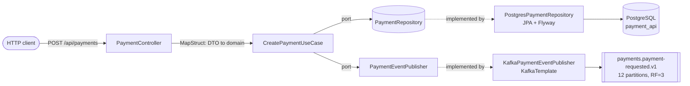

# payment-api (M3 - first producer)

Entry point for the pipeline. Accepts `POST /api/payments` over REST, persists the payment to
PostgreSQL, and publishes a `payments.payment-requested.v1` event to Kafka.

This is the only service that accepts synchronous REST traffic from outside the system
(ADR-0004); everything downstream is event-driven.

## Kafka concepts demonstrated

- `ProducerRecord` key vs value, and why the key determines the partition
- `acks` (0 / 1 / all) and the durability-vs-latency trade-off - measured below
- `enable.idempotence` and the constraints it silently imposes on `acks` and
  `max.in.flight.requests.per.connection`
- Batching: `linger.ms`, `batch.size`, `compression.type`
- Async send with a callback reporting partition and offset
- `min.insync.replicas` as the setting that gives `acks=all` its meaning

## Architecture



The `domain/` package depends on nothing but the JDK. `HexagonalArchitectureTest` (ArchUnit)
fails the build if a Spring, Kafka, or JPA import ever appears there.

## Topics

| Topic | Key | Partitions | RF | min.insync.replicas | cleanup.policy | Retention |
|---|---|---|---|---|---|---|
| `payments.payment-requested.v1` | `paymentId` | 12 | 3 | 2 | delete | 7 days |

Keyed by `paymentId`, not `merchantId` - see ADR-0003. One event per aggregate means ordering
within the key is vacuous here, so the key is chosen to spread load evenly and avoid serializing
a large merchant behind a single partition.

## How to run

The compose stack from `infra/compose` must be running first.

```bash
cd infra/compose && docker compose up -d && ./create-topics.sh
mvn -pl services/payment-api -am package
java -jar services/payment-api/target/payment-api.jar --spring.profiles.active=docker-compose
```

Listens on **8085**. Ports 8080 (AKHQ) and 8081 (Schema Registry) are taken by the compose stack.

```bash
curl -X POST http://localhost:8085/api/payments \
  -H 'Content-Type: application/json' \
  -d '{"merchantId":"merchant-acme","amount":49.99,"currency":"EUR"}'
```

## Prove it

### 1. End-to-end

`POST` returns `201` and the event lands on the topic keyed by the payment id:

```
HTTP 201  {"id":"1cc464e6-0a88-4365-9312-567ca70e1362","merchantId":"merchant-acme",
           "amount":49.99,"currency":"EUR","status":"CREATED"}

postgres> 1cc464e6-0a88-4365-9312-567ca70e1362|merchant-acme|49.9900|EUR|CREATED

kafka>    1cc464e6-0a88-4365-9312-567ca70e1362 | KEY={"envelope":{...,"eventId":"019fe41d-9de2-7d79-...",
          "eventType":"payments.payment-requested.v1","aggregateId":"1cc464e6-...","source":"payment-api"},
          "paymentId":"1cc464e6-...","merchantId":"merchant-acme","amount":49.99,...}
```

The Kafka message key equals the payment id, as ADR-0003 requires.

### 2. acks throughput comparison

10,000 records at 512 bytes, `linger.ms=5`, `batch.size=16384`, against the 3-broker cluster:

| acks | enable.idempotence | Throughput | Avg latency | p99 | Max |
|---|---|---|---|---|---|
| 0 | false | 58,480 rec/s (28.6 MB/s) | 9.6 ms | 29 ms | 92 ms |
| 1 | false | 61,350 rec/s (30.0 MB/s) | 16.4 ms | 26 ms | 99 ms |
| all | true | 52,632 rec/s (25.7 MB/s) | 26.4 ms | 48 ms | 100 ms |

**Durability costs latency, not throughput.** Average latency nearly triples from `acks=0` to
`acks=all` while throughput moves less than 15% - and `acks=1` even edges out `acks=0` within
noise. The brokers are containers on loopback, so replication is nearly free; on real network
hardware the throughput gap widens considerably. Don't quote these throughput numbers as if
they generalise - quote the latency shape.

`acks=0` and `acks=1` required `enable.idempotence=false`. Modern Kafka defaults idempotence to
true, and idempotence *requires* `acks=all` - the producer refuses to start otherwise. That
constraint is the point: you cannot have idempotent production without full acknowledgement.

### 3. Leader-kill data loss (the important one)

Single-partition RF=3 topic, 60,000 records at 3,000/s, leader stopped ~8s into the run.

**Under `acks=1`, `min.insync.replicas=1`, `retries=0`:**

```
producer reported : 59,984 records sent
actually durable  : 59,358 records
LOST              :    626 records
leader failover   : kafka2 -> kafka3,  Isr: 3,1
```

**626 records the producer was told were written, which no longer exist.** No error, no
exception, no signal. The leader acknowledged them, died before its followers replicated them,
and the new leader never had them. A payment system on `acks=1` loses transactions and reports
success while doing it.

**Under `acks=all`, `min.insync.replicas=2`:**

```
producer reported : 60,000 records sent
actually durable  : 60,000 records
LOST              :      0 records
leader failover   : kafka3 -> kafka1,  Isr: 1,2
latency during failover: max 692 ms, p99 513 ms  (vs max 101 ms, p99 3 ms under acks=1)
```

The 692 ms spike *is* the leader election - producers block until a new leader is elected and
the write can be acknowledged by two replicas. Half a second of stall in exchange for never
silently losing a payment.

### Why `min.insync.replicas=2` is the setting that matters

`acks=all` alone means "all *in-sync* replicas", which is a hollow guarantee: if the ISR has
shrunk to just the leader, `acks=all` silently degrades to `acks=1`. `min.insync.replicas=2`
forces the broker to reject the write instead of accepting it into a single-replica ISR.

In the drill above the ISR shrank from 3 members to 2 and still met the floor, so writes
continued safely. Had a second broker failed, the producer would have received
`NotEnoughReplicasException` - failing loudly rather than losing data quietly.

## Known issues / deferred

- `occurredAt` serialises as an epoch decimal (`1786238574.050447000`) rather than ISO-8601.
  Round-trips correctly in Java but is poor as a cross-language wire format and reads badly in
  AKHQ. Fix when M9 moves the topics to Avro.
- **Dual write:** the payment is committed to Postgres and *then* published to Kafka. A crash
  between the two loses the event. This is deliberate - M6 replaces it with the transactional
  outbox pattern.
- Drill topics `drill.acks1-loss` and `drill.acksall` remain in the cluster holding the
  evidence above; delete them once the results are written up.

## Troubleshooting

| Symptom | Cause |
|---|---|
| `Port 8081 was already in use` | Schema Registry owns 8081; this service uses 8085 |
| Producer won't start, complains about `acks` | `enable.idempotence=true` requires `acks=all` |
| Events publish but never appear on the host | Broker `advertised.listeners` - see `infra/compose/README.md` |
| `NotEnoughReplicasException` | Fewer than `min.insync.replicas` brokers in the ISR - a broker is down |
