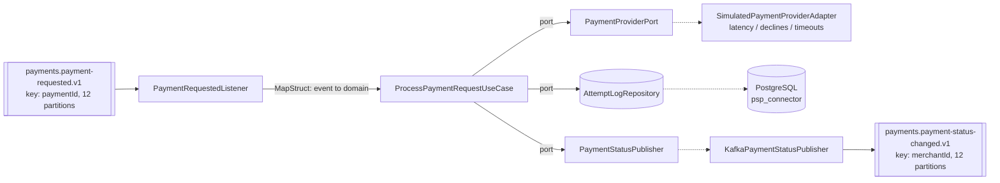

# psp-connector (M4 - first consumer)

Consumes `payments.payment-requested.v1`, calls a simulated payment provider, and publishes
`payments.payment-status-changed.v1`.

This is the first consumer in the pipeline and the module where consumer-group mechanics,
offset commits, and the poll loop become concrete.

## Kafka concepts demonstrated

- Consumer groups, `group.id`, `auto.offset.reset`
- The poll loop, and why processing time - not network time - drives `max.poll.interval.ms`
- `session.timeout.ms` vs `heartbeat.interval.ms`: heartbeats run on a **background thread**,
  so a consumer can be heartbeating happily while its processing thread is stuck. Only
  `max.poll.interval.ms` catches that.
- `enable.auto.commit=false` with manual `Acknowledgment`, and Spring's `AckMode`
- Partition-to-consumer assignment, and why extra consumers sit idle
- At-least-once delivery: duplicates and loss, measured below

## Architecture



## Topics

| Direction | Topic | Key | Partitions | RF |
|---|---|---|---|---|
| in | `payments.payment-requested.v1` | `paymentId` | 12 | 3 |
| out | `payments.payment-status-changed.v1` | `merchantId` | 12 | 3 |

**The key changes between in and out, deliberately** (ADR-0003). Inbound is keyed by
`paymentId` because there is exactly one request per payment, so ordering is vacuous and
paymentId spreads load evenly across the slowest stage in the system. Outbound is keyed by
`merchantId` because the ledger needs a single writer per merchant balance - merchantId
ordering is the stronger guarantee, and it is where that guarantee starts to matter.

## Error taxonomy (ADR-0006)

| Provider outcome | Classification | Behaviour |
|---|---|---|
| Approved | business outcome | emit `SUCCEEDED` status event, commit |
| Declined | **business outcome, not an error** | emit `FAILED` status event, commit, never retry |
| Timeout | retryable | throw `ProviderTimeoutException`; retry chain is M8 |

A declined card is a normal answer from the provider, not a failure of the system. Retrying it
would be wrong and DLQ-ing it would make the DLQ meaningless.

## How to run

```bash
cd infra/compose && docker compose up -d && ./create-topics.sh
mvn -pl services/psp-connector -am package
java -jar services/psp-connector/target/psp-connector.jar --spring.profiles.active=docker-compose
```

Listens on **8086** (payment-api 8085, AKHQ 8080, Schema Registry 8081).

Provider simulation is configurable so experiments can force outcomes:

```
psp-connector.provider.min-latency-ms / max-latency-ms
psp-connector.provider.decline-rate / timeout-rate
psp-connector.provider.forced-latency-ms / forced-outcome   # NONE | APPROVED | DECLINED | TIMEOUT
```

## Prove it

### 1. End-to-end

`POST` a payment to payment-api and the status event appears on the outbound topic:

```
payment-api  -> HTTP 201  paymentId=531551ba-6f7d-47e6-922d-691b872c42b3  merchant-e2e

kafka payments.payment-status-changed.v1:
  KEY = merchant-e2e            <-- merchantId, not paymentId
  {"envelope":{"eventId":"019fe930-8911-74eb-...","eventType":"payments.payment-status-changed.v1",
    "aggregateId":"531551ba-...","source":"psp-connector",
    "causationId":"019fe930-6dbd-7d75-ba74-43dd70662098"},   <-- inbound event's eventId
   "paymentId":"531551ba-...","merchantId":"merchant-e2e","status":"SUCCEEDED",
   "providerReference":"84023e0f-7f5f-4223-a49c-cac0b7c5e0e6"}
```

The key is the merchantId and `causationId` chains back to the inbound event's `eventId`.

### 2. Rebalance storm

Processing forced to 10s per record, `max.poll.records=1`, run for ~90s:

| `max.poll.interval.ms` | Evictions | Records processed |
|---|---|---|
| 5000 (shorter than processing) | **16** | 8 |
| 60000 (longer than processing) | **0** | 9 |

Broker's view, verbatim from the logs:

```
consumer poll timeout has expired. This means the time between subsequent calls to poll()
was longer than the configured max.poll.interval.ms
... partitions revoked: [payments.payment-requested.v1-0, ...-1, ...-2, ...]
... partitions assigned: [payments.payment-requested.v1-0, ...-1, ...-2, ...]
```

**Why it happens.** Heartbeats kept flowing the whole time - they run on a background thread,
so the group coordinator saw a live member. What it did not see was a `poll()` call, because
the processing thread was blocked for 10s inside the listener. Exceeding
`max.poll.interval.ms` makes the coordinator conclude the consumer is stuck, evict it, and
rebalance. The consumer then finishes its record, tries to commit, discovers it has been
evicted, and rejoins - triggering another rebalance. That is the storm: **16 rebalances to
process 8 records**, and every one of them stops the whole group.

This is also why blocking retries (`Thread.sleep` in a listener) are a trap - see M8.

### 3. Partition / consumer ratio

Scaled down to a 3-partition topic (`drill.consumer-ratio`) rather than 12 partitions and
13 JVMs; the arithmetic is identical.

Three consumers, three partitions - one each:

```
TOPIC                 PARTITION  CONSUMER-ID
drill.consumer-ratio  0          consumer-ratio-drill-1-85e817fa...
drill.consumer-ratio  1          consumer-ratio-drill-1-b5d47b75...
drill.consumer-ratio  2          consumer-ratio-drill-1-e37f4469...
```

Start a fourth:

```
CONSUMER-ID                     #PARTITIONS
consumer-ratio-drill-1-49104bb5    1
consumer-ratio-drill-1-b5d47b75    1
consumer-ratio-drill-1-85e817fa    1
consumer-ratio-drill-1-e37f4469    0     <-- idle
```

**A partition is assigned to exactly one consumer in a group.** Partition count is the hard
ceiling on parallelism within a group; the fourth consumer is pure standby. It is not useless -
it takes over in milliseconds if another dies - but it adds zero throughput. To scale past the
ceiling you must add partitions, which (see M19) breaks keyed ordering for existing keys.

### 4. Duplicates vs loss

200 records on a single partition, `max.poll.records=50`, 300ms processing, killed mid-batch.

**Auto-commit (`enable.auto.commit=true`):**

```
at crash:  processed=81   committed offset=50
restart:   resumes at 50, processes 150 more
total processed = 231 for 200 unique records  ->  31 DUPLICATES
```

The commit timer fired at a poll boundary and committed offset 50 while the listener had
worked ahead to 81. On restart everything from 50 onward is replayed. Exactly `81 - 50 = 31`
records processed twice. **This is at-least-once, and it is the normal case** - which is why
M5 builds idempotent consumers.

**Manual ack (`AckMode.MANUAL_IMMEDIATE`) - and a real defect it exposed:**

```
at crash:  processed=49   committed offset=50
restart:   resumes at 50, processes 150 more
total processed = 199 for 200 unique records  ->  1 record LOST
```

Manual acknowledgement should make loss impossible, so the single missing record is a bug, and
the experiment found it:

- `PaymentRequestedListener` calls `ack.acknowledge()` after the use case returns
- `KafkaPaymentStatusPublisher` publishes with `send(record).whenComplete(...)` - an
  **asynchronous** send that returns before the record reaches the broker

So the offset is committed while the outbound event is still sitting in the producer's buffer.
Kill the JVM in that window and the input is marked consumed but the output never existed.
Manual ack protects the *offset*, not the *side effect*.

Fix options, deliberately left for later modules: await the send future before acknowledging
(simple, costs latency), acknowledge inside the send callback, or make the whole thing atomic
with Kafka transactions (M7). Until then this service is at-least-once with a narrow loss
window, and that is worth knowing rather than assuming.

## Known issues / deferred

- **Async-send-before-ack loss window** described above. Not fixed here; M7 covers the
  transactional answer.
- The attempt log records `(paymentId, providerEventId)` with a unique constraint but does not
  yet *use* it to skip duplicate work - that is M5.
- Timeouts throw `ProviderTimeoutException` and are simply redelivered; the retry-topic chain
  and DLQ arrive in M8.
- Drill topics `drill.consumer-ratio` and `drill.dup-vs-loss` remain in the cluster holding the
  evidence above.

## Troubleshooting

| Symptom | Cause |
|---|---|
| Consumer rejoins in a loop, little progress | Processing exceeds `max.poll.interval.ms` - raise it or shrink `max.poll.records` |
| A consumer instance sits idle | More consumers than partitions in the group |
| Records reprocessed after a restart | Normal at-least-once with auto-commit; make the consumer idempotent (M5) |
| Events consumed but never published | The async-send-before-ack window above |

---

# M5 - Idempotency & duplicate handling

M4 built the *shape* of a dedup table - `payment_attempts` with a
`UNIQUE (payment_id, provider_event_id)` constraint - and documented, as a known defect, that
nothing consulted it: a redelivered `payments.payment-requested.v1` record (crash-restart, the
manual-ack drill, a future M8 retry, an operator resetting offsets to earliest) called the
provider again and inserted a second, genuinely duplicate attempt row, and - worse - published a
second `payments.payment-status-changed.v1` for the same payment. M5 makes the consumer actually
idempotent against that.

## The first M5 implementation was fake

The first version deduped on `(paymentId, providerEventId)` alone, checked **after** calling
`paymentProvider.authorize(...)`. PLAN.md's M5 acceptance test is: reset the consumer group's
offsets to earliest, replay the whole topic, and the outcome must be identical to a single pass.
It wasn't. Measured against the live cluster, 50 `payment-requested` events on a single-partition
topic, consumed once, then replayed once from earliest:

| Metric | First pass | After replay |
|---|---|---|
| `processed` counter | 50 | 50 again |
| `deduplicated` counter | 0 | **0** - dedup caught nothing |
| `payment_attempts` rows | 50 | **100** for 50 distinct payments |
| distinct `provider_event_id` | 50 | **100** for 50 payments - every payment authorized twice |
| `payments.payment-status-changed.v1` events | 50 | **100** for 50 payments - downstream sees every payment twice |

**Why it failed.** `providerEventId` is minted by the (simulated) provider on every call, not by
us (see `domain.model.ProviderResult`'s javadoc) - it is not part of the inbound message, so it is
not stable across redelivery. Replaying the topic calls `authorize()` again for each record,
which mints a **fresh** `providerEventId` every time, so `(paymentId, providerEventId)` never
matches anything already recorded and the check-first path never fires. Worse, the check ran
*after* `authorize()` - so even a key that *could* have matched would only ever have prevented a
second database row and a second publish, not the second authorization/charge itself, which is
the actual harm a real acquirer integration cares about. A dedup key derived from something the
far side mints, checked after the side effect it's supposed to prevent, is not idempotency; it is
bookkeeping that happens to look like idempotency until you replay the input it was never keyed
on. That is the lesson of this module.

## The fix: two distinct levels, kept separate on purpose

Collapsing both checks into one key is exactly how the original defect happened, so the fix keeps
them structurally separate - two ports, two unique constraints, two counters, checked at two
different points in `execute()`.

### Level 1 - replay/consumer idempotency (new)

Keyed on the **inbound** `EventEnvelope.eventId` - carried in the message itself (`
PaymentRequestedEvent.envelope().eventId()` → `ProcessPaymentRequestCommand#causationEventId()`),
so unlike `providerEventId` it is **stable across replays, rebalances and offset resets**: the
same Kafka record always carries the same `eventId`, no matter how many times it is redelivered.

Checked via `AttemptLogRepository#existsByInboundEventId` **before**
`paymentProvider.authorize(...)` is ever called. That ordering is the entire point: it prevents
the side effect (re-authorizing/charging a card on every topic replay), not just a second
bookkeeping row. Persisted in the new `inbound_event_id` column
(`db/migration/V2__add_inbound_event_id_to_payment_attempts.sql`), `UNIQUE`, nullable for
pre-existing V1 rows (Postgres treats every `NULL` as distinct, so old rows never collide with
each other or with new ones on this constraint).

### Level 2 - duplicate provider callback (existing, unchanged)

Keyed `(paymentId, providerEventId)`, checked after `authorize()` returns - unchanged from the
original M5 shape, and it is **not removed**, because it catches a genuinely different failure
that level 1 cannot see: the provider itself redelivering the same callback for an attempt we
ourselves only made once (simulated by `SimulatedPaymentProviderAdapter`'s `duplicate-rate`
knob). A legitimate retry after a timeout is new work with a new `providerEventId` and must still
be processed - deduping on `paymentId` alone would wrongly drop it, which is why this key is
`(paymentId, providerEventId)` and not `paymentId`.

```java
UUID inboundEventId = command.causationEventId();

// LEVEL 1 - before the side effect.
if (attemptLogRepository.existsByInboundEventId(inboundEventId)) {
    recordDuplicate(REPLAY, ...);                                  // metrics + log, no publish
    return;                                                        // never calls authorize()
}

ProviderResult result = paymentProvider.authorize(...);            // providerEventId now known

// LEVEL 2 - after the side effect, a different failure mode.
if (attemptLogRepository.existsByPaymentIdAndProviderEventId(
        command.paymentId(), result.providerEventId())) {
    recordDuplicate(PROVIDER_CALLBACK, ...);
    return;
}

boolean inserted = attemptLogRepository.tryRecord(attempt);        // DB constraints are the authority
if (!inserted) {                                                   // race path, either constraint
    recordDuplicate(resolveRaceReason(inboundEventId), ...);
    return;
}
// ... only now: throw on TIMEOUT, or publish on APPROVED/DECLINED
```

**Both levels have the same two-path shape, and both are tested**, because each check-then-act is
itself not atomic:

1. **Check first** - the common case. Cheap: no wasted insert attempt for the vast majority of
   genuinely new work, and it is what a topic replay hits on every single record once level 1 is
   in place.
2. **Race path** (`tryRecord` returning `false`) - two redeliveries of the *same* key (inbound
   event id, or `(paymentId, providerEventId)`) can both pass their existence check before either
   has inserted (concurrent consumer instances in the group, or concurrent threads). The two
   unique constraints (V2 for level 1, V1 for level 2) are the actual authority:
   `PostgresAttemptLogRepository.tryRecord` catches the resulting `DataIntegrityViolationException`
   and reports `false` - it never lets that exception escape, for either constraint. Which one
   fired isn't visible from that boolean alone, so `ProcessPaymentRequestUseCase.resolveRaceReason`
   does one cheap follow-up `existsByInboundEventId` read to attribute the counter correctly - see
   that method's javadoc.

Either path lands on the same outcome: skip the attempt-log write, skip the publish, log it, count
it, and let the listener `ack.acknowledge()` normally - a duplicate is not a failure, so it must
never be retried or DLQ'd (same ADR-0006 reasoning as a decline, applied to a different category
of "this is not an error").

## What changed (this fix)

| File | Change |
|---|---|
| `db/migration/V2__add_inbound_event_id_to_payment_attempts.sql` | new `inbound_event_id UUID NULL` column + `UNIQUE` constraint on `payment_attempts` |
| `domain/port/AttemptLogRepository.java` | new `boolean existsByInboundEventId(inboundEventId)`; `tryRecord`'s javadoc updated to cover both constraints |
| `adapters/out/persistence/PaymentAttemptEntity.java` | new `inboundEventId` field/column, separate from `causationEventId` |
| `adapters/out/persistence/PaymentAttemptJpaRepository.java` | derived `existsByInboundEventId` query |
| `adapters/out/persistence/PostgresAttemptLogRepository.java` | delegates `existsByInboundEventId`; `tryRecord`'s catch comment generalized to both constraints |
| `adapters/out/persistence/PaymentAttemptPersistenceMapper.java` | maps `PaymentAttempt.causationEventId` → `PaymentAttemptEntity.inboundEventId` |
| `application/ProcessPaymentRequestUseCase.java` | level 1 check moved **before** `authorize()`; level 2 check kept, unchanged, after it; race-path reason attribution; two tagged Micrometer counters |
| `application/ProcessPaymentRequestCommand.java` | javadoc: `causationEventId` now documented as serving both the causation link *and* the level 1 idempotency key |
| Tests | `ProcessPaymentRequestUseCaseTest` rewritten: replay-authorizes-once (the key assertion), distinct-inbound-event still processes, level 1 + level 2 check-first and race paths, level 2's pre-existing cases kept passing |

## Counters: how to read processed vs the two dedup reasons

Three Micrometer counters, registered against the default `MeterRegistry`
(`spring-boot-starter-actuator`'s auto-configured `SimpleMeterRegistry`), incremented in
`ProcessPaymentRequestUseCase`:

| Counter | Tag | Increments when |
|---|---|---|
| `psp-connector.payment.attempts.processed` | - | A genuinely new attempt was recorded (`tryRecord` succeeded) - regardless of outcome |
| `psp-connector.payment.attempts.deduplicated` | `reason=replay` | **Level 1**: an inbound event replay was skipped, before the provider was ever called |
| `psp-connector.payment.attempts.deduplicated` | `reason=provider-callback` | **Level 2**: a duplicate provider callback was skipped |

Read them via actuator (`management.endpoints.web.exposure.include` includes `metrics`):

```
curl localhost:8086/actuator/metrics/psp-connector.payment.attempts.processed
curl "localhost:8086/actuator/metrics/psp-connector.payment.attempts.deduplicated?tag=reason:replay"
curl "localhost:8086/actuator/metrics/psp-connector.payment.attempts.deduplicated?tag=reason:provider-callback"
```

Or grep the logs - the dedup log line now carries `reason=`:

```
Deduplicated payment attempt reason=REPLAY paymentId=<uuid> inboundEventId=<uuid> providerEventId=null merchantId=<id> - ...
Deduplicated payment attempt reason=PROVIDER_CALLBACK paymentId=<uuid> inboundEventId=<uuid> providerEventId=<uuid> merchantId=<id> - ...
```

`grep -c "reason=REPLAY"` on the log is what the replay proof below reports; `processed +
deduplicated(replay) + deduplicated(provider-callback)` should equal the number of
`payments.payment-requested.v1` deliveries the consumer actually saw (including redeliveries).

## Deliberate duplicate emission: `psp-connector.provider.duplicate-rate`

For M5 to be testable at all, something has to actually *produce* a duplicate
`(paymentId, providerEventId)` pair, not just a duplicate `paymentId`. `SimulatedPaymentProviderAdapter`
now remembers the last `ProviderResult` it returned per `paymentId`. When `authorize()` is called
again for a `paymentId` it has already seen (i.e. a real redelivery of the inbound request -
crash-restart, offset reset, a retry), `psp-connector.provider.duplicate-rate` (0.0-1.0, default
`0`) is the probability of replaying that exact same result - same `providerEventId`, same
outcome - instead of minting a fresh one. This simulates a real acquirer that dedupes/replays its
own callback for the same logical attempt (e.g. keyed on an idempotency key) rather than treating
a redelivery as brand-new work.

- **Default `0`**: unchanged M4 behaviour - every call, even a redelivery, gets a brand-new
  `providerEventId`. This is the "known defect" M4's README section described: replay currently
  produces real duplicate charges, because there is nothing for the dedup key to collide on.
- **`> 0`**: enables the collision the idempotent consumer above is built to catch.

Enable it via `application.yml` or the command line, e.g.:

```
--psp-connector.provider.duplicate-rate=0.2
```

Compromise: the adapter's per-`paymentId` cache is unbounded, in-memory, and local to a single
instance (invisible to other members of the consumer group). Fine for this exercise's scale and
lifetime; not a production pattern - see the class javadoc.

## Producer `enable.idempotence=true` is not the same thing

`application.yml`'s Kafka producer config already sets `enable.idempotence: true` (M3/M4, on the
`payments.payment-status-changed.v1` producer). It is easy to assume that setting alone makes the
pipeline idempotent end-to-end. **It does not**, and the distinction matters:

- `enable.idempotence=true` gives the **producer** an idempotent *send*: it assigns a producer ID
  and sequence numbers so that if the client's own internal retries (network blip,
  broker-not-leader, etc.) resend the *same* in-flight batch, the broker recognizes the sequence
  number and drops the resend instead of appending it twice. This is scoped to **one producer
  session** talking to **one partition** - it protects against the producer's own retry
  mechanism duplicating a write it is still trying to get acknowledged.
- It does **nothing** about the **consumer** re-processing a record it already handled after a
  **rebalance**, a **restart**, an **offset reset/replay**, or (M8) a **retry-topic redelivery**.
  Those are all "the same logical event arrives at the listener method more than once," which is
  precisely what `enable.auto.commit`/manual-ack semantics (M4) already showed happens routinely
  under normal at-least-once delivery - 31 duplicates in the M4 auto-commit drill, none of them
  caused by producer retries.

End-to-end idempotency therefore has to live in the **consumer**, keyed on something *stable
across redelivery* - the inbound event's own id for level 1, `(paymentId, providerEventId)` for
level 2 - not in a producer setting that only ever sees its own retries, and not in a key minted
by the far side after the side effect it's supposed to guard. This module is that consumer-side
half; the producer setting from M3/M4 is unrelated machinery solving a different, narrower
problem.

### Replay proof

Measured on the live cluster. Fresh topic `drill.m5-fixed`, 1 partition, 50 events with distinct
inbound `eventId`s and distinct `paymentId`s. Consumed once, then the consumer group's offsets were
reset to earliest and the identical 50 records replayed:

```bash
kafka-consumer-groups --group m5-fixed --topic drill.m5-fixed --reset-offsets --to-earliest --execute
```

| Measure | After pass 1 | After full replay | Verdict |
|---|---|---|---|
| `payment_attempts` rows | 50 | **50** | unchanged |
| distinct `payment_id` | 50 | **50** | unchanged |
| distinct `provider_event_id` | 50 | **50** | provider never called again |
| status events on `payments.payment-status-changed.v1` | 50 | **50** | no double-publish |
| `attempts.processed` counter (this pass) | 50 | **0** | no new work |
| `attempts.deduplicated{reason=replay}` | 0 | **50** | level 1 caught every record |

Every one of the 50 replayed records was recognised as already-processed *before* the provider call.
Nothing was authorized twice, nothing was published twice, and the attempt log did not grow.

Compare against the same experiment run on the first implementation, above: 100 rows, 100 provider
authorizations, 100 status events, and a deduplication counter of **zero**. Same test, same data,
opposite result - which is exactly why PLAN.md words the acceptance test as a replay rather than a
unit test. The unit tests passed in both versions; only the replay told the truth.
