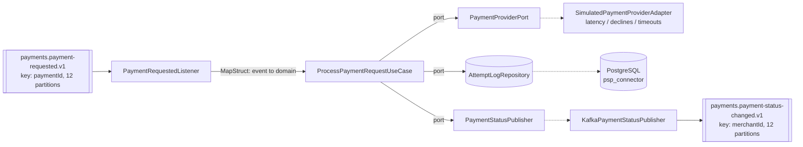
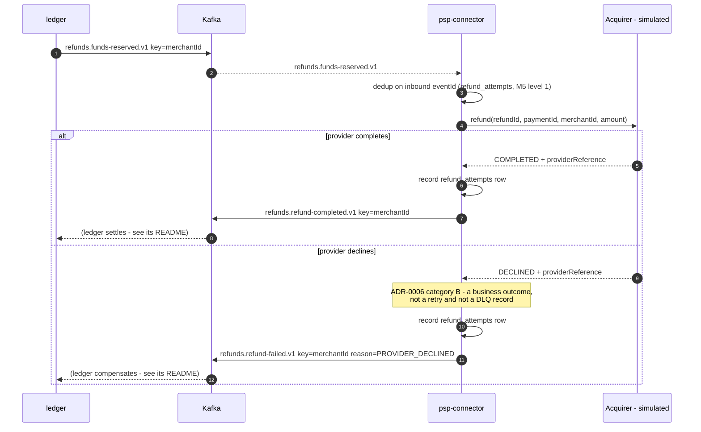
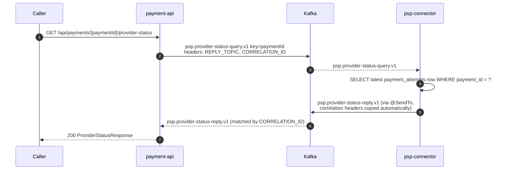

# psp-connector (M4 - first consumer)

Consumes `payments.payment-requested.v1`, calls a simulated payment provider, and publishes
`payments.payment-status-changed.v1`.

This is the first consumer in the pipeline and the module where consumer-group mechanics,
offset commits, and the poll loop become concrete.

## Kafka concepts demonstrated

- Consumer groups, `group.id`, `auto.offset.reset`
- The poll loop, and why processing time - not network time - drives `max.poll.interval.ms`
- `session.timeout.ms` vs `heartbeat.interval.ms`: heartbeats run on a **background thread**,
  so a consumer can be heartbeating happily while its processing thread is stuck. Only
  `max.poll.interval.ms` catches that.
- `enable.auto.commit=false` with manual `Acknowledgment`, and Spring's `AckMode`
- Partition-to-consumer assignment, and why extra consumers sit idle
- At-least-once delivery: duplicates and loss, measured below

## Architecture



## Topics

| Direction | Topic | Key | Partitions | RF |
|---|---|---|---|---|
| in | `payments.payment-requested.v1` | `paymentId` | 12 | 3 |
| out | `payments.payment-status-changed.v1` | `merchantId` | 12 | 3 |

**The key changes between in and out, deliberately** (ADR-0003). Inbound is keyed by
`paymentId` because there is exactly one request per payment, so ordering is vacuous and
paymentId spreads load evenly across the slowest stage in the system. Outbound is keyed by
`merchantId` because the ledger needs a single writer per merchant balance - merchantId
ordering is the stronger guarantee, and it is where that guarantee starts to matter.

## Error taxonomy (ADR-0006)

| Provider outcome | Classification | Behaviour |
|---|---|---|
| Approved | business outcome | emit `SUCCEEDED` status event, commit |
| Declined | **business outcome, not an error** | emit `FAILED` status event, commit, never retry |
| Timeout | retryable | throw `ProviderTimeoutException`; retry chain is M8 |

A declined card is a normal answer from the provider, not a failure of the system. Retrying it
would be wrong and DLQ-ing it would make the DLQ meaningless.

## How to run

```bash
cd infra/compose && docker compose up -d && ./create-topics.sh
mvn -pl services/psp-connector -am package
java -jar services/psp-connector/target/psp-connector.jar --spring.profiles.active=docker-compose
```

Listens on **8086** (payment-api 8085, AKHQ 8080, Schema Registry 8081).

Provider simulation is configurable so experiments can force outcomes:

```
psp-connector.provider.min-latency-ms / max-latency-ms
psp-connector.provider.decline-rate / timeout-rate
psp-connector.provider.forced-latency-ms / forced-outcome   # NONE | APPROVED | DECLINED | TIMEOUT
```

## Integration tests (M19 "Plus")

Two Testcontainers ITs, in `src/test/java/.../integration/`. They run under `verify`, never under
`test` - surefire's include patterns (`*Test.java`) and failsafe's (`*IT.java`) are disjoint, so
`mvn test` stays Docker-free.

```bash
mvn -pl services/psp-connector -am verify          # unit + ArchUnit + both ITs
mvn -pl services/psp-connector -am test            # unit + ArchUnit only, no containers
mvn -pl services/psp-connector -am verify -Dit.test=RebalanceLossIT   # one IT
```

Containers: `apache/kafka:3.8.1` (KRaft) + `postgres:15`, both static singletons shared by the two
IT classes and reaped by Ryuk at JVM exit. **No Schema Registry container** - the ITs point
`psp-connector.schema-registry.url` at `mock://psp-connector-it`, which makes Confluent's
serializers resolve a JVM-static `MockSchemaRegistryClient` shared by the application and the test
(same JVM, it is an `@SpringBootTest`). Each IT owns its topics and `group.id`, so they share the
broker and the database without interfering.

| IT | What it proves |
|---|---|
| `RebalanceLossIT` | 30 payments in flight, the listener container stopped and restarted **twice** mid-stream (a real LeaveGroup/JoinGroup rebalance). **No loss:** all 30 get a status event. **Bounded duplicates:** grouped by paymentId, every group has exactly ONE distinct envelope `eventId` - so a duplicate is recognisable as the same event, which is what `KafkaPaymentStatusPublisher`'s reuse of the stored `status_event_id` buys. 5 records are then re-sent verbatim so the republish path is exercised rather than hoped for. |
| `CrashRedeliveryIT` | The M19 drill-9 window, opened deliberately: a `@Primary` test-scope publisher decorator fails every publish, so the `payment_attempts` row commits with no event and no committed offset. Asserts the topic is empty at that point, then heals the publisher, bounces the listener, and asserts **exactly one** event arrives whose envelope `eventId` equals the row's `status_event_id`. Pre-fix this was 0 - a permanent, silent loss. |

Both are deterministic because `psp-connector.provider.forced-outcome=APPROVED` removes the
simulator's decline/timeout dice; a TIMEOUT is ADR-0006 category A and publishes nothing, so
"one status event per payment" is only a correct expectation once that die is off.

Honest limitation, stated in `CrashRedeliveryIT`'s javadoc too: the recovery step recycles the Kafka
consumer, not the process. The *state* (committed row, uncommitted offset, absent event) and the
code path (M5 level 1 -> republish) are what a real pod restart would produce; the process
lifecycle is not.

## Prove it

### 1. End-to-end

`POST` a payment to payment-api and the status event appears on the outbound topic:

```
payment-api  -> HTTP 201  paymentId=531551ba-6f7d-47e6-922d-691b872c42b3  merchant-e2e

kafka payments.payment-status-changed.v1:
  KEY = merchant-e2e            <-- merchantId, not paymentId
  {"envelope":{"eventId":"019fe930-8911-74eb-...","eventType":"payments.payment-status-changed.v1",
    "aggregateId":"531551ba-...","source":"psp-connector",
    "causationId":"019fe930-6dbd-7d75-ba74-43dd70662098"},   <-- inbound event's eventId
   "paymentId":"531551ba-...","merchantId":"merchant-e2e","status":"SUCCEEDED",
   "providerReference":"84023e0f-7f5f-4223-a49c-cac0b7c5e0e6"}
```

The key is the merchantId and `causationId` chains back to the inbound event's `eventId`.

### 2. Rebalance storm

Processing forced to 10s per record, `max.poll.records=1`, run for ~90s:

| `max.poll.interval.ms` | Evictions | Records processed |
|---|---|---|
| 5000 (shorter than processing) | **16** | 8 |
| 60000 (longer than processing) | **0** | 9 |

Broker's view, verbatim from the logs:

```
consumer poll timeout has expired. This means the time between subsequent calls to poll()
was longer than the configured max.poll.interval.ms
... partitions revoked: [payments.payment-requested.v1-0, ...-1, ...-2, ...]
... partitions assigned: [payments.payment-requested.v1-0, ...-1, ...-2, ...]
```

**Why it happens.** Heartbeats kept flowing the whole time - they run on a background thread,
so the group coordinator saw a live member. What it did not see was a `poll()` call, because
the processing thread was blocked for 10s inside the listener. Exceeding
`max.poll.interval.ms` makes the coordinator conclude the consumer is stuck, evict it, and
rebalance. The consumer then finishes its record, tries to commit, discovers it has been
evicted, and rejoins - triggering another rebalance. That is the storm: **16 rebalances to
process 8 records**, and every one of them stops the whole group.

This is also why blocking retries (`Thread.sleep` in a listener) are a trap - see M8.

### 3. Partition / consumer ratio

Scaled down to a 3-partition topic (`drill.consumer-ratio`) rather than 12 partitions and
13 JVMs; the arithmetic is identical.

Three consumers, three partitions - one each:

```
TOPIC                 PARTITION  CONSUMER-ID
drill.consumer-ratio  0          consumer-ratio-drill-1-85e817fa...
drill.consumer-ratio  1          consumer-ratio-drill-1-b5d47b75...
drill.consumer-ratio  2          consumer-ratio-drill-1-e37f4469...
```

Start a fourth:

```
CONSUMER-ID                     #PARTITIONS
consumer-ratio-drill-1-49104bb5    1
consumer-ratio-drill-1-b5d47b75    1
consumer-ratio-drill-1-85e817fa    1
consumer-ratio-drill-1-e37f4469    0     <-- idle
```

**A partition is assigned to exactly one consumer in a group.** Partition count is the hard
ceiling on parallelism within a group; the fourth consumer is pure standby. It is not useless -
it takes over in milliseconds if another dies - but it adds zero throughput. To scale past the
ceiling you must add partitions, which (see M19) breaks keyed ordering for existing keys.

### 4. Duplicates vs loss

200 records on a single partition, `max.poll.records=50`, 300ms processing, killed mid-batch.

**Auto-commit (`enable.auto.commit=true`):**

```
at crash:  processed=81   committed offset=50
restart:   resumes at 50, processes 150 more
total processed = 231 for 200 unique records  ->  31 DUPLICATES
```

The commit timer fired at a poll boundary and committed offset 50 while the listener had
worked ahead to 81. On restart everything from 50 onward is replayed. Exactly `81 - 50 = 31`
records processed twice. **This is at-least-once, and it is the normal case** - which is why
M5 builds idempotent consumers.

**Manual ack (`AckMode.MANUAL_IMMEDIATE`) - and a real defect it exposed:**

```
at crash:  processed=49   committed offset=50
restart:   resumes at 50, processes 150 more
total processed = 199 for 200 unique records  ->  1 record LOST
```

Manual acknowledgement should make loss impossible, so the single missing record is a bug, and
the experiment found it:

- `PaymentRequestedListener` calls `ack.acknowledge()` after the use case returns
- `KafkaPaymentStatusPublisher` publishes with `send(record).whenComplete(...)` - an
  **asynchronous** send that returns before the record reaches the broker

So the offset is committed while the outbound event is still sitting in the producer's buffer.
Kill the JVM in that window and the input is marked consumed but the output never existed.
Manual ack protects the *offset*, not the *side effect*.

Fix options, deliberately left for later modules: await the send future before acknowledging
(simple, costs latency), acknowledge inside the send callback, or make the whole thing atomic
with Kafka transactions (M7). Until then this service is at-least-once with a narrow loss
window, and that is worth knowing rather than assuming.

## Known issues / deferred

- **Async-send-before-ack loss window** described above. Not fixed here; M7 covers the
  transactional answer.
- The attempt log records `(paymentId, providerEventId)` with a unique constraint but does not
  yet *use* it to skip duplicate work - that is M5.
- Timeouts throw `ProviderTimeoutException` and are simply redelivered; the retry-topic chain
  and DLQ arrive in M8.
- Drill topics `drill.consumer-ratio` and `drill.dup-vs-loss` remain in the cluster holding the
  evidence above.

## Troubleshooting

| Symptom | Cause |
|---|---|
| Consumer rejoins in a loop, little progress | Processing exceeds `max.poll.interval.ms` - raise it or shrink `max.poll.records` |
| A consumer instance sits idle | More consumers than partitions in the group |
| Records reprocessed after a restart | Normal at-least-once with auto-commit; make the consumer idempotent (M5) |
| Events consumed but never published | The async-send-before-ack window above |

---

# M5 - Idempotency & duplicate handling

M4 built the *shape* of a dedup table - `payment_attempts` with a
`UNIQUE (payment_id, provider_event_id)` constraint - and documented, as a known defect, that
nothing consulted it: a redelivered `payments.payment-requested.v1` record (crash-restart, the
manual-ack drill, a future M8 retry, an operator resetting offsets to earliest) called the
provider again and inserted a second, genuinely duplicate attempt row, and - worse - published a
second `payments.payment-status-changed.v1` for the same payment. M5 makes the consumer actually
idempotent against that.

## The first M5 implementation was fake

The first version deduped on `(paymentId, providerEventId)` alone, checked **after** calling
`paymentProvider.authorize(...)`. PLAN.md's M5 acceptance test is: reset the consumer group's
offsets to earliest, replay the whole topic, and the outcome must be identical to a single pass.
It wasn't. Measured against the live cluster, 50 `payment-requested` events on a single-partition
topic, consumed once, then replayed once from earliest:

| Metric | First pass | After replay |
|---|---|---|
| `processed` counter | 50 | 50 again |
| `deduplicated` counter | 0 | **0** - dedup caught nothing |
| `payment_attempts` rows | 50 | **100** for 50 distinct payments |
| distinct `provider_event_id` | 50 | **100** for 50 payments - every payment authorized twice |
| `payments.payment-status-changed.v1` events | 50 | **100** for 50 payments - downstream sees every payment twice |

**Why it failed.** `providerEventId` is minted by the (simulated) provider on every call, not by
us (see `domain.model.ProviderResult`'s javadoc) - it is not part of the inbound message, so it is
not stable across redelivery. Replaying the topic calls `authorize()` again for each record,
which mints a **fresh** `providerEventId` every time, so `(paymentId, providerEventId)` never
matches anything already recorded and the check-first path never fires. Worse, the check ran
*after* `authorize()` - so even a key that *could* have matched would only ever have prevented a
second database row and a second publish, not the second authorization/charge itself, which is
the actual harm a real acquirer integration cares about. A dedup key derived from something the
far side mints, checked after the side effect it's supposed to prevent, is not idempotency; it is
bookkeeping that happens to look like idempotency until you replay the input it was never keyed
on. That is the lesson of this module.

## The fix: two distinct levels, kept separate on purpose

Collapsing both checks into one key is exactly how the original defect happened, so the fix keeps
them structurally separate - two ports, two unique constraints, two counters, checked at two
different points in `execute()`.

### Level 1 - replay/consumer idempotency (new)

Keyed on the **inbound** `EventEnvelope.eventId` - carried in the message itself (`
PaymentRequestedEvent.envelope().eventId()` → `ProcessPaymentRequestCommand#causationEventId()`),
so unlike `providerEventId` it is **stable across replays, rebalances and offset resets**: the
same Kafka record always carries the same `eventId`, no matter how many times it is redelivered.

Checked via `AttemptLogRepository#existsByInboundEventId` **before**
`paymentProvider.authorize(...)` is ever called. That ordering is the entire point: it prevents
the side effect (re-authorizing/charging a card on every topic replay), not just a second
bookkeeping row. Persisted in the new `inbound_event_id` column
(`db/migration/V2__add_inbound_event_id_to_payment_attempts.sql`), `UNIQUE`, nullable for
pre-existing V1 rows (Postgres treats every `NULL` as distinct, so old rows never collide with
each other or with new ones on this constraint).

### Level 2 - duplicate provider callback (existing, unchanged)

Keyed `(paymentId, providerEventId)`, checked after `authorize()` returns - unchanged from the
original M5 shape, and it is **not removed**, because it catches a genuinely different failure
that level 1 cannot see: the provider itself redelivering the same callback for an attempt we
ourselves only made once (simulated by `SimulatedPaymentProviderAdapter`'s `duplicate-rate`
knob). A legitimate retry after a timeout is new work with a new `providerEventId` and must still
be processed - deduping on `paymentId` alone would wrongly drop it, which is why this key is
`(paymentId, providerEventId)` and not `paymentId`.

```java
UUID inboundEventId = command.causationEventId();

// LEVEL 1 - before the side effect.
if (attemptLogRepository.existsByInboundEventId(inboundEventId)) {
    recordDuplicate(REPLAY, ...);                                  // metrics + log, no publish
    return;                                                        // never calls authorize()
}

ProviderResult result = paymentProvider.authorize(...);            // providerEventId now known

// LEVEL 2 - after the side effect, a different failure mode.
if (attemptLogRepository.existsByPaymentIdAndProviderEventId(
        command.paymentId(), result.providerEventId())) {
    recordDuplicate(PROVIDER_CALLBACK, ...);
    return;
}

boolean inserted = attemptLogRepository.tryRecord(attempt);        // DB constraints are the authority
if (!inserted) {                                                   // race path, either constraint
    recordDuplicate(resolveRaceReason(inboundEventId), ...);
    return;
}
// ... only now: throw on TIMEOUT, or publish on APPROVED/DECLINED
```

**Both levels have the same two-path shape, and both are tested**, because each check-then-act is
itself not atomic:

1. **Check first** - the common case. Cheap: no wasted insert attempt for the vast majority of
   genuinely new work, and it is what a topic replay hits on every single record once level 1 is
   in place.
2. **Race path** (`tryRecord` returning `false`) - two redeliveries of the *same* key (inbound
   event id, or `(paymentId, providerEventId)`) can both pass their existence check before either
   has inserted (concurrent consumer instances in the group, or concurrent threads). The two
   unique constraints (V2 for level 1, V1 for level 2) are the actual authority:
   `PostgresAttemptLogRepository.tryRecord` catches the resulting `DataIntegrityViolationException`
   and reports `false` - it never lets that exception escape, for either constraint. Which one
   fired isn't visible from that boolean alone, so `ProcessPaymentRequestUseCase.resolveRaceReason`
   does one cheap follow-up `existsByInboundEventId` read to attribute the counter correctly - see
   that method's javadoc.

Either path lands on the same outcome: skip the attempt-log write, skip the publish, log it, count
it, and let the listener `ack.acknowledge()` normally - a duplicate is not a failure, so it must
never be retried or DLQ'd (same ADR-0006 reasoning as a decline, applied to a different category
of "this is not an error").

## What changed (this fix)

| File | Change |
|---|---|
| `db/migration/V2__add_inbound_event_id_to_payment_attempts.sql` | new `inbound_event_id UUID NULL` column + `UNIQUE` constraint on `payment_attempts` |
| `domain/port/AttemptLogRepository.java` | new `boolean existsByInboundEventId(inboundEventId)`; `tryRecord`'s javadoc updated to cover both constraints |
| `adapters/out/persistence/PaymentAttemptEntity.java` | new `inboundEventId` field/column, separate from `causationEventId` |
| `adapters/out/persistence/PaymentAttemptJpaRepository.java` | derived `existsByInboundEventId` query |
| `adapters/out/persistence/PostgresAttemptLogRepository.java` | delegates `existsByInboundEventId`; `tryRecord`'s catch comment generalized to both constraints |
| `adapters/out/persistence/PaymentAttemptPersistenceMapper.java` | maps `PaymentAttempt.causationEventId` → `PaymentAttemptEntity.inboundEventId` |
| `application/ProcessPaymentRequestUseCase.java` | level 1 check moved **before** `authorize()`; level 2 check kept, unchanged, after it; race-path reason attribution; two tagged Micrometer counters |
| `application/ProcessPaymentRequestCommand.java` | javadoc: `causationEventId` now documented as serving both the causation link *and* the level 1 idempotency key |
| Tests | `ProcessPaymentRequestUseCaseTest` rewritten: replay-authorizes-once (the key assertion), distinct-inbound-event still processes, level 1 + level 2 check-first and race paths, level 2's pre-existing cases kept passing |

## Counters: how to read processed vs the two dedup reasons

Three Micrometer counters, registered against the default `MeterRegistry`
(`spring-boot-starter-actuator`'s auto-configured `SimpleMeterRegistry`), incremented in
`ProcessPaymentRequestUseCase`:

| Counter | Tag | Increments when |
|---|---|---|
| `psp-connector.payment.attempts.processed` | - | A genuinely new attempt was recorded (`tryRecord` succeeded) - regardless of outcome |
| `psp-connector.payment.attempts.deduplicated` | `reason=replay` | **Level 1**: an inbound event replay was skipped, before the provider was ever called |
| `psp-connector.payment.attempts.deduplicated` | `reason=provider-callback` | **Level 2**: a duplicate provider callback was skipped |

Read them via actuator (`management.endpoints.web.exposure.include` includes `metrics`):

```
curl localhost:8086/actuator/metrics/psp-connector.payment.attempts.processed
curl "localhost:8086/actuator/metrics/psp-connector.payment.attempts.deduplicated?tag=reason:replay"
curl "localhost:8086/actuator/metrics/psp-connector.payment.attempts.deduplicated?tag=reason:provider-callback"
```

Or grep the logs - the dedup log line now carries `reason=`:

```
Deduplicated payment attempt reason=REPLAY paymentId=<uuid> inboundEventId=<uuid> providerEventId=null merchantId=<id> - ...
Deduplicated payment attempt reason=PROVIDER_CALLBACK paymentId=<uuid> inboundEventId=<uuid> providerEventId=<uuid> merchantId=<id> - ...
```

`grep -c "reason=REPLAY"` on the log is what the replay proof below reports; `processed +
deduplicated(replay) + deduplicated(provider-callback)` should equal the number of
`payments.payment-requested.v1` deliveries the consumer actually saw (including redeliveries).

## Deliberate duplicate emission: `psp-connector.provider.duplicate-rate`

For M5 to be testable at all, something has to actually *produce* a duplicate
`(paymentId, providerEventId)` pair, not just a duplicate `paymentId`. `SimulatedPaymentProviderAdapter`
now remembers the last `ProviderResult` it returned per `paymentId`. When `authorize()` is called
again for a `paymentId` it has already seen (i.e. a real redelivery of the inbound request -
crash-restart, offset reset, a retry), `psp-connector.provider.duplicate-rate` (0.0-1.0, default
`0`) is the probability of replaying that exact same result - same `providerEventId`, same
outcome - instead of minting a fresh one. This simulates a real acquirer that dedupes/replays its
own callback for the same logical attempt (e.g. keyed on an idempotency key) rather than treating
a redelivery as brand-new work.

- **Default `0`**: unchanged M4 behaviour - every call, even a redelivery, gets a brand-new
  `providerEventId`. This is the "known defect" M4's README section described: replay currently
  produces real duplicate charges, because there is nothing for the dedup key to collide on.
- **`> 0`**: enables the collision the idempotent consumer above is built to catch.

Enable it via `application.yml` or the command line, e.g.:

```
--psp-connector.provider.duplicate-rate=0.2
```

Compromise: the adapter's per-`paymentId` cache is unbounded, in-memory, and local to a single
instance (invisible to other members of the consumer group). Fine for this exercise's scale and
lifetime; not a production pattern - see the class javadoc.

## Producer `enable.idempotence=true` is not the same thing

`application.yml`'s Kafka producer config already sets `enable.idempotence: true` (M3/M4, on the
`payments.payment-status-changed.v1` producer). It is easy to assume that setting alone makes the
pipeline idempotent end-to-end. **It does not**, and the distinction matters:

- `enable.idempotence=true` gives the **producer** an idempotent *send*: it assigns a producer ID
  and sequence numbers so that if the client's own internal retries (network blip,
  broker-not-leader, etc.) resend the *same* in-flight batch, the broker recognizes the sequence
  number and drops the resend instead of appending it twice. This is scoped to **one producer
  session** talking to **one partition** - it protects against the producer's own retry
  mechanism duplicating a write it is still trying to get acknowledged.
- It does **nothing** about the **consumer** re-processing a record it already handled after a
  **rebalance**, a **restart**, an **offset reset/replay**, or (M8) a **retry-topic redelivery**.
  Those are all "the same logical event arrives at the listener method more than once," which is
  precisely what `enable.auto.commit`/manual-ack semantics (M4) already showed happens routinely
  under normal at-least-once delivery - 31 duplicates in the M4 auto-commit drill, none of them
  caused by producer retries.

End-to-end idempotency therefore has to live in the **consumer**, keyed on something *stable
across redelivery* - the inbound event's own id for level 1, `(paymentId, providerEventId)` for
level 2 - not in a producer setting that only ever sees its own retries, and not in a key minted
by the far side after the side effect it's supposed to guard. This module is that consumer-side
half; the producer setting from M3/M4 is unrelated machinery solving a different, narrower
problem.

### Replay proof

Measured on the live cluster. Fresh topic `drill.m5-fixed`, 1 partition, 50 events with distinct
inbound `eventId`s and distinct `paymentId`s. Consumed once, then the consumer group's offsets were
reset to earliest and the identical 50 records replayed:

```bash
kafka-consumer-groups --group m5-fixed --topic drill.m5-fixed --reset-offsets --to-earliest --execute
```

| Measure | After pass 1 | After full replay | Verdict |
|---|---|---|---|
| `payment_attempts` rows | 50 | **50** | unchanged |
| distinct `payment_id` | 50 | **50** | unchanged |
| distinct `provider_event_id` | 50 | **50** | provider never called again |
| status events on `payments.payment-status-changed.v1` | 50 | **50** | no double-publish |
| `attempts.processed` counter (this pass) | 50 | **0** | no new work |
| `attempts.deduplicated{reason=replay}` | 0 | **50** | level 1 caught every record |

Every one of the 50 replayed records was recognised as already-processed *before* the provider call.
Nothing was authorized twice, nothing was published twice, and the attempt log did not grow.

Compare against the same experiment run on the first implementation, above: 100 rows, 100 provider
authorizations, 100 status events, and a deduplication counter of **zero**. Same test, same data,
opposite result - which is exactly why PLAN.md words the acceptance test as a replay rather than a
unit test. The unit tests passed in both versions; only the replay told the truth.

## M9 Phase 1 - consuming Avro, still producing JSON

`payments.payment-requested.v1` (inbound) is now Avro + Schema Registry; `payments.payment-status-
changed.v1` (outbound) is unchanged JSON. See `services/payment-api/README.md`'s M9 section for
the full outbox-serialization decision, wire format, subject/compatibility details, and
compromises - this is the short consumer-side note.

`PaymentRequestedListener` now takes the generated `com.example.psp.common.events.avro.
PaymentRequested` record instead of the hand-written `PaymentRequestedEvent` JSON type.
`config.KafkaConsumerConfig` wraps `io.confluent.kafka.serializers.KafkaAvroDeserializer` in the
same `ErrorHandlingDeserializer` the JSON path always used (poison-pill safety, ADR-0006 category
C, unchanged), with `specific.avro.reader=true` so the listener gets the strongly-typed generated
class rather than a schema-less `GenericRecord` - the task's explicit requirement, and the same
ergonomics the JSON path already had via `JsonDeserializer`'s typed default class.

**M5 idempotency keeps working unchanged.** The dedup key was always the inbound envelope's
`eventId` (`ProcessPaymentRequestCommand#causationEventId`), read from `event.getEnvelope().
getEventId()` on the Avro record instead of `event.envelope().eventId()` on the old JSON record -
same value, same stability across redelivery, just a different accessor style (`PaymentRequestedMapper`
now does `UUID.fromString(...)` since the Avro schema represents UUID-shaped fields as plain Avro
`string`, not a `UUID` type). Verified live: a payment POSTed during M9 verification was
**consumed, authorized, and its status event published** correctly - see
`services/payment-api/README.md`'s M9 "Wire format" section for the exact record bytes that
produced this log line:

```
Consumed payment-requested paymentId=0c1b7fc8-639f-4e27-8b8b-627310ba3d98 merchantId=merchant-m9-avro-proof-2
Provider call paymentId=0c1b7fc8-... outcome=APPROVED providerEventId=f7e41a93-78cc-4a9f-8e63-a93345e300fe
Published payments.payment-status-changed.v1 paymentId=0c1b7fc8-... merchantId=merchant-m9-avro-proof-2 status=SUCCEEDED partition=1 offset=106
```

The published status event is still plain JSON, unchanged shape - `KafkaPaymentStatusPublisher`
and `config.KafkaProducerConfig` were not touched.

**Stale on purpose:** the M4 `auto-commit-drill` profile (`AutoCommitDriftListener` /
`KafkaAutoCommitDriftConfig`) still deserializes this topic as JSON via the retired
`PaymentRequestedEvent` type. It is off by default and out of M9 Phase 1's scope; running it
against the live cluster now would poison-pill on every record. See those classes' javadoc.

## M9 Phase 2 - producing Avro: `payments.payment-status-changed.v1`

Phase 1 left this service's *outbound* topic on JSON ("`KafkaPaymentStatusPublisher` and
`config.KafkaProducerConfig` were not touched"). Phase 2 closes that gap: this is now Avro +
Schema Registry, produced by `adapters.out.kafka.PaymentStatusAvroEventFactory` (a plain factory
method, not a MapStruct `@Mapper` - the same deliberate exception `payment-api`'s
`PaymentAvroEventFactory` established in Phase 1) and `config.KafkaProducerConfig`'s
`io.confluent.kafka.serializers.KafkaAvroSerializer` value-serializer, wired entirely through
`application.yml` (`spring.kafka.producer.value-serializer` + `schema.registry.url` +
`auto.register.schemas` in `properties`) since - unlike the inbound consumer - this producer needs
no `ErrorHandlingDeserializer`-equivalent wrapper to configure by hand.

**Why this is "the important one".** `payments.payment-requested.v1` (Phase 1) has exactly one
producer and one consumer group. `payments.payment-status-changed.v1` has one producer
(psp-connector, here) and **two** independent consumer groups - `ledger.v1` and
`webhook-notifier.planner.v1` - both of which had to move to Avro in the same commit as this
producer for any of the three services to keep working. See services/ledger/README.md's and
services/webhook-notifier/README.md's M9 Phase 2 sections for the consumer side of the same
cutover.

### ADR-0001: still no `v2` topic, but the multi-consumer case gets a real answer

Phase 1's `payments.payment-requested.v1` section already worked through the general argument
(field-for-field identical Avro schema, no ADR-0001 breaking change, so no topic-version bump) and
noted the honest gap: a hard cutover risks poison-pilling any consumer group that hits the old
JSON backlog. Phase 1 accepted that risk because there was exactly one consumer, changed in
lockstep. This topic has two, which is a materially different case worth stating rather than
waving through with the same argument:

- The schema is still field-for-field identical - the ADR-0001 breaking-change test still doesn't
  fire.
- Both consumers (`ledger.v1`, `webhook-notifier.planner.v1`) are owned by this same migration and
  deployed in the same commit as this producer - not two independently-scheduled teams, which is
  the scenario ADR-0001's `v1`/`v2` dual-write escape hatch is priced for.
- Unlike Phase 1, this migration does not just *accept* the stale-JSON-backlog risk and log the
  skips - it **drains** it: both consumer groups' committed offsets were reset to the topic's
  current log-end (`kafka-consumer-groups --reset-offsets --to-latest`) BEFORE either service
  restarted with the Avro consumer wired in. That is the "drain/consume-to-end first" option the
  M9 Phase 2 brief offers as an alternative to accepting skips or cutting a `v2` topic - chosen
  here specifically because the pre-existing JSON backlog was substantial (~700-1,300 records
  across 12 partitions, left by every M4-M8 verification run) and this topic has enough
  independent consumers that draining once, centrally, was simpler and safer than trusting every
  consumer's `ErrorHandlingDeserializer` to skip cleanly through it.

```bash
docker exec kafka1 kafka-consumer-groups --bootstrap-server kafka1:9092,kafka2:9092,kafka3:9092 \
  --group ledger.v1 --topic payments.payment-status-changed.v1 --reset-offsets --to-latest --execute
docker exec kafka1 kafka-consumer-groups --bootstrap-server kafka1:9092,kafka2:9092,kafka3:9092 \
  --group webhook-notifier.planner.v1 --topic payments.payment-status-changed.v1 --reset-offsets --to-latest --execute
```

Contrast with `ledger.ledger-entry-recorded.v1` (services/ledger/README.md) and
`webhooks.webhook-delivery-requested.v1` (services/webhook-notifier/README.md), which each took a
*different* one of the three documented strategies - deliberately, so this phase exercises all
three rather than defaulting to one.

### Idempotency key survives the format change (M5 - explicitly verified)

M5's dedup key (`payment_attempts.inbound_event_id`) is the **inbound** `payments.payment-requested.v1`
envelope's `eventId` - a Phase 1 concern, untouched by this phase (`ProcessPaymentRequestUseCase`,
`PostgresAttemptLogRepository`, and `PaymentRequestedMapper` were not modified). It is unaffected
by this producer's format change *by construction*, but the live end-to-end run below re-confirms
it is still intact:

```
psql psp_connector=> SELECT payment_id, inbound_event_id, provider_event_id FROM payment_attempts
                      WHERE payment_id='477d6b08-5f17-43a2-8915-62eb388d324c';
 payment_id                           | inbound_event_id                     | provider_event_id
 477d6b08-5f17-43a2-8915-62eb388d324c | 019ff235-363f-76ef-b860-e8e12989cbab | 36d55aaa-8ec2-404c-8916-46eb30ddb9e4
```

`inbound_event_id` is the Avro-decoded `payments.payment-requested.v1` envelope `eventId`
(`UUID.fromString(event.getEnvelope().getEventId())`, Phase 1) - present, well-formed, and under
its unique constraint exactly as before.

### End-to-end proof, live cluster

```
$ curl -X POST http://localhost:8085/api/payments \
  -d '{"merchantId":"merchant-m9-phase2-e2e","amount":275.50,"currency":"EUR"}'
HTTP 201 {"id":"477d6b08-5f17-43a2-8915-62eb388d324c", "status":"CREATED", ...}

psp-connector log:
  Consumed payment-requested paymentId=477d6b08-... merchantId=merchant-m9-phase2-e2e
  Provider call paymentId=477d6b08-... outcome=APPROVED providerEventId=36d55aaa-8ec2-404c-8916-46eb30ddb9e4
  Published payments.payment-status-changed.v1 paymentId=477d6b08-... merchantId=merchant-m9-phase2-e2e
    status=SUCCEEDED partition=1 offset=107
```

Raw wire bytes at that offset (`kafka-console-consumer --print-key`, `xxd`):

```
KEY   = merchant-m9-phase2-e2e                          (plain text merchantId, ADR-0003)
VALUE (first 16 bytes): 00 00 00 00 02 48 30 31 39 66 66 32 33 35 2d 34
  00                magic byte
  00 00 00 02        schema id 2 (payments.payment-status-changed.v1-value)
  48 30 31 39 ...     Avro binary starts: 0x48 zigzag-decodes to length 36, followed by
                       "019ff235-4bce-79a4-9818-83fd26cb7185" - envelope.eventId
```

Downstream (ledger, webhook-notifier) is documented in their own READMEs' M9 Phase 2 sections; the
balance row and webhook delivery-attempt document produced by this exact run are captured there.

## M11 - Refund saga (choreography)

Implements [ADR-0008](../../docs/adr/0008-saga-choreography.md): no orchestrator. This service's
role in the saga is the execution step - it consumes `refunds.funds-reserved.v1`, executes the
refund against the (simulated) provider, and publishes the outcome. `services/ledger/README.md`'s
M11 section owns the reservation/settlement/compensation/TTL state machine; this section owns the
execution step and the property that drives it.

### Sequence - both paths



### Topic / key table

| Topic | Key | Direction | Why this key (ADR-0003) |
|---|---|---|---|
| `refunds.funds-reserved.v1` | `merchantId` | in | Every saga step for one merchant is ordered against the ledger's single-writer balance |
| `refunds.refund-completed.v1` | `merchantId` | out | Same reason - the ledger's settlement listener needs merchant order |
| `refunds.refund-failed.v1` | `merchantId` | out (this service is one of two producers - see `services/ledger/README.md`'s M11 section) | Same reason |

### The forceable property

**`psp-connector.provider.refund-forced-outcome`** (values `NONE` / `COMPLETED` / `DECLINED`,
default `NONE`) - THE property the orchestrator forces to drive the saga's two deterministic
proofs below, mirroring the payment path's `psp-connector.provider.forced-outcome`:

```
--psp-connector.provider.refund-forced-outcome=COMPLETED   # happy-path proof
--psp-connector.provider.refund-forced-outcome=DECLINED    # compensation proof
```

`NONE` falls back to `psp-connector.provider.refund-decline-rate` (default `0.10`) for a randomised
run. Both reuse the payment path's latency knobs (`min-latency-ms` / `max-latency-ms` /
`forced-latency-ms`) - one simulated acquirer, one latency model
(`adapters.out.http.SimulatedPaymentProviderAdapter#refund`).

**Deliberately no refund timeout.** `RefundOutcome` is two-way (`COMPLETED` / `DECLINED`), unlike
the payment path's three-way `ProviderOutcome`. The module brief's saga needs exactly the two
decisive outcomes to prove happy-path and compensation; a modelled refund timeout would need its
own retry-chain-and-DLQ treatment (M8 scope) to be meaningful, and would not exercise any part of
this saga that a decline does not already exercise (both feed `refunds.refund-failed.v1`; a
timeout would just add ADR-0006 category A plumbing this module does not otherwise touch).

### Idempotency

Only M5 **level 1** (replay/consumer idempotency, keyed on the inbound `refunds.funds-reserved.v1`
event's own `eventId`) is implemented here - `domain.port.RefundAttemptLogRepository`, backed by
`refund_attempts.causation_event_id UNIQUE` (`db/migration/V3__create_refund_attempts_table.sql`),
check-first (`existsByInboundEventId`) plus constraint-race (`tryRecord` returning `false`, never
throwing). **Level 2 (duplicate provider callback, keyed on a provider-minted id) is deliberately
not replicated** for the refund path: the payment path's level 2 exists to catch
`SimulatedPaymentProviderAdapter`'s deliberate duplicate-callback simulation
(`duplicate-rate`), which this module does not extend to `refund()` - there is exactly one call to
the provider per non-duplicate inbound event, and level 1 alone is sufficient to make that call
happen at most once. A future module could add it back with the same two-constraint shape
`payment_attempts` already demonstrates, if the refund path ever needs to simulate provider-side
callback duplication too.

### Known compromises

- **No refund timeout / retry chain** - see "The forceable property" above.
- **Level 2 idempotency not replicated** - see "Idempotency" above.
- **No M8 DLQ for the three refund listeners' failure path** - same documented gap as this
  service's M4/M5 listener; a `DefaultErrorHandler` with no custom retryable-exception
  classification applies, so an unclassified exception is logged and skipped rather than parked
  for replay.

### Happy path proof

With `--psp-connector.provider.refund-forced-outcome=COMPLETED`, a `60.00` refund consumed from
`refunds.funds-reserved.v1` was executed at the simulated provider and published to
`refunds.refund-completed.v1`. The ledger settled it and the merchant balance went `300.0000` ->
`240.0000`, saga state `COMPLETED`. Full measurements in
[ledger's README](../ledger/README.md#happy-path-proof), which owns the balance.

### Compensation proof

With `--psp-connector.provider.refund-forced-outcome=DECLINED`, the same flow produced
`refunds.refund-failed.v1` instead, and the ledger's compensating listener released the
reservation - balance dipping to `210.0000` and returning to `240.0000` within ~4.6s, ending
`RELEASED`. Measurements in [ledger's README](../ledger/README.md#compensation-proof).

**The role this service plays is worth stating precisely: a declined refund is not an error here.**
Per ADR-0006 the provider answering "no" is a business outcome, so this service publishes
`refund-failed` and commits its offset normally. It does not retry, does not DLQ, and does not
throw. The failure event *is* the successful outcome of processing - the compensation it triggers
downstream is a different service's concern, which is exactly what choreography means: this service
knows the provider declined, and nothing at all about reservations or balances.

---

# M12 - Request-reply over Kafka (responder)

`psp.provider-status-query.v1` -> `psp.provider-status-reply.v1`: a synchronous "what is the
provider status of this payment, right now?" check, answered from this service's own
`payment_attempts` table (the same table M4-M11 only ever wrote to - see `PaymentAttempt`'s
javadoc; this is the first module that reads it back). payment-api owns the requesting side
(`ReplyingKafkaTemplate`, the REST endpoint, the multi-instance reply-topic mechanics) - see
`services/payment-api/README.md`'s M12 section for that half and the full ADR-0004 discussion.
This section owns the responder.

## Sequence



## How the reply mechanics work, from THIS side

`@KafkaListener(topics = "...") @SendTo` (no explicit topic argument) on
`adapters.in.kafka.ProviderStatusQueryListener.onMessage`, whose container factory
(`config.ProviderStatusKafkaConfig`) has a `replyTemplate` configured. Once that is wired, Spring
Kafka reads the inbound record's `KafkaHeaders.REPLY_TOPIC` header - set automatically by
payment-api's `ReplyingKafkaTemplate` when it sends the query, naming whatever topic ITS reply
container is listening on - and publishes this method's return value there, copying
`KafkaHeaders.CORRELATION_ID` (and `REPLY_PARTITION`, when the requester set one) onto the
outbound record automatically. **This class never reads or writes either header itself, and never
needs to know the reply topic's name** - `psp.provider-status-reply.v1` appears nowhere in
`ProviderStatusQueryListener.java`. That is the entire point of header-based correlation: the
responder is a pure function of the request, with zero coupling to who is asking or where they
want the answer sent. If payment-api scales to five instances tomorrow, this class does not
change at all.

The reply is Avro-encoded by the SAME `KafkaTemplate<String, Object>` bean
`config.KafkaProducerConfig` already built for `payments.payment-status-changed.v1` - its producer
factory already has `auto.register.schemas: true` (`application.yml`), which is exactly what a
brand-new subject (`psp.provider-status-reply.v1-value`) needs on its first ever publish.

## Consumer group: shared, on purpose (contrast with realtime-gateway)

`psp.provider-status-query.v1` is consumed on `psp-connector.v1` - the **same** group id every
other listener in this class uses (docs/diagrams/topic-map.md). This is a deliberate contrast
with M12's other half: `realtime-gateway` gives every instance a *unique* group id because it
needs fan-out (every instance must see every event). A status query needs the opposite: **any**
psp-connector instance can answer it correctly from the shared `psp_connector` Postgres database,
so ordinary consumer-group load-splitting is exactly the right tool - scaling psp-connector
horizontally scales query throughput for free, with no special-casing. Same Kafka primitive,
opposite requirement, opposite choice - see `services/realtime-gateway/README.md`'s "THE central
point" section for the fan-out case this one is the mirror image of.

## Idempotency (or rather, why this endpoint needs none)

Every other listener in this service protects a side effect (authorizing a card, executing a
refund) against redelivery - M5's whole reason to exist. This one has no side effect to protect:
`CheckProviderStatusUseCase.execute` is a pure read. Redelivering the same query and answering it
twice produces two identical, correct answers - there is nothing to deduplicate, and no
`ProviderStatusTimeoutException`-equivalent retry classification was added to this listener's
container factory for the same reason.

## Known compromises

- **No DLQ** for this listener - an exception here (a malformed query, a database hiccup) is
  logged and skipped by Spring Kafka's default error handling, same documented gap as this
  service's other listeners pre-M8.
- **`ack.acknowledge()` runs before the reply is confirmed sent** - `@SendTo`'s publish happens
  after this method returns, so there is the same narrow async-send-before-ack window
  `services/psp-connector/README.md`'s M4 section already documents for the outbound
  `payment-status-changed` path, applied here to the reply instead. A crash in that exact window
  loses a reply the caller will simply see as a timeout - not silent, not incorrect, just slower.

### Request-reply proof

Measured on the live cluster. `GET /api/payments/{paymentId}/provider-status` on payment-api,
which produces to `psp.provider-status-query.v1`, blocks on a correlated reply from
`psp.provider-status-reply.v1`, and returns it:

| Call | Result | Round trip |
|---|---|---|
| 1 (cold) | `200` | **340 ms** |
| 2 | `200` | **35 ms** |
| 3 | `200` | **52 ms** |

```json
{"paymentId":"1b305364-7f28-4bdd-8f0e-3f4c663d46e4","merchantId":"broadcast-55499",
 "found":true,"status":"APPROVED",
 "providerReference":"95e5d65a-2ca4-4161-871c-24a3bb04e85c",
 "checkedAt":"2026-08-11T22:20:20.230Z","roundTripMillis":...}
```

The first call pays for producer metadata, the reply consumer's assignment, and Schema Registry
lookups; steady state is **tens of milliseconds** for a full produce-consume-produce-consume cycle
across four brokers. Fast enough to sit behind a synchronous HTTP call - which is exactly what
makes this pattern tempting, and exactly why the next paragraph matters.

#### What it costs: the responder stopped

psp-connector was then killed and the same call repeated:

```
HTTP 504 in 5.039770s
{"type":"https://psp.example.com/problems/provider-status-timeout",
 "title":"Provider status check timed out","status":504,
 "detail":"provider-status-query timed out waiting for a reply for paymentId=1b30..."}
```

Five seconds of a held HTTP connection and thread, then a clean 504 - clean because the timeout is
configured, not because anything recovered. **The query was produced successfully and is still
sitting on the topic.** Kafka did its job perfectly; the caller failed anyway, because it needed an
answer within a window and nobody was there to answer.

That is the whole argument about ADR-0004. This complies with the letter of "no service-to-service
REST" - it is Kafka end to end - while reintroducing precisely what the ADR was written to avoid:
the caller is now available only if the responder is available, and slow if the responder is slow.
Every other interaction in this system degrades differently. When psp-connector was down during the
M11 drills, payments kept being accepted and their events waited on the topic; work resumed on
restart with nothing lost. Here, the same outage is a user-visible error.

**Use request-reply when the caller genuinely cannot proceed without the answer** - a status the
caller must display right now, a validation that gates a response. Everywhere else it is a REST
call wearing a costume, and it pays Kafka's latency for HTTP's coupling. The honest test: if you
would be comfortable with the caller returning "pending, check back", you should be publishing an
event instead.
