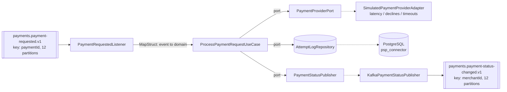

# psp-connector (M4 - first consumer)

Consumes `payments.payment-requested.v1`, calls a simulated payment provider, and publishes
`payments.payment-status-changed.v1`.

This is the first consumer in the pipeline and the module where consumer-group mechanics,
offset commits, and the poll loop become concrete.

## Kafka concepts demonstrated

- Consumer groups, `group.id`, `auto.offset.reset`
- The poll loop, and why processing time - not network time - drives `max.poll.interval.ms`
- `session.timeout.ms` vs `heartbeat.interval.ms`: heartbeats run on a **background thread**,
  so a consumer can be heartbeating happily while its processing thread is stuck. Only
  `max.poll.interval.ms` catches that.
- `enable.auto.commit=false` with manual `Acknowledgment`, and Spring's `AckMode`
- Partition-to-consumer assignment, and why extra consumers sit idle
- At-least-once delivery: duplicates and loss, measured below

## Architecture



## Topics

| Direction | Topic | Key | Partitions | RF |
|---|---|---|---|---|
| in | `payments.payment-requested.v1` | `paymentId` | 12 | 3 |
| out | `payments.payment-status-changed.v1` | `merchantId` | 12 | 3 |

**The key changes between in and out, deliberately** (ADR-0003). Inbound is keyed by
`paymentId` because there is exactly one request per payment, so ordering is vacuous and
paymentId spreads load evenly across the slowest stage in the system. Outbound is keyed by
`merchantId` because the ledger needs a single writer per merchant balance - merchantId
ordering is the stronger guarantee, and it is where that guarantee starts to matter.

## Error taxonomy (ADR-0006)

| Provider outcome | Classification | Behaviour |
|---|---|---|
| Approved | business outcome | emit `SUCCEEDED` status event, commit |
| Declined | **business outcome, not an error** | emit `FAILED` status event, commit, never retry |
| Timeout | retryable | throw `ProviderTimeoutException`; retry chain is M8 |

A declined card is a normal answer from the provider, not a failure of the system. Retrying it
would be wrong and DLQ-ing it would make the DLQ meaningless.

## How to run

```bash
cd infra/compose && docker compose up -d && ./create-topics.sh
mvn -pl services/psp-connector -am package
java -jar services/psp-connector/target/psp-connector.jar --spring.profiles.active=docker-compose
```

Listens on **8086** (payment-api 8085, AKHQ 8080, Schema Registry 8081).

Provider simulation is configurable so experiments can force outcomes:

```
psp-connector.provider.min-latency-ms / max-latency-ms
psp-connector.provider.decline-rate / timeout-rate
psp-connector.provider.forced-latency-ms / forced-outcome   # NONE | APPROVED | DECLINED | TIMEOUT
```

## Prove it

### 1. End-to-end

`POST` a payment to payment-api and the status event appears on the outbound topic:

```
payment-api  -> HTTP 201  paymentId=531551ba-6f7d-47e6-922d-691b872c42b3  merchant-e2e

kafka payments.payment-status-changed.v1:
  KEY = merchant-e2e            <-- merchantId, not paymentId
  {"envelope":{"eventId":"019fe930-8911-74eb-...","eventType":"payments.payment-status-changed.v1",
    "aggregateId":"531551ba-...","source":"psp-connector",
    "causationId":"019fe930-6dbd-7d75-ba74-43dd70662098"},   <-- inbound event's eventId
   "paymentId":"531551ba-...","merchantId":"merchant-e2e","status":"SUCCEEDED",
   "providerReference":"84023e0f-7f5f-4223-a49c-cac0b7c5e0e6"}
```

The key is the merchantId and `causationId` chains back to the inbound event's `eventId`.

### 2. Rebalance storm

Processing forced to 10s per record, `max.poll.records=1`, run for ~90s:

| `max.poll.interval.ms` | Evictions | Records processed |
|---|---|---|
| 5000 (shorter than processing) | **16** | 8 |
| 60000 (longer than processing) | **0** | 9 |

Broker's view, verbatim from the logs:

```
consumer poll timeout has expired. This means the time between subsequent calls to poll()
was longer than the configured max.poll.interval.ms
... partitions revoked: [payments.payment-requested.v1-0, ...-1, ...-2, ...]
... partitions assigned: [payments.payment-requested.v1-0, ...-1, ...-2, ...]
```

**Why it happens.** Heartbeats kept flowing the whole time - they run on a background thread,
so the group coordinator saw a live member. What it did not see was a `poll()` call, because
the processing thread was blocked for 10s inside the listener. Exceeding
`max.poll.interval.ms` makes the coordinator conclude the consumer is stuck, evict it, and
rebalance. The consumer then finishes its record, tries to commit, discovers it has been
evicted, and rejoins - triggering another rebalance. That is the storm: **16 rebalances to
process 8 records**, and every one of them stops the whole group.

This is also why blocking retries (`Thread.sleep` in a listener) are a trap - see M8.

### 3. Partition / consumer ratio

Scaled down to a 3-partition topic (`drill.consumer-ratio`) rather than 12 partitions and
13 JVMs; the arithmetic is identical.

Three consumers, three partitions - one each:

```
TOPIC                 PARTITION  CONSUMER-ID
drill.consumer-ratio  0          consumer-ratio-drill-1-85e817fa...
drill.consumer-ratio  1          consumer-ratio-drill-1-b5d47b75...
drill.consumer-ratio  2          consumer-ratio-drill-1-e37f4469...
```

Start a fourth:

```
CONSUMER-ID                     #PARTITIONS
consumer-ratio-drill-1-49104bb5    1
consumer-ratio-drill-1-b5d47b75    1
consumer-ratio-drill-1-85e817fa    1
consumer-ratio-drill-1-e37f4469    0     <-- idle
```

**A partition is assigned to exactly one consumer in a group.** Partition count is the hard
ceiling on parallelism within a group; the fourth consumer is pure standby. It is not useless -
it takes over in milliseconds if another dies - but it adds zero throughput. To scale past the
ceiling you must add partitions, which (see M19) breaks keyed ordering for existing keys.

### 4. Duplicates vs loss

200 records on a single partition, `max.poll.records=50`, 300ms processing, killed mid-batch.

**Auto-commit (`enable.auto.commit=true`):**

```
at crash:  processed=81   committed offset=50
restart:   resumes at 50, processes 150 more
total processed = 231 for 200 unique records  ->  31 DUPLICATES
```

The commit timer fired at a poll boundary and committed offset 50 while the listener had
worked ahead to 81. On restart everything from 50 onward is replayed. Exactly `81 - 50 = 31`
records processed twice. **This is at-least-once, and it is the normal case** - which is why
M5 builds idempotent consumers.

**Manual ack (`AckMode.MANUAL_IMMEDIATE`) - and a real defect it exposed:**

```
at crash:  processed=49   committed offset=50
restart:   resumes at 50, processes 150 more
total processed = 199 for 200 unique records  ->  1 record LOST
```

Manual acknowledgement should make loss impossible, so the single missing record is a bug, and
the experiment found it:

- `PaymentRequestedListener` calls `ack.acknowledge()` after the use case returns
- `KafkaPaymentStatusPublisher` publishes with `send(record).whenComplete(...)` - an
  **asynchronous** send that returns before the record reaches the broker

So the offset is committed while the outbound event is still sitting in the producer's buffer.
Kill the JVM in that window and the input is marked consumed but the output never existed.
Manual ack protects the *offset*, not the *side effect*.

Fix options, deliberately left for later modules: await the send future before acknowledging
(simple, costs latency), acknowledge inside the send callback, or make the whole thing atomic
with Kafka transactions (M7). Until then this service is at-least-once with a narrow loss
window, and that is worth knowing rather than assuming.

## Known issues / deferred

- **Async-send-before-ack loss window** described above. Not fixed here; M7 covers the
  transactional answer.
- The attempt log records `(paymentId, providerEventId)` with a unique constraint but does not
  yet *use* it to skip duplicate work - that is M5.
- Timeouts throw `ProviderTimeoutException` and are simply redelivered; the retry-topic chain
  and DLQ arrive in M8.
- Drill topics `drill.consumer-ratio` and `drill.dup-vs-loss` remain in the cluster holding the
  evidence above.

## Troubleshooting

| Symptom | Cause |
|---|---|
| Consumer rejoins in a loop, little progress | Processing exceeds `max.poll.interval.ms` - raise it or shrink `max.poll.records` |
| A consumer instance sits idle | More consumers than partitions in the group |
| Records reprocessed after a restart | Normal at-least-once with auto-commit; make the consumer idempotent (M5) |
| Events consumed but never published | The async-send-before-ack window above |
