# realtime-gateway (M12 - SSE fan-out)

Consumes `payments.payment-requested.v1`, `payments.payment-status-changed.v1`, and every
`refunds.*.v1` event, and pushes them to browsers over Server-Sent Events (SSE), filtered by
`paymentId` and/or `merchantId` so a browser can watch one payment's timeline live. No database -
every piece of state this service holds is an in-memory SSE subscription, which is meaningless to
persist (it dies with the browser connection it belongs to).

This is the module where "a consumer group load-splits, it does not fan out" stops being an
abstract warning and becomes the one decision this whole service is built around.

## Kafka concepts demonstrated

- **The broadcast problem**: every instance needs every event, because instances hold different
  browser connections - the exact opposite requirement from every other consumer in this system.
- **`group.id` as a load-splitting knob, not a fan-out knob** - and the unique-per-instance fix.
- Consuming multiple distinct Avro schemas with one listener via Java 21 pattern-matching
  `switch` (`RealtimeEventMapper`), instead of one listener method per topic.
- `SseEmitter` connection lifecycle: register, client disconnect, idle timeout, no leaks.
- Why a slow downstream consumer (a browser) must never share a thread with the Kafka poll loop.
- `__consumer_offsets` accumulation from throwaway consumer groups, and what to do about it.

## Architecture

```mermaid
flowchart LR
    subgraph Topics["7 topics (docs/diagrams/topic-map.md)"]
      PR[["payments.payment-requested.v1"]]
      PSC[["payments.payment-status-changed.v1"]]
      RR[["refunds.refund-requested.v1"]]
      FR[["refunds.funds-reserved.v1"]]
      RC[["refunds.refund-completed.v1"]]
      RF[["refunds.refund-failed.v1"]]
      RRel[["refunds.reservation-released.v1"]]
    end

    Topics -->|"ONE consumer,<br/>unique group.id per instance"| L[RealtimeEventListener]
    L -->|"Java 21 pattern-matching switch"| M[RealtimeEventMapper]
    M -->|RealtimeEvent| UC[BroadcastRealtimeEventUseCase]
    UC --> REG[(InMemorySseConnectionRegistry)]
    REG -->|"per-connection virtual-thread<br/>dispatch, non-blocking"| E1[SseEmitter - browser A]
    REG -->|"per-connection virtual-thread<br/>dispatch, non-blocking"| E2[SseEmitter - browser B]
    WEB[PaymentTimelineController<br/>GET /api/realtime/events] -->|register/unregister| REG
```



## Topics consumed

| Topic | Key | Partitions | Retention | Why this service consumes it |
|---|---|---|---|---|
| `payments.payment-requested.v1` | `paymentId` | 12 | 7 d | A payment's timeline starts here |
| `payments.payment-status-changed.v1` | `merchantId` | 12 | 7 d | Approved/declined outcome |
| `refunds.refund-requested.v1` | `merchantId` | 6 | 7 d | Refund saga starts |
| `refunds.funds-reserved.v1` | `merchantId` | 6 | 7 d | Saga step 2 |
| `refunds.refund-completed.v1` | `merchantId` | 6 | 7 d | Saga happy path |
| `refunds.refund-failed.v1` | `merchantId` | 6 | 7 d | Saga decline |
| `refunds.reservation-released.v1` | `merchantId` | 6 | 7 d | Saga compensation |

No DLQ on any of these (docs/diagrams/topic-map.md): "analytics and realtime-gateway deliberately
have none: they log, count, and skip, and are rebuilt by resetting offsets" - a dropped event here
means one browser missed one update, not a lost payment.

## THE central point: the broadcast problem

Every gateway instance needs **every** event on all 7 topics, because each instance holds a
completely different set of browser connections. There is no way to know in advance which
instance a given browser will connect to - the only correct answer is "all instances see all
events, all the time."

A Kafka **consumer group is a load-splitting mechanism, not a fan-out mechanism**: the group
coordinator divides a topic's partitions *across* the group's live members so each partition is
owned by exactly one member - the entire point being that N members collectively do 1/N of the
work, not that all N see everything. Two gateway instances sharing one `group.id` would each get
only their assigned *slice* of the traffic. A payment's status-changed event lands on whichever
instance's consumer happens to own that partition - which is very likely **not** the instance
holding the browser waiting to render it. The browser simply never sees the update. No error
anywhere: the record was consumed, acknowledged, and correctly processed - just by the wrong
process.

**This is the exact rule M4 measured directly.** `services/psp-connector/README.md`'s "Partition
/ consumer ratio" experiment put 3 consumers on a 3-partition topic (one partition each), started
a 4th, and watched it sit at **zero** partitions:

> A partition is assigned to exactly one consumer in a group... the fourth consumer is pure
> standby... it adds zero throughput.

That 4th consumer being idle was *harmless* for psp-connector - spare capacity, ready to take
over on failure. Apply the identical mechanic here and it is not harmless at all: a "4th
realtime-gateway instance" sharing the group would silently serve **zero** of the events its own
connected browsers are waiting for, while looking completely healthy - consuming, acknowledging,
no errors, no lag. One Kafka rule; a merely suboptimal outcome in one module, a silently broken
product feature in this one. That contrast is the entire lesson of M12.

### The fix: a unique `group.id` per instance

`config.KafkaConsumerConfig` derives `realtime-gateway.<hostname>.<uuid>`:

- **`<hostname>`** - stable per instance, and what an operator reads in
  `kafka-consumer-groups --list` output to tell instances apart at a glance.
- **`<uuid>`** - a random UUID minted once per JVM at class-load time. Hostname *alone* is not
  enough: every "prove it" run in this codebase happens against `localhost`, so two instances
  started as plain `java -jar` processes on different ports (exactly how the multi-instance
  broadcast proof runs) share the same hostname - hostname-only uniqueness collides the moment two
  instances run side by side outside a container.

Combining both keeps the id human-debuggable *and* collision-proof regardless of deployment
topology (bare `java -jar`, Docker Compose, or Kubernetes pods with distinct pod names).

**Why `subscribe()` + unique `group.id`, not manual partition assignment** (the other option
docs/PLAN.md's M12 brief lists: "each instance uses a unique group.id (or partition assignment
without a group)"): this is the approach the brief lists first, it needs no per-topic
partition-count bookkeeping in `config.KafkaConsumerConfig`, and it is the more direct
illustration of "group.id is the load-splitting knob" - the module's actual teaching goal. Manual
assignment (`Consumer#assign()`, e.g. via `@KafkaListener(topicPartitions = ...)`) is the
documented production alternative below, not built here.

### Consequence: throwaway groups in `__consumer_offsets`

Every restart mints a brand-new `group.id`. Kafka never deletes a consumer group's committed
offsets on its own - they sit in `__consumer_offsets` until the group is explicitly deleted or
`offsets.retention.minutes` (broker default: 10080 = 7 days) ages them out after the group has no
live members. A fleet of gateway instances restarting routinely (rolling deploys, pod evictions,
autoscaling) accumulates one abandoned group per restart, forever, unless something reaps them.

**What I would do in production, and which I chose here:**

1. **Lower `offsets.retention.minutes`** for this pattern specifically (broker-level, or scoped by
   a group-naming convention an operator can filter on) so abandoned groups expire in hours, not
   a week.
2. **Sidestep consumer groups entirely** via manual partition assignment - no group membership at
   all means nothing is ever written to `__consumer_offsets` for this service. Arguably the
   cleaner fix: it removes the accumulation at the source instead of merely shortening its
   lifetime.

This module builds the `subscribe()`-with-unique-`group.id` version (see above for why); manual
assignment is the documented alternative, not implemented here. Either way, `auto.offset.reset` is
set to `latest`, not the `earliest` every other consumer group in this system uses
(docs/diagrams/topic-map.md) - a brand-new `group.id` has no committed offset regardless, and this
service's only job is pushing *live* events to *currently connected* browsers; replaying the full
7-day retention on every restart buys nothing and costs startup latency plus broker I/O.

## Connection lifecycle - register, disconnect, idle timeout, no leaks

`adapters.in.web.PaymentTimelineController` (register) and
`adapters.out.sse.InMemorySseConnectionRegistry` (dispatch, cleanup) split the responsibility:

| Event | Handled by | Effect |
|---|---|---|
| Client connects | `PaymentTimelineController#stream` | Builds an `SseEmitter`, wraps it as an `EventSink`, registers via `ManageSubscriptionUseCase` |
| Clean disconnect (tab closed, navigated away) | `SseEmitter#onCompletion` | Unregisters the subscription |
| Broken connection (network drop, proxy timeout) | `SseEmitter#onError` | Unregisters the subscription |
| Idle timeout (`realtime-gateway.sse.timeout-ms`, default 5 min) | `SseEmitter`'s own constructor timeout + `onTimeout` | Unregisters and completes the emitter - catches a client that vanished silently, without a clean TCP close, and so never fires `onError` |
| A send fails mid-broadcast | `InMemorySseConnectionRegistry#deliver`'s catch block | Self-heals: removes the subscription on the next attempted write, the belt-and-braces case that catches everything the three callbacks above might miss between events |

### Why a slow browser must never block the Kafka consumer thread

This gateway instance's unique `group.id` means **nobody else** shares its group - it alone owns
every partition of every subscribed topic, consumed by one poll-loop thread. If sending to an
`SseEmitter` were done directly on that thread inside `broadcast()`, one slow or stalled browser
(laptop asleep mid-handshake, a client that stopped reading its socket) would block delivery to
*every other* connected browser and, worse, delay the next `poll()` call - the exact mechanism M4
measured causing a rebalance storm when listener processing exceeded `max.poll.interval.ms`
(`services/psp-connector/README.md`'s "Rebalance storm" section). A fan-out gateway is *more*
exposed to this than a normal listener, since it makes many downstream writes per one consumed
record instead of one.

**The fix:** each subscription gets its own single-thread `ExecutorService`, backed by a virtual
thread (`Thread.ofVirtual()`, JEP 444, final in Java 21 - matching this project's
`java.version`). `broadcast()` only ever calls `dispatcher.execute(...)` - a non-blocking
hand-off - and returns immediately, regardless of how long the actual `emitter.send(...)` call
takes or whether it ever completes. A single-thread executor *per connection*, not one shared
pool, guarantees a payment's events are delivered to that browser in the order they were
broadcast; virtual threads make "one executor per connection" cheap even with many concurrent
browsers, unlike a platform-thread-per-connection design.

## How to run

```bash
cd infra/compose && docker compose up -d && ./create-topics.sh && ./register-schemas.sh
mvn -pl services/realtime-gateway -am package
java -jar services/realtime-gateway/target/realtime-gateway.jar --spring.profiles.active=docker-compose
```

Listens on **8090** (payment-api 8085, psp-connector 8086, ledger 8087, webhook-notifier 8088,
analytics 8089, AKHQ 8080, Schema Registry 8081).

Watch one payment's timeline:

```bash
curl -N "http://localhost:8090/api/realtime/events?paymentId=<paymentId>"
```

Watch everything for one merchant:

```bash
curl -N "http://localhost:8090/api/realtime/events?merchantId=<merchantId>"
```

At least one of `paymentId`/`merchantId` is required - `400` otherwise (a filter with neither
would silently subscribe to the entire event firehose).

## Prove it (single instance)

Opened an SSE stream filtered by `merchantId=merchant-m12-sse-proof-4`, then `POST`ed a payment
for that merchant to payment-api. Both events this gateway consumes for that payment arrived over
the SAME connection, in order:

```
$ curl -N "http://localhost:8090/api/realtime/events?merchantId=merchant-m12-sse-proof-4"

id:019ff2e2-31ca-770f-9526-929b9a225fc4
event:payments.payment-requested.v1
data:{"eventId":"019ff2e2-31ca-770f-9526-929b9a225fc4","eventType":"payments.payment-requested.v1","occurredAt":"2026-08-11T22:12:17.994Z","paymentId":"c30df048-5a28-46bd-a959-0a6f9e5725f7","merchantId":"merchant-m12-sse-proof-4","refundId":null,"status":"CREATED","reason":null,"providerReference":null}

id:019ff2e2-4489-7d49-9c48-7515de516e7e
event:payments.payment-status-changed.v1
data:{"eventId":"019ff2e2-4489-7d49-9c48-7515de516e7e","eventType":"payments.payment-status-changed.v1","occurredAt":"2026-08-11T22:12:22.793Z","paymentId":"c30df048-5a28-46bd-a959-0a6f9e5725f7","merchantId":"merchant-m12-sse-proof-4","refundId":null,"status":"SUCCEEDED","reason":null,"providerReference":"ae97c7d0-96ab-4146-8121-a3c46481b195"}
```

`payment-requested` arrived ~3 ms after `createdAt` (outbox -> Debezium -> Kafka -> this gateway
-> SSE, essentially the CDC relay latency); `payment-status-changed` arrived ~4.8 s later, matching
psp-connector's simulated provider latency window (100 ms-5 s). Consumer group log confirms this
instance's unique `group.id` was assigned **all 7 partitions of all 7 topics** on startup - one
partition each, since the topics involved here run at 1 partition in the embedded/dev proof
context but the mechanic is identical at 12/6 partitions in the full cluster:

```
realtime-gateway.MacBook-Pro.e8938260-757e-41ef-a201-7178ec05bc6e: partitions assigned:
[payments.payment-requested.v1-0, payments.payment-status-changed.v1-0,
 refunds.funds-reserved.v1-0, refunds.refund-completed.v1-0, refunds.refund-failed.v1-0,
 refunds.refund-requested.v1-0, refunds.reservation-released.v1-0]
```

### Broadcast proof

Measured on the live cluster. Two instances started on ports 8090 and 8091, their group ids
confirmed distinct:

```
realtime-gateway.MacBook-Pro.c35320b4-d148-462a-848d-bd7f5d4cbb75
realtime-gateway.MacBook-Pro.3cf84a46-c856-448a-acb2-681a2384e26a
```

Same hostname, different UUID - which is the whole point, because on this machine (and in any
deployment where instances share a host) the hostname alone would collide.

An SSE connection was opened to **each** instance filtered by the same merchantId, then **one**
payment was posted:

| Instance | Events received |
|---|---|
| 8090 | `payments.payment-requested.v1`, `payments.payment-status-changed.v1` |
| 8091 | `payments.payment-requested.v1`, `payments.payment-status-changed.v1` |

**One payment, both instances, both events each.** That is fan-out.

#### Why a shared group.id would break this silently

The mechanism is visible in the partition assignments. Each gateway instance has its own group, so
each is assigned every partition:

```
realtime-gateway.MacBook-Pro.c35320b4...   partitions=12
realtime-gateway.MacBook-Pro.f3e28536...   partitions=12
```

Two consumers sharing a single group on the same topic divide them instead:

```
CONSUMER-ID                     #PARTITIONS
console-consumer-479e15f2-0b2c     6
console-consumer-f927e677-4362     6
```

Twelve partitions, six each, no overlap. Put both gateway instances in one group and each would
receive **half** the events - so a browser connected to 8090 would miss every payment whose key
hashed to a partition assigned to 8091. Roughly half your users stop receiving updates.

**And nothing would look broken.** No error, no exception, no consumer lag - lag would be zero on
both instances, because between them they *are* consuming everything. Every dashboard would be
green while half the product silently failed. This is the same rule that made the fourth consumer
idle in [M4's partition/consumer ratio drill](../psp-connector/README.md#3-partition--consumer-ratio),
applied to a service where the rule is exactly wrong.

The one-line version: **consumer groups split load; they do not fan out.** If every instance needs
every record, every instance needs its own group.

## Known issues / compromises

- **No DLQ** - deliberate (see "Topics consumed" above); a malformed record is logged and skipped.
- **Manual partition assignment not implemented** - `subscribe()` + unique `group.id` was chosen
  for the reasons above; the `__consumer_offsets` accumulation this trades for is real and
  documented, not silently accepted.
- **Per-connection virtual-thread executors are unbounded** - fine at this exercise's scale
  (a handful of browser tabs); a very high connection count would want a shared, bounded
  work-stealing pool instead. Not built here.
- **`InMemorySseConnectionRegistry` is single-instance, in-memory** - by design (module brief: "no
  database"). A subscription only ever exists on the one instance whose SSE connection a browser
  actually holds; nothing here is meant to survive a restart.

## Troubleshooting

| Symptom | Cause |
|---|---|
| A browser connects but never sees any event | Check `paymentId`/`merchantId` matches exactly - `SubscriptionFilter#matches` is an exact-string match, not a prefix/contains |
| An event is logged as consumed but never appears on ANY browser | Check `RealtimeEventMapper`'s pattern-matching `switch` - an unrecognized Avro type logs a warning and is dropped, see "Known issues" |
| Two gateway instances, browsers on the "wrong" instance never update | THE central-point bug this module exists to teach - verify each instance's logged `group.id` is actually unique (`grep "consumer group.id=" `application logs) |
| `__consumer_offsets` growing unbounded over many restarts | Expected - see "Consequence: throwaway groups" above |
