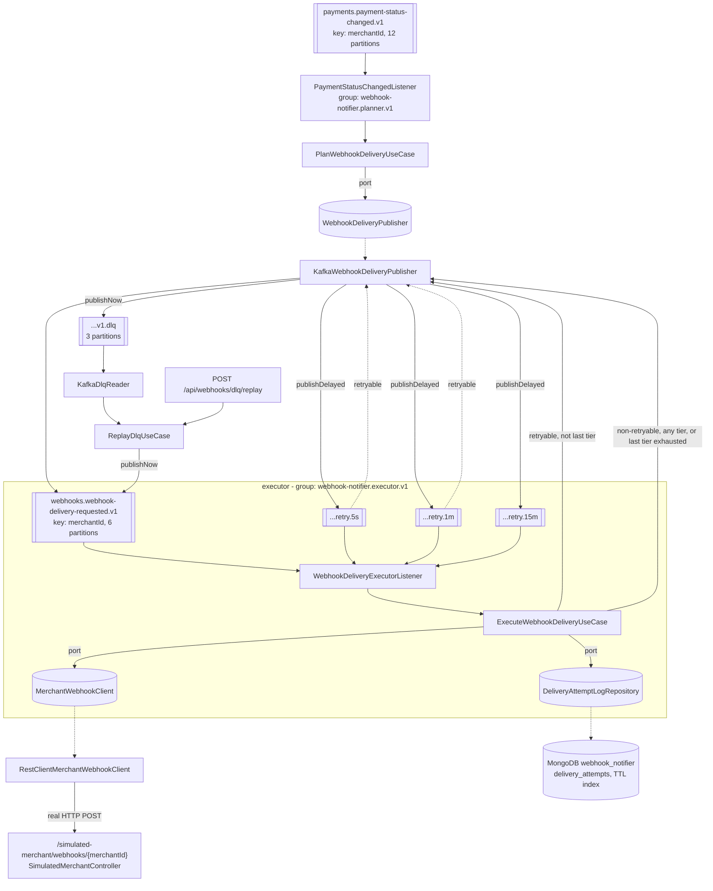

# webhook-notifier (M8 - Retries, DLQ, poison pills)

Consumes `payments.payment-status-changed.v1` and plans one webhook delivery command per event;
a second consumer group executes the HTTP callback to the merchant and routes failures through a
non-blocking retry chain ending in a dead-letter topic, per [ADR-0006](../../docs/adr/0006-error-taxonomy-retry-dlq.md).

This is the module where "retryable" stops being a synonym for "failed" and becomes a
classification decision made once, up front, that the rest of the system just obeys.

## Kafka concepts demonstrated

- **Non-blocking retry topics**: a chain of literally-named topics
  (`.retry.5s -> .retry.1m -> .retry.15m -> .dlq`), each consumed by the SAME application, with a
  delay honoured by scheduling the next publish on a background thread - never by blocking a
  consumer poll thread.
- **Why blocking retries are forbidden**: a `Thread.sleep` inside a listener consumes
  `max.poll.interval.ms` budget on the exact thread that must call `poll()` again to prove
  liveness. `psp-connector`'s M4 "prove it" experiment measured this failure directly (forced
  10s processing against a 5s `max.poll.interval.ms`): **16 rebalances**, the coordinator
  concluding the member was stuck and evicting it, over and over, with almost no progress (see
  [services/psp-connector/README.md](../psp-connector/README.md)'s "Prove it" section). A 5s
  stall causes a *storm*; a 15-minute blocking sleep - this module's longest tier - would not
  cause repeated rebalances, it would cause the member to never come back from a single `poll()`
  call at all.
- **`ErrorHandlingDeserializer`**: a record whose bytes cannot be deserialized is routed to the
  container's error handler *before* any listener code runs, instead of throwing out of `poll()`
  itself and spinning the same offset forever. Runnable WITHOUT it via a property, to reproduce
  the failure before the fix.
- **Retry headers**: this module hand-rolls its own retry chain (see "Why not `@RetryableTopic`"
  below) using ADR-0006's own header vocabulary rather than Spring's `@RetryableTopic` internals -
  attempt count, original topic/partition/offset, and the classified failure, carried on every
  hop.
- **`DeadLetterPublishingRecoverer`**: Spring's own standalone DLQ-publishing recoverer, used
  (unlike the hand-rolled hop-to-hop chain) for the one failure surface that IS a genuine
  uncaught exception - a poison pill or an unclassified bug.
- **Manual, bounded DLQ replay**: "the DLQ is an inbox, not a queue" (ADR-0006) - replay is a
  REST call, never automatic, and always capped.

## Architecture



## Topics

| Direction | Topic | Key | Partitions | RF | Retention |
|---|---|---|---|---|---|
| in (planner) | `payments.payment-status-changed.v1` | `merchantId` | 12 | 3 | 7 d |
| out (planner) / base (executor) | `webhooks.webhook-delivery-requested.v1` | `merchantId` | 6 | 3 | 3 d |
| retry tier 1 | `webhooks.webhook-delivery-requested.v1.retry.5s` | `merchantId` | 6 | 3 | 3 d |
| retry tier 2 | `webhooks.webhook-delivery-requested.v1.retry.1m` | `merchantId` | 6 | 3 | 3 d |
| retry tier 3 | `webhooks.webhook-delivery-requested.v1.retry.15m` | `merchantId` | 6 | 3 | 3 d |
| terminal | `webhooks.webhook-delivery-requested.v1.dlq` | `merchantId` | 3 | 3 | 30 d |

All six already exist in the cluster (`infra/compose/create-topics.sh`, sourced from
[docs/diagrams/topic-map.md](../../docs/diagrams/topic-map.md)) - this service does not create
or alter them. Consumer groups: `webhook-notifier.planner.v1` (base-topic only) and
`webhook-notifier.executor.v1` (the delivery-command topic plus all three retry tiers). DLQ
replay uses a THIRD, dedicated group (`webhook-notifier.dlq-replay.v1`) so on-demand reads never
interact with normal delivery execution.

## Error taxonomy (ADR-0006, applied to an outbound HTTP call)

ADR-0006's four categories were written for a Kafka listener's failure; this service is the first
one whose "processing" is an outbound HTTP call rather than a database write, so the mapping is
stated explicitly rather than assumed:

| Category | ADR-0006 name | Here | Behaviour |
|---|---|---|---|
| A | Retryable (transient infra) | Merchant 5xx, connection reset, client-side read/connect timeout | `DeliveryOutcome.RETRYABLE_FAILURE` - routed through the retry chain, then DLQ |
| B | Business outcome | *(not applicable)* | A webhook delivery has no domain-meaningful "the merchant said no" - unlike a card decline, an HTTP response here is acknowledgement-or-not, not a business fact the rest of the system needs to see |
| C | Contract violation / poison pill | Merchant 4xx (bad payload, unknown merchant, endpoint gone) **and** a Kafka record whose bytes cannot be deserialized | `DeliveryOutcome.NON_RETRYABLE_FAILURE` (HTTP case) / caught by `ErrorHandlingDeserializer` (Kafka case) - both go straight to the DLQ, zero retries |
| D | Unknown (bug) | Any exception `RestClientMerchantWebhookClient`/the use case does not classify | Propagates to the Kafka container's error handler; `DeadLetterPublishingRecoverer` publishes to the DLQ with zero retries |

A 4xx is treated as category C's outbound-HTTP analogue on purpose: "the bytes will not improve"
(ADR-0006's own phrase for a deserialization failure) is exactly as true of an unchanged request
against an unchanged, permanently-rejecting endpoint.

## Why not `@RetryableTopic`?

Spring Kafka's built-in non-blocking retry (`@RetryableTopic` / `RetryTopicConfigurationBuilder`)
derives every retry-tier topic name from ONE suffix plus an auto-incrementing index or delay
value (e.g. `topic-retry-0`, `topic-retry-1`, or `topic-5000`, `topic-60000`). It has no mechanism
for three unrelated, literal suffixes on one base topic. This service's retry topics already
exist with the literal names `.retry.5s` / `.retry.1m` / `.retry.15m` (provisioned by
`infra/compose/create-topics.sh` with specific partition counts and retention this module must
not override), so `@RetryableTopic`'s auto-creation/auto-naming would either collide with them or
create a second, wrongly-specced set alongside them. This module is therefore the "explicit
equivalent" M8's brief allows: a hand-rolled chain (`domain.model.RetryChain`,
`domain.model.RetryEnvelope`, `domain.model.RetryHeaderCodec`) using ADR-0006's own header
vocabulary (`domain.model.RetryHeaderNames`) instead of Spring's internal header constants. The
one piece of Spring's OWN retry-topic machinery still used directly is
`DeadLetterPublishingRecoverer` - a standalone class, not part of `@RetryableTopic` - for the
container-level poison-pill/unknown-bug path. See `domain.model.RetryHeaderNames`'s javadoc for
the full reasoning.

## Retry headers (ADR-0006 vocabulary)

Written by `KafkaWebhookDeliveryPublisher`, read by `WebhookDeliveryExecutorListener` and
`KafkaDlqReader`, encoded/decoded symmetrically by `domain.model.RetryHeaderCodec`:

| Header | Meaning | Present on |
|---|---|---|
| `x-attempt-count` | 1 for the first delivery, incremented every hop | every record |
| `x-original-topic` / `-partition` / `-offset` / `-timestamp` | coordinates of the FIRST attempt - stamped once on the first failure, never overwritten afterward | every record after the first failure |
| `x-exception-fqcn` / `x-exception-message` | classification of the failure that caused this hop (e.g. `merchant-5xx-or-timeout`) | every record after the first failure |
| `x-exception-stacktrace` | full stack trace | only records published by `DeadLetterPublishingRecoverer` (a real thrown exception exists there; a classified HTTP outcome is not a thrown exception, so the hand-rolled chain never populates this one) |
| `x-failed-at` | ISO-8601 instant this record was written to the DLQ | DLQ records only |
| `x-replayed-from` / `x-replay-count` | which DLQ topic this was replayed from, and how many times | records republished by `POST /api/webhooks/dlq/replay` |

## How to run

```bash
cd infra/compose && docker compose up -d && ./create-topics.sh
mvn -pl services/webhook-notifier -am package
java -jar services/webhook-notifier/target/webhook-notifier.jar --spring.profiles.active=docker-compose
```

Listens on **8088** (payment-api 8085, psp-connector 8086, ledger 8087, AKHQ 8080, Schema
Registry 8081). Database `webhook_notifier` (MongoDB, ADR-0005, `infra/compose/.env`) - already
provisioned by `infra/compose/mongo/init/01-init-databases.sh`.

## Every configurable knob

### Retry topology (`webhook-notifier.kafka.*` / `webhook-notifier.retry.*`)

| Property | Default | Purpose |
|---|---|---|
| `webhook-notifier.kafka.payment-status-changed-topic` | `payments.payment-status-changed.v1` | planner input |
| `webhook-notifier.kafka.delivery-requested-topic` | `webhooks.webhook-delivery-requested.v1` | base delivery topic |
| `webhook-notifier.kafka.retry-5s-topic` / `-1m-topic` / `-15m-topic` | `...retry.5s` / `.1m` / `.15m` | the three tiers |
| `webhook-notifier.kafka.dlq-topic` | `...v1.dlq` | terminal topic |
| `webhook-notifier.retry.delay-5s-ms` / `-1m-ms` / `-15m-ms` | `5000` / `60000` / `900000` | how long each tier waits before the next hop - override to shrink the whole chain for an experiment |

### THE poison-pill flag

`webhook-notifier.kafka.deserialization-error-handling-enabled` (default `true`). Set to
**`false`** to run WITHOUT `ErrorHandlingDeserializer` and reproduce the infinite-loop failure
first:

```
--webhook-notifier.kafka.deserialization-error-handling-enabled=false
```

### DLQ replay guard (`webhook-notifier.dlq-replay.*`)

| Property | Default | Purpose |
|---|---|---|
| `webhook-notifier.dlq-replay.consumer-group` | `webhook-notifier.dlq-replay.v1` | dedicated group for on-demand reads |
| `webhook-notifier.dlq-replay.max-batch-size` | `50` | hard ceiling per replay call, regardless of the request |
| `webhook-notifier.dlq-replay.poll-timeout-ms` | `2000` | how long one replay call waits for records |

### Merchant HTTP client (`webhook-notifier.merchant-client.*`)

| Property | Default | Purpose |
|---|---|---|
| `webhook-notifier.merchant-client.base-url` | `http://localhost:8088` | target - defaults to this service's OWN simulated endpoint |
| `webhook-notifier.merchant-client.webhook-path` | `/simulated-merchant/webhooks/{merchantId}` | path template |
| `webhook-notifier.merchant-client.connect-timeout-ms` | `2000` | TCP connect timeout |
| `webhook-notifier.merchant-client.read-timeout-ms` | `3000` | response read timeout - must be shorter than `simulated-merchant.timeout-delay-ms` |

### Simulated merchant endpoint (`webhook-notifier.simulated-merchant.*`)

| Property | Default | Purpose |
|---|---|---|
| `webhook-notifier.simulated-merchant.forced-outcome` | `NONE` | `SUCCESS` / `CLIENT_ERROR` / `SERVER_ERROR` / `TIMEOUT` forces every request |
| `webhook-notifier.simulated-merchant.server-error-rate` | `0.0` | probability of a 5xx (retryable) |
| `webhook-notifier.simulated-merchant.client-error-rate` | `0.0` | probability of a 4xx (non-retryable) |
| `webhook-notifier.simulated-merchant.timeout-rate` | `0.0` | probability of a deliberate timeout (retryable) |
| `webhook-notifier.simulated-merchant.latency-ms` | `50` | base simulated processing delay |
| `webhook-notifier.simulated-merchant.timeout-delay-ms` | `6000` | extra delay for a TIMEOUT outcome - must exceed `merchant-client.read-timeout-ms` |

**Per-merchant override, independent of the properties above**: a `merchantId` containing the
literal substring `force-success` / `force-4xx` / `force-5xx` / `force-timeout` deterministically
forces that outcome for that merchant only - e.g. `POST /api/payments` with
`merchantId: merchant-force-5xx-1` always gets a 5xx from the simulated endpoint, letting one
experiment mix outcomes across merchants without touching config between requests.

### Mongo TTL (`webhook-notifier.mongo.*`)

| Property | Default | Purpose |
|---|---|---|
| `webhook-notifier.mongo.attempt-log-ttl-seconds` | `2592000` (30 d) | TTL on `delivery_attempts.attemptedAt` - matches the DLQ's own 30-day retention |
| `webhook-notifier.mongo.create-ttl-index-on-startup` | `true` | set `false` only where no live MongoDB is available (tests) |

## MongoDB delivery-attempt log

Collection `delivery_attempts` (database `webhook_notifier`), one document per attempt - success
included, not just failures:

```json
{
  "_id": "...",
  "merchantId": "merchant-1",
  "paymentId": "0b2b...e7",
  "attemptNumber": 1,
  "outcome": "SUCCESS",
  "statusCode": 200,
  "error": null,
  "sourceTopic": "webhooks.webhook-delivery-requested.v1",
  "attemptedAt": "2026-08-11T12:00:00Z"
}
```

**TTL**: an index on `attemptedAt`, `expireAfterSeconds` = `webhook-notifier.mongo.attempt-log-ttl-seconds`
(default 2,592,000 = 30 days), created programmatically at startup by `config.MongoIndexConfig`
(not a static `@Indexed` annotation, which cannot take a property value). MongoDB's TTL monitor
sweeps and deletes expired documents in the background (roughly every 60s), not instantaneously.

## DLQ replay endpoint

```
POST /api/webhooks/dlq/replay?maxRecords=10
```

Reads up to `maxRecords` (clamped to `webhook-notifier.dlq-replay.max-batch-size`, default 50, no
matter what is requested) records from `webhooks.webhook-delivery-requested.v1.dlq` and
republishes each, unchanged in key and payload, to `webhooks.webhook-delivery-requested.v1` -
giving it a full fresh pass through the retry chain if it fails again. Response:

```json
{ "replayedCount": 3, "dlqTopic": "webhooks.webhook-delivery-requested.v1.dlq", "republishedToTopic": "webhooks.webhook-delivery-requested.v1" }
```

Manual and explicit only (ADR-0006: "DLQ is not a queue, it is an inbox") - there is no scheduled
or automatic redrive.

### Poison pill proof

Measured on the live cluster. One record of `not-json-at-all-{{{` produced directly onto
`webhooks.webhook-delivery-requested.v1`, consumed by `webhook-notifier.executor.v1`.

**Without `ErrorHandlingDeserializer`** (`--webhook-notifier.kafka.deserialization-error-handling-enabled=false`):

| Measure | Result over 45 seconds |
|---|---|
| deserialization errors logged | **5,846,600** |
| log file produced | **9.1 GB** |
| offset advanced past the bad record | no |
| rebalance | none - heartbeats kept flowing |

```
RecordDeserializationException: Error deserializing VALUE for partition
webhooks.webhook-delivery-requested.v1-5 at offset ...
```

The consumer fetches the record, fails to deserialize it, and never commits - so the next poll
returns the same bytes and it fails again, as fast as the CPU allows. **Nearly six million failures
in forty-five seconds.** Note what does *not* happen: no rebalance, no eviction, no error surfaced
to any listener. The poll loop is healthy and heartbeats keep flowing, which is precisely why this
is worse than M4's rebalance storm - the group looks fine while one partition is permanently
wedged and every record behind the bad one is unreachable.

**The 9.1 GB is not a footnote.** A single malformed record filled the disk faster than any
alerting would react. Earlier in this project a full disk took Docker down entirely; this is the
same failure with a different trigger. Log volume is the symptom you will actually notice first.

**With `ErrorHandlingDeserializer`** (default), the same record on the same topic:

| Measure | Result |
|---|---|
| deserialization errors logged | **0** |
| log file produced | **12 KB** |
| record routed to `.dlq` | yes, exactly once |
| consumer | advanced past it and kept working |

The DLQ record carries the raw bytes plus Spring's provenance headers:

```
kafka_dlt-original-topic:     webhooks.webhook-delivery-requested.v1
kafka_dlt-original-partition: ...
kafka_dlt-original-offset:    ...
kafka_dlt-original-timestamp: ...
```

`ErrorHandlingDeserializer` catches the failure at deserialization and hands a marker to
`DefaultErrorHandler`, which passes it to `DeadLetterPublishingRecoverer`. The bad bytes leave the
hot path with their provenance intact, and the partition keeps moving. Same record, same topic,
same code: **9.1 GB and a wedged partition, versus 12 KB and one DLQ entry.**

Caveat worth stating: a DLQ record whose bytes were never parseable cannot be usefully replayed -
replaying it just reproduces the failure. Its value is forensic, not operational.

### Retry chain proof

Measured on the live cluster. Two delivery commands produced onto the base topic in the same run -
one for `force-5xx-merchant` (retryable) and one for `force-4xx-merchant` (non-retryable) - then
90 seconds of observation.

Topic end offsets, before and after:

| Topic | Before | After | Delta |
|---|---|---|---|
| `webhooks.webhook-delivery-requested.v1` | 802 | 804 | +2 (the two commands) |
| `...v1.retry.5s` | 777 | 778 | **+1** (the 5xx) |
| `...v1.retry.1m` | 0 | 1 | **+1** (the 5xx, escalated) |
| `...v1.retry.15m` | 0 | 0 | not yet - the 1m delay had not elapsed |
| `...v1.dlq` | 7 | 9 | **+2** (the 4xx, plus the poison pill from the previous drill) |

**The retryable failure walked the chain.** Its record on `.retry.1m` carries the routing state in
headers:

```
x-attempt-count:   3
x-original-topic:  webhooks.webhook-delivery-requested.v1
x-exception-fqcn:  merchant-5xx-or-timeout
merchantId:        force-5xx-merchant
```

Attempt 3 on the `1m` tier is exactly right: attempt 1 on the base topic, attempt 2 after the 5s
delay, attempt 3 after the 1m delay. The original topic is preserved through every hop, so a record
in the DLQ can always be traced back to where it entered.

**The non-retryable failure skipped the chain entirely.** The newest DLQ record is
`force-4xx-merchant`, and it never appeared on any retry tier. From the logs:

```
4xx -> non-retryable -> straight to DLQ
```

That is ADR-0006 doing real work. A 4xx means the request itself is wrong - a bad callback URL, a
rejected payload - and no amount of waiting changes that. Sending it through three retry tiers
would burn ~16 minutes of latency and three redeliveries to arrive at the same answer, while
delaying every genuinely transient failure queued behind it. A 5xx or a timeout is the opposite:
the request was fine and the far side was not, so waiting is exactly the right response.

**Why none of this blocks.** Each hop is a *separate topic with its own consumer*, and the delay is
a scheduled publish - never a `Thread.sleep` on a consumer thread. Sleeping 15 minutes inside a
listener would blow `max.poll.interval.ms` and trigger the eviction-and-rejoin cycle measured in
[M4's rebalance storm](../psp-connector/README.md#2-rebalance-storm): 16 rebalances to process 8
records, with the whole group stopped each time. One slow merchant would take down deliveries for
every other merchant on the partition. Non-blocking retry topics are what keep a 15-minute backoff
from becoming a 15-minute outage.

## Prove it (happy path, run for real)

One payment, one successful delivery, straight through the simulated endpoint:

```bash
curl -X POST http://localhost:8085/api/payments \
  -d '{"merchantId":"merchant-m8-demo","amount":42.00,"currency":"EUR"}'
```

`payments.payment-status-changed.v1` carries the resulting status change, the planner turns it
into a delivery command, the executor calls the simulated endpoint (default: 100% success), and a
`delivery_attempts` document with `outcome: "SUCCESS"` appears in MongoDB - see this module's
acceptance run for the actual observed document.

## Compromises

- **Container-level pause/resume is not used**; the non-blocking delay is a scheduled publish
  (`TaskScheduler.schedule`), not Spring's own per-partition consumer-pause mechanism
  (`KafkaConsumerBackoffManager`, internal to `@RetryableTopic`). The listener holds the Kafka
  record's acknowledgment open until the scheduled hop actually fires and succeeds, which is what
  keeps this at-least-once-correct (a crash before the hop fires simply redelivers the record on
  restart), but it means many concurrently-pending retries each hold one scheduled task and one
  open (unacknowledged) record - fine at this system's scale, not necessarily at high DLQ-tier
  volume.
- **A retryable failure always retries the HTTP call from scratch**; there is no partial-delivery
  detection. A merchant that received the notification but failed to respond in time (rather than
  genuinely never receiving it) will see a duplicate - the merchant's own idempotency is assumed,
  not enforced by this service, consistent with ADR-0006's "every retryable operation MUST be
  idempotent" being a contract on the FAR side too, not just this one.
- **The DLQ replay reader cannot meaningfully replay a poison-pilled DLQ record** (one whose value
  is still the original undeserializable bytes, published by `DeadLetterPublishingRecoverer`
  rather than the hand-rolled chain) - see `KafkaDlqReader`'s javadoc.
- **No DLQ for the planner's own consumption** of `payments.payment-status-changed.v1` -
  `docs/diagrams/topic-map.md` provisions only one DLQ for this service
  (`webhooks.webhook-delivery-requested.v1.dlq`), downstream of the planner. A poison pill on the
  planner's input is logged and skipped, not parked anywhere - a documented scope boundary, not a
  silent one (see `PaymentStatusChangedListener`'s javadoc).
- **Mongo TTL index migration is not handled**: changing `attempt-log-ttl-seconds` on an
  already-running database requires manually dropping the existing index first (MongoDB rejects
  re-creating a same-keyed index with different options) - see `MongoIndexConfig`'s javadoc.

## Troubleshooting

| Symptom | Cause / fix |
|---|---|
| Consumer lag on `webhook-notifier.executor.v1` grows, no records logged in MongoDB, no errors | Check `webhook-notifier.kafka.deserialization-error-handling-enabled` - if `false`, this is the M8 poison-pill failure by design. Flip it back to `true`. |
| Every delivery times out even though `simulated-merchant.forced-outcome=NONE` and rates are 0 | `merchant-client.read-timeout-ms` is shorter than the simulated endpoint's own `latency-ms` - raise the read timeout or lower the simulated latency. |
| A merchant marked `force-4xx` still gets retried through `.retry.5s` | Check the merchantId actually contains the literal substring `force-4xx` - the match is a plain `String#contains`, not a prefix/suffix rule. |
| `DLQ replay republished 0 records` on a non-empty DLQ | The dedicated `webhook-notifier.dlq-replay.v1` group already committed past them on a previous call - this is correct (replay is once-only per record), not a bug; a record only reappears if it lands in the DLQ again. |
| `NoUniqueBeanDefinitionException` for `ConsumerFactory<String, Object>` | `dlqReplayConsumerFactory` and any other `ConsumerFactory<String, Object>` bean are ambiguous without `@Qualifier` - see `KafkaDlqReader`'s constructor. |
